# Geisha
## 信息收集
### 端口枚举
全端口扫描
```
└─$ sudo nmap -p- 192.168.146.66             
Starting Nmap 7.92 ( https://nmap.org ) at 2022-08-14 14:40 HKT
Nmap scan report for 192.168.146.66
Host is up (0.00029s latency).
Not shown: 65528 closed tcp ports (reset)
PORT     STATE SERVICE
21/tcp   open  ftp
22/tcp   open  ssh
80/tcp   open  http
7080/tcp open  empowerid
7125/tcp open  unknown
8088/tcp open  radan-http
9198/tcp open  unknown
MAC Address: 00:0C:29:D6:81:2A (VMware)
Nmap done: 1 IP address (1 host up) scanned in 7.97 seconds

```
指定端口枚举
```
└─$ sudo nmap -p21,22,80,7080,7125,8088,9198 -sV -A 192.168.146.66
Starting Nmap 7.92 ( https://nmap.org ) at 2022-08-14 14:41 HKT
Nmap scan report for 192.168.146.66
Host is up (0.00034s latency).

PORT     STATE SERVICE  VERSION
21/tcp   open  ftp      vsftpd 3.0.3
22/tcp   open  ssh      OpenSSH 7.9p1 Debian 10+deb10u2 (protocol 2.0)
| ssh-hostkey: 
|   2048 1b:f2:5d:cd:89:13:f2:49:00:9f:8c:f9:eb:a2:a2:0c (RSA)
|   256 31:5a:65:2e:ab:0f:59:ab:e0:33:3a:0c:fc:49:e0:5f (ECDSA)
|_  256 c6:a7:35:14:96:13:f8:de:1e:e2:bc:e7:c7:66:8b:ac (ED25519)
80/tcp   open  http     Apache httpd 2.4.38 ((Debian))
|_http-title: Geisha
|_http-server-header: Apache/2.4.38 (Debian)
7080/tcp open  ssl/http LiteSpeed httpd
|_http-title: Geisha
| ssl-cert: Subject: commonName=geisha/organizationName=webadmin/countryName=US
| Not valid before: 2020-05-09T14:01:34
|_Not valid after:  2022-05-09T14:01:34
|_http-server-header: LiteSpeed
|_ssl-date: TLS randomness does not represent time
| tls-alpn: 
|   h2
|   spdy/3
|   spdy/2
|_  http/1.1
7125/tcp open  http     nginx 1.17.10
|_http-title: Geisha
|_http-server-header: nginx/1.17.10
8088/tcp open  http     LiteSpeed httpd
|_http-server-header: LiteSpeed
|_http-title: Geisha
9198/tcp open  http     SimpleHTTPServer 0.6 (Python 2.7.16)
|_http-title: Geisha
MAC Address: 00:0C:29:D6:81:2A (VMware)
Warning: OSScan results may be unreliable because we could not find at least 1 open and 1 closed port
Device type: general purpose
Running: Linux 4.X|5.X
OS CPE: cpe:/o:linux:linux_kernel:4 cpe:/o:linux:linux_kernel:5
OS details: Linux 4.15 - 5.6
Network Distance: 1 hop
Service Info: OSs: Unix, Linux; CPE: cpe:/o:linux:linux_kernel

TRACEROUTE
HOP RTT     ADDRESS
1   0.34 ms 192.168.146.66

```
### FTP尝试登录
21端口无法匿名登录
<br>
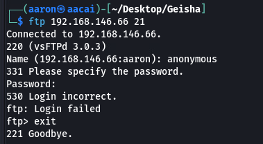

### 网页信息收集
80端口信息收集
```
...
[14:48:26] 200 -  176B  - /index.html
[14:48:26] 200 -    2B  - /info.php
...
```
<br>
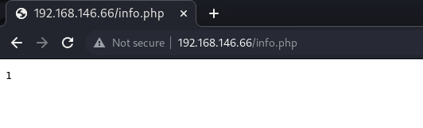
<br>
在info.php里面有一个1, 没有其他信息
<br>

---
7080端口
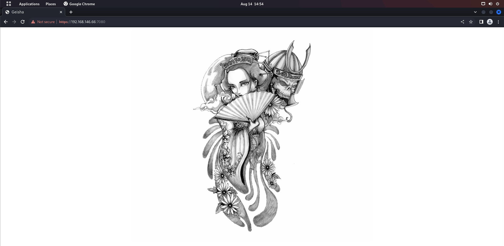
跟80端口一样的图片
<br>

```
└─$ cat 7080_result.txt | grep -v "403"
[14:54:24] Starting: 
[14:54:39] 301 -    1KB - /docs  ->  https://192.168.146.66:7080/docs/
[14:54:39] 200 -    6KB - /docs/
[14:54:43] 200 -  176B  - /index.html

```

docs目录显示了当前server的版本
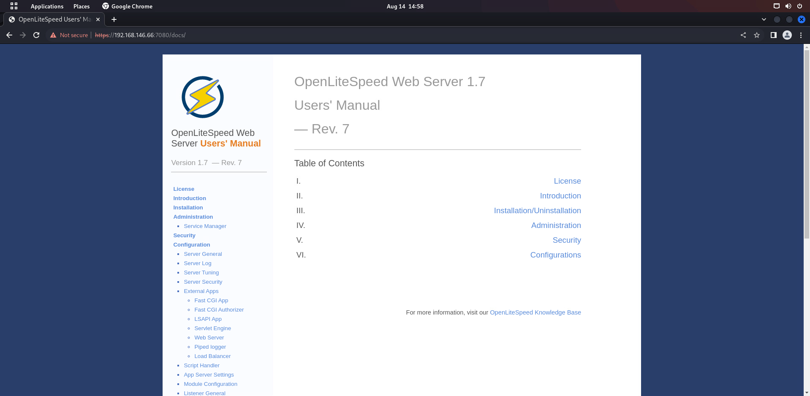
nikto没有任何结果
<br>
dirb返回了js和img的目录
```
START_TIME: Sun Aug 14 15:11:58 2022
URL_BASE: https://192.168.146.66:7080/
WORDLIST_FILES: /usr/share/dirb/wordlists/common.txt

-----------------

GENERATED WORDS: 4612                                                          

---- Scanning URL: https://192.168.146.66:7080/ ----
==> DIRECTORY: https://192.168.146.66:7080/docs/                                                                                                           
+ https://192.168.146.66:7080/index.html (CODE:200|SIZE:176)                                                                                               
                                                                                                                                                           
---- Entering directory: https://192.168.146.66:7080/docs/ ----
==> DIRECTORY: https://192.168.146.66:7080/docs/css/                                                                                                       
==> DIRECTORY: https://192.168.146.66:7080/docs/img/                                                                                                       
+ https://192.168.146.66:7080/docs/index.html (CODE:200|SIZE:5678)                                                                                         
                                                                                                                                                           
---- Entering directory: https://192.168.146.66:7080/docs/css/ ----
                                                                                                                                                           
---- Entering directory: https://192.168.146.66:7080/docs/img/ ----
                                                                                                                                                           
-----------------
END_TIME: Sun Aug 14 15:12:05 2022
DOWNLOADED: 18448 - FOUND: 2

```
---
7125端口

一样的图片
<br>
目录枚举
```
...
[15:13:32] 200 -  175B  - /index.php
[15:13:33] 200 -  175B  - /index.php/login/
[15:13:38] 200 -    1KB - /passwd
...
```
发现登录目录以及passwd模块, 访问passwd模块之后则是直接下载了一个passwd文件下来
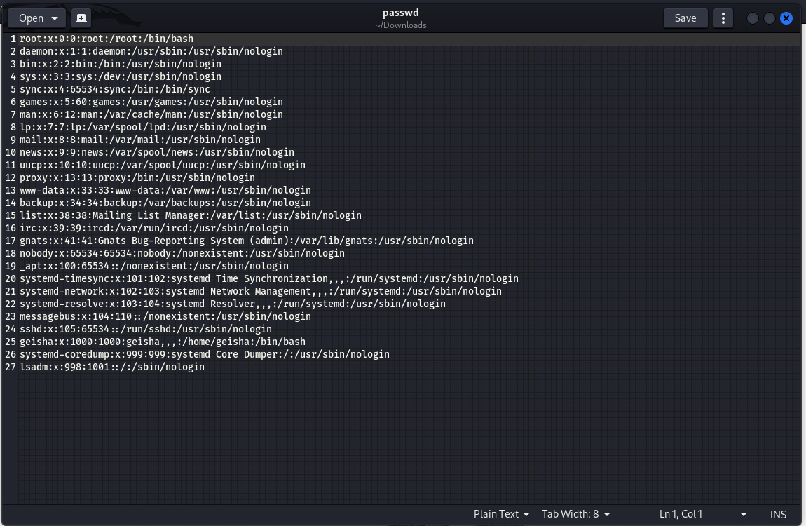
但是并没有发现有哈希值的密码, 并且发现只有三个用户是可以登录的
<br>
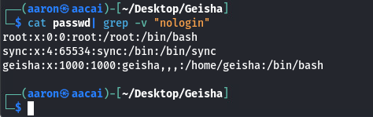
<br>

访问login之后返回一个image, 但是没有内容    

---
8088端口
```
Target: http://192.168.146.66:8088/

[15:20:01] Starting: 
[15:20:14] 301 -    1KB - /cgi-bin  ->  http://192.168.146.66:8088/cgi-bin/
[15:20:17] 301 -    1KB - /docs  ->  http://192.168.146.66:8088/docs/
[15:20:17] 200 -    6KB - /docs/
[15:20:20] 200 -  176B  - /index.html
[15:20:20] 200 -    2B  - /info.php

```

cgi-bin下面只有一个helloword的页面
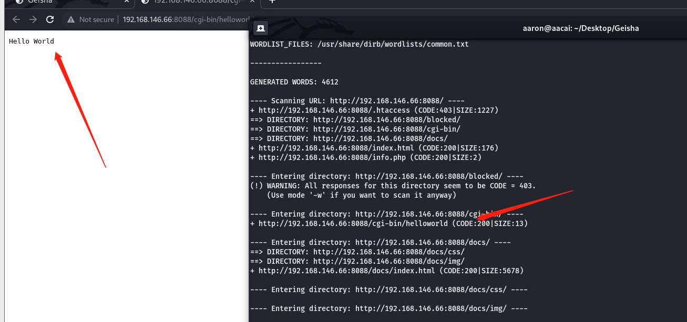

---
9198端口信息收集
```
└─$ dirb "http://192.168.146.66:9198"

-----------------
DIRB v2.22    
By The Dark Raver
-----------------

START_TIME: Sun Aug 14 15:29:58 2022
URL_BASE: http://192.168.146.66:9198/
WORDLIST_FILES: /usr/share/dirb/wordlists/common.txt

-----------------

GENERATED WORDS: 4612                                                          

---- Scanning URL: http://192.168.146.66:9198/ ----
+ http://192.168.146.66:9198/index.html (CODE:200|SIZE:176)                                                                                                
+ http://192.168.146.66:9198/info.php (CODE:200|SIZE:2)                                                                                                    
                                                                                                                                                           
-----------------
END_TIME: Sun Aug 14 15:30:04 2022
DOWNLOADED: 4612 - FOUND: 2


└─$ nikto -h "http://192.168.146.66:9198/"
- Nikto v2.1.6
---------------------------------------------------------------------------
+ Target IP:          192.168.146.66
+ Target Hostname:    192.168.146.66
+ Target Port:        9198
+ Start Time:         2022-08-14 15:27:11 (GMT8)
---------------------------------------------------------------------------
+ Server: SimpleHTTP/0.6 Python/2.7.16
+ The anti-clickjacking X-Frame-Options header is not present.
+ The X-XSS-Protection header is not defined. This header can hint to the user agent to protect against some forms of XSS
+ The X-Content-Type-Options header is not set. This could allow the user agent to render the content of the site in a different fashion to the MIME type
+ No CGI Directories found (use '-C all' to force check all possible dirs)
+ SimpleHTTP/0.6 appears to be outdated (current is at least 1.2)
+ ERROR: Error limit (20) reached for host, giving up. Last error: 
+ Scan terminated:  19 error(s) and 4 item(s) reported on remote host
+ End Time:           2022-08-14 15:28:51 (GMT8) (100 seconds)
---------------------------------------------------------------------------


Target: http://192.168.146.66:9198/

[15:25:22] Starting: 
[15:25:43] 200 -  176B  - /index.html
[15:25:44] 200 -    2B  - /info.php

```
与前几次的扫描结果基本一致

拿到了ssh密码
## 突破边界
### SSH密码爆破
到后面, web页面基本上只给了我们一个passwd的信息, 这样我们只能通过ssh爆破来实现突破边界
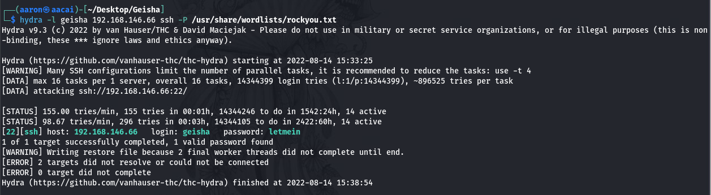
### 获取密码后提权
通过ssh密码我们能够直接登录靶机
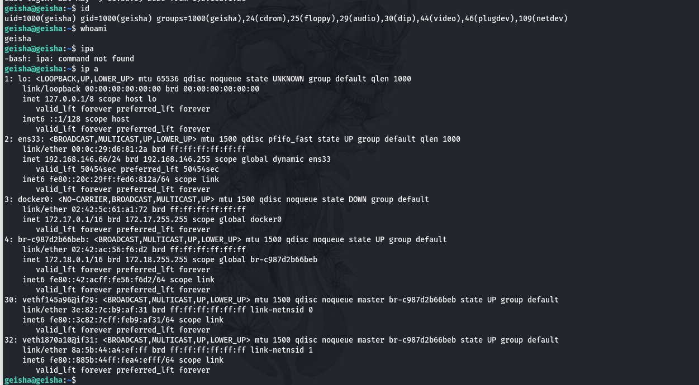
<br>
查看一下是否有suid的文件以及是否有sudo权限
<br>
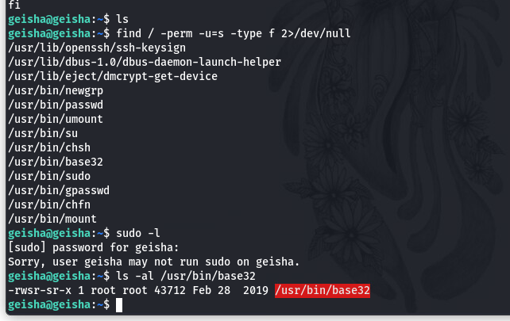
<br>
发现/usr/bin/base32拥有suid权限
<br>
查看如何利用base32去提权
<br>
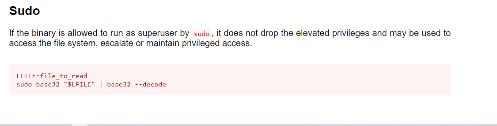
那我们就可以通过base32去读取/etc/shadow的的文件了!
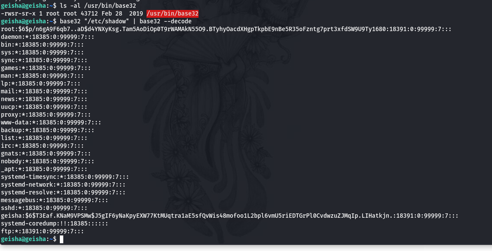
获取到root的密码哈希, 尝试能否使用john爆破
<br>
同样的我们也可以尝试去获取root的sshkey
<br>
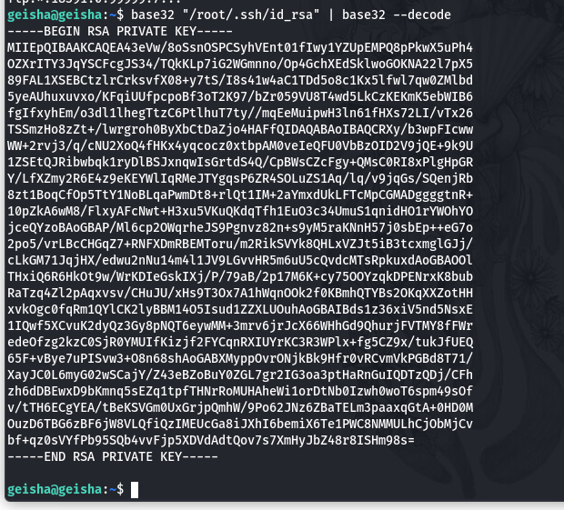
拿到root的sshkey, 拿到时我们需要修改sshkey的权限, 否则无法登录
<br>
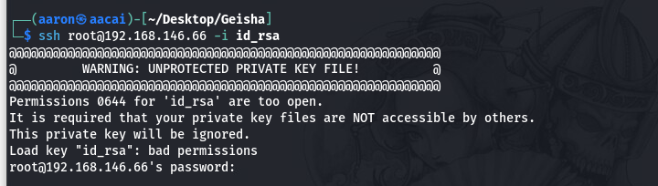
### 提权成功
通过修改id_rsa的权限, 成功登录root
<br>
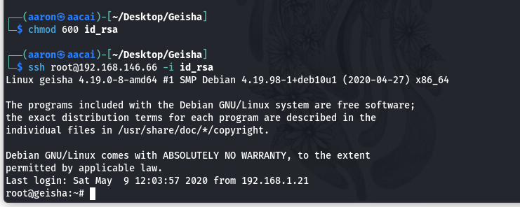
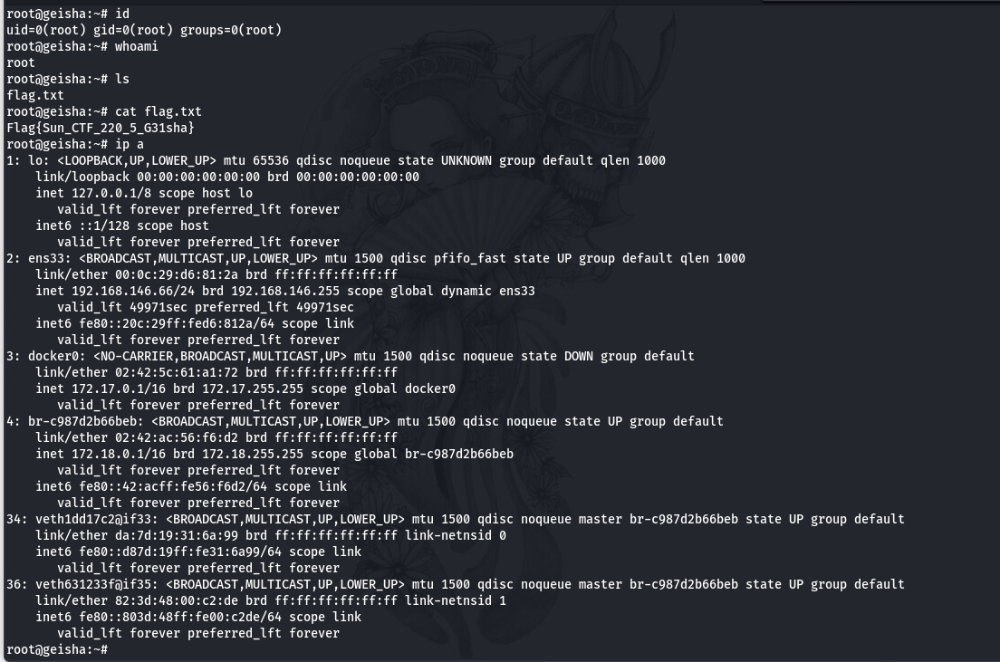

## Note
在本文当中使用到的查找suid权限的文件的命令为
```
find / -perm -u=s -type f 2>/dev/null
```
## 总结
这次靶机当中我们主要以爆破来突破边界, 通过suid的方式提权, 端口很多导致我们的进度缓慢, 所以要整理思路, 可以在一开始拿到passwd文件的时候就进行爆破, 以减少自己的工作量, 节省时间
<br>
最后, 祝各位师傅早日拿到自己想要的证书