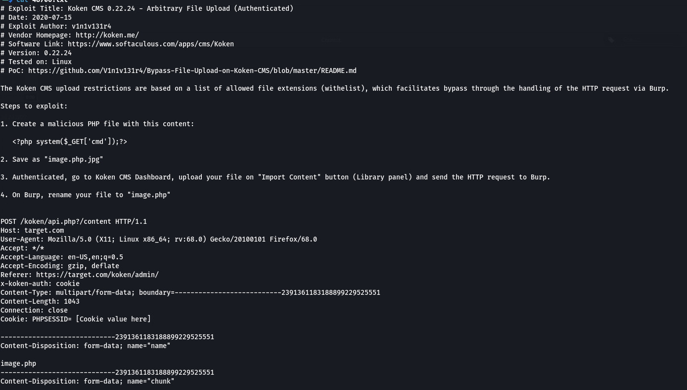

# photographer
## 信息收集
### 端口枚举
老规矩还是用上nmap进行全端口的扫描
```
└─$ sudo nmap -p- 192.168.146.54            
Starting Nmap 7.92 ( https://nmap.org ) at 2022-08-14 15:59 HKT
Nmap scan report for 192.168.146.54
Host is up (0.00015s latency).
Not shown: 65531 closed tcp ports (reset)
PORT     STATE SERVICE
80/tcp   open  http
139/tcp  open  netbios-ssn
445/tcp  open  microsoft-ds
8000/tcp open  http-alt
MAC Address: 00:0C:29:6F:9C:50 (VMware)
```
指定端口枚举
```
└─$ sudo nmap -p80,139,445,8000 -sV -A 192.168.146.54
[sudo] password for aaron: 
Starting Nmap 7.92 ( https://nmap.org ) at 2022-08-14 16:23 HKT
Nmap scan report for 192.168.146.54
Host is up (0.00030s latency).

PORT     STATE SERVICE     VERSION
80/tcp   open  http        Apache httpd 2.4.18 ((Ubuntu))
|_http-server-header: Apache/2.4.18 (Ubuntu)
|_http-title: Photographer by v1n1v131r4
139/tcp  open  netbios-ssn Samba smbd 3.X - 4.X (workgroup: WORKGROUP)
445/tcp  open  netbios-ssn Samba smbd 4.3.11-Ubuntu (workgroup: WORKGROUP)
8000/tcp open  http        Apache httpd 2.4.18 ((Ubuntu))
|_http-server-header: Apache/2.4.18 (Ubuntu)
|_http-title: daisa ahomi
|_http-open-proxy: Proxy might be redirecting requests
|_http-generator: Koken 0.22.24
MAC Address: 00:0C:29:6F:9C:50 (VMware)
Warning: OSScan results may be unreliable because we could not find at least 1 open and 1 closed port
Device type: general purpose
Running: Linux 3.X|4.X
OS CPE: cpe:/o:linux:linux_kernel:3 cpe:/o:linux:linux_kernel:4
OS details: Linux 3.2 - 4.9
Network Distance: 1 hop
Service Info: Host: PHOTOGRAPHER

Host script results:
|_clock-skew: mean: 1h19m59s, deviation: 2h18m34s, median: 0s
| smb2-time: 
|   date: 2022-08-14T08:23:48
|_  start_date: N/A
|_nbstat: NetBIOS name: PHOTOGRAPHER, NetBIOS user: <unknown>, NetBIOS MAC: <unknown> (unknown)
| smb2-security-mode: 
|   3.1.1: 
|_    Message signing enabled but not required
| smb-os-discovery: 
|   OS: Windows 6.1 (Samba 4.3.11-Ubuntu)
|   Computer name: photographer
|   NetBIOS computer name: PHOTOGRAPHER\x00
|   Domain name: \x00
|   FQDN: photographer
|_  System time: 2022-08-14T04:23:48-04:00
| smb-security-mode: 
|   account_used: guest
|   authentication_level: user
|   challenge_response: supported
|_  message_signing: disabled (dangerous, but default)

TRACEROUTE
HOP RTT     ADDRESS
1   0.31 ms 192.168.146.54

OS and Service detection performed. Please report any incorrect results at https://nmap.org/submit/ .
Nmap done: 1 IP address (1 host up) scanned in 25.90 seconds

```
总计开放了4个端口, 进行网页信息枚举
### 网页信息枚举
直接访问80端口就是一个blog的主页面

使用dirsearch枚举一下路径
```
└─$ cat dirsearch_res.txt| grep -v "403"        
[16:29:57] Starting: 
[16:30:08] 200 -    1KB - /assets/
[16:30:08] 301 -  317B  - /assets  ->  http://192.168.146.54/assets/
[16:30:15] 301 -  317B  - /images  ->  http://192.168.146.54/images/
[16:30:15] 200 -    3KB - /images/
[16:30:15] 200 -    6KB - /index.html

```
访问上面三个目录, 都是一些最基本的web资源
<br>


<br>
nikto出来的结果并没有多少
```
                                                                                                                                                                                
┌──(aaron㉿aacai)-[~/Desktop/photographer]
└─$ nikto -h "http://192.168.146.54/"     
- Nikto v2.1.6
---------------------------------------------------------------------------
+ Target IP:          192.168.146.54
+ Target Hostname:    192.168.146.54
+ Target Port:        80
+ Start Time:         2022-08-14 16:33:27 (GMT8)
---------------------------------------------------------------------------
+ Server: Apache/2.4.18 (Ubuntu)
+ The anti-clickjacking X-Frame-Options header is not present.
+ The X-XSS-Protection header is not defined. This header can hint to the user agent to protect against some forms of XSS
+ The X-Content-Type-Options header is not set. This could allow the user agent to render the content of the site in a different fashion to the MIME type
+ No CGI Directories found (use '-C all' to force check all possible dirs)
+ IP address found in the 'location' header. The IP is "127.0.1.1".
+ OSVDB-630: The web server may reveal its internal or real IP in the Location header via a request to /images over HTTP/1.0. The value is "127.0.1.1".
+ Server may leak inodes via ETags, header found with file /, inode: 164f, size: 5aaf04d7cd1a0, mtime: gzip
+ Apache/2.4.18 appears to be outdated (current is at least Apache/2.4.37). Apache 2.2.34 is the EOL for the 2.x branch.
+ Allowed HTTP Methods: GET, HEAD, POST, OPTIONS 
+ OSVDB-3268: /images/: Directory indexing found.
+ OSVDB-3233: /icons/README: Apache default file found.
+ 7915 requests: 0 error(s) and 10 item(s) reported on remote host
+ End Time:           2022-08-14 16:34:18 (GMT8) (51 seconds)
---------------------------------------------------------------------------
+ 1 host(s) tested
                      
```

---
8000端口
```
┌──(aaron㉿aacai)-[~/Desktop/photographer]
└─$ cat 8000.txt| grep "200"            
[16:40:50] 200 - 1020B  - /admin/
[16:40:50] 200 - 1020B  - /admin/?/login
[16:40:50] 200 - 1020B  - /admin/index.html
[16:40:56] 200 -  114B  - /app/
[16:40:56] 200 -  114B  - /app/cache/
[16:40:56] 200 -  114B  - /app/logs/
[16:41:02] 200 -    4KB - /content/
[16:41:07] 200 -    3KB - /error/
[16:41:13] 200 -    4KB - /index.php
[16:42:01] 200 -    4KB - /wp-content/plugins/jrss-widget/proxy.php?url=

```

发现了管理员后台

### smb枚举

<br>
通过smbclient可以发现smbashare是一个share的文件夹
<br>

<br>
当我尝试连接的时候, 发现它跟我说\的数量不够, 于是再加两个
<br>

<br>
发现已经通过其连接上
<br>

<br>
下载mailsent.txt到本地
<br>

<br>
发现这是一个关于Daisa的邮件, 然后在login界面我们需要通过邮箱登录, 那就使用这个账号试试
<br>

<br>
登录上来了
<br>
另外在主页我们可以看到这是build with koken
<br>

<br>
通过searchsploit我们可以看到这里有一个文件上传(需要身份验证)后的漏洞
<br>

<br>
在右下角我们可以发现有一个import content, 接下来我们就来用Burp抓包然后进行文件上传
<br>


## 突破边界
上传完之后, 就拿到了shell

然后发现上面有python, 于是使用python获取可交互式的shell

### 提权
查看带有suid的文件
```
find / -perm -u=s -type f 2>/dev/null
/usr/lib/dbus-1.0/dbus-daemon-launch-helper
/usr/lib/eject/dmcrypt-get-device
/usr/lib/xorg/Xorg.wrap
/usr/lib/snapd/snap-confine
/usr/lib/openssh/ssh-keysign
/usr/lib/x86_64-linux-gnu/oxide-qt/chrome-sandbox
/usr/lib/policykit-1/polkit-agent-helper-1
/usr/sbin/pppd
/usr/bin/pkexec
/usr/bin/passwd
/usr/bin/newgrp
/usr/bin/gpasswd
/usr/bin/php7.2
/usr/bin/sudo
/usr/bin/chsh
/usr/bin/chfn
/bin/ping
/bin/fusermount
/bin/mount
/bin/ping6
/bin/umount
/bin/su
```
既然这样我们就可以通过php7.2来进行提权
<br>

<br>
直接利用之后得到结果
<br>

<br>
这时候有root权限了
<br>

<br>
提权成功